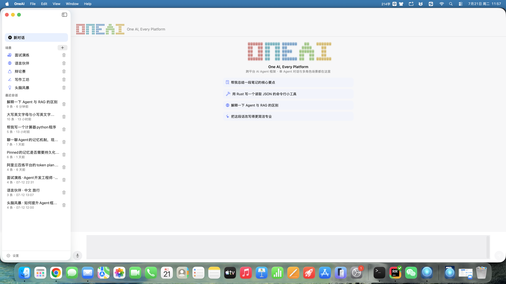
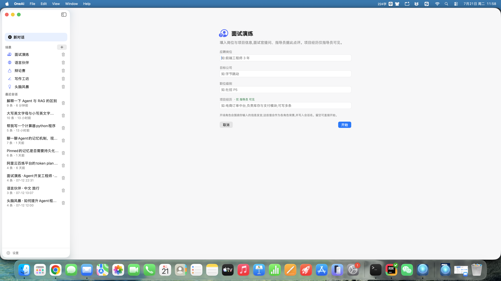
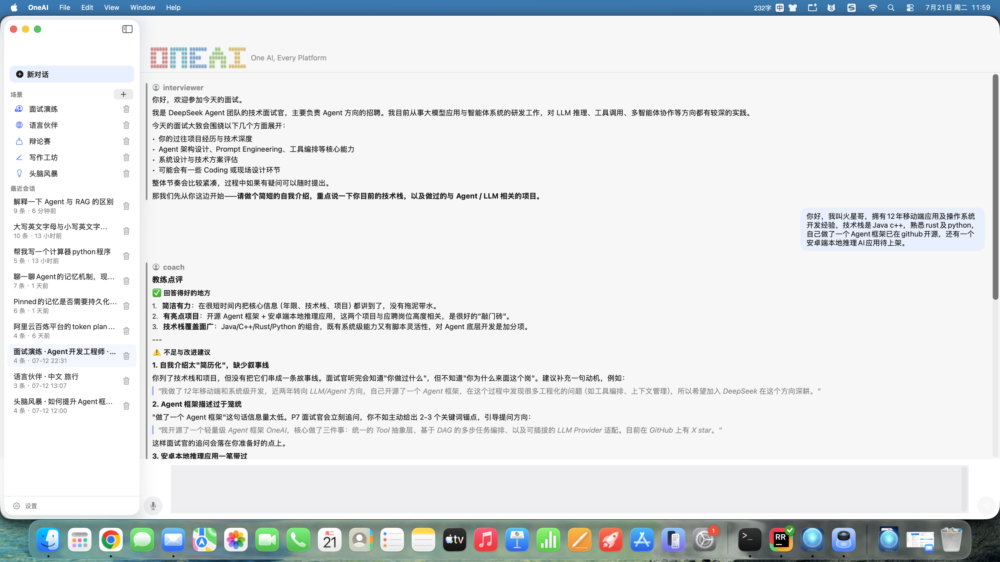
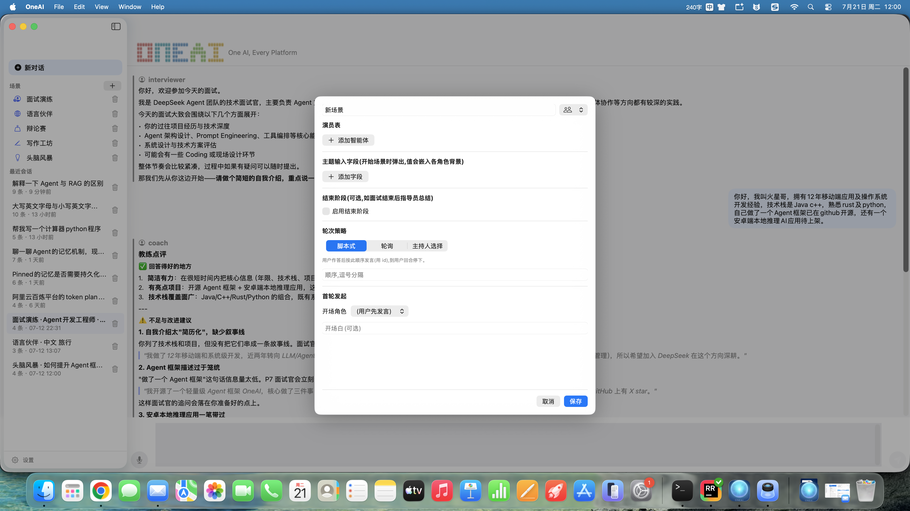
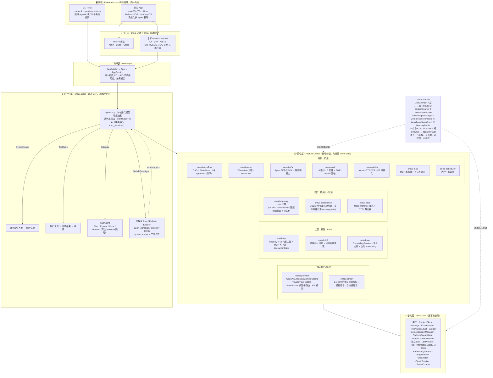

# OneAI

[English](README_EN.md) | **简体中文**

> **One AI, Every Platform** — 跨平台 AI Agent 框架，基于 Rust 构建：模块化、类型安全、领域可插拔、可评测、多 Agent 原生，一套 Rust 内核打到六端。

[](LICENSE)
[](https://crates.io/crates/oneai-app)
[]()
[]()
[]()
[]()
[]()

<p align="center">
  
</p>

<p align="center"><em>同一套 Rust 内核（<code>oneai-core</code>），通过 UniFFI 与手写 <code>extern "C"</code> facade，驱动 macOS / Windows / Linux / Android / iOS / HarmonyOS 六端原生 App。</em></p>

---

## 目录

- [一图看懂](#一图看懂)
- [快速上手](#快速上手)
  - [一、macOS App（原生，免编译）](#一macos-app原生免编译)
  - [二、TUI / CLI（通用 Agentic 执行）](#二tui--cli通用-agentic-执行)
  - [三、集成 OneAI SDK 构建你自己的应用](#三集成-oneai-sdk-构建你自己的应用cratesio)
- [OneAI 是什么？](#oneai-是什么)
- [两种使用方式](#两种使用方式)
- [架构](#架构)
- [Crate 总览](#crate-总览)
- [核心概念](#核心概念)
  - [1. DomainPack 系统](#1-domainpack-系统领域配置包)
  - [2. Agentic Loop（动态循环）](#2-agentic-loop动态循环)
  - [3. Agent 范式](#3-agent-范式)
  - [4. 权限模型](#4-权限模型)
  - [5. LLM Provider、路由与 3 层输出解析器](#5-llm-provider路由与-3-层输出解析器)
  - [6. 工具系统](#6-工具系统)
  - [7. 多 Agent 协作](#7-多-agent-协作)
  - [8. 记忆系统](#8-记忆系统)
  - [9. 工作状态系统](#9-工作状态系统跨-session-任务续接)
  - [10. 用量与可靠性](#10-用量与可靠性)
  - [11. 工作流引擎](#11-工作流引擎)
  - [12. RAG](#12-rag)
  - [13. A2A 协议、WASM 沙箱、评测、Studio、MCP](#13-a2a-协议wasm-沙箱评测studiomcp)
  - [14. 轨迹日志](#14-轨迹日志trace)
- [SWE-bench 评测（能力×用量×效率三轴）](#swe-bench-评测能力用量效率三轴)
- [跨平台：桌面与移动端](#跨平台桌面与移动端)
- [许可证](#许可证)

---

## 一图看懂

<p align="center">
  
</p>

<p align="center"><em>macOS 原生 App · 默认对话主页 —— 品牌像素 Logo + slogan + 推荐话题入口；空会话即此页，点话题即开聊。</em></p>

<p align="center">
  
</p>

<p align="center"><em>macOS 原生 App ·「面试演练」场景入口 —— 启动前内联填写应聘岗位 / 目标公司 / 项目经历等背景字段，按<strong>成员可见性</strong>注入各自的系统提示（面试官看不到项目经历，指导员据此给项目级建议）。</em></p>

<p align="center">
  
</p>

<p align="center"><em>macOS 原生 App · 多 Agent 群聊 —— 面试官（蓝，提问）与指导员（绿，点评）按脚本轮次发言：用户作答 → 指导员点评 → 面试官追问，流式逐字渲染 + 思考气泡。</em></p>

<p align="center">
  
</p>

<p align="center"><em>macOS 原生 App · 可视化场景编辑器 —— 拖拽式编排角色阵容、背景字段、轮次策略（脚本/轮询/主持人）、开场白与复盘阶段，持久化到 <code>~/Library/Application Support</code>。</em></p>

<p align="center">
  
</p>

<p align="center"><em>交互式 CLI（<code>oneai-cli</code>）· Plan 模式下执行复杂任务 —— 思考气泡、计划清单面板、工具调用展示，以及 accept/reject 审批弹窗。</em></p>

**同一个引擎，两种前端**：左上的原生 App 是给「场景化多 Agent 对话」（面试陪练 / 语言伙伴 / 辩论 / 写作工坊 / 头脑风暴）准备的；下方的 CLI TUI 是给「通用 Agentic 编程 / 任务执行」准备的。两者背后是同一套 Rust 内核与同一个 `AgentLoop`。

---

## 快速上手

OneAI 暴露三条上手路径，按你的角色挑一条：

| 路径 | 适合谁 |
|------|--------|
| **一、macOS App** | 想直接下载即用、玩场景化多 Agent 对话，不碰命令行 / 环境变量 |
| **二、TUI / CLI** | 通用 Agentic 编程 / 任务执行、子系统探索 |
| **三、集成 OneAI SDK** | 用 crates.io 上的 OneAI 构建自己的 Rust 应用 |

### 一、macOS App（原生，免编译）

从 [GitHub Releases](https://github.com/Marssssss/OneAI/releases) 下载 `OneAI-1.0.0-macos.zip`，解压得到 `OneAI.app`，拖入「应用程序」。

> 该 .app **未签名 / 未公证**（universal arm64 + x86_64，macOS 13+）。首次打开会触发 Gatekeeper 拦截：在 Finder 里**右键 → 打开**，确认后即可正常启动。

#### 配置（App 内 Settings 面板）

macOS App **不读环境变量或 `~/.oneai/config.toml`** —— Provider 与 Embedding 都在 App 内「设置」sheet 里配，持久化到 `~/Library/Application Support`。打开 OneAI.app 后从侧边栏或菜单唤出「设置」：

- **Provider 类型**：选 `openai` / `anthropic` / `ollama`，或填自定义（`gemini` / `glm` / `dashscope` 等任意 OpenAI 兼容网关）。选 ollama 自动填 `127.0.0.1:11434`。
- **API Key**：对应厂商的 key（ollama 无需填）。
- **Base URL**：留空走官方端点；走中转站 / 自建网关填你的地址。
- **Model**：如 `gpt-4o` / `claude-sonnet-4-6` / `llama3` / `qwen-plus`。
- **Embedding 设置**：默认留空即 `auto` 探测（探测链与显式覆盖见[第二部分 Embedding 配置](#embedding-配置零负担)）。

每个 Agent 还可在场景编辑器里单独覆写 model / key / base_url，混用多家厂商。

#### 使用

侧边栏「从场景开始」选 5 个内置预设之一（**面试演练 / 语言伙伴 / 辩论赛 / 写作工坊 / 头脑风暴**），或「编辑场景」拖拽式自建角色阵容、轮次策略、背景字段、复盘阶段。运行中：流式逐字渲染 + 思考气泡、`⌘K` 命令面板、语音输入、产物画布。场景与对话机制详见下文[两种使用方式 → B. 原生桌面 / 移动 App](#b-原生桌面--移动-app--场景化多-agent-对话)。

> 如需从源码构建：`./scripts/build_apple.sh && ./platforms/macos/build_macos.sh`，然后 `open platforms/macos/build/OneAI.app`。

### 二、TUI / CLI（通用 Agentic 执行）

面向编程、任务执行、子系统探索。`examples/cli`（bin `oneai-cli`）是基于 ratatui+crossterm 的交互式 TUI。Provider 走环境变量或 `~/.oneai/config.toml`（环境变量优先级更高）。

#### 配置 Provider

OneAI 兼容任何 **OpenAI 兼容端点**（OpenAI、Anthropic、Gemini、Ollama，以及阿里百炼/DashScope、DeepSeek、vLLM 等自建网关）。通过环境变量或配置文件设置凭据——环境变量优先级更高。

```bash
# OpenAI 兼容端点 —— 适用于 OpenAI / DashScope / DeepSeek 等
export ONEAI_API_KEY="sk-..."
export ONEAI_BASE_URL="https://api.openai.com/v1"   # 或你的网关地址
export ONEAI_MODEL="gpt-4o"                          # 或 qwen-plus、deepseek-chat ...

# Ollama（本地，无需 key）
export ONEAI_BASE_URL="http://localhost:11434"
export ONEAI_MODEL="llama3"
```

…或写入 `~/.oneai/config.toml`：

```toml
[provider]
api_key = "sk-..."
base_url = "https://api.openai.com/v1"
model = "gpt-4o"

[domain]
default_pack = "coding"   # coding | research | general

[ui]
theme = "dark"
```

用 `oneai config create` 生成默认配置，`oneai config show` 查看。

#### 网络代理

所有出站 HTTP（LLM Provider API、`web_search` / `web_fetch`、A2A 客户端、embedding 服务、MCP HTTP 传输）都走 `reqwest::Client`，故代理基于环境变量、全端统一：

- `HTTPS_PROXY` / `HTTP_PROXY` / `ALL_PROXY` —— 代理 URL（reqwest 在每个 client build 时自动探测，无需代码 opt-in）。
- `NO_PROXY` —— 逗号分隔排除列表。
- SOCKS5：`ALL_PROXY=socks5://host:port`（reqwest `socks` feature 已开）。
- macOS/Windows 上 `system-proxy` feature 还读 OS GUI 代理设置；环境变量始终优先。

#### 启动 TUI

```bash
cargo run -p oneai-cli
# 或安装稳定版：cargo install oneai-cli，然后直接：oneai
```

进入交互式 Agent。输入任务即可看到完整管线实时运行：流式思考气泡、工具调用、计划清单、用量/Token 统计、轨迹日志。

**交互模式 —— 用 `Shift+Tab` 循环切换：**

| 模式 | 行为 |
|------|------|
| `Normal` | 默认 —— 高风险工具暂停等待审批 |
| `⚡ Auto` | 全部自动批准（快速迭代） |
| `📋 Plan` | 禁用工具执行 —— Agent 必须先给出计划；你在 accept/reject 弹窗中审阅后才开始执行 |

**按键：**

| 按键 | 动作 |
|------|------|
| `Enter` | 发送 · `Ctrl+Enter` 换行 |
| `Shift+Tab` | 循环模式（Normal → Auto → Plan） |
| `Tab` | 切换侧边栏 |
| `↑↓` / `Ctrl+↑↓` / `PgUp` / `PgDn` | 历史与聊天滚动 |
| 鼠标拖拽 | 选中文本复制 · 滚轮滚动 |
| `Esc` | Vim 模式 / 退出 |

#### 对话内斜杠命令

在输入框以 `/` 起首触发自动补全。完整命令列表（输入 `/help` 可在 TUI 内随时调出）：

| 命令 | 作用 |
|------|------|
| `/help`（或 `/h`） | 显示帮助与全部可用命令 |
| `/tools`（或 `/t`） | 列出当前已注册的工具 |
| `/skills` | 列出所有可用技能（领域内置 + 约定目录发现） |
| `/skill <name>` | 激活某技能；`/skill off` 停用；`/skill add <name> <desc>` 新增；`/skill search <kw>` 搜索 |
| `/tool <name> {json}` | 直接以 JSON 参数调用某工具（不经模型） |
| `/usage` | 查看本会话 token 用量（prompt / completion / total）与上下文占用 |
| `/context` | 按类别展示上下文窗口的详细 token 拆分（系统提示 / 工具定义 / 域包 / 对话） |
| `/session` | 查看当前会话详情（ID、Provider、范式、上下文、用量） |
| `/domain` | 查看当前 DomainPack；`/domain <name>` 切换（coding / research / general） |
| `/compact` | 压缩当前对话上下文（触发压缩器抽取并归档事实） |
| `/wf list` / `/wf run <name>` / `/wf show <name>` / `/wf graph <name>` / `/wf status` / `/wf history` | 工作流命令：列出 / 执行 / 查看步骤 / 渲染 DAG / 状态 / 历史 |
| `/new` | 新建会话 |
| `/init [oneai\|agents\|claude] [--force] [--no-llm]` | 生成项目指令文件（已配置 LLM 时由模型综合生成，否则启发式） |
| `/clear` | 清空当前对话并新建会话 |
| `/quit`（或 `/q`） | 退出 TUI |

#### 非交互单次推理

```bash
oneai run "把 auth 模块重构为 async" --domain coding --model gpt-4o
```

#### 通过 CLI 体验各子系统

OneAI 把每个子系统都暴露为 CLI 子命令，无需写代码即可驱动。下表覆盖 `oneai-cli` 的全部子命令（`oneai` 即 `oneai-cli`，不带子命令时默认进入 TUI）：

```bash
# ── 会话与推理 ──
oneai                                  # 启动交互式 TUI（默认）
oneai chat [--domain coding] [--model gpt-4o] [--user <id>]   # 启动 TUI（显式）
oneai run "把 auth 模块重构为 async" [--domain coding] [--model ...] [--user <id>]  # 非交互单次推理，输出到 stdout
oneai version                          # 版本信息

# ── DomainPack（领域配置包）──
oneai pack list                        # 浏览内置 pack
oneai pack show <name>                 # 查看 pack 详情
oneai pack install <path|git-url>      # 从本地路径或 git 安装
oneai pack validate spec.toml         # 对照 JSON Schema 校验（结构 + 语义）
oneai pack spec                       # 导出 DomainPack 规范为 JSON Schema
oneai pack check <name>               # 对照规范检查已安装 pack

# ── Skill（约定目录发现的技能）──
oneai skill list                       # 列出从 .claude/.agents/.opencode/.oneai skills 发现的技能
oneai skill show <name>                # 查看技能详情

# ── 评测框架（能力 × 成本 × 效率 三轴）──
oneai eval list                        # 列出评测套件
oneai eval run coding_basics [--format markdown|json|compact] [--profile] [--record <path>]  # 运行套件（--profile 输出效率轴，--record 录制轨迹）
oneai eval score <suite>               # 仅跑指标（不执行 agent）
oneai eval replay <path>              # 幽灵重放录制轨迹，校验确定性
oneai eval swebench --dataset ./swe_bench_lite.jsonl [--instances astropy__astropy-12907] [--limit N] [--modal]  # SWE-bench 三轴评测

# ── 工作流与状态图（DomainPack 内嵌）──
oneai workflow list [--domain coding]  # 列出 DAG 工作流 + 状态图
oneai workflow show <name>             # ASCII 渲染工作流 DAG + 步骤
oneai workflow run <name> [task] [--domain ...] [--model ...] [--user <id>]  # 端到端执行 DAG 工作流
oneai graph list [--domain coding]     # 列出状态图（react/plan/reflect/explore）
oneai graph show <name>                # ASCII 渲染状态图
oneai graph run <name> <task> [--domain ...] [--model ...] [--user <id>]   # 用真实 Provider 执行状态图

# ── 多 Agent 协作 ──
oneai team strategies                  # 列出团队协作策略（Coordinate/Route/Collaborate/Debate）
oneai team presets                     # 列出预设团队（code_review/research_route/dev_pipeline/arch_debate）
oneai team info <id>                   # 查看团队配置详情
oneai team run "..." [--strategy coordinate] [--preset ...] [--budget 100000]  # 执行团队协作任务
oneai handoff list                     # 列出 handoff 目标与预设
oneai handoff targets <preset>         # 查看预设的 handoff 目标描述
oneai handoff config [--preset ...]    # 查看 handoff 配置
oneai handoff run <target> <reason> [--preset ...]  # 执行 handoff（演示模式）
oneai swarm list                       # 列出群体预设
oneai swarm routing                    # 列出路由策略（best-fit/load-balanced/cost-optimized/fastest）
oneai swarm config <preset>            # 查看群体配置
oneai swarm agents <preset>            # 查看群体内的 agent 与能力
oneai swarm run --task "..." [--routing best-fit] [--preset ...] [--budget 100000]  # 群体编排

# ── Provider 池与智能路由 ──
oneai provider status                  # Provider 池状态：活跃 provider、健康、熔断
oneai provider fallback-log [--limit 20]  # 近期降级事件
oneai provider test                     # 连通性检查池中所有 provider
oneai provider route "任务描述" [--strategy balanced|cost|latency|quality]  # 路由决策 dry-run（成本/延迟/质量分析）
oneai provider route-log [--limit 10]  # 近期路由决策及理由
oneai provider route-config             # 当前路由策略与配置

# ── Token 计数与上下文管理 ──
oneai token count "文本" [--model ...]  # 统计 token 数
oneai token estimate [--model ...]      # 估算样例对话的 token 数
oneai token context <model>            # 查看模型上下文窗口画像
oneai token models                      # 列出已知 tokenizer 画像
oneai token fits "文本" --model <model> # 检查文本是否装得下上下文窗口
oneai token probe [--model ...]        # 探测 Provider 模型元数据端点（L2），展示三层解析结果

# ── 用量记录（纯 token 维度，无 USD）──
oneai usage report                     # 全局用量汇总（总 token、调用次数、按模型拆分）
oneai usage session <id>               # 单会话用量详情
oneai usage export [--format json|csv]  # 导出用量记录

# ── 记忆（跨会话持久事实）──
oneai memory search <kw> [--user <id>] [--top_k 10]  # 关键词检索持久事实
oneai memory list [--user <id>] [--session <id>]      # 列出某用户/会话的事实

# ── 持久化会话（SQLite）──
oneai session list                     # 列出已保存会话
oneai session resume <id>             # 预览某会话对话历史（print-only；live 续接走 tasks continue）
oneai session delete <id>             # 删除会话
oneai session info <id>               # 查看会话详情

# ── 工作状态（跨 session 任务续接，文件事件日志）──
oneai tasks list                       # 列出未完成任务（读 index.json）
oneai tasks show <id>                  # 查看某任务的目标/步骤/决策/卡点
oneai tasks continue <id>             # 新 session 绑定该任务、derive 进内存、续接
oneai tasks archive <id>              # 归档任务（gzip 事件日志）

# ── Embedding 服务 ──
oneai embed generate "text" [--model ...] [--provider auto|openai|voyage|ollama|fastembed|openai-compat] [--api-key ...]  # 生成向量
oneai embed batch "t1,t2" [同上选项]   # 批量生成
oneai embed list                       # 列出可用 provider + auto 探测链
oneai embed health [同上选项]          # 检查 embedding 服务健康
oneai embed dimension [同上选项]       # 查看模型向量维度

# ── WASM 沙箱 ──
oneai wasm list                        # 列出已加载模块
oneai wasm load <name> <file.wasm>     # 加载模块
oneai wasm run <name> [--input <json> | --input-file <path>]  # 执行模块
oneai wasm health [--name <name>]      # 模块健康检查
oneai wasm unload <name>              # 卸载模块
oneai wasm stats                        # 资源监控统计

# ── MCP（客户端 + 服务端）──
oneai mcp serve [--domain coding]       # 作为 MCP 服务器运行（兼容 Claude Code/Cursor）
oneai mcp list                          # 列出已配置 MCP 服务器
oneai mcp add <name> --transport stdio|sse|streamable_http [--command ...] [--url ...] [--args ...]  # 添加 MCP 服务器
oneai mcp remove <name>                # 移除 MCP 服务器
oneai mcp connect <name>              # 测试连接并展示发现的工具

# ── A2A（Agent-to-Agent 协议）──
oneai a2a serve [--domain coding]       # 启动 A2A 服务器，暴露 OneAI agent 能力
oneai a2a discover <url>               # 发现远程 A2A agent 能力
oneai a2a list                         # 列出已配置 A2A 端点
oneai a2a send <url> "任务消息"        # 向远程 A2A agent 发送任务

# ── 配置 ──
oneai config show                      # 查看当前配置
oneai config init                      # 创建默认配置文件

# ── Web UI ──
oneai studio [--port 3000] [--domain coding] [--model ...] [--user <id>]  # 启动 Studio Web UI（StateGraph 可视化 + Checkpoint 时间旅行）

# ── 项目指令文件 ──
oneai init [--format oneai|agents|claude] [--path <dir>] [--force] [--no-llm]  # 生成 ONEAI.md/AGENTS.md/CLAUDE.md（已配置 LLM 时由模型综合生成，否则启发式）
```

> 全部子命令均来自 `examples/cli/src/main.rs` 的 clap 定义；运行 `oneai --help` 或 `oneai <sub> --help` 可查看任意子命令的完整参数。

#### Embedding 配置（零负担）

Embedding 用于长期记忆语义召回。默认 **零配置**：不填任何 embedding 字段即走 `auto` 探测，按以下顺序挑第一个可用 provider；全无可用时降级为关键词召回（不报错）：

1. `openai-compat` — 需同时设 `ONEAI_EMBEDDING_API_KEY` + `ONEAI_EMBEDDING_BASE_URL`（中转站）
2. `voyage` — 设 `VOYAGE_API_KEY`（`api.voyageai.com`）
3. `openai` — 设 `OPENAI_API_KEY`（官方 `api.openai.com`）
4. `ollama` — 本地 `localhost:11434` 可达且装了 embedding 模型（如 `nomic-embed-text`）
5. `fastembed` — 本地 ONNX（`AllMiniLML6V2`，无 key；首次使用一次性下载 ~22MB，之后离线）

   代理网络下 hf-hub 的下载客户端可能忽略代理，导致首次下载失败。运行 `./scripts/download_fastembed_models.sh`（用 curl，尊重代理环境变量）预拉取模型到 hf-hub cache，之后 fastembed 离线加载。
6. 全无可用 → 关键词召回

**关键：embedding key 与主模型（LLM）key 相互独立** —— `LlmProvider` trait 无 embed 方法，LLM 与 embedding 是两项独立能力。`ANTHROPIC_API_KEY`（给 Claude 对话）不能当 embedding key；Anthropic 无原生 embedding API，真实路径是 Voyage。中转站（`ONEAI_API_KEY` 配的）大概率无 embedding 端点，故 auto 不复用主模型 key。

显式覆盖（三处均可）：

- CLI：`oneai embed generate "x" --provider voyage --api-key pa-...`
- `~/.oneai/config.toml`：`[embedding]` 段（`provider` / `model` / `api_key` / `base_url` / `fallback`）
- 各平台 App 设置 → "Embedding 设置"：macOS/Windows/Android 设置面板，默认留空即 auto

模型名为自由字符串（`--model voyage-3`），未知名称运行时探测维度。`fallback` 字段在主 provider 创建/首调失败时自动切换（构建期 + 运行期，共享一套 `should_continue` 错误分类：429/5xx/传输错/缺 key 降级，其它报错）。超长输入按 UTF-8 字节二分自动切分。

### 三、集成 OneAI SDK 构建你自己的应用（crates.io）

OneAI 的全部 crate 已发布到 [crates.io](https://crates.io/crates/oneai-app)（badge 反映最新版本），可直接作为依赖集成进你自己的 Rust 应用。

#### 1. 添加依赖

```bash
cargo add oneai-app
cargo add tokio --features full
```

或手写 `Cargo.toml`：

```toml
[dependencies]
oneai-app = "1.0"        # 集成入口：AppBuilder → App → AppSession
tokio = { version = "1", features = ["full"] }
```

> 网络代理：OneAI 所有出站 HTTP 都走 `reqwest::Client`，因此**代理靠环境变量、全端统一**——`HTTPS_PROXY` / `HTTP_PROXY` / `ALL_PROXY`（代理 URL）、`NO_PROXY`（排除列表）、`ALL_PROXY=socks5://host:port`（SOCKS5，`socks` feature 已开）。reqwest 每个 client build 时自动探测，无需代码 opt-in；macOS/Windows 还读 OS GUI 代理设置，环境变量始终优先。不要为个别 provider / tool 自行 wire 一个 `reqwest::Client`——靠 env vars 即可。

#### 2. 按需选 crate

所有 `oneai-*` crate 都在 crates.io 上、可单独依赖。**一般集成只需 `oneai-app`**（`AppBuilder` 会按调用的 builder 方法按需拉取 feature crate）；下列 crate 在你只要某个子系统、想缩小依赖面时单独引入：

| crate | 何时单独依赖 |
|------|-------------|
| `oneai-core` | 只要核心类型 / trait（`Message` / `ContentBlock` / `LlmProvider` / `Tool` / `PermissionLevel` / `Budget`） |
| `oneai-provider` | 只要 LLM Provider（OpenAI / Anthropic / Gemini / Ollama）+ `ProviderPool` / `SmartRouter` |
| `oneai-domain` | 只要 DomainPack（`coding_pack` / `research_pack`，7 层领域配置） |
| `oneai-tool` | 只要工具 Registry + 12 内置工具 + `InteractionGate` |
| `oneai-memory` | 只要记忆系统（Letta 三层 + 压缩增量抽取 + 持久化） |
| `oneai-rag` | 只要 RAG / `EmbeddingService`（OpenAI / Voyage / Ollama / FastEmbed + auto 探测） |
| `oneai-workflow` | 只要 Workflow DAG + StateGraph |
| `oneai-parser` | 只要 3 层输出解析防御 |
| `oneai-persistence` | 只要 SQLite 持久化（会话 / LTM / 用量）+ 文件事件日志（working state） |
| `oneai-skill` / `oneai-trace` / `oneai-scheduler` | 技能发现 / OpenInference 轨迹 / 内存任务调度 |
| `oneai-a2a` / `oneai-wasm` / `oneai-eval` / `oneai-studio` / `oneai-mcp` | 只要对应子系统 |
| `oneai-uniffi` | 跨平台 FFI 绑定（Kotlin / Swift / Python + 手写 `extern "C"` facade） |

> 想直接跑起来交互式 Agent，可装 CLI：`cargo install oneai-cli`。

#### 3. 最简 Rust 程序

```rust
use oneai_app::AppBuilder;
use oneai_domain::coding_pack;

#[tokio::main]
async fn main() {
    let app = AppBuilder::new()
        .noop_interaction_gate()
        .default_parser()
        .domain_pack(coding_pack("/project/dir"))  // ← 一行领域切换
        .build()
        .expect("App 构建成功");

    let session = app.create_session();
    let result = session
        .execute_tool("calculator", serde_json::json!({"expression": "2+3"}))
        .await
        .unwrap();
    println!("结果: {}", result.content); // → "5"
}
```

> **给 AI Agent 读者的提示**：本项目是 `cargo` workspace，集成入口是 `crates/oneai-app/src/builder.rs` 的 `AppBuilder`——每个子系统都是可选的、通过 builder 方法插装（**LLM Provider 也是可选的**，纯工具 / 纯工作流用法无需 Provider）。要理解架构，读 [CLAUDE.md](CLAUDE.md)（crate 分层、DomainPack 7 层、AgentLoop 决策、权限模型）。要程序化驱动，从上面的「最简 Rust 程序」与 `examples/cli` 开始。

---

## OneAI 是什么？

OneAI 是一个用 Rust 编写的全栈 Agent 框架。它提供了构建、运行和评测 AI Agent 所需的一切——从 LLM Provider 抽象到工具执行、记忆管理、工作流编排、领域专属配置、多 Agent 协作和轨迹日志——全部支持通过 UniFFI bindings 实现跨平台。**LLM Provider 是可选的**——纯工具或纯工作流的使用无需 Provider。

**核心原则：**

- **模块化设计** — 25 个独立 crate，各司其职，按需使用。
- **类型安全** — 密封枚举层级（每个公开枚举都加了 `#[non_exhaustive]`）、trait 驱动抽象，无字符串配置。
- **领域可插拔** — DomainPack 系统让领域知识声明式、可组合、一行切换；可对照 JSON Schema 校验，并通过 pack 市场共享。
- **多 Agent 原生** — SubAgent、Team 协作（Coordinate/Route/Collaborate/Debate）、Handoff 协议、Swarm 群体编排（能力驱动路由）；以及引擎级 **GroupChat 原语**驱动场景化多角色对话。
- **生产级基础设施** — ProviderPool 降级链、SmartRouter 多因子路由、用量统计、限流、熔断、Token 感知的上下文管理。
- **跨平台** — 通过 UniFFI + 手写 `extern "C"` facade 支持 macOS、Windows、Linux、Android、iOS 和 HarmonyOS（Kotlin、Swift、C++、C#、ArkTS），同一套 Rust 内核。
- **可评测** — 内置 OpenInference 兼容轨迹日志器 + 独立评测框架（6 指标、3 套件 + SWE-bench 三轴）。
- **人机协作** — 高风险工具通过原生 UI 对话框审批；执行前的 Plan 模式审批门。
- **动态 Agentic Loop** — 不是固定管线；每轮迭代动态决策（直接回答/工具调用/委托子 Agent/切换范式）。

---

## 两种使用方式

OneAI 暴露两个面向用户的前端，背后是同一套内核。

### A. CLI / TUI —— 通用 Agentic 执行

面向编程、任务执行、子系统探索。`examples/cli`（bin `oneai-cli`）是基于 ratatui+crossterm 的交互式 TUI，跑完整管线：流式思考气泡、工具调用展示、Plan 模式审批门、用量/Token 统计、轨迹日志。每个子系统都暴露为 clap 子命令（见上方「体验各子系统」）。

### B. 原生桌面 / 移动 App —— 场景化多 Agent 对话

面向「多角色协作对话」场景。以 macOS App 为参考实现（其他端镜像同一设计），核心是 **GroupChat 原语 + 场景系统**：

- **场景（Scenario）= 角色阵容 + 轮次策略 + 背景字段 + 复盘阶段**。一个 Agent 是一个 AI 人格（用户是隐式额外参与者）。
- **轮次策略**：`scripted`（脚本式，固定顺序）、`roundRobin`（轮询）、`moderator`（主持人选下一位）。
- **背景字段 + 成员可见性**：启动前内联表单收集背景（如「应聘岗位」「项目经历」），按 `visibleTo` 注入各自系统提示——例如面试官看不到候选人的项目经历，但指导员能据此给项目级建议。
- **复盘阶段（Debrief）**：如面试结束按钮一键切换到指导员全场总结 + 后续 Q&A，其他成员退场。
- **审改循环（ReviewLoop）**：如写作工坊的「写手起草 → 编辑审阅 → 写手修改 → 编辑复审」，编辑发出 `定稿` 标记或达 `maxRounds` 即止。
- **内置 5 预设**：`面试演练` / `语言伙伴` / `辩论赛` / `写作工坊` / `头脑风暴`，开箱即用、可编辑、可自建。
- 流式 20fps 合并渲染、语音输入（Speech 框架）、Markdown 渲染、暗色跟随系统、命令面板（`⌘K`）、产物画布。

各端的编译运行见下文 [跨平台：桌面与移动端](#跨平台桌面与移动端)。

---

## 架构



> 箭头方向 = 依赖 / 数据流向（上层依赖下层）。实线为编译期依赖与运行时调用，虚线为横切声明式配置。`oneai-domain` 不是某一层级，而是横切所有特性层的声明式配置层——`AppBuilder::domain_pack(...)` 一行即可切换整套领域行为。

---

## Crate 总览

| Crate | 说明 | 测试数 |
|-------|------|--------|
| `oneai-core` | 核心类型、trait、PermissionLevel、Budget、PlatformCapabilities | 262|
| `oneai-provider` | LLM Provider（OpenAI/Anthropic/Gemini/Ollama）+ ProviderPool + SmartRouter | 111|
| `oneai-parser` | 3 层输出解析防御 | 7|
| `oneai-memory` | 记忆系统（STM、LTM、压缩、HNSW、MemoryManager + 持久化） | 60|
| `oneai-tool` | 工具注册、MCP 客户端、InteractionGate、执行器、12 工具 | 63|
| `oneai-skill` | 技能选择器 + 注册 + 内置领域技能 | 9|
| `oneai-domain` | DomainPack 系统（7 层）、CodingPack、市场、规范校验器 | 127|
| `oneai-agent` | AgentLoop + SubAgent + ReAct/Plan/Reflect + StreamParser + ContextAssembler + Team/Handoff/Swarm + GroupChat | 219|
| `oneai-rag` | RAG + EmbeddingService（OpenAI/Voyage/Ollama/FastEmbed/OpenAI-compat + auto 探测 + fallback） | 61|
| `oneai-workflow` | Workflow DAG + StateGraph + 编译器 + 执行器 | 44|
| `oneai-scheduler` | 内存任务调度 | 6|
| `oneai-persistence` | SQLite（会话/LTM/用量）+ 文件事件日志（working state / 跨 session 续接） | 46|
| `oneai-a2a` | A2A 协议 SDK — 客户端 + 服务端宿主 + DomainPack→AgentCard | 88|
| `oneai-wasm` | WASM 沙箱引擎 — Wasmtime + WasmTool + 模块注册 | 95|
| `oneai-eval` | 评测框架 — 用例/指标/Runner/3 套件 + SWE-bench 三轴 | 95|
| `oneai-studio` | Studio Web UI — axum HTTP+WS + D3.js StateGraph 可视化 + Checkpoint 时间旅行 | 34|
| `oneai-mcp` | MCP 服务生态 — 宿主 + 插件注册 + 配置 | 57|
| `oneai-app` | 应用集成层（AppBuilder） | 19|
| `oneai-trace` | OpenInference 兼容轨迹日志器 | 14|
| `oneai-uniffi` | UniFFI 绑定定义 + 手写 `extern "C"` facade（C#/Windows、C++/HarmonyOS 复用） | 34|
| `oneai-platform-desktop` | 桌面平台（macOS/Windows/Linux） | 2|
| `oneai-platform-android` | Android 平台 | 2|
| `oneai-platform-ios` | iOS 平台 | 1|
| `oneai-platform-harmony` | HarmonyOS 平台 | 1|
| **总计** | | **1457** |

> 另有 `oneai-staticlib`（crate-type=staticlib 的打包 crate，仅 Apple/Windows 构建脚本构建，排除在 `default-members` 之外，故不计入 24）。

---

## 核心概念

### 1. DomainPack 系统（领域配置包）

DomainPack 是 OneAI 的关键架构创新——它让领域知识变为**声明式、可插拔、可组合**，而非硬编码。一个 DomainPack 封装 7 层领域专属配置：

| 层级 | 组件 | 作用 |
|------|------|------|
| 1 | **工具 + ToolDecorator** | 领域专属工具集与描述覆写 |
| 2 | **ContextSource** | 领域专属环境感知（含刷新策略） |
| 3 | **PermissionProfile** | 领域专属权限分类（拒绝/自动/确认） |
| 4 | **ParadigmStrategy** | 领域专属任务→范式映射 |
| 5 | **CompressionTemplate** | 领域专属上下文保留优先级 |
| 6 | **Workflow + StateGraph** | 领域预定义工作流与循环图 |
| 7 | **MemoryProfile** | 领域专属记忆策略(抽取 schema/召回/core 预算/自管理工具/跨会话习惯) |

```rust
let app = AppBuilder::new()
    .provider(provider)
    .domain_pack(coding_pack("/project/dir"))  // ← 一行领域切换
    .build()?;
```

DomainPack 可**合并**用于多领域 Agent（coding + research）——权限"严格优先"、上下文源按优先级合并。Pack 可对照 JSON Schema（`DomainPackSpec`）做结构 + 语义**校验**，可从路径或 git URL **安装**，并通过**市场**（`PackSource` + `PackRegistry` + 内置索引）共享。

```bash
oneai pack list                  # 浏览内置 pack
oneai pack validate spec.toml   # 对照规范校验
oneai pack install ./my-pack     # 从本地路径安装
```

#### CodingPack（内置）

参照 Claude Code 的工作流嵌入机制：9 个工具（FileRead、FileEdit、Shell、Grep、Glob、FileList、NotebookEdit、Environment、WebFetch）、8 个工具装饰器、6 个带刷新策略的上下文源、权限配置（自动审批读取、确认编辑/Shell、拒绝 `rm -rf`/`mkfs`）、4 个范式策略、3 个子 Agent 类型（searcher / coder / reviewer）。

### 2. Agentic Loop（动态循环）

核心执行引擎是 **动态循环**——而非固定管线。每轮迭代模型动态决定下一步：

| 决策类型 | 行动 |
|----------|------|
| **DirectAnswer** | 模型给出最终答案 → 循环结束 |
| **ToolCalls** | 模型调用工具 → 执行并回填结果 |
| **Delegate** | 模型委托子任务给专门的子 Agent |
| **SwitchParadigm** | 模型切换范式（Plan/Reflect/Explore）——会改 system prompt + 工具过滤 |

迭代上限由 **TokenBudget** 约束（而非硬编码 `max_iterations`）。`delegate` / `switch_paradigm` 由 `meta_tool.rs` 注入为模型可调用的 meta-tool——模型即可主动委托子 Agent 或切换范式，`apply_paradigm_switch` + `AgentLoopGraphActionExecutor` 内联升级范式（system prompt + 工具过滤）。内置生命周期钩子（`PreToolUse`/`PostToolUse` 等）、中断/恢复（`CancellationToken`）、结构化输出。

### 3. Agent 范式

| 范式 | 模式 | 适用场景 |
|------|------|----------|
| **ReAct** | 推理 → 行动 → 观察 循环 | 通用工具调用任务 |
| **Plan** | 分解 → 有序步骤列表 | 复杂多步任务 |
| **Reflection** | 验证 → 建议修正 | 质量保证、自检 |
| **Parallel** | ScopeState 隔离 → 合并 | 独立子任务 |
| **Explore** | 搜索 → 理解 → 概括 | 代码库/搜索探索 |

范式是**模型/工作流驱动**的——模型调用 `switch_paradigm`，或 StateGraph 节点发出 `GraphDecision::SwitchParadigm`，`apply_paradigm_switch` 随即改变 system prompt + 决策提示 + 工具过滤。用户侧的执行策略则是独立的 **InteractionMode**（Normal/Auto/Plan，`Shift+Tab` 切换）。

### 4. 权限模型

三级权限：

- `Read`（自动审批）
- `Standard`（视策略而定）
- `Full`（需审批）

解析顺序：`deny_by_default` → `permission_overrides` → `auto_approve` → `require_confirmation` → 工具自身 `risk_level()`。

人机交互由统一的 **`InteractionGate`** 把守 5 个决策点：

- **`PreInfer`** — 推理前可改写请求/跳过
- **`PostInfer`** — 推理后可校验/替换
- **`ToolApproval`** — 高风险工具放行，对接原生对话框
- **`PlanDecision`** — 规划权衡选择
- **`PlanReview`** — 最终计划 accept/reject/Revise

内置实现：

- `NoopInteractionGate` — 全点零延迟放行，等价自动批准
- `ChannelInteractionGate` — mpsc+oneshot 桥到 UI 线程，按点可配
- `ThresholdInteractionGate` — 低风险自动放行、其余走通道
- `DenyAllInteractionGate` — 全拒

平台侧 `PlatformInteractionGate` 在 macOS/Windows/Linux/Android/iOS/HarmonyOS 用原生 NSAlert/MessageBox/AlertDialog/UIController/CommonDialog 处理 `ToolApproval`。旧的 `ApprovalGate` / `on_plan_submitted` 已移除。

### 5. LLM Provider、路由与 3 层输出解析器

内置 Provider：**OpenAI、Anthropic、Gemini、Ollama**，统一在 `LlmProvider` trait（`infer` + `infer_stream`）之下。

其上是两个生产级层：

- **ProviderPool** — Provider 降级链，每个 Provider 自带熔断器、限流器和降级规则（如 Anthropic→OpenAI→本地）。自动处理 429/重试，解析 `Retry-After`。
- **SmartRouter** — 多因子路由（延迟/质量/均衡/自定义），给 Provider 打分后挑最优，集成熔断/限流/上下文约束。每次决策都记录日志可供查看。

```rust
let app = AppBuilder::new()
    .default_provider_pool_anthropic()   // Anthropic → OpenAI → Ollama 降级
    .default_smart_router_balanced()     // 多因子路由
    .build()?;
```

**3 层输出解析器**（`oneai-parser`）防御不可靠的 LLM 输出，复用它而非直接解析模型输出：

1. **约束解码** — 流式增量阶段即对 token 施加结构约束
2. **模糊 JSON 修复** — 括号补全、正则提取、嵌入式 JSON 检测
3. **回退自纠重提示** — 解析失败时构造自纠提示让模型重新生成

### 6. 工具系统

```rust
#[async_trait]
pub trait Tool: Send + Sync {
    fn name(&self) -> &str;
    fn description(&self) -> &str;
    fn parameters_schema(&self) -> serde_json::Value;
    fn risk_level(&self) -> RiskLevel;
    async fn execute(&self, args: serde_json::Value) -> Result<ToolOutput>;
}
pub trait PermissionAwareTool: Tool { fn permission_level(&self) -> PermissionLevel; }
```

**内置 12 工具：** ShellTool（安全黑名单+沙箱）、FileReadTool（offset+limit 分页）、FileEditTool、FileWriteTool、FileListTool、GrepTool、GlobTool、EnvironmentTool、NotebookEditTool、FileDeleteTool、CalculatorTool、WebFetchTool。MCP 客户端通过 `rmcp` 集成（stdio/SSE/streamable-http）；**MCP 服务端**模式让 OneAI 自身向 Claude Code/Cursor 暴露工具（`oneai mcp serve`）。

### 7. 多 Agent 协作

| 模式 | 机制 |
|------|------|
| **GroupChat（场景）** | 引擎级 `GroupChatSession` 原语 + 场景系统（角色阵容/轮次策略/背景字段/复盘/审改循环），驱动 macOS/Windows 等端的多角色对话 |
| **SubAgent** | 分层委托给专门的子 Agent（Plan/Explore/Code/Review/Custom），可选 worktree 隔离 |
| **Team** | `TeamCoordinator` 4 策略——Coordinate/Route/Collaborate/Debate——加 4 预设（`code_review`/`research_route`/`dev_pipeline`/`arch_debate`） |
| **Handoff** | `HandoffTool`（handoff-as-tool-call）+ `HandoffManager` + 3 预设 |
| **Swarm** | 动态 Agent 池，3 路由策略（BestFit/LoadBalanced/Fastest），任务分解 + 质量校验 + 重试 |

### 8. 记忆系统

**三层记忆（Letta 式）：**

- **recall log** — `Conversation` 原始对话日志（唯一原始源）
- **core** — 常驻、有 token 预算、agent 自管理；只存策展过的原子事实，不再冗余副本
- **archival** — 全量事实向量库，按需召回

`Conversation` 是唯一原始日志，core 只存策展过的原子事实，不再冗余副本。

**MemoryProfile（DomainPack 第 7 层）：** 声明领域级「抽取 schema（记什么）+ 召回策略 + core 预算 + 是否暴露自管理工具 + 习惯事实类型（跨会话）」，与 `CompressionTemplate`/`ContextSource` 同级可合并。`CodingPack`/`ResearchPack` 内置默认 profile。

**压缩 → 归档增量抽取：** `ContextCompressor` 丢弃旧轮次前，按领域 schema 用 `FactExtractor` 抽取原子事实，经 `MemoryFactStore` 的 Mem0 式冲突更新（同 subject+predicate 更新而非追加）归档，堵住"压缩即丢失"。

**抗压缩注入：** `CoreMemorySource`（实现 `ContextSource`，`EveryIteration`）每轮注入 core 块 + 召回上下文，压缩后自动重注入。

**自管理记忆工具（领域 opt-in）：** `memory_search` / `core_memory_edit` / `archival_memory_insert`，让 agent 主动策展记忆 → "越用越好用"。

**双命名空间 + 持久化：**

- `user_id`（跨会话习惯）+ `session_id`（本会话 episodic）
- 统一 `memories` 表持久化，`oneai memory search/list --user` 命名空间化跨会话记忆

**短期 / 长期记忆：**

- 短期 — 滑动窗口，自动驱逐到长期记忆
- 长期 — HNSW 向量存储 + 内容存储 + 混合评分；通过配置的 `EmbeddingService` **自动 embedding**。未配置时 auto 探测，无可用 provider 则降级关键词召回

**STM↔LTM 闭环：** `MemoryReflection` + `inject_ltm_context` + `RecallStrategy`。

**上下文压缩：** Token 超限自动摘要，保留近期轮次；`ContextBudgetManager` 按比例分配每轮预算。

**持久化：** `SqliteSessionStore` 持久化会话/LTM/事实；`AppSession` 每次运行后自动保存。`oneai session list / resume <id> / delete / info`、`oneai memory search <kw> --user <id> / list --user <id>`。

### 9. 工作状态系统（跨 session 任务续接）

一个任务的目标 / 步骤清单 / 进度 / 关键决策 / 卡点，不再摊在 session transcript 里，而是作为 **per-task append-only 事件日志** 落到文件，独立于任何 session。新 session 启动时读一次轻量索引即可 surface 上次未完成的工作。

- **文件事件日志（source of truth）** — `FileWorkingStateStore`（`oneai-persistence`），每个 task 一个 `{task_id}.jsonl`（append-only 事件流）+ `tasks.index.json`（跨 session 发现用的轻量索引）。编码场景落在 in-repo `.oneai/tasks/`（可 `git diff` 人工审，git 提交即免费 durability + 对账 source）；助手场景落在 `~/.oneai/working-state/{user}/`。
- **内存投影 + 零 IO 热路径** — session 启动 derive 一次进 `LoopState.working_state`；每轮 `inject_pinned_blocks` 只读内存缓存，渲染 `[Task Anchor]` / `[Plan & Progress]` / `[Decisions Made]` / `[Blockers]` 块。事件日志是 source of truth，内存投影随时可 rebuild。
- **每步增量持久化** — `append_event` 是唯一写路径，在 plan 控制工具执行点（`exit_plan_mode` 建任务+加步骤、`task_update` 步骤状态变更、`request_plan_decision` 落定决策、stuck/恢复 记卡点）append 事件。崩溃最多丢最后一步（append-only → partial 末行 reload 时跳过）。
- **跨 session 发现** — 新 session 首轮读 `list_open_tasks`（一次 index.json 读）注入 `[Unfinished Work From Previous Sessions]` ephemeral 块，列未完成任务 + 进度摘要 + open blockers，问用户是否继续某个。**不读旧 session conversation**（transcript 不是 working state 的 source）。
- **场景策略（DomainPack 第 7 层 `MemoryProfile.working_state`）** — `storage_root`(InRepo/HomeDir) / `checkpoint_granularity`(EveryStep/CriticalNodes/OnTaskBoundary) / `ground_truth_reconciliation`(Git/None) / `cross_session_surface`(AutoInject/OnDemand) / `retention`(ArchiveOnComplete/Keep) / `compaction`（阈值折叠成日志内 `Snapshot` 事件，任务完成 gzip 归档）。`CodingPack` = InRepo+EveryStep+Git+AutoInject+ArchiveOnComplete+Thin；`Assistant` = HomeDir+OnTaskBoundary+None+Keep+Thick。
- **Ground truth 对账** — CodingPack 下 `GitReconciliationSource`（`OnResume`）在 continue/resume 时跑 `git status/log/diff .oneai/`，与 working state 对账：drift 则记 `Reconciliation` 事件 + pinned 块标 STALE，冲突以代码为准。

**使用走查（CLI）：**

```bash
# 1. 在某项目里跑一个长任务（建任务、跑步骤、未完先退出）
cd my-project
oneai run "把测试从 jest 迁到 vitest"          # 跑到一半退出，进度已落 .oneai/tasks/*.jsonl

# 2. 新开一个 session（不读旧 conversation），首轮自动看到未完成工作
oneai run "继续之前的迁移"
# → 模型首轮上下文含 [Unfinished Work From Previous Sessions] + 该任务的目标/进度/open blockers

# 3. 显式列出 / 查看 / 续接 / 归档
oneai tasks list                              # 列出本 user/project 的未完成任务（读 index.json）
oneai tasks show <id>                         # 查看该任务的目标/步骤/决策/卡点
oneai tasks continue <id>                     # 本 session 绑定该 task_id、derive 进内存、续接
oneai tasks archive <id>                      # 完成后归档（gzip 事件日志，保留 summary）
```

> 编码场景下 `.oneai/` 在 repo 里，建议提交进 git —— 既是免费 durability，`git diff .oneai/` 也是对账 source。机制全貌见 `docs/working-state-mechanism.md`。
>
> 注：`oneai session resume <id>` 目前是 **print-only 预览**（显示对话历史，不跑 agent loop、不 rehydrate working state）。live 续接统一走 `tasks continue <id>`（跨 session，新 session 绑定该 task_id 并 derive 进内存）。同 session 的 `chat --resume` 尚未实现。

### 10. 用量与可靠性

- **用量记录（纯 token 维度）** — `UsageTracker` trait + `UsageRecord`，内置 `InMemoryUsageTracker` 与持久化用的 `SqliteUsageTracker`（`oneai-persistence`）。每次推理后由 AgentLoop 记录 prompt/completion/total tokens 与调用次数，**不追踪任何 USD 金额或预算**（USD 成本/预算管理已移除）—— `oneai usage report / session <id> / export`。
- **RateLimiter**（`TokenWindowRateLimiter`）+ **CircuitBreaker**（`ThresholdCircuitBreaker`，Closed/Open/HalfOpen）—— 在 AgentLoop 内强制执行。
- **Token 计数** — `HeuristicTokenCounter`（按 Provider、CJK 感知）+ `ContextWindowProfile` + 4 种裁剪策略 + 装得下检查 —— `oneai token`。

### 11. 工作流引擎

- **WorkflowDag** — 声明式 DAG，用于并行步骤编排。
- **StateGraph** — 有环有向图，用于需要迭代的 Agent 流程（ReAct 循环、条件路由、中断点）。StateGraph 与 AgentLoop 形成闭环：图节点可发出 `GraphDecision::SwitchParadigm`/`Delegate`/`ToolCalls`。

### 12. RAG

`oneai-rag` 提供 Embedding 与检索能力，核心组件：

- **`EmbeddingService` trait** — 含 OpenAI / Voyage / Ollama / FastEmbed / OpenAI-compat 实现。
- **`EmbeddingProviderAdapter` 注册表** — 统一各 provider 差异。
- **`EmbeddingResolver`** — auto 探测 + 构建期/运行期 fallback，共享 `should_continue` 错误分类（429/5xx/传输错/缺 key 降级，其它报错）。
- **`EmbeddingServiceRegistry`** — 缓存 + primary→fallback 运行期切换。
- **`AutoEmbeddingDocumentIndex`** — 在 `add_document()` 时自动 embedding。
- **输入切分** — 按 UTF-8 字节二分，保证多字节（CJK）不截断。
- **分块策略** — SentenceBoundary / FixedSize / Paragraph。

配置与探测链详见上方 [Embedding 配置](#embedding-配置零负担)。

### 13. A2A 协议、WASM 沙箱、评测、Studio、MCP

- **A2A**（`oneai-a2a`）— Agent 间协议 SDK：客户端 + axum JSON-RPC 服务端宿主 + DomainPack→AgentCard 自动暴露。`oneai a2a serve / discover / list / send`。
- **WASM**（`oneai-wasm`）— Wasmtime 沙箱执行不可信代码：`WasmTool`、`WasmModuleRegistry`、资源监控、WASI 受限访问、Native↔Wasm 执行模式。`oneai wasm list / load / run / health / stats`。
- **Eval**（`oneai-eval`）— `EvalCase`/`ExpectedOutput`/`EvalMetric`/`EvalRunner` + 6 内置指标 + 3 套件。`oneai eval run <suite>` / `eval score`。另含 **SWE-bench 三轴评测**（能力 resolved × 用量 usage × 效率 efficiency），见[下文专节](#swe-bench-评测能力用量效率三轴)。
- **Studio**（`oneai-studio`）— axum HTTP+WebSocket 服务、REST API、实时事件推送、D3.js SVG StateGraph 可视化、Checkpoint 时间旅行。`oneai studio`。
- **MCP 生态**（`oneai-mcp`）— `McpServerHost`（JSON-RPC 服务端）+ `McpPluginRegistry`（发现/配置/连接）+ TOML 配置 + stdio 传输。`oneai mcp serve / list / add / remove / connect`。

### 14. 轨迹日志（Trace）

OpenInference 兼容轨迹用于 Agent 评测，外加 OTEL 导出器（`OtlpCollector` + `OtelMetricsProvider`）：

```rust
let app = AppBuilder::new().trace_in_memory().build()?;
session.end_session(SpanStatus::Ok);
let tree = session.build_trace_tree();
println!("成功率: {:.1}%", tree.metrics.success_rate * 100.0);
```

---

## SWE-bench 评测（能力×用量×效率三轴）

OneAI 接入 [SWE-bench Lite](https://www.swebench.com/)（300 实例）做 coding agent 评测，按 **能力（resolved）× 用量（usage）× 效率（efficiency）** 三轴采集：

- **能力轴** ← SWE-bench 外部 harness 判定（`resolved` true/false），由 `SwebenchJudge` 调 Python subprocess 得到。
- **用量轴** ← `UsageTracker.session_usage()`（api_calls + prompt/completion/total token 拆分，纯 token 维度，无 USD）。
- **效率轴** ← `TraceMetrics`（total_tokens / tool_call_count / avg_iterations）+ 各阶段 wall-clock 耗时拆解。

每条实例：`git clone <repo>` → `git checkout <base_commit>` → 用 `problem_statement` 驱动 agent（CodingPack 提供 read_file/edit_file/grep/glob/shell）→ `git diff` 收 patch → 外部 harness 判 `resolved`，三轴全部写入 `EvalResult`。

### 前置准备

```bash
# 1) 建 venv 并装 datasets + swebench + modal（一个 venv 两用：导数据 + 判定）
#    macOS Homebrew Python 受 PEP 668 限制不能系统级装包，必须走 venv
python3 -m venv ~/.venvs/swebench
~/.venvs/swebench/bin/pip install datasets swebench modal httpx[socks]
~/.venvs/swebench/bin/modal token new        # 登录 Modal

# 2) 用该 venv 的 python 导出数据集 JSONL 到本地（Rust 端不做 HF 网络）
~/.venvs/swebench/bin/python scripts/swebench/export_dataset.py
# → 生成 swe_bench_lite.jsonl（300 行）

# 3) LLM Provider（agent 真调 API = 真花钱）
export ONEAI_API_KEY=sk-...
```

> 也可用 Verified（500 实例）：`export_dataset.py --dataset princeton-nlp/SWE-bench_Verified --out swe_bench_verified.jsonl`。
> `scripts/swebench/` 另有 `fetch_instance.py`（拉单个实例元数据）和 `make_prediction.py`（手工 git diff→JSONL），是阶段一的手工通路，阶段二已被下面的 CLI 命令替代。
> 判定器默认找 `~/.venvs/swebench/bin/python`（即上面建的 venv），用 `--python <path>` 可覆盖。

### 测试某一个实例（先这样冒烟，确认闭环）

```bash
cargo run -p oneai-cli-demo -- eval swebench \
    --dataset ./swe_bench_lite.jsonl \
    --instances astropy__astropy-12907 \
    --workspace ./swebench-workspace \
    --run-id oneai-smoke
```

### 测试一批实例

```bash
# 限定 N 条（从数据集顺序取前 N，避免一次烧太多 API）
cargo run -p oneai-cli-demo -- eval swebench \
    --dataset ./swe_bench_lite.jsonl \
    --limit 10 \
    --workspace ./swebench-workspace \
    --run-id oneai-batch

# 或指定多个 instance id
cargo run -p oneai-cli-demo -- eval swebench \
    --dataset ./swe_bench_lite.jsonl \
    --instances astropy__astropy-12907,django__django-11099 \
    --workspace ./swebench-workspace \
    --run-id oneai-batch
```

### 测试全量 300 个实例

```bash
cargo run -p oneai-cli-demo -- eval swebench \
    --dataset ./swe_bench_lite.jsonl \
    --workspace ./swebench-workspace \
    --run-id oneai-full-$(date +%Y%m%d) \
    --format json
```

> 全量 300 实例会真实克隆 300 个仓库、跑 300 轮 agent，API 费用和时间都不小——建议先单条冒烟再上批量。

### 产物与可选项

每次运行在 `--workspace` 下产出：

| 文件 | 内容 |
|---|---|
| `predictions.jsonl` | agent 产出的 patch（可重跑/提交 harness） |
| `leaderboard.json` | swebench.com 提交 schema：`instance_calls` / `resolved_count` / `total_instances` / `resolution_rate` / `per_instance:[{instance_id, api_calls, resolved}]`（USD 成本字段已移除，可比口径是 `api_calls`） |
| `evaluation_results/<run_id>/` | swebench harness 自己写的判定明细 |

stdout 按下式输出报告：

| `--format` | 输出 |
|---|---|
| `markdown`（默认） | 人类可读报告（含每实例能力/用量/效率三轴） |
| `json` | 完整 `EvalReport` JSON |
| `compact` | CI 友好的一行摘要 |

常用选项：`--python <path>` 指定判定器解释器（默认 `~/.venvs/swebench/bin/python`）；`--modal false` 改本地 docker（Apple Silicon 需 `--namespace ''`，慢）；`--dataset-name princeton-nlp/SWE-bench_Lite` 传给 harness；`--run-id` 控制 `evaluation_results/` 子目录名。

---

## 跨平台：桌面与移动端

一套 Rust 内核（`oneai-core` + `oneai-app`），通过两条 FFI 通路打到六端原生 App：

- **UniFFI 绑定**（Kotlin / Swift / Python）—— Android、Apple 平台。
- **手写 `extern "C"` JSON facade**（`crates/oneai-uniffi/src/c_facade.rs`，头文件 `bindings/c/oneai_c.h`）—— 因 `uniffi-bindgen` 0.32 无 C#/ArkTS 生成器，Windows（C# P/Invoke `oneai.dll`）与 HarmonyOS（NAPI 包裹）复用此 facade。所有字符串以 UTF-8 过界，CJK 正确往返。

| 平台 | 技术 | 绑定语言 | 原生 InteractionGate |
|------|------|----------|----------------------|
| macOS | SwiftUI（`swiftc`，无需 Xcode） | Swift（UniFFI） | NSAlert |
| Windows | WinUI 3 / C# | C#（P/Invoke facade） | MessageBox |
| Linux | 桌面平台 crate | C++（facade） | MessageBox |
| Android | Jetpack Compose / Kotlin | Kotlin（UniFFI） | AlertDialog |
| iOS | SwiftUI / Swift | Swift（UniFFI xcframework） | UIAlertController |
| HarmonyOS | ArkTS / ArkUI + NAPI | C++（NAPI 包裹 facade） | CommonDialog |

各端共享同一设计：场景化多 Agent 群聊（5 内置预设）、流式 20fps 合并渲染、Markdown、暗色跟随系统、命令面板、产物画布。**macOS App 是参考实现，其他端镜像之。**

### macOS（参考实现，无需 Xcode）

```bash
# 前置：Command Line Tools（swiftc）+ Apple Rust targets
rustup target add aarch64-apple-darwin x86_64-apple-darwin

# 1) 生成 Swift 绑定 + 交叉编译 universal 静态库到 platforms/apple/
./scripts/generate_bindings.sh swift
./scripts/build_apple.sh

# 2) swiftc 编译 SwiftUI 源码 → OneAI.app
./platforms/macos/build_macos.sh        # 加 --debug 走 debug profile

# 3) 运行
open platforms/macos/build/OneAI.app
```

源码在 `platforms/macos/Sources/`（11 个 Swift 文件，~3.3k 行）：`OneAIApp`（入口/主题）、`Views`（聊天屏/侧边栏）、`ChatViewModel`（会话生命周期/流式合并）、`AgentStore`（场景 CRUD + 5 预设）、`Models`（Scenario/Agent/TurnPolicy）、`ScenarioEditor`、`CommandPalette`（⌘K）、`ArtifactCanvas`、`SpeechInput`、`Markdown`。

### Windows（WinUI 3 / C#）

```powershell
# 前置：Visual Studio + WindowsAppSDK workload
rustup target add x86_64-pc-windows-msvc

# 1) 交叉编译 oneai.dll（cdylib，同时导出 uniffi 符号与 c_facade extern "C" 符号）
pwsh ./scripts/build_windows.ps1

# 2) 构建 App（VS 打开 OneAI.sln，或 dotnet）
dotnet build platforms\windows\OneAI.sln -c Debug

# 3) 运行（unpackaged）
dotnet run --project platforms\windows\OneAI\OneAI.csproj -c Debug
```

源码在 `platforms/windows/OneAI/`（Native/ViewModels/Services/Views），README 见 `platforms/windows/README.md`。

### Android（Jetpack Compose / Kotlin）

```bash
# 前置：Android NDK + cargo-ndk
rustup target add aarch64-linux-android armv7-linux-androideabi x86_64-linux-android i686-linux-android
cargo install cargo-ndk

# 1) 4 ABI 交叉编译 + 暂存 liboneai.so 与 Kotlin 绑定
./scripts/build_android.sh

# 2) 构建 & 安装
cd platforms/android
./gradlew assembleDebug
./gradlew installDebug
```

README 见 `platforms/android/README.md`。Ollama on host from emulator：`kind=ollama, model=llama3, base_url=http://10.0.2.2:11434`。

### iOS（SwiftUI / Swift）

```bash
# 前置：Xcode（Command Line Tools 不足以构建 iOS / xcframework）
rustup target add aarch64-apple-ios aarch64-apple-ios-sim

./scripts/build_apple.sh   # 检测到 xcodebuild 即额外产出 OneAI.xcframework（iOS+macOS slice）
```

`build_apple.sh` 无 Xcode 时只产出 macOS 静态库（跳过 iOS/xcframework 并提示）。iOS App 工程待补；绑定与 xcframework 由该脚本就绪。

### HarmonyOS（ArkTS / ArkUI + NAPI）

```bash
# 前置：DevEco Studio + HarmonyOS Native SDK
rustup target add aarch64-linux-ohos x86_64-linux-ohos
export OHOS_NDK_HOME=/path/to/harmony/native   # 含 llvm/bin/clang

# 1) 交叉编译 liboneai.so 并暂存到 CMake 能找到的位置
./scripts/build_harmony.sh

# 2) DevEco Studio 打开 platforms/harmony → hvigorw assembleHap
#    CMake 构建 liboneai_napi.so（包裹 oneai_* C 符号）并链接 liboneai.so
```

README 见 `platforms/harmony/README.md`。流式回调经 `napi_threadsafe_function` 在 tokio worker 线程触发、ArkTS 线程派发。

---

## 许可证

Apache-2.0 — 详情见 [LICENSE](LICENSE)。
