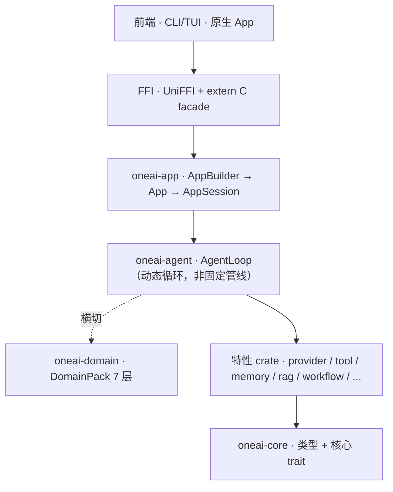

# OneAI

[English](README_EN.md) | **简体中文**

> **One AI, Every Platform** —— 跨平台 AI Agent 框架，基于 Rust 构建：模块化、类型安全、领域可插拔、可评测、多 Agent 原生，一套 Rust 内核打到六端。

[](LICENSE)
[](https://github.com/Marssssss/OneAI/actions/workflows/ci.yml)
[](https://crates.io/crates/oneai-app)
[]()
[]()
[]()
[]()
[]()

<p align="center">
  
</p>

同一套 Rust 内核（`oneai-core`），通过 UniFFI 与手写 `extern "C"` facade，驱动 macOS / Windows / Linux / Android / iOS / HarmonyOS 六端原生 App。

---

## 一图看懂

<p align="center">
  
</p>

<p align="center"><em>macOS 原生 App · 默认对话主页 —— 品牌入口 + 推荐话题，点话题即开聊。</em></p>

<p align="center">
  
</p>

<p align="center"><em>交互式 CLI（<code>oneai-cli</code>）· Plan 模式 —— 思考气泡、计划面板、工具调用、accept/reject 审批。</em></p>

**同一个引擎，两种前端**：原生 App 给「场景化多 Agent 对话」（面试陪练 / 语言伙伴 / 辩论 / 写作工坊 / 头脑风暴），CLI TUI 给「通用 Agentic 编程 / 任务执行」。两者背后是同一套 Rust 内核与同一个 `AgentLoop`。

---

## Highlights · 为什么选 OneAI

- **六端原生** —— 一套 Rust 内核驱动 macOS / Windows / Linux / Android / iOS / HarmonyOS 原生 App，不是 WebView 套壳。
- **动态 AgentLoop** —— 不是固定管线；每轮模型动态决策（直接回答 / 工具调用 / 委托子 Agent / 切换范式），迭代上限由 Token 预算约束。
- **DomainPack 一行切领域** —— 7 层声明式配置（工具 / 上下文 / 权限 / 范式 / 压缩 / 工作流 / 记忆），可合并、可对照 JSON Schema 校验、可经市场共享。
- **场景化 GroupChat** —— 引擎级多角色对话原语：角色阵容 + 轮次策略 + 背景字段可见性 + 复盘/审改循环，5 个内置预设开箱即用。
- **生产级基础设施** —— ProviderPool 降级链 + SmartRouter 多因子路由 + 限流 / 熔断 / 429 重试 + Token 感知的上下文管理。
- **可观测可评测** —— OpenInference 兼容轨迹 + 独立评测框架（6 指标 3 套件 + SWE-bench 三轴：能力 × 用量 × 效率）。
- **跨会话续接** —— 任务目标 / 步骤 / 决策 / 卡点以 append-only 事件日志落盘，新 session 自动 surface 上次未完成工作。

技术总览见 [架构与技术设计](docs/architecture.md)。

---

## 快速上手

按你的角色挑一条路径：

| 路径 | 适合谁 |
|------|--------|
| **一、桌面 App** | 想直接用 App 玩场景化多 Agent 对话（macOS 下载即用 / Windows 源码构建），不碰命令行 |
| **二、TUI / CLI** | 通用 Agentic 编程 / 任务执行、子系统探索 |
| **三、集成 OneAI SDK** | 用 crates.io 上的 OneAI 构建自己的 Rust 应用 |

### 一、桌面 App（macOS / Windows）

两个原生桌面 App 共用同一设计、场景系统与设置面板——macOS 为 SwiftUI、Windows 为 WinUI 3 / C#，功能对齐。**配置与使用方式完全一致**，差异只在安装。

**macOS（下载即用）**：从 [GitHub Releases](https://github.com/Marssssss/OneAI/releases) 下载 `OneAI-1.1.0-macos.zip`，解压拖入「应用程序」。该 .app 未签名 / 未公证（arm64，Apple Silicon，macOS 13+）；从浏览器下载的副本带隔离标记，**终端一行剥掉即可**：

```bash
xattr -cr /Applications/OneAI.app   # 之后双击直接打开，无弹窗
```

**Windows（源码构建）**：需 Visual Studio 含 WindowsAppSDK 1.8 workload。

```powershell
rustup target add x86_64-pc-windows-msvc
powershell ./scripts/build_windows.ps1
dotnet run --project platforms\windows\OneAI\OneAI.csproj -c Debug -r win-x64
```

`-r win-x64` 不可省。详见 [`platforms/windows/README.md`](platforms/windows/README.md)。

**配置（App 内 Settings 面板）**：桌面 App 不读环境变量或 `~/.oneai/config.toml`，Provider 与 Embedding 都在「设置」面板里配，持久化到各平台用户数据目录。打开 App 从侧边栏底部或菜单唤出「设置」：

- **Provider 类型**：`openai` / `anthropic` / `ollama`，或任意 OpenAI 兼容网关（`gemini` / `glm` / `dashscope`）。选 ollama 自动填 `127.0.0.1:11434`。
- **API Key** / **Base URL**（留空走官方端点）/ **Model**（如 `gpt-4o` / `claude-sonnet-4-6` / `llama3` / `qwen-plus`）。
- **Embedding 设置**：默认留空即 `auto` 探测（探测链见 [RAG 机制](docs/rag-mechanism.md)）。

每个 Agent 还可在场景编辑器里单独覆写 model / key / base_url，混用多家厂商。使用：侧边栏「从场景开始」选 5 个内置预设之一（**面试演练 / 语言伙伴 / 辩论赛 / 写作工坊 / 头脑风暴**），或「编辑场景」拖拽式自建。运行中：流式逐字渲染 markdown + 思考气泡、命令面板（macOS `⌘K` / Windows `Ctrl+K`）、语音输入、产物画布。

> 从源码构建 macOS：`./scripts/build_apple.sh && ./platforms/macos/build_macos.sh && open platforms/macos/build/OneAI.app`。

### 二、TUI / CLI（通用 Agentic 执行）

`examples/cli`（bin `oneai-cli`）是基于 ratatui+crossterm 的交互式 TUI。Provider 走环境变量或 `~/.oneai/config.toml`（环境变量优先级更高）。兼容任何 OpenAI 兼容端点（OpenAI / Anthropic / Gemini / Ollama / DashScope / DeepSeek / vLLM 等）。

```bash
# OpenAI 兼容端点
export ONEAI_API_KEY="sk-..."
export ONEAI_BASE_URL="https://api.openai.com/v1"
export ONEAI_MODEL="gpt-4o"

# Ollama（本地，无需 key）
export ONEAI_BASE_URL="http://localhost:11434"
export ONEAI_MODEL="llama3"
```

```bash
cargo run -p oneai-cli      # 或：cargo install oneai-cli，然后直接 oneai
```

进入交互式 Agent：输入任务即可看到完整管线实时运行——流式思考气泡、工具调用、计划清单、用量统计、轨迹日志。

**文本选择与复制**：TUI 保留了鼠标捕获（滚轮 / 滚动条拖拽 / `Ctrl+↑↓` / `PageUp-Down` / `Home` / `End` 均可滚动，流式输出过程中上滚查看历史不会被自动拉回底部）。要选中模型输出并复制，**按住 `Shift` 在聊天区拖拽**——应用自身绘制选中高亮并写入系统剪贴板（`arboard`），松开即自动复制，**不依赖终端**的 Shift-bypass 行为，故在所有终端上都能工作；普通点击仍折叠消息。

**交互模式（`Shift+Tab` 循环切换）：**

| 模式 | 行为 |
|------|------|
| `Normal` | 默认 —— 高风险工具暂停等待审批 |
| `⚡ Auto` | 全部自动批准（快速迭代） |
| `📋 Plan` | 禁用工具执行 —— Agent 必须先给计划，你在 accept/reject 弹窗审阅后再执行 |

**高频斜杠命令**（完整列表 `TUI 内 /help`，子命令参考见 [CLI 参考](docs/cli-reference.md)）：

| 命令 | 作用 |
|------|------|
| `/tools` | 列出当前已注册工具 |
| `/skills` · `/skill <name>` | 列出 / 激活技能 |
| `/domain <name>` | 切换 DomainPack（coding / research / general） |
| `/usage` · `/context` | 查看 token 用量 / 上下文拆分 |
| `/wf list` · `/wf run <name>` | 列出 / 执行工作流 |
| `/new` · `/quit` | 新建会话 / 退出 |

非交互单次推理：`oneai run "把 auth 模块重构为 async" --domain coding --model gpt-4o`。

> **网络代理**：所有出站 HTTP 走 `reqwest::Client`，代理靠环境变量全端统一——`HTTPS_PROXY` / `HTTP_PROXY` / `ALL_PROXY`（代理 URL）、`NO_PROXY`（排除）、`ALL_PROXY=socks5://host:port`（SOCKS5）。详见 [CLAUDE.md — Network proxy](CLAUDE.md)。

### 三、集成 OneAI SDK 构建你自己的应用（crates.io）

```bash
cargo add oneai-app
cargo add tokio --features full
```

集成入口是 `crates/oneai-app/src/builder.rs` 的 `AppBuilder`——每个子系统都可选、通过 builder 方法插装（**LLM Provider 也是可选的**，纯工具 / 纯工作流用法无需 Provider）。`App` 之上用 `create_session()` 拿到 `AppSession`，之后**让 AgentLoop 跑起来的推理入口就是 `session.run_agent(task, observer, interrupt_slot)`**——把用户输入作为 `task` 字符串直接传进去，循环自己会把这条 user message 加进 conversation，不需要先 `send_user_message`。

#### 最小可跑（静默推理）

```rust
use oneai_app::AppBuilder;
use oneai_core::ModelConfig;
use oneai_provider::OpenAIProvider;

#[tokio::main]
async fn main() -> anyhow::Result<()> {
    // Provider 必填——跑推理时没 provider 会返回 Provider 错误。
    // ONEAI_API_KEY / ONEAI_BASE_URL / ONEAI_MODEL 是 CLI 读取的环境变量，
    // SDK 集成时你可以直接从 env 取，也可以硬编码或读配置文件。
    let provider = OpenAIProvider::new(ModelConfig {
        api_key: std::env::var("ONEAI_API_KEY").ok(),
        base_url: std::env::var("ONEAI_BASE_URL").ok(),
        model_name: Some("gpt-4o".to_string()),
        ..ModelConfig::default()
    });

    let app = AppBuilder::new()
        .provider(std::sync::Arc::new(provider))
        .noop_interaction_gate()        // 无审批 UI 时用 no-op 门（默认即此）
        .default_parser()               // 3 层输出解析器，防 LLM 不可靠输出
        .build()?;

    let mut session = app.create_session();   // 同步；带持久化续聊用 create_session_with_id(id).await

    // run_agent_silent = run_agent + 空 observer + 一次性 interrupt slot。
    // 适合后端批处理 / 一次性问答：拿最终答案就完事。
    let result = session.run_agent_silent("帮我总结 src/main.rs 的作用").await?;
    println!("{}", result.final_answer);   // → 模型的最终回答
    println!("迭代 {} 轮, 完成={}", result.iterations, result.completed);
    Ok(())
}
```

#### 流式 + 工具调用过程回调

要做聊天 UI（打字机效果、工具调用气泡），实现 `AgentLoopObserver`——循环在每个关键节点回调它：

```rust
use std::sync::Arc;
use tokio::sync::mpsc;
use oneai_agent::{AgentLoopObserver, AgentLoopResult, ToolCallRequest, ParadigmKind};
use oneai_core::ToolOutput;

struct UiObserver { tx: mpsc::UnboundedSender<String> }

impl AgentLoopObserver for UiObserver {
    fn on_iteration_start(&self, iter: usize, _p: ParadigmKind) {
        let _ = self.tx.send(format!("[iter {iter}]"));
    }
    fn on_stream_chunk(&self, text: &str) {            // 流式 token —— 推给打字机
        let _ = self.tx.send(text.to_string());
    }
    fn on_tool_calls(&self, calls: &[ToolCallRequest]) {/* 渲染工具调用气泡 */}
    fn on_tool_result(&self, _id: &str, name: &str, out: &ToolOutput) {
        let _ = self.tx.send(format!("→ {name}: {:?}", out.content));
    }
    fn on_direct_answer(&self, text: &str) {            // 模型决定收尾时的最终回答
        let _ = self.tx.send(text.to_string());
    }
    fn on_complete(&self, _r: &AgentLoopResult) { /* 收尾 */ }
    // 还有 on_thinking / on_token_usage_full / on_context_accounting /
    // on_delegate / on_interrupt / on_resume …… 按需 override，均有默认空实现。
}

// interrupt_slot：跨线程中断 / 恢复循环
let interrupt_slot: Arc<tokio::sync::Mutex<Option<oneai_agent::AgentLoop>>> =
    Arc::new(tokio::sync::Mutex::new(None));

let (tx, mut rx) = mpsc::unbounded_channel();
let observer = UiObserver { tx };

// 这一行让 AgentLoop 起飞：
let result = session
    .run_agent("用户输入放这里", &observer, interrupt_slot.clone())
    .await?;

// 另一条 tokio task drain `rx`，把 chunk 渲染到 UI
while let Some(chunk) = rx.recv().await { /* render */ }
```

#### 关键约定

- **`task` 就是用户输入**：不要先 `send_user_message` 再 `run_agent`——会重复入消息。`run_agent` 内部已把 task 加进 conversation（`session.rs` 注释说明）。
- **多轮对话**：一个 session 内连续调多次 `run_agent`，conversation 累积历史；上下文超 token 预算时 AgentLoop 自动压缩（`ContextBudgetManager` 门控，预算按模型真实窗口缩放），无需你管。手动压缩走 `session.compact(keep_recent_turns)`。
- **中断 / 恢复**：把 `interrupt_slot` clone 到 UI 线程，取其中的 `AgentLoop` 句柄调 `interrupt()`，在迭代边界生效；`InteractionGate` 的 `ChannelInteractionGate` / `ThresholdInteractionGate` 还能拦截工具审批、Plan 决策等 5 个决策点（见 `AppBuilder::channel_interaction_gate` / `threshold_interaction_gate`）。
- **跨 session 续聊**：`app.create_session_with_id(id).await` 从 SQLite 回放历史；要绑定到 working-state 任务用 `session.continue_task(task_id)`（崩溃恢复 + 跨 session 任务续跑）。
- **领域切换**：builder 上 `.domain_pack(coding_pack("/dir"))` 一行切领域，AgentLoop 用对应 system prompt + 工具白名单 + 范式策略；多领域合并 `.domain_packs(vec![...])`（权限 strictest-wins）。
- **纯工具 / 纯工作流（无 Provider）**：跳过 `.provider(...)`，直接 `session.execute_tool("calculator", json!({"expression":"2+3"})).await`（返回 `ToolOutput.content`），或 `session.execute_workflow(&config).await` 跑 StateGraph——见下面「无 LLM 也能用」示例：

```rust
let app = AppBuilder::new().noop_interaction_gate().default_parser().build()?;
let session = app.create_session();
let r = session
    .execute_tool("calculator", serde_json::json!({"expression": "2+3"}))
    .await?;
println!("{}", r.content); // → "5"
```

一般集成只需 `oneai-app`；想缩小依赖面时按需单独依赖 `oneai-core` / `-provider` / `-domain` / `-tool` / `-memory` / `-rag` 等，完整列表见 [架构 — Crate 总览](docs/architecture.md#crate-总览)。深入理解架构读 [CLAUDE.md](CLAUDE.md)，驱动各子系统跑一遍见 [CLI 参考](docs/cli-reference.md)——`examples/cli` 的 `chat` 子命令就是 `run_agent` + 自定义 observer + interrupt slot 的完整参考实现，照抄即可。

---

## 架构一瞥


```mermaid
flowchart TB
  FE["前端 · CLI/TUI · 原生 App"] --> FFI["FFI · UniFFI + extern C facade"]
  FFI --> App["oneai-app · AppBuilder → App → AppSession"]
  App --> Loop["oneai-agent · AgentLoop（动态循环，非固定管线）"]
  Loop -. 横切 .-> Domain["oneai-domain · DomainPack 7 层"]
  Loop --> Features["特性 crate · provider / tool / memory / rag / workflow / ..."]
  Features --> Core["oneai-core · 类型 + 核心 trait"]
```

每轮迭代模型在「直接回答 / 工具调用 / 委托子 Agent / 切换范式」间动态决策；`DomainPack` 横切所有特性层，一行切换整套领域行为。完整架构图、依赖分层、Crate 总览与模块设计文档索引见 [架构与技术设计](docs/architecture.md)。

---

## 跨平台：桌面与移动端

一套 Rust 内核，通过两条 FFI 通路打到六端原生 App：

| 平台 | 技术 | 绑定语言 | 原生审批对话框 |
|---|---|---|---|
| macOS | SwiftUI（`swiftc`，无需 Xcode） | Swift（UniFFI） | NSAlert |
| Windows | WinUI 3 / C# | C#（P/Invoke facade） | MessageBox |
| Linux | 桌面平台 crate | C++（facade） | MessageBox |
| Android | Jetpack Compose / Kotlin | Kotlin（UniFFI） | AlertDialog |
| iOS | SwiftUI / Swift | Swift（UniFFI xcframework） | UIAlertController |
| HarmonyOS | ArkTS / ArkUI + NAPI | C++（NAPI 包裹 facade） | CommonDialog |

各端共享同一设计：场景化多 Agent 群聊（5 内置预设）、流式 20fps 合并渲染、Markdown、暗色跟随系统、命令面板、产物画布。**macOS App 是参考实现，其他端镜像之。** 构建步骤与 FFI 细节见 [跨平台机制](docs/cross-platform-mechanism.md) 与各 [`platforms/*/README.md`](platforms/macos/README.md)。

---

## 评测

OneAI 接入 [SWE-bench Lite](https://www.swebench.com/) 做 coding agent 评测，按 **能力（resolved）× 用量（token）× 效率（轨迹）** 三轴采集——不只看「做没做对」，也看花了多少、多快。

```bash
# 冒烟：单实例确认闭环
cargo run -p oneai-cli-demo -- eval swebench \
    --dataset ./swe_bench_lite.jsonl \
    --instances astropy__astropy-12907 \
    --workspace ./swebench-workspace --run-id oneai-smoke
```

前置准备、批量 / 全量运行、产物 schema 与记忆评测见 [评测机制](docs/eval-mechanism.md)。

---

## 贡献

欢迎贡献！无论是修 bug、补文档、清理 clippy lint，还是新增子系统，都请先读 [CONTRIBUTING.md](CONTRIBUTING.md)——它说明了本地构建 / 测试命令、crate 分层规则、3 层解析器 / 权限模型等「别绕过」的约定，以及提 PR 前的自查清单。想找容易上手的，认领一个标了 [`good first issue`](https://github.com/Marssssss/OneAI/labels/good%20first%20issue) 的 issue；设计讨论走 [GitHub Discussions](https://github.com/Marssssss/OneAI/discussions)。行为准则见 [CODE_OF_CONDUCT.md](CODE_OF_CONDUCT.md)。

## 许可证

Apache-2.0 — 详情见 [LICENSE](LICENSE)。
