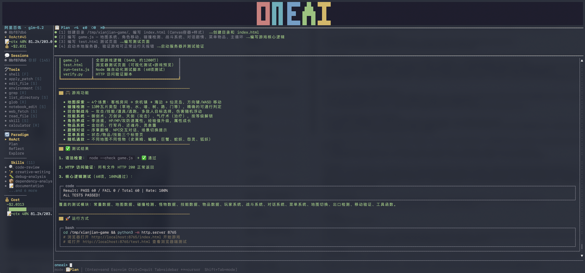

# OneAI

**English** | [简体中文](README.md)

> A cross-platform AI agent framework built in Rust — modular, type-safe, domain-pluggable, eval-ready, and multi-agent native.

[](LICENSE)
[]()
[]()
[]()

<p align="center">
  
</p>

<p align="center"><em>The interactive TUI (<code>oneai-cli</code>) running a complex task in Plan mode — thinking bubbles, plan checklist panel, tool-call display, and the accept/reject review gate.</em></p>

---

## Quick Start

### 1. Configure a provider

OneAI talks to any **OpenAI-compatible** endpoint (OpenAI, Anthropic, Gemini, Ollama, and self-hosted gateways like 阿里百炼/DashScope, DeepSeek, vLLM). Set credentials via env vars or a config file — env vars take priority.

```bash
# OpenAI-compatible endpoint — works for OpenAI, DashScope, DeepSeek, etc.
export ONEAI_API_KEY="sk-..."
export ONEAI_BASE_URL="https://api.openai.com/v1"   # or your gateway
export ONEAI_MODEL="gpt-4o"                          # or qwen-plus, deepseek-chat, ...

# Ollama (local, no key needed)
export ONEAI_BASE_URL="http://localhost:11434"
export ONEAI_MODEL="llama3"
```

…or write `~/.oneai/config.toml`:

```toml
[provider]
api_key = "sk-..."
base_url = "https://api.openai.com/v1"
model = "gpt-4o"

[domain]
default_pack = "coding"   # coding | research | general

[ui]
theme = "dark"
```

Generate one with `oneai config create`, inspect with `oneai config show`.

### 2. Launch the TUI

```bash
cargo run -p oneai-cli-demo
# or, after `cargo install --path examples/cli`, just: oneai
```

You're dropped into the interactive agent. Type a task and watch the full pipeline run live: streaming thinking bubbles, tool calls, the plan checklist, cost/token accounting, and trajectory trace.

**Interaction modes — cycle with `Shift+Tab`:**

| Mode | Behavior |
|------|----------|
| `Normal` | Default — high-risk tools pause for approval |
| `⚡ Auto` | Auto-approve everything (fast iteration) |
| `📋 Plan` | Tool execution disabled — the agent must produce a plan first; you review it in an accept/reject popup before anything runs |

**Keys:**

| Key | Action |
|-----|--------|
| `Enter` | Send · `Ctrl+Enter` newline |
| `Shift+Tab` | Cycle mode (Normal → Auto → Plan) |
| `Tab` | Toggle sidebar |
| `↑↓` / `Ctrl+↑↓` / `PgUp` / `PgDn` | History & chat scroll |
| Mouse drag | Select & copy text · wheel to scroll |
| `Esc` | Vim mode / quit |

**In-chat slash commands** (type `/help` for the full list): `/skills` `/skill` `/tools` `/cost` `/context` `/session` `/domain` `/compact` `/wf` `/new` `/init` `/clear` `/quit`.

### 3. Non-interactive single-shot

```bash
oneai run "Refactor the auth module to use async" --domain coding --model gpt-4o
```

### 4. Try a subsystem from the CLI

OneAI ships every subsystem behind a CLI subcommand so you can drive it without writing code:

```bash
oneai pack list                      # browse DomainPacks
oneai eval run coding-basic          # run an eval suite
oneai studio                         # launch the Web UI (StateGraph viz + checkpoint time-travel)
oneai mcp serve                      # run as an MCP server (Claude Code/Cursor compatible)
oneai provider status                # provider-pool health & fallback log
oneai route                          # show SmartRouter's last routing decision
oneai cost report                    # cost/usage/budget report
oneai token --prompt "..."          # count tokens & check context-window fit
oneai team run code-review           # multi-agent team coordination
oneai swarm run --task "..."         # swarm orchestration
oneai session list / resume <id>     # persisted sessions (SQLite)
oneai wasm list / run <name>         # WASM-sandboxed modules
oneai embed generate "text"          # vector embeddings
oneai a2a serve                       # expose the agent over the A2A protocol
oneai init [--format oneai|agents|claude] [--force] [--no-llm]  # generate a project-instruction file (LLM-synthesized when a provider is configured, else heuristic)
```

### 5. Minimal Rust program

```rust
use oneai_app::AppBuilder;
use oneai_domain::coding_pack;

#[tokio::main]
async fn main() {
    let app = AppBuilder::new()
        .auto_approval_gate()
        .default_parser()
        .domain_pack(coding_pack("/project/dir"))  // ← one-line domain switch
        .build()
        .expect("App build should succeed");

    let session = app.create_session();
    let result = session
        .execute_tool("calculator", serde_json::json!({"expression": "2+3"}))
        .await
        .unwrap();
    println!("Result: {}", result.content); // → "5"
}
```

---

## What is OneAI?

OneAI is a full-stack agent framework written in Rust. It provides everything you need to build, run, and evaluate AI agents — from LLM provider abstraction to tool execution, memory management, workflow orchestration, domain-specific configuration, multi-agent coordination, and trajectory logging — all with cross-platform support via UniFFI bindings. **The LLM provider is optional** — tool-only or workflow-only usage needs no provider.

**Key principles:**

- **Modular by design** — 24 independent crates, each with a clear responsibility. Use only what you need.
- **Type-safe throughout** — sealed enum hierarchies (`#[non_exhaustive]` on every public enum), trait-driven abstractions, no stringly-typed configs.
- **Domain-pluggable** — the DomainPack system makes domain knowledge declarative, composable, and switchable in one line; packs can be validated against a JSON Schema and shared via a pack market.
- **Multi-agent native** — SubAgents, Team coordination (Coordinate/Route/Collaborate/Debate), Handoff protocol, and Swarm orchestration with capability-driven routing.
- **Production-grade infra** — ProviderPool fallback chains, SmartRouter multi-factor routing, cost/usage budgets, rate limiting, circuit breakers, and token-aware context management.
- **Cross-platform** — macOS, Windows, Linux, Android, iOS, and HarmonyOS via UniFFI (Kotlin, Swift, C++, C#).
- **Eval-ready** — built-in OpenInference-compatible trajectory logger plus a dedicated eval framework (6 metrics, 3 suites).
- **Human-machine collaboration** — approval gates with native UI dialogs for high-risk tool operations; Plan mode gate before execution.
- **Dynamic agentic loop** — not a fixed pipeline; each iteration decides dynamically (direct answer, tool call, delegate to sub-agent, or switch paradigm).

---

## Architecture

```
┌─────────────────────────────────────────────────────────────────────┐
│                        oneai-app (Integration)                       │
│  AppBuilder → App → AppSession   (the single wiring point)          │
├──────────┬──────────┬──────────┬──────────┬──────────┬──────────────┤
│ oneai-   │ oneai-   │ oneai-   │ oneai-   │ oneai-   │ oneai-       │
│ agent    │ workflow │ memory   │ tool     │ rag      │ skill        │
│ AgentLoop│ DAG +    │ STM +    │ Registry │ Document │ Selector     │
│ +SubAgent│ StateGrph│ LTM +    │ + MCP +  │ Index +  │ + Registry   │
│ +ReAct   │ Compile→ │ Compress │ Approval │ Embedding│ + Skills     │
│ +Plan    │ Execute   │ +SQLite  │ +12 tools│ Retrieval│              │
│ +Reflect │          │ persist  │          │          │              │
├──────────┴──────────┴──────────┴──────────┴──────────┴──────────────┤
│ oneai-domain (5-layer DomainPack + market + spec validator)          │
│ oneai-a2a   oneai-wasm   oneai-eval   oneai-studio   oneai-mcp        │
│ A2A SDK     Wasmtime     Eval suite   Web UI         MCP server/host │
├──────────────────────────────────────────────────────────────────────┤
│ oneai-provider: OpenAI/Anthropic/Gemini/Ollama + ProviderPool +     │
│                 SmartRouter + retry/429                              │
│ oneai-parser (3-layer) · oneai-persistence · oneai-trace · oneai-    │
│   scheduler · oneai-uniffi · oneai-platform-{desktop,android,ios,   │
│   harmony}                                                           │
├──────────────────────────────────────────────────────────────────────┤
│                     oneai-core (Foundation)                          │
│  ContentBlock, Message, Conversation, PermissionLevel, Budget,       │
│  ContextBudgetManager, PlatformCapabilities, all core traits         │
│  (LlmProvider, Tool, ApprovalGate, EmbeddingService, CostTracker,   │
│   RateLimiter, CircuitBreaker, TokenCounter)                         │
└─────────────────────────────────────────────────────────────────────┘
```

---

## Crate Overview

| Crate | Description | Tests |
|-------|-------------|-------|
| `oneai-core` | Core types, traits, PermissionLevel, Budget, PlatformCapabilities | 259 |
| `oneai-provider` | LLM providers (OpenAI, Anthropic, Gemini, Ollama) + ProviderPool + SmartRouter | 91 |
| `oneai-parser` | 3-layer output parsing defense | 12 |
| `oneai-memory` | STM, LTM, compression, HNSW, MemoryManager + persistence | 33 |
| `oneai-tool` | Tool registry, MCP client, approval gates, executor, 12 tools | 55 |
| `oneai-skill` | Skill selector + registry + built-in domain skills | — |
| `oneai-domain` | DomainPack system (5-layer), CodingPack, market, spec validator | 102 |
| `oneai-agent` | AgentLoop + SubAgent + ReAct/Plan/Reflect + StreamParser + ContextAssembler + Team/Handoff/Swarm | 179 |
| `oneai-rag` | RAG + EmbeddingService (OpenAI/Anthropic/Voyage/Ollama/FastEmbed) | 61 |
| `oneai-workflow` | Workflow DAG + StateGraph + compiler + executor | 44 |
| `oneai-scheduler` | In-memory task scheduling | 6 |
| `oneai-persistence` | ProgressiveCheckpoint + SQLite (sessions/cost) backends | 39 |
| `oneai-a2a` | A2A protocol SDK — client + server host + DomainPack→AgentCard | 88 |
| `oneai-wasm` | WASM sandbox engine — Wasmtime + WasmTool + module registry | 95 |
| `oneai-eval` | Eval framework — cases, metrics, runner, 3 suites | 59 |
| `oneai-studio` | Studio Web UI — axum HTTP+WS + D3.js StateGraph viz + checkpoint time-travel | 34 |
| `oneai-mcp` | MCP server ecosystem — host + plugin registry + config | 57 |
| `oneai-app` | Application integration layer (AppBuilder) | 17 |
| `oneai-trace` | OpenInference-compatible trajectory logger | 14 |
| `oneai-uniffi` | UniFFI binding definitions for FFI | 20 |
| `oneai-platform-desktop` | Desktop platform (macOS/Windows/Linux) | 2 |
| `oneai-platform-android` | Android platform | 2 |
| `oneai-platform-ios` | iOS platform | 1 |
| `oneai-platform-harmony` | HarmonyOS platform | 1 |
| **Total** | | **1271** |

---

## Core Concepts

### Domain Pack System

The DomainPack is OneAI's key architectural innovation — it makes domain knowledge **declarative, pluggable, and composable** instead of hardcoded. A DomainPack encapsulates 5 layers of domain-specific configuration:

| Layer | Component | Purpose |
|-------|-----------|---------|
| 1 | **Tools + ToolDecorators** | Domain-specific tool set and description overrides |
| 2 | **ContextSources** | Domain-specific environment sensing with refresh policies |
| 3 | **PermissionProfile** | Domain-specific permission classification (deny/auto/confirm) |
| 4 | **ParadigmStrategies** | Domain-specific task → paradigm mapping |
| 5 | **CompressionTemplate** | Domain-specific context preservation priorities |

```rust
let app = AppBuilder::new()
    .provider(provider)
    .domain_pack(coding_pack("/project/dir"))  // ← one-line domain switch
    .build()?;
```

DomainPacks **merge** for multi-domain agents (coding + research) — strictest-wins permissions, priority merge for context sources. Packs can be **validated** against a JSON Schema (`DomainPackSpec`) with structural + semantic checks, **installed** from a path or git URL, and shared via the **pack market** (`PackSource` + `PackRegistry` + builtin index).

```bash
oneai pack list                  # browse builtin packs
oneai pack validate spec.toml   # validate a pack against the spec
oneai pack install ./my-pack     # install from a local path
```

#### CodingPack (Built-in)

Modeled after Claude Code's workflow embedding: 9 tools (FileRead, FileEdit, Shell, Grep, Glob, FileList, NotebookEdit, Environment, WebFetch), 8 tool decorators, 6 context sources with refresh policies, a permission profile (auto-approve reads, confirm edits/shell, deny `rm -rf`/`mkfs`), 4 paradigm strategies, and 3 sub-agent types (searcher / coder / reviewer).

### Agentic Loop (AgentLoop)

The core execution engine is a **dynamic loop** — not a fixed pipeline. Each iteration, the model decides what to do next:

| Decision | Action |
|----------|--------|
| **DirectAnswer** | Model produced a final answer → loop ends |
| **ToolCalls** | Model wants to invoke tools → execute and feed results back |
| **Delegate** | Model delegates a subtask to a specialized sub-agent |
| **SwitchParadigm** | Model switches paradigm (Plan/Reflect/Explore) — changes system prompt + tool filter |

Termination is governed by **TokenBudget**, not a hardcoded `max_iterations`. Lifecycle hooks (`PreToolUse`/`PostToolUse`/etc.), interrupt/resume (`CancellationToken`), and structured output are built in.

### Agent Paradigms

| Paradigm | Pattern | Use Case |
|----------|---------|----------|
| **ReAct** | Reason → Act → Observe loop | General tool-calling tasks |
| **Plan** | Decompose → ordered step list | Complex multi-step tasks |
| **Reflection** | Verify → suggest corrections | Quality assurance, self-check |
| **Parallel** | ScopeState isolation → merge | Independent sub-tasks |
| **Explore** | Search → understand → summarize | Codebase/search exploration |

Paradigms are **model/workflow-driven** — the model calls `switch_paradigm`, or a StateGraph node emits `GraphDecision::SwitchParadigm`, and `apply_paradigm_switch` changes the system prompt + decision hint + tool filter. The user-facing execution policy is the separate **InteractionMode** (Normal/Auto/Plan via `Shift+Tab`).

### Permission Model

Three-tier permission system: `Read` (auto-approve), `Standard` (policy-dependent), `Full` (requires approval). Resolution order: `deny_by_default` → `permission_overrides` → `auto_approve` → `require_confirmation` → tool's own `risk_level()`. Approval gates: `BlockingApprovalGate`, `AutoApprovalGate`, `ChannelApprovalGate`, `PlatformApprovalGate` (native NSAlert/AlertDialog/UIController dialogs).

### LLM Providers & Routing

Built-in providers: **OpenAI, Anthropic, Gemini, Ollama** — all behind the `LlmProvider` trait (`infer` + `infer_stream`). On top of them sit two production layers:

- **ProviderPool** — a fallback chain of providers with per-provider circuit breakers, rate limiters, and degradation rules (e.g. Anthropic→OpenAI→local). Automatic 429/retry handling with `Retry-After` parsing.
- **SmartRouter** — multi-factor routing (cost / latency / quality / balanced / custom) that scores providers and picks the best for each request, integrating circuit/rate/budget/context constraints. Logs every decision for inspection.

```rust
let app = AppBuilder::new()
    .default_provider_pool_anthropic()   // Anthropic → OpenAI → Ollama fallback
    .default_smart_router_balanced()     // multi-factor routing
    .build()?;
```

### Tool System

```rust
#[async_trait]
pub trait Tool: Send + Sync {
    fn name(&self) -> &str;
    fn description(&self) -> &str;
    fn parameters_schema(&self) -> serde_json::Value;
    fn risk_level(&self) -> RiskLevel;
    async fn execute(&self, args: serde_json::Value) -> Result<ToolOutput>;
}
pub trait PermissionAwareTool: Tool { fn permission_level(&self) -> PermissionLevel; }
```

**12 built-in tools:** ShellTool (safety blacklist + sandbox), FileReadTool (offset+limit), FileEditTool, FileWriteTool, FileListTool, GrepTool, GlobTool, EnvironmentTool, NotebookEditTool, FileDeleteTool, CalculatorTool, WebFetchTool. MCP client integration via `rmcp` (stdio/SSE/streamable-http); **MCP server** mode lets OneAI itself expose tools to Claude Code/Cursor (`oneai mcp serve`).

### Multi-Agent Coordination

| Pattern | Mechanism |
|---------|-----------|
| **SubAgent** | Hierarchical delegation to specialized sub-agents (Plan/Explore/Code/Review/Custom), with optional worktree isolation |
| **Team** | `TeamCoordinator` with 4 strategies — Coordinate, Route, Collaborate, Debate — plus 4 presets (`code_review`, `research_route`, `dev_pipeline`, `arch_debate`) |
| **Handoff** | `HandoffTool` (handoff-as-tool-call) + `HandoffManager` + 3 presets |
| **Swarm** | Dynamic agent pool with 4 routing strategies (BestFit/LoadBalanced/CostOptimized/Fastest), task decomposition + quality validation + retry |

### Memory System

- **Short-term memory** — sliding window with automatic eviction to long-term.
- **Long-term memory** — HNSW-like vector store + content store + hybrid scoring; **auto-embeds** entries via the configured `EmbeddingService`.
- **STM↔LTM closed loop** — `MemoryReflection` + `inject_ltm_context` + `RecallStrategy`.
- **Context compression** — summarization past threshold, keeping recent turns; `ContextBudgetManager` allocates per-iteration budget proportionally.
- **Persistence** — `SqliteSessionStore` persists conversations / STM / LTM; `AppSession` auto-saves after each run. `oneai session list / resume <id> / delete / info`.

### Cost, Usage & Reliability

- **CostTracker** (`InMemory` + `Sqlite`) with a `ModelPricingCatalog` (25+ models) — `oneai cost report / budget / models / export`.
- **RateLimiter** (`TokenWindowRateLimiter`) + **CircuitBreaker** (`ThresholdCircuitBreaker`, Closed/Open/HalfOpen) — enforced inside the AgentLoop.
- **Token counting** — `HeuristicTokenCounter` (per-provider, CJK-aware) + `ContextWindowProfile` + 4 trimming strategies + fit checks — `oneai token`.

### 3-Layer Output Parser

LLM outputs are defended in three layers: constrained decoding → fuzzy JSON repair (bracket closing, regex extraction, embedded JSON) → fallback self-correction re-prompt. Reuse it rather than parsing model output directly.

### Workflow Engine

- **WorkflowDag** — declarative DAG for parallel step orchestration.
- **StateGraph** — cyclic directed graph for iterative agent flows (ReAct loops, conditional routing, interrupt points). The StateGraph and AgentLoop close the loop: a graph node can emit `GraphDecision::SwitchParadigm`/`Delegate`/`ToolCalls`.

### RAG

`EmbeddingService` trait with OpenAI / Anthropic / Voyage / Ollama / FastEmbed (local ONNX) impls, an `EmbeddingServiceRegistry` (caching + fallback), and `AutoEmbeddingDocumentIndex` that embeds on `add_document()`. Chunking: SentenceBoundary / FixedSize / Paragraph.

### A2A Protocol, WASM Sandbox, Eval, Studio, MCP

- **A2A** (`oneai-a2a`) — Agent-to-Agent protocol SDK: client + axum JSON-RPC server host + DomainPack→AgentCard auto-exposure. `oneai a2a serve / discover / list / send`.
- **WASM** (`oneai-wasm`) — Wasmtime sandbox for untrusted code: `WasmTool`, `WasmModuleRegistry`, resource monitoring, WASI-restricted access, Native↔Wasm execution modes. `oneai wasm list / load / run / health / stats`.
- **Eval** (`oneai-eval`) — `EvalCase`/`ExpectedOutput`/`EvalMetric`/`EvalRunner` + 6 builtin metrics + 3 suites. `oneai eval run <suite>` / `eval score`.
- **Studio** (`oneai-studio`) — axum HTTP+WebSocket server, REST API, live event push, D3.js SVG StateGraph visualization, and checkpoint time-travel. `oneai studio`.
- **MCP ecosystem** (`oneai-mcp`) — `McpServerHost` (JSON-RPC server) + `McpPluginRegistry` (discovery/config/connect) + TOML config + stdio transport. `oneai mcp serve / list / add / remove / connect`.

### Trajectory Logging (Trace)

OpenInference-compatible trace for agent evaluation + an OTEL exporter (`OtlpCollector` + `OtelMetricsProvider`):

```rust
let app = AppBuilder::new().trace_in_memory().build()?;
session.end_session(SpanStatus::Ok);
let tree = session.build_trace_tree();
println!("Success rate: {:.1}%", tree.metrics.success_rate * 100.0);
```

---

## Cross-Platform Support

| Platform | Binding Language | Approval Gate | PlatformCapabilities |
|----------|-----------------|---------------|----------------------|
| macOS / Windows / Linux | C++ / C# | NSAlert / MessageBox | Screenshot, FilesystemSandbox, Notifications |
| Android | Kotlin | AlertDialog | Camera, Screenshot, Network |
| iOS | Swift | UIAlertController | Camera (limited), Screenshot |
| HarmonyOS | C++ | CommonDialog | Camera, AppSandbox |

---

## Project Structure

```
oneai/
├── crates/
│   ├── oneai-core/          # Foundation: types, traits, PermissionLevel, Budget
│   ├── oneai-provider/      # OpenAI/Anthropic/Gemini/Ollama + ProviderPool + SmartRouter
│   ├── oneai-parser/         # 3-layer output parsing
│   ├── oneai-memory/         # STM, LTM, compression, HNSW, MemoryManager + persistence
│   ├── oneai-tool/          # Registry, 12 tools, MCP client, approval, executor
│   ├── oneai-skill/         # Skill registry + selector + built-in domain skills
│   ├── oneai-domain/        # DomainPack (5-layer), CodingPack, market, spec validator
│   ├── oneai-agent/         # AgentLoop, SubAgent, paradigms, Team/Handoff/Swarm, StreamParser
│   ├── oneai-rag/           # Document, index, EmbeddingService, retrieval
│   ├── oneai-workflow/      # DAG, StateGraph, compiler, validator, executor
│   ├── oneai-scheduler/     # InMemoryScheduler
│   ├── oneai-persistence/   # Checkpoint + SQLite session/cost backends
│   ├── oneai-a2a/           # A2A protocol SDK (client + server host)
│   ├── oneai-wasm/          # Wasmtime sandbox + WasmTool + module registry
│   ├── oneai-eval/          # Eval cases, metrics, runner, suites
│   ├── oneai-studio/        # Studio Web UI (axum + WS + D3 viz)
│   ├── oneai-mcp/           # MCP server host + plugin registry
│   ├── oneai-app/           # AppBuilder, App, AppSession
│   ├── oneai-trace/         # OpenInference trajectory + OTEL exporter
│   ├── oneai-uniffi/        # UniFFI binding definitions
│   └── oneai-platform-{desktop,android,ios,harmony}/
├── examples/
│   ├── cli/                 # Interactive TUI demo (ratatui + crossterm) — bin: oneai-cli
│   ├── desktop-app/         # Desktop approval gate demo
│   ├── rust/                # Channel approval gate demo
│   ├── android-app/         # Android demo (Kotlin)
│   └── ios-app/             # iOS demo (Swift)
├── bindings/                # Generated UniFFI bindings (cpp/csharp/kotlin/swift)
├── scripts/                 # generate_bindings.sh
└── Cargo.toml               # Workspace root (resolver = "2", edition 2021, v0.2.0)
```

---

## Build, Test, Run

```bash
cargo build                      # build the whole workspace
cargo test                       # all 1271 tests across 24 crates
cargo test -p oneai-agent        # tests for a single crate
cargo test -p oneai-agent plan   # a single test/module within a crate
cargo clippy --workspace --all-targets   # keep lints clean
cargo run -p oneai-cli-demo      # launch the interactive TUI (bin: oneai-cli)
```

The workspace uses `resolver = "2"`, `edition = "2021"`, shared version `0.2.0` from `[workspace.package]`, and all shared dependencies pinned in `[workspace.dependencies]`. `#[non_exhaustive]` is applied to public enums as part of the v0.2.0 API-stability commitment.

---

## Development Roadmap

| Phase | Focus | Status |
|-------|-------|--------|
| 1–11 | Core, providers, parser, paradigms, memory, tools, workflow, persistence, AppBuilder, UniFFI, platform UI, trajectory, DomainPack, TUI | ✅ Complete |
| P2-1 | SubAgent + Worktree isolation + parallel execution | ✅ Complete |
| P2-2 | StateGraph ↔ AgentLoop closed-loop execution | ✅ Complete |
| P2-3/4 | OTEL observability + STM↔LTM closed loop | ✅ Complete |
| P2-5 | A2A protocol SDK | ✅ Complete |
| P2-6 | WASM sandbox engine | ✅ Complete |
| P3-1 | API stabilization (`#[non_exhaustive]`, v0.2.0) | ✅ Complete |
| P3-2/3 | DomainPack market + CLI polish (clap subcommands + config) | ✅ Complete |
| P3-4/5 | Eval framework + Studio Web UI | ✅ Complete |
| P3-6 | MCP server ecosystem | ✅ Complete |
| P4-1/2 | A2A server host + MCP client enhancement | ✅ Complete |
| P4-3/4 | DomainPack spec validator + WASM runtime enhancement | ✅ Complete |
| P5-1/2/3 | SQLite persistence + embedding service + cost/usage management | ✅ Complete |
| P6-1/2/3 | ProviderPool + SmartRouter + token counting/context management | ✅ Complete |
| P7-1/2/3 | Team coordination + Handoff protocol + Swarm orchestration | ✅ Complete |
| TUI | Tool display, Plan mode gate, skill disclosure, scroll perf, mouse selection | ✅ Complete |

---

## License

Apache-2.0 — see [LICENSE](LICENSE) for details.
