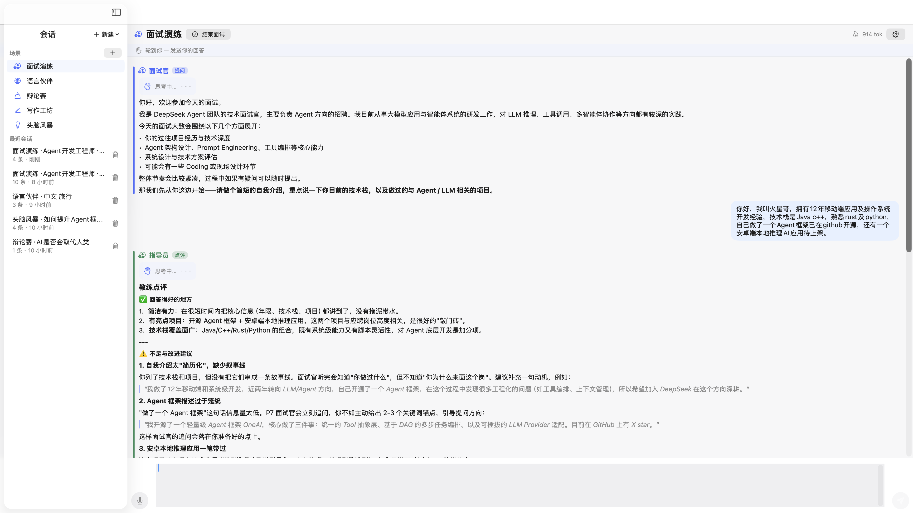
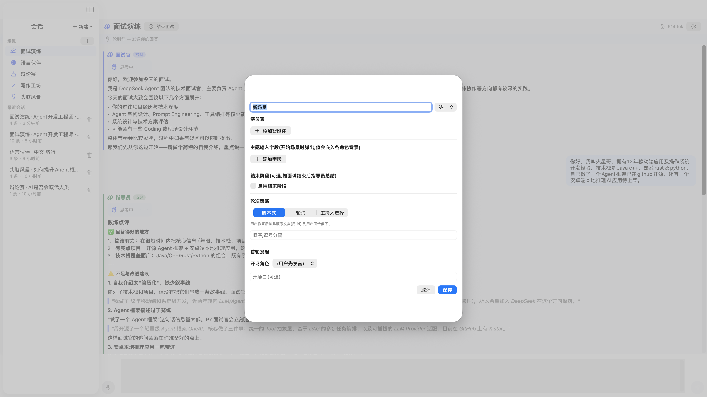
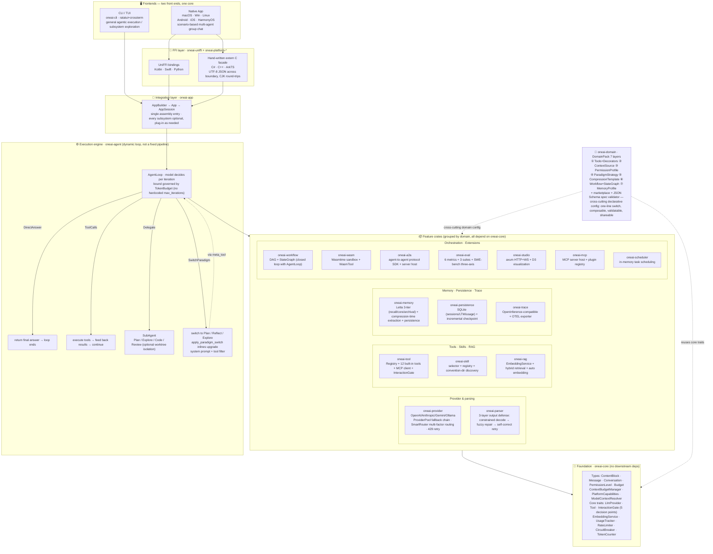

# OneAI

**English** | [简体中文](README.md)

> **One AI, Every Platform** — A cross-platform AI agent framework built in Rust: modular, type-safe, domain-pluggable, evaluable, natively multi-agent. One Rust core, six native targets.

[](LICENSE)
[](https://crates.io/crates/oneai-app)
[]()
[]()
[]()
[]()
[]()

<p align="center">
  
</p>

<p align="center"><em>One Rust core (<code>oneai-core</code>) drives native apps on macOS / Windows / Linux / Android / iOS / HarmonyOS via UniFFI bindings plus a hand-written <code>extern "C"</code> facade.</em></p>

---

## At a glance

<p align="center">
  
</p>

<p align="center"><em>macOS native app · the <strong>mock interview</strong> scenario intake — before it starts you fill in position / target company / project history, and each field is injected into the right member's system prompt by <strong>per-member visibility</strong> (the interviewer never sees the project history; the coach uses it for project-level advice).</em></p>

<p align="center">
  
</p>

<p align="center"><em>macOS native app · multi-agent group chat — the interviewer (blue, asks) and coach (green, critiques) speak on a scripted turn order: user answers → coach critiques → interviewer follows up. Token-by-token streaming with collapsible thinking bubbles.</em></p>

<p align="center">
  
</p>

<p align="center"><em>macOS native app · visual scenario editor — compose the cast, background fields, turn policy (scripted / round-robin / moderator), opening line and debrief phase; persisted to <code>~/Library/Application Support</code>.</em></p>

<p align="center">
  
</p>

<p align="center"><em>Interactive CLI (<code>oneai-cli</code>) · executing a complex task in Plan mode — thinking bubbles, plan checklist panel, tool-call display, and the accept/reject approval dialog.</em></p>

**Same engine, two frontends**: the native app above is built for *scenario-based multi-agent conversations* (mock interview / language partner / debate / writing workshop / brainstorm); the CLI TUI below is built for *general agentic coding / task execution*. Both are powered by the same Rust core and the same `AgentLoop`.

---

## Quick start (CLI — 30 seconds)

### 0. Download the macOS app (native, no build)

Grab `OneAI-1.0.0-macos.zip` from [GitHub Releases](https://github.com/Marssssss/OneAI/releases), unzip, and drop `OneAI.app` into Applications.

> The .app is **unsigned / un-notarized** (universal arm64 + x86_64, macOS 13+). The first launch trips Gatekeeper: in Finder, **right-click → Open**, confirm, and it launches normally. To build from source: `./scripts/build_apple.sh && ./platforms/macos/build_macos.sh`.

### 1. Configure a provider

OneAI works with any **OpenAI-compatible endpoint** (OpenAI, Anthropic, Gemini, Ollama, plus DashScope, DeepSeek, vLLM, …). Set credentials via env vars or a config file — env vars win.

```bash
# OpenAI-compatible endpoint — OpenAI / DashScope / DeepSeek / your gateway
export ONEAI_API_KEY="sk-..."
export ONEAI_BASE_URL="https://api.openai.com/v1"   # or your gateway
export ONEAI_MODEL="gpt-4o"                          # or qwen-plus, deepseek-chat ...

# Ollama (local, no key)
export ONEAI_BASE_URL="http://localhost:11434"
export ONEAI_MODEL="llama3"
```

…or write `~/.oneai/config.toml`:

```toml
[provider]
api_key = "sk-..."
base_url = "https://api.openai.com/v1"
model = "gpt-4o"

[domain]
default_pack = "coding"   # coding | research | general

[ui]
theme = "dark"
```

`oneai config create` generates a default config; `oneai config show` prints it.

### 2. Launch the TUI

```bash
cargo run -p oneai-cli
# or install the release: cargo install oneai-cli, then just: oneai
```

Drop into the interactive agent. Type a task and watch the full pipeline run live: streaming thinking bubbles, tool calls, plan checklist, usage/token stats, trace logs.

**Interaction modes — cycle with `Shift+Tab`:**

| Mode | Behavior |
|------|----------|
| `Normal` | Default — high-risk tools pause for approval |
| `⚡ Auto` | Approve everything (fast iteration) |
| `📋 Plan` | Disable tool execution — the agent must produce a plan first; you review it in an accept/reject dialog before any execution |

**Keys:**

| Key | Action |
|------|--------|
| `Enter` | Send · `Ctrl+Enter` newline |
| `Shift+Tab` | Cycle mode (Normal → Auto → Plan) |
| `Tab` | Toggle sidebar |
| `↑↓` / `Ctrl+↑↓` / `PgUp` / `PgDn` | History & chat scroll |
| Mouse drag | Select text to copy · wheel scroll |
| `Esc` | Vim mode / quit |

**In-conversation slash commands** (`/help` for the full list): `/skills` `/skill` `/tools` `/usage` `/context` `/session` `/domain` `/compact` `/wf` `/new` `/init` `/clear` `/quit`.

### 3. One-shot non-interactive inference

```bash
oneai run "refactor the auth module to async" --domain coding --model gpt-4o
```

### 4. Drive every subsystem from the CLI

OneAI exposes every subsystem as a CLI subcommand — drive it without writing code. The table below covers every subcommand of `oneai-cli` (`oneai` is `oneai-cli`; with no subcommand it launches the TUI):

```bash
# ── Sessions & inference ──
oneai                                  # launch the interactive TUI (default)
oneai chat [--domain coding] [--model gpt-4o] [--user <id>]   # launch the TUI (explicit)
oneai run "refactor auth module to async" [--domain coding] [--model ...] [--user <id>]  # non-interactive single-shot inference, prints to stdout
oneai version                          # version info

# ── DomainPacks (domain configuration packs) ──
oneai pack list                        # browse built-in packs
oneai pack show <name>                 # show pack details
oneai pack install <path|git-url>      # install from a local path or git
oneai pack validate spec.toml         # validate against the JSON Schema (structural + semantic)
oneai pack spec                       # export the DomainPack spec as a JSON Schema
oneai pack check <name>               # check an installed pack against the spec

# ── Skills (discovered from convention dirs) ──
oneai skill list                       # list skills discovered from .claude/.agents/.opencode/.oneai skills
oneai skill show <name>                # show skill details

# ── Eval framework (quality × usage × efficiency three axes) ──
oneai eval list                        # list eval suites
oneai eval run coding_basics [--format markdown|json|compact] [--profile] [--record <path>]  # run a suite (--profile emits efficiency axis, --record records trajectory)
oneai eval score <suite>               # metrics only (no agent execution)
oneai eval replay <path>              # ghost-replay a recorded trajectory, verify determinism
oneai eval swebench --dataset ./swe_bench_lite.jsonl [--instances astropy__astropy-12907] [--limit N] [--modal]  # 3-axis SWE-bench eval

# ── Workflows & state graphs (embedded in the DomainPack) ──
oneai workflow list [--domain coding]  # list DAG workflows + state graphs
oneai workflow show <name>             # render a workflow DAG as ASCII + list steps
oneai workflow run <name> [task] [--domain ...] [--model ...] [--user <id>]  # execute a DAG workflow end-to-end
oneai graph list [--domain coding]     # list state graphs (react/plan/reflect/explore)
oneai graph show <name>                # render a state graph as ASCII
oneai graph run <name> <task> [--domain ...] [--model ...] [--user <id>]   # run a state graph with a real provider

# ── Multi-agent coordination ──
oneai team strategies                  # list team strategies (Coordinate/Route/Collaborate/Debate)
oneai team presets                     # list preset teams (code_review/research_route/dev_pipeline/arch_debate)
oneai team info <id>                   # show team config details
oneai team run "..." [--strategy coordinate] [--preset ...] [--budget 100000]  # run a team coordination task
oneai handoff list                     # list handoff targets and presets
oneai handoff targets <preset>         # show handoff target descriptions for a preset
oneai handoff config [--preset ...]    # show handoff config
oneai handoff run <target> <reason> [--preset ...]  # execute a handoff (demo mode)
oneai swarm list                       # list swarm presets
oneai swarm routing                    # list routing strategies (best-fit/load-balanced/cost-optimized/fastest)
oneai swarm config <preset>            # show swarm config
oneai swarm agents <preset>            # show agents & capabilities in a swarm preset
oneai swarm run --task "..." [--routing best-fit] [--preset ...] [--budget 100000]  # swarm orchestration

# ── Provider pool & smart routing ──
oneai provider status                  # provider-pool status: active provider, health, circuit states
oneai provider fallback-log [--limit 20]  # recent fallback events
oneai provider test                     # connectivity-check every provider in the pool
oneai provider route "task description" [--strategy balanced|cost|latency|quality]  # routing decision dry-run (cost/latency/quality analysis)
oneai provider route-log [--limit 10]  # recent routing decisions with rationale
oneai provider route-config             # current routing strategy and config

# ── Token counting & context management ──
oneai token count "text" [--model ...]  # count tokens
oneai token estimate [--model ...]      # estimate tokens in a sample conversation
oneai token context <model>            # show context-window profile for a model
oneai token models                      # list known tokenizer profiles
oneai token fits "text" --model <model> # check whether text fits a model's context window
oneai token probe [--model ...]        # probe the provider's model-metadata endpoint (L2), show 3-layer resolution

# ── Usage tracking (tokens only, no USD) ──
oneai usage report                     # global usage summary (total tokens, calls, by-model breakdown)
oneai usage session <id>               # per-session usage details
oneai usage export [--format json|csv]  # export usage records

# ── Memory (durable cross-session facts) ──
oneai memory search <kw> [--user <id>] [--top_k 10]  # search durable facts by keyword
oneai memory list [--user <id>] [--session <id>]      # list facts for a user/session

# ── Persistent sessions (SQLite) ──
oneai session list                     # list saved sessions
oneai session resume <id>             # resume a session (show conversation history)
oneai session delete <id>             # delete a session
oneai session info <id>               # inspect session details

# ── Embedding service ──
oneai embed generate "text" [--model ...] [--service fastembed|ollama|openai|anthropic] [--api-key ...]  # generate an embedding
oneai embed batch "t1,t2" [same opts]  # batch generate
oneai embed list                       # list available embedding models
oneai embed health [same opts]        # check embedding-service health
oneai embed dimension [same opts]      # show vector dimension for a model

# ── WASM sandbox ──
oneai wasm list                        # list loaded modules
oneai wasm load <name> <file.wasm>     # load a module
oneai wasm run <name> [--input <json> | --input-file <path>]  # execute a module
oneai wasm health [--name <name>]      # module health check
oneai wasm unload <name>              # unload a module
oneai wasm stats                        # resource-monitor statistics

# ── MCP (client + server) ──
oneai mcp serve [--domain coding]       # run as an MCP server (Claude Code / Cursor compatible)
oneai mcp list                          # list configured MCP servers
oneai mcp add <name> --transport stdio|sse|streamable_http [--command ...] [--url ...] [--args ...]  # add an MCP server
oneai mcp remove <name>                # remove an MCP server
oneai mcp connect <name>              # test connection and show discovered tools

# ── A2A (agent-to-agent protocol) ──
oneai a2a serve [--domain coding]       # start the A2A server, expose OneAI agent capabilities
oneai a2a discover <url>               # discover a remote A2A agent's capabilities
oneai a2a list                         # list configured A2A endpoints
oneai a2a send <url> "task message"     # send a task to a remote A2A agent

# ── Config ──
oneai config show                      # show current config
oneai config init                      # create the default config file

# ── Web UI ──
oneai studio [--port 3000] [--domain coding] [--model ...] [--user <id>]  # launch the Studio Web UI (StateGraph viz + checkpoint time-travel)

# ── Project instruction files ──
oneai init [--format oneai|agents|claude] [--path <dir>] [--force] [--no-llm]  # scaffold ONEAI.md/AGENTS.md/CLAUDE.md (model-synthesized if LLM configured, else heuristic)
```

> Every subcommand comes from the clap definitions in `examples/cli/src/main.rs`; run `oneai --help` or `oneai <sub> --help` to see full options for any subcommand.

### 5. Minimal Rust program

```rust
use oneai_app::AppBuilder;
use oneai_domain::coding_pack;

#[tokio::main]
async fn main() {
    let app = AppBuilder::new()
        .noop_interaction_gate()
        .default_parser()
        .domain_pack(coding_pack("/project/dir"))  // ← one-line domain switch
        .build()
        .expect("app builds");

    let session = app.create_session();
    let result = session
        .execute_tool("calculator", serde_json::json!({"expression": "2+3"}))
        .await
        .unwrap();
    println!("result: {}", result.content); // → "5"
}
```

> **For AI-agent readers of this repo**: this is a `cargo` workspace; the integration point is `AppBuilder` in `crates/oneai-app/src/builder.rs` — every subsystem is optional and plugged in via builder methods. For architecture, read [CLAUDE.md](CLAUDE.md) (crate layering, the 7-layer DomainPack, AgentLoop decisions, the permission model). To drive it programmatically, start from the minimal program above and `examples/cli`.

---

## What is OneAI?

OneAI is a full-stack agent framework written in Rust. It provides everything you need to build, run, and evaluate AI agents — from the LLM provider abstraction to tool execution, memory management, workflow orchestration, domain-specific configuration, multi-agent collaboration, and tracing — all cross-platform via UniFFI bindings. **The LLM provider is optional** — tool-only or workflow-only usage needs no provider.

**Core principles:**

- **Modular** — 25 independent crates, each with one job; use what you need.
- **Type-safe** — sealed-enum hierarchies (every public enum is `#[non_exhaustive]`), trait-driven abstractions, no stringly-typed config.
- **Domain-pluggable** — the DomainPack system makes domain knowledge declarative, composable, and one-line switchable; it can be validated against a JSON Schema and shared via a pack market.
- **Natively multi-agent** — SubAgent, Team coordination (Coordinate/Route/Collaborate/Debate), Handoff protocol, Swarm orchestration (capability-driven routing); plus an engine-level **GroupChat primitive** powering scenario-based multi-role conversations.
- **Production-grade infra** — ProviderPool fallback chain, SmartRouter multi-factor routing, usage tracking, rate limiting, circuit breaking, token-aware context management.
- **Cross-platform** — macOS, Windows, Linux, Android, iOS, and HarmonyOS (Kotlin, Swift, C++, C#, ArkTS) off one Rust core via UniFFI + a hand-written `extern "C"` facade.
- **Evaluable** — built-in OpenInference-compatible tracer + standalone eval framework (6 metrics, 3 suites + SWE-bench three-axis).
- **Human-in-the-loop** — high-risk tools approved via native UI dialogs; a Plan-mode approval gate before execution.
- **Dynamic agentic loop** — not a fixed pipeline; each iteration decides dynamically (direct answer / tool call / delegate to a sub-agent / switch paradigm).

---

## Two ways to use it

OneAI surfaces two user-facing frontends over the same core.

### A. CLI / TUI — general agentic execution

For coding, task execution, and subsystem exploration. `examples/cli` (bin `oneai-cli`) is a ratatui+crossterm interactive TUI running the full pipeline: streaming thinking bubbles, tool-call display, Plan-mode approval gate, usage/token stats, trace logs. Every subsystem is exposed as a clap subcommand (see "Drive every subsystem" above).

### B. Native desktop / mobile app — scenario-based multi-agent chat

For *multi-role collaborative conversations*. The macOS app is the reference implementation (other platforms mirror the design); the core is a **GroupChat primitive + scenario system**:

- **A Scenario = cast + turn policy + topic fields + debrief phase.** An Agent is an AI persona (the user is an implicit extra participant, never stored as an Agent).
- **Turn policies**: `scripted` (fixed order), `roundRobin` (cycle in list order), `moderator` (a moderator member picks the next speaker).
- **Topic fields + per-member visibility**: an inline form collects background before start (e.g. "position", "project history"); each field is injected into the right members' system prompts via `visibleTo` — e.g. the interviewer never sees the candidate's project history, but the coach uses it for project-level advice.
- **Debrief phase**: e.g. an "end interview" button switches to a coach full-session summary + follow-up Q&A, other members step back.
- **Review loop**: e.g. the writing workshop's "writer drafts → editor reviews → writer revises → editor re-reviews" loop, ending when the editor emits an `approveMarker` ("定稿") or `maxRounds` is reached.
- **5 built-in presets**: mock interview / language partner / debate / writing workshop / brainstorm — usable out of the box, editable, and you can build your own.
- 20fps-coalesced streaming render, speech input (Speech framework), Markdown, dark mode following the system, command palette (`⌘K`), artifact canvas.

Per-platform build & run instructions are in [Cross-platform: desktop & mobile](#cross-platform-desktop--mobile) below.

---

## Architecture



> Arrow direction = dependency / data flow (upper depends on lower). Solid lines are compile-time deps and runtime calls; dashed lines are cross-cutting declarative config. `oneai-domain` is not a layer — it is a cross-cutting declarative config layer over all feature crates; `AppBuilder::domain_pack(...)` switches the entire domain behavior in one line.

---

## Crate map

| Crate | What it does | Tests |
|-------|--------------|-------|
| `oneai-core` | core types, traits, PermissionLevel, Budget, PlatformCapabilities | 262|
| `oneai-provider` | LLM providers (OpenAI/Anthropic/Gemini/Ollama) + ProviderPool + SmartRouter | 111|
| `oneai-parser` | 3-layer output-parse defense | 7|
| `oneai-memory` | memory system (STM, LTM, compression, HNSW, MemoryManager + persistence) | 60|
| `oneai-tool` | tool registry, MCP client, InteractionGate, executor, 12 tools | 63|
| `oneai-skill` | skill selector + registry + built-in domain skills | 9|
| `oneai-domain` | DomainPack system (7 layers), CodingPack, market, spec validator | 127|
| `oneai-agent` | AgentLoop + SubAgent + ReAct/Plan/Reflect + StreamParser + ContextAssembler + Team/Handoff/Swarm + GroupChat | 219|
| `oneai-rag` | RAG + EmbeddingService (OpenAI/Anthropic/Voyage/Ollama/FastEmbed) | 61|
| `oneai-workflow` | Workflow DAG + StateGraph + compiler + executor | 44|
| `oneai-scheduler` | in-memory task scheduler | 6|
| `oneai-persistence` | progressive checkpoints + SQLite (session/usage) backends | 46|
| `oneai-a2a` | A2A protocol SDK — client + server host + DomainPack→AgentCard | 88|
| `oneai-wasm` | WASM sandbox engine — Wasmtime + WasmTool + module registry | 95|
| `oneai-eval` | eval framework — cases/metrics/runner/3 suites + SWE-bench three-axis | 95|
| `oneai-studio` | Studio Web UI — axum HTTP+WS + D3.js StateGraph viz + checkpoint time-travel | 34|
| `oneai-mcp` | MCP ecosystem — host + plugin registry + config | 57|
| `oneai-app` | app integration layer (AppBuilder) | 19|
| `oneai-trace` | OpenInference-compatible tracer | 14|
| `oneai-uniffi` | UniFFI binding definitions + hand-written `extern "C"` facade (reused by C#/Windows, C++/HarmonyOS) | 34|
| `oneai-platform-desktop` | desktop platform (macOS/Windows/Linux) | 2|
| `oneai-platform-android` | Android platform | 2|
| `oneai-platform-ios` | iOS platform | 1|
| `oneai-platform-harmony` | HarmonyOS platform | 1|
| **Total** | | **1457** |

> Plus `oneai-staticlib` (a crate-type=staticlib packaging crate, built only by the Apple/Windows build scripts, excluded from `default-members`, so not counted in the 24).

---

## Core concepts

### The DomainPack system (domain config pack)

DomainPack is OneAI's key architectural innovation — it makes domain knowledge **declarative, pluggable, composable** instead of hard-coded. A DomainPack encapsulates 7 layers of domain-specific config:

| Layer | Component | Purpose |
|-------|-----------|---------|
| 1 | **Tools + ToolDecorator** | domain-specific toolset and description overrides |
| 2 | **ContextSource** | domain-specific environment awareness (with refresh policies) |
| 3 | **PermissionProfile** | domain-specific permission classification (deny/auto/confirm) |
| 4 | **ParadigmStrategy** | domain-specific task→paradigm mapping |
| 5 | **CompressionTemplate** | domain-specific context-retention priorities |
| 6 | **Workflow + StateGraph** | domain-predefined workflows and cyclic graphs |
| 7 | **MemoryProfile** | domain-specific memory policy (extraction schema / recall / core budget / self-managed tools / cross-session habits) |

```rust
let app = AppBuilder::new()
    .provider(provider)
    .domain_pack(coding_pack("/project/dir"))  // ← one-line domain switch
    .build()?;
```

DomainPacks can be **merged** for multi-domain agents (coding + research) — permissions are strictest-wins, context sources merge by priority. A pack can be **validated** against a JSON Schema (`DomainPackSpec`), **installed** from a path or git URL, and shared via a **market** (`PackSource` + `PackRegistry` + a builtin index).

```bash
oneai pack list                  # browse built-in packs
oneai pack validate spec.toml   # validate against the spec
oneai pack install ./my-pack     # install from a local path
```

#### CodingPack (built-in)

Modeled on Claude Code's workflow-embedding mechanism: 9 tools (FileRead, FileEdit, Shell, Grep, Glob, FileList, NotebookEdit, Environment, WebFetch), 8 tool decorators, 6 context sources with refresh policies, permission config (auto-approve reads, confirm edits/Shell, deny `rm -rf`/`mkfs`), 4 paradigm strategies, 3 sub-agent types (searcher / coder / reviewer).

### The Agentic Loop (dynamic)

The core execution engine is a **dynamic loop** — not a fixed pipeline. Each iteration the model decides the next step:

| Decision | Action |
|----------|--------|
| **DirectAnswer** | model gives the final answer → loop ends |
| **ToolCalls** | model calls tools → execute and feed results back |
| **Delegate** | model delegates a subtask to a specialized sub-agent |
| **SwitchParadigm** | model switches paradigm (Plan/Reflect/Explore) — rewrites the system prompt + tool filter |

The iteration ceiling is governed by a **TokenBudget** (not a hardcoded `max_iterations`). `delegate` / `switch_paradigm` are injected as model-callable meta-tools via `meta_tool.rs` — the model can actively delegate or switch paradigm; `apply_paradigm_switch` + `AgentLoopGraphActionExecutor` inline-upgrade the paradigm (system prompt + tool filter). Built-in lifecycle hooks (`PreToolUse`/`PostToolUse`, …), interrupt/resume (`CancellationToken`), structured output.

### Agent paradigms

| Paradigm | Pattern | Good for |
|----------|---------|----------|
| **ReAct** | reason → act → observe loop | general tool-using tasks |
| **Plan** | decompose → ordered step list | complex multi-step tasks |
| **Reflection** | verify → suggest fixes | QA, self-checking |
| **Parallel** | ScopeState isolation → merge | independent subtasks |
| **Explore** | search → understand → summarize | codebase / search exploration |

Paradigms are **model/workflow-driven** — the model calls `switch_paradigm`, or a StateGraph node emits `GraphDecision::SwitchParadigm`, and `apply_paradigm_switch` changes the system prompt + decision hint + tool filter. The user-side execution strategy is a separate **InteractionMode** (Normal/Auto/Plan, `Shift+Tab`).

### Permission model

Three tiers: `Read` (auto-approve), `Standard` (policy-dependent), `Full` (needs approval). Resolution order: `deny_by_default` → `permission_overrides` → `auto_approve` → `require_confirmation` → the tool's own `risk_level()`. Human interaction is guarded by the unified **`InteractionGate`** across 5 decision points: `PreInfer` (rewrite/skip before inference), `PostInfer` (validate/replace after inference), `ToolApproval` (gate high-risk tools, wired to native dialogs), `PlanDecision` (planning trade-off), `PlanReview` (final plan accept/reject/Revise). Built-in implementations: `NoopInteractionGate` (zero-latency pass on every point ≈ auto-approve), `ChannelInteractionGate` (mpsc+oneshot bridge to the UI thread, per-point configurable), `ThresholdInteractionGate` (auto-pass low-risk, the rest go through the channel), `DenyAllInteractionGate` (deny all). The platform-side `PlatformInteractionGate` handles `ToolApproval` with native NSAlert/MessageBox/AlertDialog/UIController/CommonDialog on macOS/Windows/Linux/Android/iOS/HarmonyOS. The old `ApprovalGate` / `on_plan_submitted` were removed.

### LLM providers & routing

Built-in providers: **OpenAI, Anthropic, Gemini, Ollama**, unified under the `LlmProvider` trait (`infer` + `infer_stream`). On top sit two production-grade layers:

- **ProviderPool** — provider fallback chain; each provider has its own circuit breaker, rate limiter, and degradation rule (e.g. Anthropic→OpenAI→local). Handles 429/retry automatically, parses `Retry-After`.
- **SmartRouter** — multi-factor routing (latency/quality/balanced/custom), scores providers and picks the best, with integrated circuit breaking / rate limiting / context constraints. Every decision is logged.

```rust
let app = AppBuilder::new()
    .default_provider_pool_anthropic()   // Anthropic → OpenAI → Ollama fallback
    .default_smart_router_balanced()     // multi-factor routing
    .build()?;
```

### Tool system

```rust
#[async_trait]
pub trait Tool: Send + Sync {
    fn name(&self) -> &str;
    fn description(&self) -> &str;
    fn parameters_schema(&self) -> serde_json::Value;
    fn risk_level(&self) -> RiskLevel;
    async fn execute(&self, args: serde_json::Value) -> Result<ToolOutput>;
}
pub trait PermissionAwareTool: Tool { fn permission_level(&self) -> PermissionLevel; }
```

**12 built-in tools:** ShellTool (safety blacklist + sandbox), FileReadTool (offset+limit paging), FileEditTool, FileWriteTool, FileListTool, GrepTool, GlobTool, EnvironmentTool, NotebookEditTool, FileDeleteTool, CalculatorTool, WebFetchTool. MCP client integration via `rmcp` (stdio/SSE/streamable-http); a **MCP server** mode lets OneAI itself expose tools to Claude Code/Cursor (`oneai mcp serve`).

### Multi-agent collaboration

| Mode | Mechanism |
|------|-----------|
| **GroupChat (scenarios)** | engine-level `GroupChatSession` primitive + scenario system (cast / turn policy / topic fields / debrief / review loop), driving multi-role chat on macOS/Windows/etc. |
| **SubAgent** | hierarchical delegation to specialized sub-agents (Plan/Explore/Code/Review/Custom), optional worktree isolation |
| **Team** | `TeamCoordinator` with 4 strategies — Coordinate/Route/Collaborate/Debate — plus 4 presets (`code_review`/`research_route`/`dev_pipeline`/`arch_debate`) |
| **Handoff** | `HandoffTool` (handoff-as-tool-call) + `HandoffManager` + 3 presets |
| **Swarm** | dynamic agent pool, 3 routing strategies (BestFit/LoadBalanced/Fastest), task decomposition + quality checks + retries |

### Memory system

- **Three-tier memory (Letta-style)** — recall log (`Conversation`) / core (resident, token-budgeted, agent self-managed) / archival (full fact vector store, recalled on demand). `Conversation` is the only raw log; core holds only curated atomic facts, no redundant copies.
- **MemoryProfile (DomainPack layer 7)** — declarative per-domain "extraction schema (what to remember) + recall strategy + core budget + whether to expose self-managed tools + habit-fact types (cross-session)", composable alongside `CompressionTemplate`/`ContextSource`. `CodingPack`/`ResearchPack` ship default profiles.
- **Compression → archival incremental extraction** — before `ContextCompressor` drops old turns, it extracts atomic facts via `FactExtractor` per the domain schema, archived through `MemoryFactStore` with Mem0-style conflict updates (same subject+predicate → update, not append), plugging "compression = data loss".
- **Compression-resistant injection** — `CoreMemorySource` (implements `ContextSource`, `EveryIteration`) injects the core block + recall context every turn; re-injected after compression.
- **Self-managed memory tools (domain opt-in)** — `memory_search` / `core_memory_edit` / `archival_memory_insert`, letting the agent curate its own memory → "gets better with use".
- **Dual namespace + persistence** — `user_id` (cross-session habits) + `session_id` (this session's episodic); a unified `memories` table persists; `oneai memory search/list --user`. The `--user` flag namespaces cross-session memory.
- **Short-term memory** — sliding window, auto-evicted to long-term.
- **Long-term memory** — HNSW vector store + content store + hybrid scoring; **auto-embedded** via the configured `EmbeddingService`.
- **STM↔LTM closed loop** — `MemoryReflection` + `inject_ltm_context` + `RecallStrategy`.
- **Context compression** — auto-summarize when over token limit, keeping recent turns; `ContextBudgetManager` allocates per-turn budgets proportionally.
- **Persistence** — `SqliteSessionStore` persists sessions/LTM/facts; `AppSession` auto-saves after each run. `oneai session list / resume <id> / delete / info`, `oneai memory search <kw> --user <id> / list --user <id>`.

### Usage & reliability

- **Usage tracking (tokens only)** — `UsageTracker` trait + `UsageRecord`, with `InMemoryUsageTracker` and the persistent `SqliteUsageTracker` (`oneai-persistence`). After each inference the AgentLoop records prompt/completion/total tokens and call count — **no USD amounts or budgets tracked** (USD cost/budget management was removed). `oneai usage report / session <id> / export`.
- **RateLimiter** (`TokenWindowRateLimiter`) + **CircuitBreaker** (`ThresholdCircuitBreaker`, Closed/Open/HalfOpen) — enforced inside the AgentLoop.
- **Token counting** — `HeuristicTokenCounter` (per-provider, CJK-aware) + `ContextWindowProfile` + 4 trimming strategies + fits-in-window check — `oneai token`.

### 3-layer output parser

LLM output passes through 3 defensive layers: constrained decoding → fuzzy JSON repair (bracket completion, regex extraction, embedded-JSON detection) → fallback self-correction re-prompt. Reuse it rather than parsing model output directly.

### Workflow engine

- **WorkflowDag** — declarative DAG for parallel step orchestration.
- **StateGraph** — cyclic directed graph for iterative agent flows (ReAct loops, conditional routing, breakpoints). StateGraph closes the loop with AgentLoop: graph nodes can emit `GraphDecision::SwitchParadigm`/`Delegate`/`ToolCalls`.

### RAG

`EmbeddingService` trait with OpenAI/Anthropic/Voyage/Ollama/FastEmbed (local ONNX) implementations, `EmbeddingServiceRegistry` (cache + fallback), `AutoEmbeddingDocumentIndex` auto-embedding on `add_document()`. Chunking: SentenceBoundary/FixedSize/Paragraph.

### A2A protocol, WASM sandbox, eval, Studio, MCP

- **A2A** (`oneai-a2a`) — agent-to-agent protocol SDK: client + axum JSON-RPC server host + DomainPack→AgentCard auto-exposure. `oneai a2a serve / discover / list / send`.
- **WASM** (`oneai-wasm`) — Wasmtime sandbox for untrusted code: `WasmTool`, `WasmModuleRegistry`, resource monitor, WASI restricted access, Native↔Wasm execution modes. `oneai wasm list / load / run / health / stats`.
- **Eval** (`oneai-eval`) — `EvalCase`/`ExpectedOutput`/`EvalMetric`/`EvalRunner` + 6 built-in metrics + 3 suites. `oneai eval run <suite>` / `eval score`. Plus the **SWE-bench three-axis eval** (capability resolved × usage × efficiency), see [the dedicated section below](#swe-bench-eval-capability--usage--efficiency).
- **Studio** (`oneai-studio`) — axum HTTP+WebSocket service, REST API, real-time event push, D3.js SVG StateGraph viz, checkpoint time-travel. `oneai studio`.
- **MCP ecosystem** (`oneai-mcp`) — `McpServerHost` (JSON-RPC server) + `McpPluginRegistry` (discover/configure/connect) + TOML config + stdio transport. `oneai mcp serve / list / add / remove / connect`.

### Tracing

OpenInference-compatible traces for agent evaluation, plus OTEL exporters (`OtlpCollector` + `OtelMetricsProvider`):

```rust
let app = AppBuilder::new().trace_in_memory().build()?;
session.end_session(SpanStatus::Ok);
let tree = session.build_trace_tree();
println!("success rate: {:.1}%", tree.metrics.success_rate * 100.0);
```

---

## SWE-bench eval (capability × usage × efficiency)

OneAI runs against [SWE-bench Lite](https://www.swebench.com/) (300 instances) as a coding-agent benchmark, collecting three axes — **capability (resolved) × usage × efficiency**:

- **Capability axis** ← decided by the external SWE-bench harness (`resolved` true/false), via `SwebenchJudge` calling a Python subprocess.
- **Usage axis** ← `UsageTracker.session_usage()` (api_calls + prompt/completion/total token breakdown — tokens only, no USD).
- **Efficiency axis** ← `TraceMetrics` (total_tokens / tool_call_count / avg_iterations) + per-phase wall-clock breakdown.

Per instance: `git clone <repo>` → `git checkout <base_commit>` → drive the agent with the `problem_statement` (CodingPack provides read_file/edit_file/grep/glob/shell) → collect the patch via `git diff` → the external harness decides `resolved`; all three axes are written into `EvalResult`.

### Prerequisites

```bash
# 1) Create a venv and install datasets + swebench + modal (one venv does double duty: export data + judge)
#    macOS Homebrew Python is PEP-668-locked against system-wide installs, so a venv is mandatory.
python3 -m venv ~/.venvs/swebench
~/.venvs/swebench/bin/pip install datasets swebench modal httpx[socks]
~/.venvs/swebench/bin/modal token new        # log into Modal

# 2) Export the dataset JSONL locally with that venv's python (the Rust side does no HF network I/O)
~/.venvs/swebench/bin/python scripts/swebench/export_dataset.py
# → produces swe_bench_lite.jsonl (300 lines)

# 3) LLM provider (the agent really calls the API = real money)
export ONEAI_API_KEY=sk-...
```

> Verified (500 instances) also works: `export_dataset.py --dataset princeton-nlp/SWE-bench_Verified --out swe_bench_verified.jsonl`.
> `scripts/swebench/` also has `fetch_instance.py` (pull a single instance's metadata) and `make_prediction.py` (hand-craft git diff→JSONL) — the stage-1 manual path, superseded by the CLI commands below in stage 2.
> The judge looks for `~/.venvs/swebench/bin/python` (the venv above) by default; override with `--python <path>`.

### Smoke-test one instance (do this first to confirm the loop)

```bash
cargo run -p oneai-cli-demo -- eval swebench \
    --dataset ./swe_bench_lite.jsonl \
    --instances astropy__astropy-12907 \
    --workspace ./swebench-workspace \
    --run-id oneai-smoke
```

### Run a batch

```bash
# Limit to N (first N from the dataset, to avoid burning too much API at once)
cargo run -p oneai-cli-demo -- eval swebench \
    --dataset ./swe_bench_lite.jsonl \
    --limit 10 \
    --workspace ./swebench-workspace \
    --run-id oneai-batch

# Or pin specific instance ids
cargo run -p oneai-cli-demo -- eval swebench \
    --dataset ./swe_bench_lite.jsonl \
    --instances astropy__astropy-12907,django__django-11099 \
    --workspace ./swebench-workspace \
    --run-id oneai-batch
```

### Run all 300 instances

```bash
cargo run -p oneai-cli-demo -- eval swebench \
    --dataset ./swe_bench_lite.jsonl \
    --workspace ./swebench-workspace \
    --run-id oneai-full-$(date +%Y%m%d) \
    --format json
```

> All 300 instances really clones 300 repos and runs 300 agent rounds — non-trivial API cost and time. Smoke-test one first, then go batch.

### Artifacts & options

Each run produces, under `--workspace`:

| File | Contents |
|---|---|
| `predictions.jsonl` | the patches the agent produced (re-runnable / submittable to the harness) |
| `leaderboard.json` | swebench.com submission schema: `instance_calls` / `resolved_count` / `total_instances` / `resolution_rate` / `per_instance:[{instance_id, api_calls, resolved}]` (USD cost fields removed; the comparable axis is `api_calls`) |
| `evaluation_results/<run_id>/` | the swebench harness's own judgment details |

stdout reports via:

| `--format` | Output |
|---|---|
| `markdown` (default) | human-readable report (per-instance capability/usage/efficiency) |
| `json` | full `EvalReport` JSON |
| `compact` | CI-friendly one-line summary |

Common options: `--python <path>` the judge interpreter (default `~/.venvs/swebench/bin/python`); `--modal false` switch to local docker (Apple Silicon needs `--namespace ''`, slow); `--dataset-name princeton-nlp/SWE-bench_Lite` passed to the harness; `--run-id` controls the `evaluation_results/` subdirectory.

---

## Cross-platform: desktop & mobile

One Rust core (`oneai-core` + `oneai-app`) reaches six native targets via two FFI routes:

- **UniFFI bindings** (Kotlin / Swift / Python) — Android, Apple platforms.
- **A hand-written `extern "C"` JSON facade** (`crates/oneai-uniffi/src/c_facade.rs`, header `bindings/c/oneai_c.h`) — since `uniffi-bindgen` 0.32 has no C#/ArkTS generator, Windows (C# P/Invoke `oneai.dll`) and HarmonyOS (NAPI-wrapped) reuse this facade. All strings cross as UTF-8, so CJK round-trips correctly.

| Platform | Tech | Binding lang | Native InteractionGate |
|----------|------|--------------|-------------------------|
| macOS | SwiftUI (`swiftc`, no Xcode needed) | Swift (UniFFI) | NSAlert |
| Windows | WinUI 3 / C# | C# (P/Invoke facade) | MessageBox |
| Linux | desktop-platform crate | C++ (facade) | MessageBox |
| Android | Jetpack Compose / Kotlin | Kotlin (UniFFI) | AlertDialog |
| iOS | SwiftUI / Swift | Swift (UniFFI xcframework) | UIAlertController |
| HarmonyOS | ArkTS / ArkUI + NAPI | C++ (NAPI-wrapped facade) | CommonDialog |

Every platform shares the same design: scenario-based multi-agent group chat (5 built-in presets), 20fps-coalesced streaming, Markdown, dark mode following the system, command palette, artifact canvas. **The macOS app is the reference implementation; the others mirror it.**

### macOS (reference implementation — no Xcode required)

```bash
# Prereq: Command Line Tools (swiftc) + Apple Rust targets
rustup target add aarch64-apple-darwin x86_64-apple-darwin

# 1) Generate Swift bindings + cross-compile a universal static lib to platforms/apple/
./scripts/generate_bindings.sh swift
./scripts/build_apple.sh

# 2) swiftc compiles the SwiftUI sources → OneAI.app
./platforms/macos/build_macos.sh        # add --debug for a debug profile

# 3) Run
open platforms/macos/build/OneAI.app
```

Sources live in `platforms/macos/Sources/` (11 Swift files, ~3.3k lines): `OneAIApp` (entry/theme), `Views` (chat screen/sidebar), `ChatViewModel` (session lifecycle/stream coalescing), `AgentStore` (scenario CRUD + 5 presets), `Models` (Scenario/Agent/TurnPolicy), `ScenarioEditor`, `CommandPalette` (⌘K), `ArtifactCanvas`, `SpeechInput`, `Markdown`.

### Windows (WinUI 3 / C#)

```powershell
# Prereq: Visual Studio + WindowsAppSDK workload
rustup target add x86_64-pc-windows-msvc

# 1) Cross-compile oneai.dll (cdylib — exports both uniffi symbols AND c_facade extern "C" symbols)
pwsh ./scripts/build_windows.ps1

# 2) Build the app (open OneAI.sln in VS, or dotnet)
dotnet build platforms\windows\OneAI.sln -c Debug

# 3) Run (unpackaged)
dotnet run --project platforms\windows\OneAI\OneAI.csproj -c Debug
```

Sources in `platforms/windows/OneAI/` (Native/ViewModels/Services/Views); see `platforms/windows/README.md`.

### Android (Jetpack Compose / Kotlin)

```bash
# Prereq: Android NDK + cargo-ndk
rustup target add aarch64-linux-android armv7-linux-androideabi x86_64-linux-android i686-linux-android
cargo install cargo-ndk

# 1) Cross-compile 4 ABIs + stage liboneai.so and Kotlin bindings
./scripts/build_android.sh

# 2) Build & install
cd platforms/android
./gradlew assembleDebug
./gradlew installDebug
```

See `platforms/android/README.md`. Ollama on host from the emulator: `kind=ollama, model=llama3, base_url=http://10.0.2.2:11434`.

### iOS (SwiftUI / Swift)

```bash
# Prereq: Xcode (Command Line Tools alone cannot build iOS / xcframeworks)
rustup target add aarch64-apple-ios aarch64-apple-ios-sim

./scripts/build_apple.sh   # when xcodebuild is detected it also produces OneAI.xcframework (iOS+macOS slices)
```

Without Xcode, `build_apple.sh` produces only the macOS staticlib (skipping iOS/xcframework with a note). The iOS app project is forthcoming; the bindings and xcframework are staged by the script.

### HarmonyOS (ArkTS / ArkUI + NAPI)

```bash
# Prereq: DevEco Studio + HarmonyOS Native SDK
rustup target add aarch64-linux-ohos x86_64-linux-ohos
export OHOS_NDK_HOME=/path/to/harmony/native   # contains llvm/bin/clang

# 1) Cross-compile liboneai.so and stage it where CMake finds it
./scripts/build_harmony.sh

# 2) Open platforms/harmony in DevEco Studio → hvigorw assembleHap
#    CMake builds liboneai_napi.so (wrapping the oneai_* C symbols) and links liboneai.so
```

See `platforms/harmony/README.md`. The streaming callback fires on a tokio worker thread via `napi_threadsafe_function` and is dispatched on the ArkTS thread.

---

## Project structure

```
oneai/
├── crates/
│   ├── oneai-core/          # foundation: types, traits, PermissionLevel, Budget
│   ├── oneai-provider/      # OpenAI/Anthropic/Gemini/Ollama + ProviderPool + SmartRouter
│   ├── oneai-parser/        # 3-layer output parsing
│   ├── oneai-memory/        # STM, LTM, compression, HNSW, MemoryManager + persistence
│   ├── oneai-tool/          # registry, 12 tools, MCP client, approval, executor
│   ├── oneai-skill/         # skill registry + selector + built-in domain skills
│   ├── oneai-domain/        # DomainPack (7 layers), CodingPack, market, spec validator
│   ├── oneai-agent/         # AgentLoop, SubAgent, paradigms, Team/Handoff/Swarm/GroupChat, StreamParser
│   ├── oneai-rag/           # Document, Index, EmbeddingService, Retrieval
│   ├── oneai-workflow/      # DAG, StateGraph, compiler, validator, executor
│   ├── oneai-scheduler/     # InMemoryScheduler
│   ├── oneai-persistence/   # Checkpoint + SQLite session/usage backends
│   ├── oneai-a2a/           # A2A protocol SDK (client + server host)
│   ├── oneai-wasm/          # Wasmtime sandbox + WasmTool + module registry
│   ├── oneai-eval/          # eval cases/metrics/runner/suites + SWE-bench three-axis
│   ├── oneai-studio/        # Studio Web UI (axum + WS + D3 viz)
│   ├── oneai-mcp/           # MCP server host + plugin registry
│   ├── oneai-app/           # AppBuilder, App, AppSession
│   ├── oneai-trace/         # OpenInference traces + OTEL exporters
│   ├── oneai-uniffi/        # UniFFI binding definitions + hand-written extern "C" facade
│   └── oneai-platform-{desktop,android,ios,harmony}/
├── platforms/               # six native apps (SwiftUI / WinUI / Compose / ArkTS)
│   ├── macos/               # reference implementation (SwiftUI, swiftc build)
│   ├── windows/             # WinUI 3 / C#
│   ├── android/             # Jetpack Compose / Kotlin
│   ├── ios/                 # SwiftUI (Xcode xcframework)
│   ├── harmony/             # ArkTS / ArkUI + NAPI
│   └── apple/               # cross-compile staging: liboneai.a + headers + binding
├── examples/
│   ├── cli/                 # interactive TUI demo (ratatui + crossterm) — bin: oneai-cli
│   ├── desktop-app/         # desktop approval-gate demo
│   └── rust/                # channel approval-gate demo
├── bindings/                # generated bindings (cpp/csharp/kotlin/swift + hand-written c/)
├── scripts/                 # generate_bindings.sh + build_{apple,windows,android,harmony}.sh + swebench/
└── Cargo.toml               # workspace root (resolver = "2", edition 2021, v0.2.0)
```

---

## Build, test, run

```bash
cargo build                      # build the whole workspace
cargo test                       # all 1457 tests (25 crates)
cargo test -p oneai-agent        # tests for a single crate
cargo test -p oneai-agent plan   # a single test/module
cargo clippy --workspace --all-targets   # keep lints clean
cargo run -p oneai-cli-demo      # launch the interactive TUI (bin: oneai-cli)
```

The workspace uses `resolver = "2"`, `edition = "2021"`, shared version `0.2.0` (from `[workspace.package]`), with all shared dependencies pinned in `[workspace.dependencies]`. Public enums are `#[non_exhaustive]` as part of the v0.2.0 API-stability commitment.

### Network proxy

All outbound HTTP — LLM provider APIs, `web_search`/`web_fetch`, the A2A client, embedding services, MCP HTTP transport — goes through `reqwest::Client`, so proxy support is env-var-based and uniform everywhere:

- `HTTPS_PROXY` / `HTTP_PROXY` / `ALL_PROXY` — proxy URL (auto-detected by reqwest on every client build; no code opt-in needed).
- `NO_PROXY` — comma-separated exclusion list.
- SOCKS5: `ALL_PROXY=socks5://host:port` (reqwest `socks` feature is on in the workspace `Cargo.toml`).
- On macOS/Windows, reqwest's `system-proxy` feature also reads the OS GUI proxy settings; env vars always win.

---

## Roadmap

| Phase | Focus | Status |
|-------|-------|--------|
| 1–11 | core, provider, parser, paradigms, memory, tools, workflow, persistence, AppBuilder, UniFFI, platform UI, trace, DomainPack, TUI | ✅ done |
| P2-1 | SubAgent + Worktree isolation + parallel execution | ✅ done |
| P2-2 | StateGraph ↔ AgentLoop closed-loop execution | ✅ done |
| P2-3/4 | OTEL observability + STM↔LTM closed loop | ✅ done |
| P2-5 | A2A protocol SDK | ✅ done |
| P2-6 | WASM sandbox engine | ✅ done |
| P3-1 | API stabilization (`#[non_exhaustive]`, v0.2.0) | ✅ done |
| P3-2/3 | DomainPack market + CLI polish (clap subcommands + config) | ✅ done |
| P3-4/5 | eval framework + Studio Web UI | ✅ done |
| P3-6 | MCP server ecosystem | ✅ done |
| P4-1/2 | A2A server host + MCP client enhancements | ✅ done |
| P4-3/4 | DomainPack spec validator + WASM runtime enhancements | ✅ done |
| P5-1/2/3 | SQLite persistence + Embedding service + usage (token) management | ✅ done |
| P6-1/2/3 | ProviderPool + SmartRouter + token counting / context management | ✅ done |
| P7-1/2/3 | Team coordination + Handoff protocol + Swarm orchestration | ✅ done |
| Native | six native apps: macOS/Windows/Android/iOS/HarmonyOS + scenario-based multi-agent chat | ✅ macOS/Windows/Android/Harmony · 🚧 iOS |
| TUI | tool display, Plan-mode approval gate, skill disclosure, scroll perf, mouse selection | ✅ done |

---

## License

Apache-2.0 — see [LICENSE](LICENSE).
