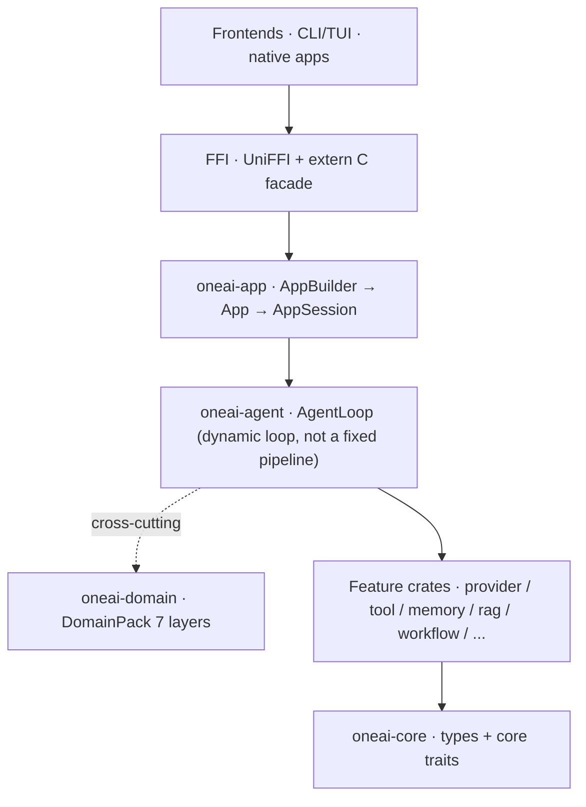

# OneAI

**English** | [简体中文](README.md)

> **One AI, Every Platform** — A cross-platform AI agent framework built in Rust: modular, type-safe, domain-pluggable, evaluable, natively multi-agent. One Rust core, six native targets.

[](LICENSE)
[](https://github.com/Marssssss/OneAI/actions/workflows/ci.yml)
[](https://crates.io/crates/oneai-app)
[]()
[]()
[]()
[]()
[]()

<p align="center">
  
</p>

One Rust core (`oneai-core`) drives native apps on macOS / Windows / Linux / Android / iOS / HarmonyOS via UniFFI bindings plus a hand-written `extern "C"` facade.

---

## At a glance

<p align="center">
  
</p>

<p align="center"><em>macOS native app · the default chat home — brand entry + starter prompts; tap one to start chatting.</em></p>

<p align="center">
  
</p>

<p align="center"><em>Interactive CLI (<code>oneai-cli</code>) · Plan mode — thinking bubbles, plan panel, tool calls, accept/reject approval.</em></p>

**Same engine, two frontends**: the native app is built for *scenario-based multi-agent conversations* (mock interview / language partner / debate / writing workshop / brainstorm); the CLI TUI is built for *general agentic coding / task execution*. Both are powered by the same Rust core and the same `AgentLoop`.

---

## Highlights · why OneAI

- **Six native targets from one core** — one Rust core drives native apps on macOS / Windows / Linux / Android / iOS / HarmonyOS. Not a WebView shell.
- **Dynamic AgentLoop** — not a fixed pipeline; each iteration the model decides (direct answer / tool call / delegate to a sub-agent / switch paradigm), bounded by a token budget rather than a hardcoded `max_iterations`.
- **DomainPack — switch domains in one line** — 7 declarative layers (tools / context / permissions / paradigms / compression / workflows / memory), mergeable, validatable against a JSON Schema, shareable via a pack market.
- **Scenario GroupChat** — an engine-level multi-role primitive: cast + turn policy + per-field visibility + debrief/review loops, with 5 built-in presets ready to use.
- **Production-grade infrastructure** — `ProviderPool` fallback chain + `SmartRouter` multi-factor routing + rate limiting / circuit breaking / 429 retry + token-aware context management.
- **Observable & evaluable** — OpenInference-compatible traces + a standalone eval framework (6 metrics, 3 suites + SWE-bench three-axis: capability × usage × efficiency).
- **Cross-session continuation** — task goal / steps / decisions / blockers persist as an append-only event log; a new session auto-surfaces unfinished work from last time.

Technical overview: [Architecture & design](docs/architecture_EN.md).

---

## Quick start

Pick the path that matches your role:

| Path | For whom |
|------|----------|
| **1. Desktop app** | Want to run scenario-based multi-agent chats from an app (macOS: download & go / Windows: build from source), no terminal |
| **2. TUI / CLI** | General agentic coding / task execution, subsystem exploration |
| **3. Integrate the OneAI SDK** | Build your own Rust app on top of OneAI from crates.io |

### 1. Desktop app (macOS / Windows)

Two native desktop apps share the same design, scenario system, and settings panel — macOS is SwiftUI, Windows is WinUI 3 / C#, feature-aligned. **Configuration and usage are identical**; only installation differs.

**macOS (download & go)**: grab `OneAI-1.1.0-macos.zip` from [GitHub Releases](https://github.com/Marssssss/OneAI/releases), unzip, and drag into *Applications*. The .app is unsigned / unnotarized (arm64, Apple Silicon, macOS 13+); the browser-downloaded copy carries a quarantine flag — **strip it with one terminal line**:

```bash
xattr -cr /Applications/OneAI.app   # then double-click to open, no dialog
```

**Windows (build from source)**: requires Visual Studio with the WindowsAppSDK 1.8 workload.

```powershell
rustup target add x86_64-pc-windows-msvc
powershell ./scripts/build_windows.ps1
dotnet run --project platforms\windows\OneAI\OneAI.csproj -c Debug -r win-x64
```

`-r win-x64` is required. See [`platforms/windows/README.md`](platforms/windows/README.md).

**Configure (in-app Settings panel)**: the desktop app does not read env vars or `~/.oneai/config.toml` — providers and embeddings are configured in the *Settings* panel and persisted to each platform's user-data directory. Open it from the sidebar footer or menu:

- **Provider type**: `openai` / `anthropic` / `ollama`, or any OpenAI-compatible gateway (`gemini` / `glm` / `dashscope`). Picking ollama auto-fills `127.0.0.1:11434`.
- **API key** / **Base URL** (blank = official endpoint) / **Model** (e.g. `gpt-4o` / `claude-sonnet-4-6` / `llama3` / `qwen-plus`).
- **Embedding settings**: leave blank for `auto`-probe (probe chain in [RAG mechanism](docs/rag-mechanism_EN.md)).

Each agent can additionally override model / key / base_url in the scenario editor to mix vendors. Usage: pick one of 5 built-in presets from *Start from a scenario* (**mock interview / language partner / debate / writing workshop / brainstorm**), or *Edit scenario* to compose your own. In-session: token-by-token markdown streaming + thinking bubbles, command palette (macOS `⌘K` / Windows `Ctrl+K`), voice input, artifact canvas.

> Build macOS from source: `./scripts/build_apple.sh && ./platforms/macos/build_macos.sh && open platforms/macos/build/OneAI.app`.

### 2. TUI / CLI (general agentic execution)

`examples/cli` (bin `oneai-cli`) is a ratatui+crossterm interactive TUI. Providers come from env vars or `~/.oneai/config.toml` (env vars take precedence). Any OpenAI-compatible endpoint works (OpenAI / Anthropic / Gemini / Ollama / DashScope / DeepSeek / vLLM …).

```bash
# OpenAI-compatible endpoint
export ONEAI_API_KEY="sk-..."
export ONEAI_BASE_URL="https://api.openai.com/v1"
export ONEAI_MODEL="gpt-4o"

# Ollama (local, no key)
export ONEAI_BASE_URL="http://localhost:11434"
export ONEAI_MODEL="llama3"
```

```bash
cargo run -p oneai-cli      # or: cargo install oneai-cli, then just: oneai
```

Enter the interactive agent: type a task and watch the full pipeline run live — streaming thinking bubbles, tool calls, plan checklist, usage stats, traces.

**Text selection & copy**: the TUI keeps mouse capture on (wheel / scrollbar drag / `Ctrl+↑↓` / `PageUp-Down` / `Home` / `End` all scroll, and scrolling up to read history mid-stream is sticky — it won't snap back to the bottom). To select model output and copy, **hold `Shift` and drag in the chat area** — the app draws the selection highlight itself and writes the system clipboard (`arboard`), copying on release. It does **not** rely on the terminal's Shift-bypass, so it works on every terminal; plain click still toggles message collapse.

**Interaction modes (cycle with `Shift+Tab`):**

| Mode | Behavior |
|------|----------|
| `Normal` | Default — high-risk tools pause for approval |
| `⚡ Auto` | Auto-approve everything (fast iteration) |
| `📋 Plan` | Tools disabled — the agent must plan first; you review in an accept/reject dialog before execution |

**Frequent slash commands** (full list via `/help` in the TUI; subcommands in the [CLI reference](docs/cli-reference_EN.md)):

| Command | Action |
|---------|--------|
| `/tools` | List registered tools |
| `/skills` · `/skill <name>` | List / activate a skill |
| `/domain <name>` | Switch DomainPack (coding / research / general) |
| `/usage` · `/context` | Token usage / context breakdown |
| `/wf list` · `/wf run <name>` | List / run a workflow |
| `/new` · `/quit` | New session / quit |

Non-interactive single-shot inference: `oneai run "Refactor the auth module to async" --domain coding --model gpt-4o`.

> **Network proxy**: all outbound HTTP goes through `reqwest::Client`, so proxy support is env-var based and uniform across targets — `HTTPS_PROXY` / `HTTP_PROXY` / `ALL_PROXY` (proxy URL), `NO_PROXY` (exclusion), `ALL_PROXY=socks5://host:port` (SOCKS5). See [CLAUDE.md — Network proxy](CLAUDE.md).

### 3. Integrate the OneAI SDK (crates.io)

```bash
cargo add oneai-app
cargo add tokio --features full
```

```rust
use oneai_app::AppBuilder;
use oneai_domain::coding_pack;

#[tokio::main]
async fn main() {
    let app = AppBuilder::new()
        .noop_interaction_gate()
        .default_parser()
        .domain_pack(coding_pack("/project/dir"))  // ← switch domain in one line
        .build()
        .expect("App built");

    let session = app.create_session();
    let result = session
        .execute_tool("calculator", serde_json::json!({"expression": "2+3"}))
        .await
        .unwrap();
    println!("Result: {}", result.content); // → "5"
}
```

The integration point is `AppBuilder` in `crates/oneai-app/src/builder.rs` — every subsystem is optional and plugged in via builder methods (**the LLM provider is optional too**; tool-only or workflow-only usage needs no provider). Plain integration only needs `oneai-app`; to shrink your dependency surface, pull individual crates (`oneai-core` / `-provider` / `-domain` / `-tool` / `-memory` / `-rag` …) — full list in [Architecture — Crate map](docs/architecture_EN.md#crate-map). For a deeper architectural read see [CLAUDE.md](CLAUDE.md); to drive each subsystem end-to-end see the [CLI reference](docs/cli-reference_EN.md).

---

## Architecture at a glance


```mermaid
flowchart TB
  FE["Frontends · CLI/TUI · native apps"] --> FFI["FFI · UniFFI + extern C facade"]
  FFI --> App["oneai-app · AppBuilder → App → AppSession"]
  App --> Loop["oneai-agent · AgentLoop (dynamic loop, not a fixed pipeline)"]
  Loop -. cross-cutting .-> Domain["oneai-domain · DomainPack 7 layers"]
  Loop --> Features["Feature crates · provider / tool / memory / rag / workflow / ..."]
  Features --> Core["oneai-core · types + core traits"]
```

Each iteration the model dynamically chooses among *direct answer / tool call / delegate to a sub-agent / switch paradigm*; `DomainPack` cross-cuts every feature layer — one line switches the whole domain behavior. Full diagram, dependency layering, crate map, and the module design-doc index live in [Architecture & design](docs/architecture_EN.md).

---

## Cross-platform: desktop & mobile

One Rust core, two FFI paths, six native targets:

| Platform | Stack | Binding language | Native approval dialog |
|---|---|---|---|
| macOS | SwiftUI (`swiftc`, no Xcode needed) | Swift (UniFFI) | NSAlert |
| Windows | WinUI 3 / C# | C# (P/Invoke facade) | MessageBox |
| Linux | desktop platform crate | C++ (facade) | MessageBox |
| Android | Jetpack Compose / Kotlin | Kotlin (UniFFI) | AlertDialog |
| iOS | SwiftUI / Swift | Swift (UniFFI xcframework) | UIAlertController |
| HarmonyOS | ArkTS / ArkUI + NAPI | C++ (NAPI-wrapped facade) | CommonDialog |

Every target shares the same design: scenario-based multi-agent group chat (5 built-in presets), 20fps streaming coalesce-render, markdown, system-following dark mode, command palette, artifact canvas. **The macOS app is the reference implementation; other targets mirror it.** Build steps and FFI details in [Cross-platform mechanism](docs/cross-platform-mechanism_EN.md) and each [`platforms/*/README.md`](platforms/macos/README.md).

---

## Eval

OneAI runs [SWE-bench Lite](https://www.swebench.com/) as a coding-agent eval, collecting three axes — **capability (resolved) × usage (tokens) × efficiency (trace)** — not just "did it pass", but "how much did it cost and how fast".

```bash
# Smoke: a single instance to confirm the loop
cargo run -p oneai-cli-demo -- eval swebench \
    --dataset ./swe_bench_lite.jsonl \
    --instances astropy__astropy-12907 \
    --workspace ./swebench-workspace --run-id oneai-smoke
```

Prerequisites, batch / full runs, artifact schema, and the memory eval in [Eval mechanism](docs/eval-mechanism_EN.md).

---

## Contributing

Contributions welcome! Whether fixing bugs, improving docs, cleaning clippy lints, or adding subsystems, please first read [CONTRIBUTING.md](CONTRIBUTING.md) — it covers local build / test commands, crate layering rules, the "don't bypass" conventions (3-layer parser / permission model), and a pre-PR self-check. For easy picks, claim a [`good first issue`](https://github.com/Marssssss/OneAI/labels/good%20first%20issue); design discussions go to [GitHub Discussions](https://github.com/Marssssss/OneAI/discussions). Code of conduct: [CODE_OF_CONDUCT.md](CODE_OF_CONDUCT.md).

## License

Apache-2.0 — see [LICENSE](LICENSE) for details.
