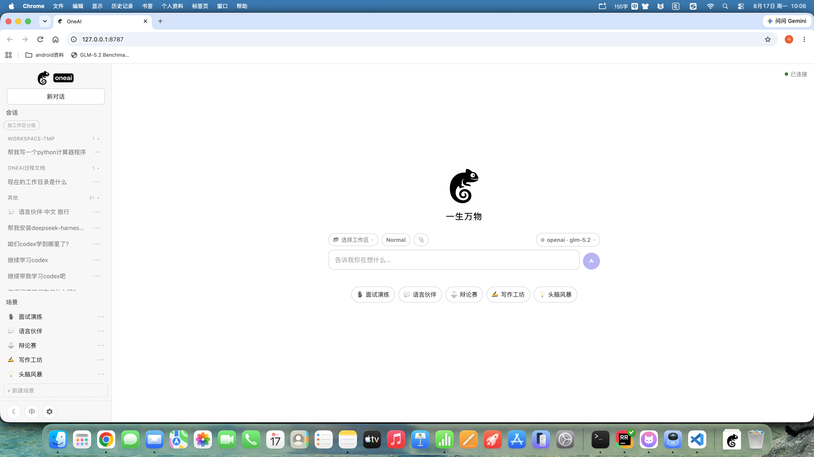

# OneAI

**English** | [简体中文](README.md)

> **One AI, Every Platform** — a cross-platform AI agent framework built in Rust. One engine feeds frontends on six targets.

[](LICENSE)
[](https://github.com/Marssssss/OneAI/actions/workflows/ci.yml)
[](https://crates.io/crates/oneai-app)
[]()
[]()
[]()
[]()
[]()

<p align="center">
  <picture>
    <source media="(prefers-color-scheme: dark)" srcset="assets/oneai-logo-dark.png">
    <source media="(prefers-color-scheme: light)" srcset="assets/oneai-logo.png">
    
  </picture>
</p>

<p align="center">
  
</p>

<p align="center"><em>WebUI (<code>oneai web</code> / <code>npx oneai-cli web</code>) · one command launches the engine + browser frontend and opens the page.</em></p>

---

## Highlights

- **Many official frontends** — the WebUI (browser, zero-install, recommended), CLI/TUI, macOS / Windows apps, a VS Code extension, a browser extension, and mobile apps; one engine feeds them all, each with its own native UI.
- **Unified engine bus** — one protocol of `Directive` (frontend → engine) + `EngineYield` (engine → frontend), shared by every frontend.
- **Dynamic AgentLoop** — each iteration the model dynamically decides (direct answer / tool call / delegate / switch paradigm), bounded by a token budget.
- **One-line DomainPack switch** — 7-layer declarative config, mergeable, validatable, shareable.
- **Scenario GroupChat** — an engine-level multi-role conversation primitive with 5 built-in presets.
- **Production-grade infrastructure** — ProviderPool fallback chain + SmartRouter routing + rate limiting / circuit breaking / 429 retry.
- **Cross-session resume** — task progress persists as an event log; a new session surfaces unfinished work.

---

## Official frontends

One engine — pick a frontend for your scenario. **The WebUI is zero-install and cross-platform; it's the recommended frontend for most users.** The rest use each platform's native UI.

| Frontend | Status | For |
|---|---|---|
| WebUI (browser) | ✅ all platforms | zero-install, cross-platform, scenario chat (**recommended**) |
| CLI / TUI | ✅ all platforms | general agentic coding |
| macOS app | ✅ | scenario-based multi-agent chat |
| Windows app | ⚠️ build from source | scenario-based multi-agent chat |
| VS Code extension | ✅ | chat inside your editor |
| Browser extension | ✅ macOS/Linux | chat in the browser |
| Android app | ✅ build from source | mobile scenario chat |
| iOS app | 🚧 in progress | mobile |
| HarmonyOS app | 🚧 in progress | mobile |

### 1. WebUI (browser, recommended)

One command launches the Rust engine + React frontend + browser, on macOS / Windows / Linux — no Rust, no extra process. The same port (axum) serves the SPA static assets and the `/ws` JSON-RPC upgrade.

**Run from npm (recommended, no Rust):**

```bash
npx oneai-cli web          # postinstall fetches the prebuilt engine, serves and auto-opens the browser
# or install once globally:
npm install -g oneai-cli
oneai web
```

Listens on `http://127.0.0.1:8787` by default and opens the browser. Common flags: `--no-open`, `--port`/`--host`, `--model`, `--domain`, `--dist <path>` (web dist dir), `--user`. Provider config matches the CLI (env vars or `~/.oneai/config.toml`).

**Run from source:**

```bash
# 1) Engine binary (the `http` feature is on by default; `oneai web` ships in oneai-cli)
cargo build --release -p oneai-cli

# 2) Build the web frontend dist (once; `oneai web` auto-detects ./platforms/web/dist)
cd platforms/web && npm install && npm run build && cd ../..

# 3) Serve
cargo run -p oneai-cli --release -- web
```

> Frontend dev mode (hot reload): `cd platforms/web && npm run dev` (Vite 5173), and point `VITE_APP_SERVER_URL=ws://127.0.0.1:8787/ws` at a standalone `oneai app-server --listen ws://127.0.0.1:8787`.

Open the page → configure a provider in Settings (type / API Key / Base URL / Model; Ollama takes an empty key) → pick a scenario preset or build your own → start chatting. Mechanism in [WebUI mechanism](docs/webui-mechanism_EN.md).

### 2. CLI / TUI

The general agentic-coding and task-execution frontend, runs on every platform (macOS / Windows / Linux).

Install:

```bash
npm install -g oneai-cli      # no Rust; postinstall fetches the prebuilt binary
# or track the latest source:
cargo install --path examples/cli
```

Run:

```bash
oneai          # launch the interactive TUI
```

Provider config (env vars, or write them to `~/.oneai/config.toml`):

```bash
export ONEAI_API_KEY="sk-..."
export ONEAI_BASE_URL="https://api.openai.com/v1"
export ONEAI_MODEL="gpt-4o"
```

For the full slash-command and subcommand set, see the [CLI reference](docs/cli-reference_EN.md).

### 3. macOS app

Native SwiftUI, no Xcode required — the Command Line Tools are enough. The app defaults to **in-process FFI** (the `liboneai.a` staticlib is embedded — no process, no socket, best UX); optionally switch to the **sidecar** architecture (the app spawns `oneai app-server --listen ipc://…` as a child and talks to the engine over JSON-RPC).

```bash
# 1) Build the engine release binary first — the sidecar transport needs it
#    bundled into the .app (Contents/Resources/bin/oneai). Without it,
#    sidecar falls back to `oneai` on PATH.
cargo build --release -p oneai-cli

# 2) Build the staticlib + headers + Swift binding
./scripts/build_apple.sh

# 3) Build the .app (bundles the oneai binary from step 1)
./platforms/macos/build_macos.sh

open platforms/macos/build/OneAI.app
```

> Using only the default in-process FFI (no sidecar) lets you skip step 1. After changing engine code, re-run step 1 before steps 2–3 (`build_macos.sh` only stages, it doesn't build — skipping the rebuild bundles a stale engine). To switch to sidecar: `defaults write oneai_provider oneai_engine_transport sidecar` (delete the key to return to FFI).

Open the app → configure a provider in Settings (type / API Key / Base URL / Model; Ollama takes an empty key) → pick a scenario preset from the sidebar (mock interview / language partner / debate / writing workshop / brainstorm) or build your own → start chatting.

### 4. Windows app

Native WinUI 3 / C#, requires Visual Studio with the WindowsAppSDK 1.8 workload.

```powershell
rustup target add x86_64-pc-windows-msvc
powershell ./scripts/build_windows.ps1
dotnet run --project platforms\windows\OneAI\OneAI.csproj -c Debug -r win-x64
```

`-r win-x64` is required. Configuration matches macOS (Settings panel for the provider). Details in [`platforms/windows/README.md`](platforms/windows/README.md).

### 5. VS Code extension

Chat inside your editor. On activation it spawns the engine as a child process and auto-restarts it if it crashes.

> Not yet on the VS Code Marketplace — build from source below for now.

1. Put the engine on PATH:

   ```bash
   npm install -g oneai-cli      # or cargo install --path examples/cli
   ```

2. Build the extension:

   ```bash
   cd platforms/vscode
   npm install
   npm run compile
   ```

3. Launch it for debugging: open the `platforms/vscode` folder in VS Code and press `F5` — VS Code opens an Extension Development Host, a second window with the extension loaded for debugging. Or from the command line (inside the `platforms/vscode` directory): `code --extensionDevelopmentPath="$PWD"`.
4. Configure the provider: open VS Code settings and fill in `oneai.apiKey` / `oneai.baseUrl` (empty = official endpoint) / `oneai.model` (e.g. `gpt-4o`); set `oneai.providerKind` to `openai` / `anthropic` / `ollama` (Ollama takes an empty key). If `oneai` isn't on PATH, set `oneai.oneaiPath` to point at the binary.
5. Run the command `OneAI: Open Chat` to start.

### 6. Browser extension

Chrome / Firefox, talks to the engine over native messaging.

> Not yet on the Chrome Web Store / AMO — sideload from source below for now.

1. Put the engine on PATH:

   ```bash
   npm install -g oneai-cli      # or cargo install --path examples/cli
   ```

2. Configure the provider in `~/.oneai/config.toml` (the engine reads it):

   ```toml
   [provider]
   api_key = "sk-..."
   base_url = "https://api.openai.com/v1"
   model = "gpt-4o"
   ```

3. Load the extension to get its ID:
   - **Chrome**: `chrome://extensions` → Developer mode → Load unpacked → pick `platforms/browser` → copy the extension ID.
   - **Firefox**: `about:debugging` → Load Temporary Add-on → pick `manifest.json`; the ID is `oneai@oneai`.
4. Register the native-messaging host:

   ```bash
   cd platforms/browser
   ./install-host.sh --browser=chrome --ext-id=<the ID from step 3>
   ```

5. Open the extension popup — it connects to the engine and you can chat.

> The Windows native-messaging host packaging is deferred; macOS / Linux work today.

### 7. Mobile

The Android app (Jetpack Compose / Kotlin) is working — `./scripts/build_android.sh` cross-compiles 4 ABIs (needs `cargo-ndk` + Android Studio).

iOS and HarmonyOS are in-progress ports — they need Xcode / DevEco Studio respectively; install the matching IDE and re-run the build scripts. There's no standalone Linux desktop app; use the CLI.

---

## Contributing

Contributions welcome! Start with [CONTRIBUTING.md](CONTRIBUTING.md) — local build / test commands, crate layering rules, and a pre-PR self-check. Claim a [`good first issue`](https://github.com/Marssssss/OneAI/labels/good%20first%20issue) to ease in; design discussion in [GitHub Discussions](https://github.com/Marssssss/OneAI/discussions). Code of conduct in [CODE_OF_CONDUCT.md](CODE_OF_CONDUCT.md).

## License

Apache-2.0 — see [LICENSE](LICENSE).
