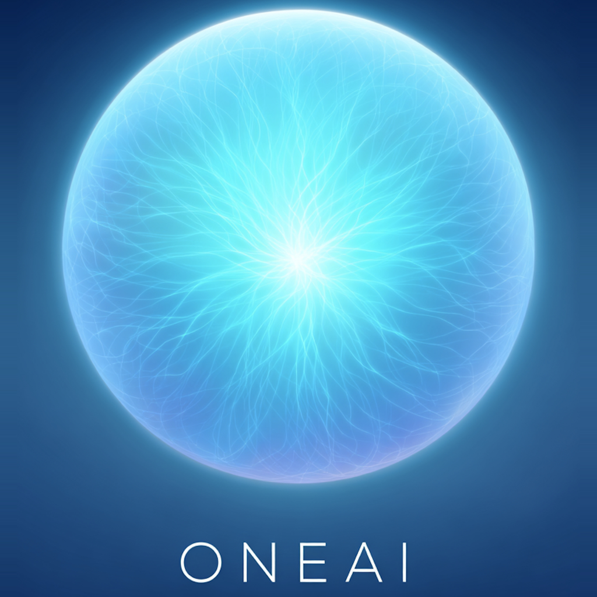
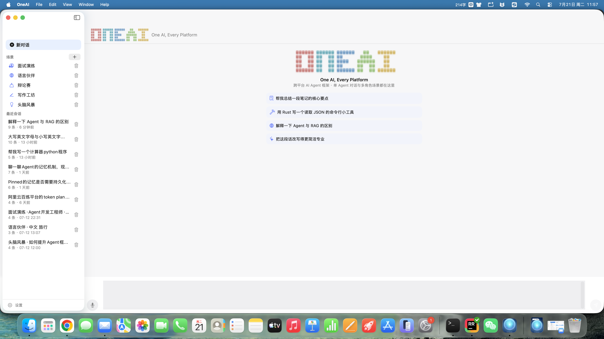
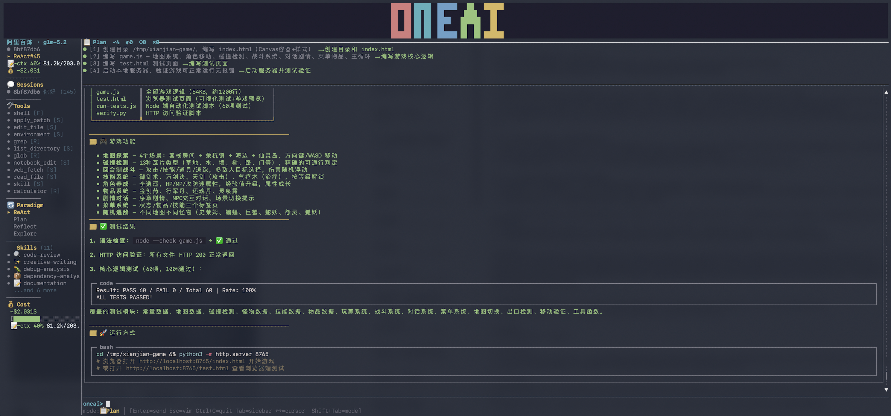
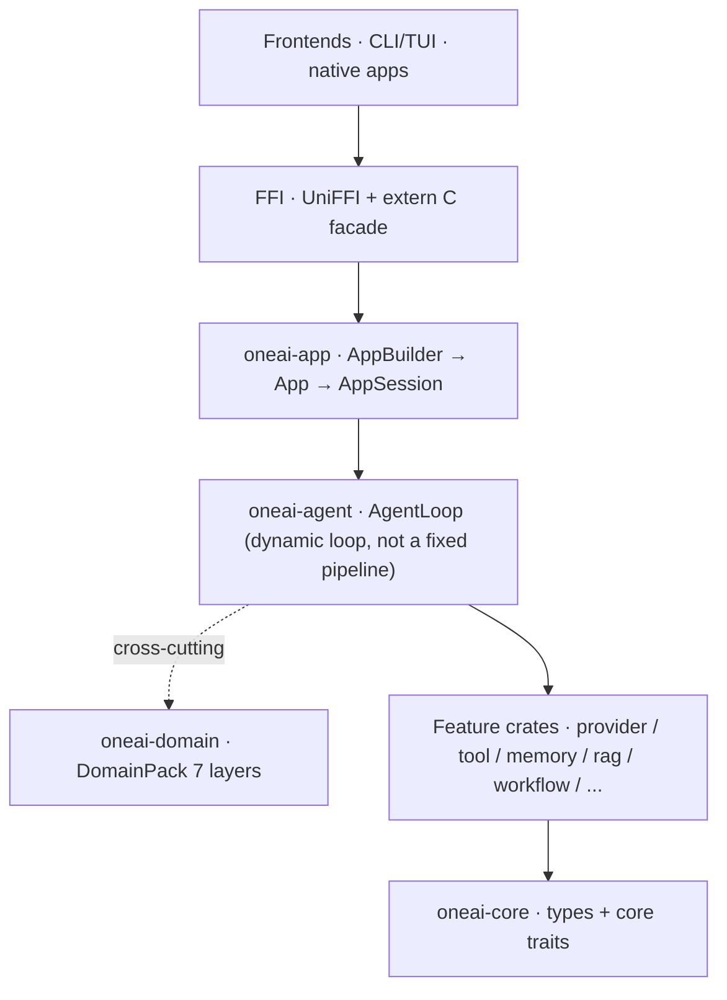

# OneAI

**English** | [简体中文](README.md)

> **One AI, Every Platform** — A cross-platform AI agent framework built in Rust: modular, type-safe, domain-pluggable, evaluable, natively multi-agent. One Rust core, six native targets.

[](LICENSE)
[](https://github.com/Marssssss/OneAI/actions/workflows/ci.yml)
[](https://crates.io/crates/oneai-app)
[]()
[]()
[]()
[]()
[]()

<p align="center">
  
</p>

One Rust core (`oneai-core`) drives native apps on macOS / Windows / Linux / Android / iOS / HarmonyOS via UniFFI bindings plus a hand-written `extern "C"` facade.

---

## At a glance

<p align="center">
  
</p>

<p align="center"><em>macOS native app · the default chat home — brand entry + starter prompts; tap one to start chatting.</em></p>

<p align="center">
  
</p>

<p align="center"><em>Interactive CLI (<code>oneai-cli</code>) · Plan mode — thinking bubbles, plan panel, tool calls, accept/reject approval.</em></p>

**Same engine, two frontends**: the native app is built for *scenario-based multi-agent conversations* (mock interview / language partner / debate / writing workshop / brainstorm); the CLI TUI is built for *general agentic coding / task execution*. Both are powered by the same Rust core and the same `AgentLoop`.

---

## Highlights · why OneAI

- **Six native targets from one core** — one Rust core drives native apps on macOS / Windows / Linux / Android / iOS / HarmonyOS. Not a WebView shell.
- **Unified engine bus** — one protocol of `Directive` (frontend → engine) + `EngineYield` (engine → frontend), shared by the TUI, Studio web, six native apps, and the `oneai serve` sidecar; a frontend only needs to "write Directives, read EngineYields".
- **Dynamic AgentLoop** — not a fixed pipeline; each iteration the model decides (direct answer / tool call / delegate to a sub-agent / switch paradigm), bounded by a token budget rather than a hardcoded `max_iterations`.
- **DomainPack — switch domains in one line** — 7 declarative layers (tools / context / permissions / paradigms / compression / workflows / memory), mergeable, validatable against a JSON Schema, shareable via a pack market.
- **Scenario GroupChat** — an engine-level multi-role primitive: cast + turn policy + per-field visibility + debrief/review loops, with 5 built-in presets ready to use.
- **Production-grade infrastructure** — `ProviderPool` fallback chain + `SmartRouter` multi-factor routing + rate limiting / circuit breaking / 429 retry + token-aware context management.
- **Observable & evaluable** — OpenInference-compatible traces + a standalone eval framework (6 metrics, 3 suites + SWE-bench three-axis: capability × usage × efficiency).
- **Cross-session continuation** — task goal / steps / decisions / blockers persist as an append-only event log; a new session auto-surfaces unfinished work from last time.

Technical overview: [Architecture & design](docs/architecture_EN.md).

---

## Quick start

Pick the path that matches your role:

| Path | For whom |
|------|----------|
| **1. Desktop app** | Want to run scenario-based multi-agent chats from an app (macOS: download & go / Windows: build from source), no terminal |
| **2. TUI / CLI** | General agentic coding / task execution, subsystem exploration |
| **3. Integrate the OneAI SDK** | Build your own Rust app on top of OneAI from crates.io |

### 1. Desktop app (macOS / Windows)

Two native desktop apps share the same design, scenario system, and settings panel — macOS is SwiftUI, Windows is WinUI 3 / C#, feature-aligned. **Configuration and usage are identical**; only installation differs.

**macOS (build from source — recommended)**: needs only Command Line Tools, no Xcode. Two steps — first build the Rust static lib and bindings, then compile the SwiftUI app:

```bash
./scripts/build_apple.sh        # stages liboneai.a + headers + Swift binding
./platforms/macos/build_macos.sh
open platforms/macos/build/OneAI.app
```

> You can also download a packaged .app from [GitHub Releases](https://github.com/Marssssss/OneAI/releases). **Releases often lag behind source**, though, so for the latest features build from source as shown above. A copy downloaded from a browser carries a quarantine flag — strip it with one line and you can double-click straight in:
>
> ```bash
> xattr -cr /Applications/OneAI.app
> ```

**Windows (build from source)**: requires Visual Studio with the WindowsAppSDK 1.8 workload.

```powershell
rustup target add x86_64-pc-windows-msvc
powershell ./scripts/build_windows.ps1
dotnet run --project platforms\windows\OneAI\OneAI.csproj -c Debug -r win-x64
```

`-r win-x64` is required. See [`platforms/windows/README.md`](platforms/windows/README.md).

**Configure (in-app Settings panel)**: the desktop app does not read env vars or `~/.oneai/config.toml` — providers and embeddings are configured in the *Settings* panel and persisted to each platform's user-data directory. Open it from the sidebar footer or menu:

- **Provider type**: `openai` / `anthropic` / `ollama`, or any OpenAI-compatible gateway (`gemini` / `glm` / `dashscope`). Picking ollama auto-fills `127.0.0.1:11434`.
- **API key** / **Base URL** (blank = official endpoint) / **Model** (e.g. `gpt-4o` / `claude-sonnet-4-6` / `llama3` / `qwen-plus`).
- **Embedding settings**: leave blank for `auto`-probe (probe chain in [RAG mechanism](docs/rag-mechanism_EN.md)).

Each agent can additionally override model / key / base_url in the scenario editor to mix vendors. Pick one of 5 built-in presets from *Start from a scenario* (**mock interview / language partner / debate / writing workshop / brainstorm**), or *Edit scenario* to compose your own. While running you get token-by-token markdown streaming with thinking bubbles, a command palette (macOS `⌘K` / Windows `Ctrl+K`), voice input, and an artifact canvas.

### 2. TUI / CLI (general agentic execution)

`examples/cli` (bin `oneai-cli`) is a ratatui+crossterm interactive TUI. Providers come from env vars or `~/.oneai/config.toml` (env vars take precedence). Any OpenAI-compatible endpoint works (OpenAI / Anthropic / Gemini / Ollama / DashScope / DeepSeek / vLLM …).

```bash
# OpenAI-compatible endpoint
export ONEAI_API_KEY="sk-..."
export ONEAI_BASE_URL="https://api.openai.com/v1"
export ONEAI_MODEL="gpt-4o"

# Ollama (local, no key)
export ONEAI_BASE_URL="http://localhost:11434"
export ONEAI_MODEL="llama3"
```

```bash
cargo run -p oneai-cli      # or: cargo install --path examples/cli, then just: oneai
```

Enter the interactive agent: type a task and watch the full pipeline run live — streaming thinking bubbles, tool calls, plan checklist, usage stats, traces.

**Text selection & copy**: the TUI keeps mouse capture on (wheel / scrollbar drag / `Ctrl+↑↓` / `PageUp-Down` / `Home` / `End` all scroll, and scrolling up to read history mid-stream is sticky — it won't snap back to the bottom). To select model output and copy, **hold `Shift` and drag in the chat area** — the app draws the selection highlight itself and writes the system clipboard (`arboard`), copying on release. It does **not** rely on the terminal's Shift-bypass, so it works on every terminal; plain click still toggles message collapse.

**Interaction modes (cycle with `Shift+Tab`):**

| Mode | Behavior |
|------|----------|
| `Normal` | Default — high-risk tools pause for approval |
| `⚡ Auto` | Auto-approve everything (fast iteration) |
| `📋 Plan` | Tools disabled — the agent must plan first; you review in an accept/reject dialog before execution |

**Frequent slash commands** (full list via `/help` in the TUI; subcommands in the [CLI reference](docs/cli-reference_EN.md)):

| Command | Action |
|---------|--------|
| `/tools` | List registered tools |
| `/skills` · `/skill <name>` | List / activate a skill |
| `/domain <name>` | Switch DomainPack (coding / research / general) |
| `/usage` · `/context` | Token usage / context breakdown |
| `/wf list` · `/wf run <name>` | List / run a workflow |
| `/new` · `/quit` | New session / quit |

Non-interactive single-shot inference: `oneai run "Refactor the auth module to async" --domain coding --model gpt-4o`.

> **Network proxy**: all outbound HTTP goes through `reqwest::Client`, so proxy support is env-var based and uniform across targets — `HTTPS_PROXY` / `HTTP_PROXY` / `ALL_PROXY` (proxy URL), `NO_PROXY` (exclusion), `ALL_PROXY=socks5://host:port` (SOCKS5). See [CLAUDE.md — Network proxy](CLAUDE.md).

### 3. Integrate the OneAI SDK (crates.io)

```bash
cargo add oneai-app
cargo add tokio --features full
```

The integration point is `AppBuilder` in `crates/oneai-app/src/builder.rs` — every subsystem is optional and plugged in on demand via builder methods (**the LLM provider is optional too**; tool-only or workflow-only usage needs no provider). `build()` gives you an `App`, and `create_session()` gives you an `AppSession`. The inference entry that drives the AgentLoop is `session.run_agent(task, observer, interrupt_slot)`: pass the user input as the `task` string and the loop adds it to the conversation itself — you do *not* call `send_user_message` first.

#### Minimal (silent inference)

```rust
use oneai_app::AppBuilder;
use oneai_core::ModelConfig;
use oneai_provider::OpenAIProvider;

#[tokio::main]
async fn main() -> anyhow::Result<()> {
    // Provider is required for inference — without one, run_agent returns a
    // Provider error. ONEAI_API_KEY / ONEAI_BASE_URL / ONEAI_MODEL are the env
    // vars the CLI reads; in SDK code you can read env, hardcode, or load a config.
    let provider = OpenAIProvider::new(ModelConfig {
        api_key: std::env::var("ONEAI_API_KEY").ok(),
        base_url: std::env::var("ONEAI_BASE_URL").ok(),
        model_name: Some("gpt-4o".to_string()),
        ..ModelConfig::default()
    });

    let app = AppBuilder::new()
        .provider(std::sync::Arc::new(provider))
        .noop_interaction_gate()        // no approval UI → no-op gate (also the default)
        .default_parser()                // 3-layer output parser, defends unreliable LLM output
        .build()?;

    let mut session = app.create_session();   // sync; for resumed chat use create_session_with_id(id).await

    // run_agent_silent = run_agent + a no-op observer + a throwaway interrupt slot.
    // Ideal for backend batch jobs / one-shot Q&A: just get the final answer.
    let result = session.run_agent_silent("Summarize the role of src/main.rs").await?;
    println!("{}", result.final_answer);   // → the model's final answer
    println!("Iterations: {}, completed={}", result.iterations, result.completed);
    Ok(())
}
```

#### Streaming + tool-call callbacks

For a chat UI (typewriter effect, tool-call bubbles), implement `AgentLoopObserver` — the loop calls it at every key point:

```rust
use std::sync::Arc;
use tokio::sync::mpsc;
use oneai_agent::{AgentLoopObserver, AgentLoopResult, ToolCallRequest, ParadigmKind};
use oneai_core::ToolOutput;

struct UiObserver { tx: mpsc::UnboundedSender<String> }

impl AgentLoopObserver for UiObserver {
    fn on_iteration_start(&self, iter: usize, _p: ParadigmKind) {
        let _ = self.tx.send(format!("[iter {iter}]"));
    }
    fn on_stream_chunk(&self, text: &str) {            // streaming token → typewriter
        let _ = self.tx.send(text.to_string());
    }
    fn on_tool_calls(&self, calls: &[ToolCallRequest]) {/* render tool-call bubbles */}
    fn on_tool_result(&self, _id: &str, name: &str, out: &ToolOutput) {
        let _ = self.tx.send(format!("→ {name}: {:?}", out.content));
    }
    fn on_direct_answer(&self, text: &str) {            // model decided to wrap up
        let _ = self.tx.send(text.to_string());
    }
    fn on_complete(&self, _r: &AgentLoopResult) { /* finalize */ }
    // Also on_thinking / on_token_usage_full / on_context_accounting /
    // on_delegate / on_interrupt / on_resume … override as needed (all default empty).
}

// interrupt_slot: cross-thread interrupt / resume of the loop
let interrupt_slot: Arc<tokio::sync::Mutex<Option<oneai_agent::AgentLoop>>> =
    Arc::new(tokio::sync::Mutex::new(None));

let (tx, mut rx) = mpsc::unbounded_channel();
let observer = UiObserver { tx };

// This is the line that starts the AgentLoop:
let result = session
    .run_agent("User input goes here", &observer, interrupt_slot.clone())
    .await?;

// On another tokio task, drain `rx` and render chunks to the UI.
while let Some(chunk) = rx.recv().await { /* render */ }
```

#### Key conventions

- **`task` *is* the user input**: do not `send_user_message` then `run_agent` — that double-adds the message. `run_agent` adds the task to the conversation internally (see the comment in `session.rs`).
- **Multi-turn chat**: call `run_agent` repeatedly within one session; the conversation accumulates history and the AgentLoop auto-compresses when context exceeds the token budget (`ContextBudgetManager` gates it, budget scales with the model's real window). Manual compression: `session.compact(keep_recent_turns)`.
- **Interrupt / resume**: clone `interrupt_slot` to the UI thread, take the `AgentLoop` handle inside and call `interrupt()` — takes effect at iteration boundaries. The `ChannelInteractionGate` / `ThresholdInteractionGate` also intercept decision points like tool approval and plan decisions — see `AppBuilder::channel_interaction_gate` / `threshold_interaction_gate`.
- **Cross-session resume**: `app.create_session_with_id(id).await` replays history from SQLite; to bind to a working-state task use `session.continue_task(task_id)` (crash recovery + cross-session task continuation).
- **Domain switch**: `.domain_pack(coding_pack("/dir"))` on the builder switches domain in one line — the AgentLoop uses the corresponding system prompt + tool whitelist + paradigm strategies; merge multiple with `.domain_packs(vec![...])` (permissions strictest-wins).
- **Tool-only / workflow-only (no provider)**: skip `.provider(...)`, call `session.execute_tool("calculator", json!({"expression":"2+3"})).await` directly (returns `ToolOutput.content`), or `session.execute_workflow(&config).await` to run a StateGraph — see the "no LLM needed" example below:

```rust
let app = AppBuilder::new().noop_interaction_gate().default_parser().build()?;
let session = app.create_session();
let r = session
    .execute_tool("calculator", serde_json::json!({"expression": "2+3"}))
    .await?;
println!("{}", r.content); // → "5"
```

Plain integration only needs `oneai-app`; to shrink your dependency surface, pull individual crates (`oneai-core` / `-provider` / `-domain` / `-tool` / `-memory` / `-rag` …) — full list in [Architecture — Crate map](docs/architecture_EN.md#crate-map). For a deeper architectural read see [CLAUDE.md](CLAUDE.md); to drive each subsystem end-to-end see the [CLI reference](docs/cli-reference_EN.md) — the `chat` subcommand in `examples/cli` is a complete reference implementation of `run_agent` + a custom observer + an interrupt slot, ready to copy.

#### Building a UI / native frontend? Take the engine bus

`run_agent` + `AgentLoopObserver` suits **embedding into your own Rust app** — the engine calls your observer back directly. But if you are building a **separate frontend process or native app** (macOS Swift, Windows C#, mobile, or even a web Studio), take the engine bus instead: two channels — `Directive` (frontend → engine) and `EngineYield` (engine → frontend) — one shared protocol for every frontend.

```rust
use oneai_app::AppBuilder;

// engine_bus() enables the bus: installs BusInteractionGate, returns (builder, directive_rx)
let (builder, directive_rx) = AppBuilder::new()
    .provider(...)
    .engine_bus();
let app = builder.build()?;
let bus = app.engine_bus.clone().expect("engine_bus is set");

let mut session = app.create_session();
// Subscribe to the yield stream: each turn the engine yields stream chunks / tool calls / approval requests
let mut yields = bus.subscribe_yields();
// Run a turn — the engine emits EngineYield; the frontend can also submit Directives (UserMessage / Approve / Interrupt …)
session.run_turn_via_bus("user input here", interrupt_slot).await?;
```

A frontend's role is simple: write `Directive`s, read `EngineYield`s. An in-process frontend (TUI, same-process UI) holds an `Arc<InProcessBus>` directly; an out-of-process one (native app, IDE plugin) goes through the `oneai serve` sidecar over newline-JSON on UDS (Unix) / named pipe (Windows). Approval reuses the same pair of channels — `EngineYield::ApprovalRequest` carries a `request_id`, the frontend replies with `Directive::Approve`, so no per-frontend mpsc is needed. Full protocol, sidecar, and the c_facade 3-symbol pump in [Engine bus mechanism](docs/bus-mechanism_EN.md).

---

## Architecture at a glance


```mermaid
flowchart TB
  FE["Frontends · CLI/TUI · native apps"] --> FFI["FFI · UniFFI + extern C facade"]
  FFI --> App["oneai-app · AppBuilder → App → AppSession"]
  App --> Loop["oneai-agent · AgentLoop (dynamic loop, not a fixed pipeline)"]
  Loop -. cross-cutting .-> Domain["oneai-domain · DomainPack 7 layers"]
  Loop --> Features["Feature crates · provider / tool / memory / rag / workflow / ..."]
  Features --> Core["oneai-core · types + core traits"]
```

Each iteration the model dynamically chooses among *direct answer / tool call / delegate to a sub-agent / switch paradigm*; `DomainPack` cross-cuts every feature layer — one line switches the whole domain behavior. Full diagram, dependency layering, crate map, and the module design-doc index live in [Architecture & design](docs/architecture_EN.md).

---

## Cross-platform: desktop & mobile

One Rust core, three paths to six native targets:

1. **UniFFI bindings** — Kotlin / Swift bind `oneai-core` traits directly.
2. **Hand-written `extern "C"` facade** — C# / C++ / ArkTS go through a UTF-8 JSON facade (`c_facade`) with a 3-symbol bus pump (build engine, submit, drain).
3. **`oneai serve` sidecar / `oneai app-server`** — when a native process does not embed the Rust lib, it talks to the engine bus over UDS (Unix) / named pipe (Windows). `oneai serve` is newline-JSON passthrough of `Directive`/`EngineYield` (optional escape hatch); `oneai app-server` speaks JSON-RPC 2.0 (`turn/run` / `approval/respond` / `session/*` / `group/*` / `scenario/*` / `event` notifications), with multiple transports (**stdio** / **ipc** / **ws** / **native-messaging**) bound concurrently, feeding four non-Rust frontend classes — the **VS Code extension** (`platforms/vscode`, spawns stdio on activation, Codex/LSP model), the **browser extension** (`platforms/browser`, Chrome/Firefox native messaging, zero manual server start), and the **macOS/Windows native sidecar** (`OneAiRpcClient` over ipc, `EngineProcessManager` auto-spawns). Frontends **never start a server manually** — any frontend that can spawn a process owns the spawn (Codex model); `scenario/*` shares one scenario library + one authoritative `scenario/validate`. See [Engine bus mechanism](docs/bus-mechanism_EN.md) and [App-Server mechanism](docs/app-server-mechanism_EN.md).

| Platform | Stack | Binding language | Native approval dialog |
|---|---|---|---|
| macOS | SwiftUI (`swiftc`, no Xcode needed) | Swift (UniFFI) | NSAlert |
| Windows | WinUI 3 / C# | C# (P/Invoke facade) | MessageBox |
| Linux | desktop platform crate | C++ (facade) | MessageBox |
| Android | Jetpack Compose / Kotlin | Kotlin (UniFFI) | AlertDialog |
| iOS | SwiftUI / Swift | Swift (UniFFI xcframework) | UIAlertController |
| HarmonyOS | ArkTS / ArkUI + NAPI | C++ (NAPI-wrapped facade) | CommonDialog |

Every target shares the same design: scenario-based multi-agent group chat (5 built-in presets), 20fps streaming coalesce-render, markdown, system-following dark mode, command palette, artifact canvas. **The macOS app is the reference implementation; other targets mirror it.** Build steps and FFI details in [Cross-platform mechanism](docs/cross-platform-mechanism_EN.md) and each [`platforms/*/README.md`](platforms/macos/README.md).

---

## Eval

OneAI runs [SWE-bench Lite](https://www.swebench.com/) as a coding-agent eval, collecting three axes — **capability (resolved) × usage (tokens) × efficiency (trace)** — not just "did it pass", but "how much did it cost and how fast".

```bash
# Smoke: a single instance to confirm the loop
cargo run -p oneai-cli -- eval swebench \
    --dataset ./swe_bench_lite.jsonl \
    --instances astropy__astropy-12907 \
    --workspace ./swebench-workspace --run-id oneai-smoke
```

Prerequisites, batch / full runs, artifact schema, and the memory eval in [Eval mechanism](docs/eval-mechanism_EN.md).

---

## Self-evolution system

OneAI ships a **GEPA-style outer evolution loop** (`oneai-evolve` crate): it doesn't touch model weights — it only mutates the `DomainPackConfig` (7-layer declarative pack) + `AgentLoopConfig`'s text/numeric knobs. Each generation scores candidates against a real eval suite, Pareto-selects the frontier on multiple objectives, and a lesson-merge carries the frontier into the next generation, looping until convergence / budget / stagnation. E5 adds three safety gates (`DomainPackValidator` + a PermissionResolver static gate + judge/candidate model separation) and two regression gates (held-out full-suite overfit detection + replay determinism-drift detection).

```bash
# Run a single/multi-generation loop (variation scored against a builtin suite)
cargo run -p oneai-cli -- evolve run \
    --seed ./my-pack.yaml --suite coding_basics \
    --max-generations 3 --target 0.85 --patience 2
# Inspect artifacts offline
cargo run -p oneai-cli -- evolve report ~/.oneai/evolve/run-<ts>
cargo run -p oneai-cli -- evolve diff   ~/.oneai/evolve/run-<ts>   # seed-vs-frontier config diff
cargo run -p oneai-cli -- evolve lesson ~/.oneai/evolve/run-<ts>  # cross-generation lesson log
cargo run -p oneai-cli -- evolve step  ~/.oneai/evolve/run-<ts> --suite coding_basics  # resume one gen
```

The full mechanism (five-stage loop / variation-substrate map / safety gates / layered reward-hacking defense / replay applicability) is in the [Self-evolution mechanism whitepaper](docs/self-evolution-mechanism.md); design rationale in the [implementation plan](docs/self-evolution-system-2026-08.md).

---

## Contributing

Contributions welcome! Whether fixing bugs, improving docs, cleaning clippy lints, or adding subsystems, please first read [CONTRIBUTING.md](CONTRIBUTING.md) — it covers local build / test commands, crate layering rules, the "don't bypass" conventions (3-layer parser / permission model), and a pre-PR self-check. For easy picks, claim a [`good first issue`](https://github.com/Marssssss/OneAI/labels/good%20first%20issue); design discussions go to [GitHub Discussions](https://github.com/Marssssss/OneAI/discussions). Code of conduct: [CODE_OF_CONDUCT.md](CODE_OF_CONDUCT.md).

## License

Apache-2.0 — see [LICENSE](LICENSE) for details.
