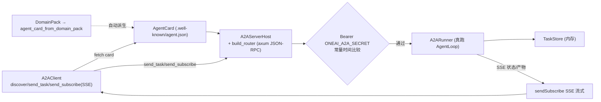

# OneAI A2A 机制

> Google A2A（Agent-to-Agent）开放协议 Rust SDK——客户端 + axum JSON-RPC 服务端宿主 + DomainPack→AgentCard 自动暴露：让 OneAI Agent 既能作为客户端发现并委托远程 Agent，也能作为服务端把自己的能力暴露给其他 Agent；任务为中心（task-centric）模型，共享密钥 Bearer 鉴权（`ONEAI_A2A_SECRET`，常量时间比较，非 JWT）。

## 1. 概述（是什么）

`oneai-a2a` 是 Google A2A 开放协议的 Rust 实现。A2A 解决"Agent 之间怎么通信协作"——不是让 Agent 共享内存或对话，而是以**任务为中心**：客户端发现远端 Agent 的能力（`AgentCard`），创建 Task 发一条 Message，远端 Agent 处理后返回 Artifacts。这个 crate 同时提供客户端 SDK（`A2AClient` 发现/发任务/流式订阅）与服务端宿主（`A2AServerHost` + axum JSON-RPC router 真跑 AgentLoop + `sendSubscribe` SSE 流式），并把 `DomainPack` 自动转成 `AgentCard` 暴露能力。

它位于特性层、依赖 `oneai-core`（`LlmProvider`/`Tool`）与 `oneai-domain`（`DomainPack`→`AgentCard`）及 `oneai-gateway`（复用 axum/HTTP 基座），被 `oneai-app` 与 CLI `oneai a2a` 消费。a2a→gateway 的依赖是 axum/HTTP 基座的代码复用，非概念耦合。设计上戒律推迟了 push/resubscribe 与 TaskStore 落盘（gap P0 最后未清项闭合于真跑 AgentLoop + SSE）。

## 2. 职责与能力（做什么）

**AgentCard 互操作。** `AgentCard` 描述 Agent 能力（skills、流式支持、鉴权）；`agent_card_from_domain_pack` 把 `DomainPack` 自动转 card；`well_known_agent_card` 出 `.well-known/agent.json`；`parse_agent_card`（JSON/YAML）。

**客户端 SDK。** `A2AClient`（`discover` 拉 card / `send_task` 发任务 / `get_task` 查状态带 history / `cancel_task` / `send_subscribe` SSE 流式订阅 + `TaskStream`）。

**服务端宿主。** `A2AServerHost`（持 `AgentCard` + `TaskStore` + `A2ARunner`，`from_domain_pack` 一行从 pack 建服务，`well_known_card_json` 诚实暴露能力）+ `build_router` 出 axum router + 共享密钥 `secret_from_env`（`ONEAI_A2A_SECRET`）Bearer 鉴权、常量时间比较。

**真跑 AgentLoop。** `A2ARunner` trait + 真实 runner 跑 AgentLoop 处理 task，`sendSubscribe` 经 SSE 流式回传状态/产物；`TaskOutcome`/`TaskState` 状态机。

**任务存储。** `TaskStore`（内存，gap P0 推迟落盘）持 task 生命周期 + 状态流转。

**显式不做什么**：不做 Agent 内部对话编排（归 GroupChat/`delegate`）；不做 push/resubscribe（戒律推迟）；TaskStore 不落盘（内存，推迟）；不做 JWT（共享密钥 Bearer，按供应链戒律不引 JWT 库）；不实现 LLM 推理（runner 调 AgentLoop）。

## 3. 设计动机（为什么这样实现）

| 决策 | 理由 | 否决的替代方案 |
|---|---|---|
| Task-centric 而非对话-centric | Agent 间协作是"我委托你做件事、你返结果"，非持续对话；Task 作为一等实体有明确生命周期（submitted/working/completed/failed/canceled），便于异步与状态查询 | 对话-centric → 状态隐式、难查询、难取消 |
| 客户端 + 服务端同 crate | OneAI Agent 既是 A2A 客户端（委托远程）又是服务端（被委托），同 crate 保证两端协议实现一致、不漂移 | 分两 crate → 协议两处实现易漂移 |
| `DomainPack`→`AgentCard` 自动 | 能力声明已在 DomainPack 七层，重复手写 card 会漂移；自动从 pack 派生保证 card 与实际能力一致（诚实暴露）| 手写 card → 与 pack 漂移、能力撒谎 |
| 共享密钥 Bearer 而非 JWT | A2A 是服务间可信调用，共享密钥 + 常量时间比较够用且简单；JWT 需引库、密钥管理重，按供应链戒律不引 | JWT → 供应链负担重、过度工程 |
| `sendSubscribe` SSE 流式而非轮询 | Agent 处理任务可能很久，轮询浪费且延迟高；SSE 流式让客户端实时收状态/产物，且 A2A 协议原生支持 | 轮询 `get_task` → 延迟高、流量浪费 |
| 真跑 AgentLoop 而非 mock | 服务端要真处理 task，mock 无意义；runner 直接驱动 AgentLoop，能力与本地一致 | mock runner → 服务端无真能力 |
| push/resubscribe + TaskStore 落盘推迟 | 这些是生产韧性能力，gap P0 优先把"真跑 + SSE"打通（最后未清项闭合），韧性按戒律推迟 | 一次全做 → P0 闭环慢、风险高 |
| `well_known_agent_card` 诚实暴露 | card 必须反映真实能力，不能虚报 skill；`from_domain_pack` 保证一致性 | 虚报 skill → 客户端委托后失败 |

## 4. 架构与核心抽象



**核心类型：**

```rust
pub struct A2AClient { /* discover/send_task/get_task/cancel_task/send_subscribe */ }
pub struct A2AServerHost {
    agent_card: AgentCard, task_store: Arc<TaskStore>, runner: Arc<dyn A2ARunner>,
    pub fn from_domain_pack(domain: &DomainPack, url: &str) -> Self;
    pub fn well_known_card_json(&self) -> Result<String>;
}
pub trait A2ARunner: Send + Sync { /* 真跑 AgentLoop 处理 task */ }
pub fn secret_from_env() -> Option<String>;   // ONEAI_A2A_SECRET
pub fn build_router(state: A2AWebState) -> Router;   // axum JSON-RPC
```

## 5. 参与的流程

**作为客户端（委托远程 Agent）：**

1. `A2AClient::new(agent_url)` → `discover()` 拉远端 `.well-known/agent.json` 得 `AgentCard`，读其 skills 判断能力。
2. `send_task(message)` 创建 Task，得 `task_id`。
3. 短任务 `get_task(task_id, history_length)` 轮询状态；长任务 `send_subscribe(message)` 经 SSE 流式收状态/Artifacts（`TaskStream`）。
4. 需中断 `cancel_task(task_id)`。

**作为服务端（暴露能力）：**

1. `A2AServerHost::from_domain_pack(domain, url)` 从 pack 建服务（自动出 card）+ 注入 `A2ARunner`（真跑 AgentLoop）。
2. `build_router` 起 axum JSON-RPC 服务，挂 `/.well-known/agent.json` 暴露 card。
3. 每个请求验 `Authorization: Bearer <ONEAI_A2A_SECRET>`（常量时间比较）。
4. `send_task` 经 router → handler → `A2ARunner` 跑 AgentLoop 处理，状态/Artifacts 经 `sendSubscribe` SSE 流式回传，落 `TaskStore`。

## 6. 依赖关系

| 方向 | 谁 | 内容 |
|---|---|---|
| 上游 | `oneai-core` | `LlmProvider`/`Tool`/`Conversation` |
| 上游 | `oneai-domain` | `DomainPack`→`AgentCard` 自动派生 |
| 上游 | `oneai-gateway` | axum/HTTP 基座复用（代码复用非概念耦合）|
| 上游 | `axum`/`reqwest`/`serde`/`tokio` | JSON-RPC 服务、HTTP 客户端、SSE |
| 下游 | `oneai-app` | `AppBuilder` 接 A2A server |
| 下游 | CLI | `oneai a2a serve/discover/list/send` |
| 横切接入 | env | `ONEAI_A2A_SECRET` 共享密钥 |
| 横切接入 | DomainPack | `agent_card_from_domain_pack` 自动暴露 |

## 7. 关键类型与文件

| 项 | 位置 |
|---|---|
| `AgentCard` + `agent_card_from_domain_pack`/`parse_agent_card`/`well_known_agent_card` | `crates/oneai-a2a/src/card.rs:45,150,158,170` |
| `A2AClient`（discover/send_task/get_task/cancel_task/send_subscribe）| `crates/oneai-a2a/src/client.rs:60,125,169,201,224,253` |
| `TaskStream`（SSE 流式）| `crates/oneai-a2a/src/client.rs:430` |
| `A2AServerHost` + `from_domain_pack` + `well_known_card_json` + `secret_from_env` | `crates/oneai-a2a/src/server.rs:66,109,133,145` |
| `build_router`（axum JSON-RPC）| `crates/oneai-a2a/src/server.rs:210` |
| `A2ARouter` + `A2AHandler` | `crates/oneai-a2a/src/router.rs:21` + `handler.rs` |
| `A2ARunner` trait + `TaskOutcome`/`TaskState` | `crates/oneai-a2a/src/runner.rs:36` |
| `TaskStore`（内存）| `crates/oneai-a2a/src/task_store.rs:40` |
| `A2AError` | `crates/oneai-a2a/src/error.rs:9` |
| transport | `crates/oneai-a2a/src/transport.rs` |
| types（Task/Message/Artifact）| `crates/oneai-a2a/src/types.rs` |

## 8. 与业界对比

| 系统 | 模型 | OneAI 取舍 |
|---|---|---|
| **Google A2A** | Agent 间开放协议（task-centric + AgentCard + JSON-RPC + SSE）| OneAI 是该协议的 Rust SDK 实现，客户端 + 服务端同 crate，且 `DomainPack`→card 自动派生 |
| **MCP（Anthropic）** | 工具暴露协议（client/server）| A2A 是 Agent 间（task 委托），MCP 是 Agent↔工具；OneAI 两者都实现（见 [mcp-mechanism](mcp-mechanism.md)），互补 |
| **OpenAI Swarm** | 对话式 handoff | A2A 是协议级跨进程，Swarm 是进程内对话交接；OneAI 进程内走 `delegate`，跨进程走 A2A |
| **LangGraph multi-agent** | 图编排多 agent | A2A 不做编排，只做 Agent 间互操作；OneAI 编排走 StateGraph/`delegate`，A2A 是进程外协作 |

OneAI 独特点：**客户端 + 服务端同 crate**（协议两端不漂移）+ **DomainPack 自动派生 AgentCard**（能力诚实暴露不手写）+ **共享密钥 Bearer 按供应链戒律不引 JWT**。

## 9. 扩展点与配置

- **作为客户端**：`A2AClient::new(url)` + `with_headers`/`with_timeout`，`discover` → `send_task`/`send_subscribe`。
- **作为服务端**：`A2AServerHost::from_domain_pack(domain, url)` + `with_runner` + `build_router`，或经 `AppBuilder`。
- **鉴权**：设 `ONEAI_A2A_SECRET` 环境变量（共享密钥 Bearer）。
- **暴露能力**：`DomainPack` 自动派生 card，挂 `.well-known/agent.json`。
- **CLI**：`oneai a2a serve/discover/list/send`（详见 [cli-reference](cli-reference.md)）。

## 10. 深入阅读

- [multi-agent-mechanism.md](multi-agent-mechanism.md) —— 进程内 `delegate` 与 GroupChat（A2A 是进程外对等）
- [domain-pack-mechanism.md](domain-pack-mechanism.md) —— `DomainPack`→`AgentCard` 自动派生
- [gateway-mechanism.md](gateway-mechanism.md) —— axum/HTTP 基座复用
- [tool-mechanism.md](tool-mechanism.md) —— runner 调的 AgentLoop 与工具
- 源码：`crates/oneai-a2a/src/`（11 文件 / ~4.8K LOC）
