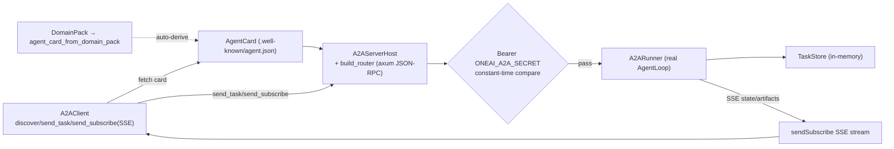

# OneAI A2A Mechanism

> Google A2A (Agent-to-Agent) open-protocol Rust SDK — client + axum JSON-RPC server host + DomainPack→AgentCard auto-exposure: lets a OneAI agent act both as a client (discover and delegate to remote agents) and as a server (expose its own capabilities to other agents); task-centric model, shared-secret Bearer auth (`ONEAI_A2A_SECRET`, constant-time compare, not JWT).

## 1. Overview (what it is)

`oneai-a2a` is the Rust implementation of the Google A2A open protocol. A2A solves "how do agents talk to each other" — not by sharing memory or a conversation, but with a task-centric model: the client discovers a remote agent's capabilities (`AgentCard`), creates a Task by sending a Message, the remote agent processes it and returns Artifacts. This crate provides both a client SDK (`A2AClient` — discover/send-task/streaming-subscribe) and a server host (`A2AServerHost` + axum JSON-RPC router that really runs the AgentLoop + `sendSubscribe` SSE streaming), and auto-derives an `AgentCard` from a `DomainPack`.

It sits in the feature layer, depending on `oneai-core` (`LlmProvider`/`Tool`), `oneai-domain` (`DomainPack`→`AgentCard`), and `oneai-gateway` (axum/HTTP base reuse). The a2a→gateway dep is axum/HTTP base reuse, not conceptual coupling. By discipline, push/resubscribe and a durable TaskStore were deferred (the gap P0 last-open item closed on "real AgentLoop run + SSE").

## 2. Responsibilities & capabilities (what it does)

**AgentCard interop.** `AgentCard` describes an agent's capabilities (skills, streaming support, auth); `agent_card_from_domain_pack` derives a card from a `DomainPack`; `well_known_agent_card` produces `.well-known/agent.json`; `parse_agent_card` (JSON/YAML).

**Client SDK.** `A2AClient` (`discover` fetches card / `send_task` / `get_task` with history / `cancel_task` / `send_subscribe` SSE streaming + `TaskStream`).

**Server host.** `A2AServerHost` (holds `AgentCard` + `TaskStore` + `A2ARunner`, `from_domain_pack` builds a server from a pack in one line, `well_known_card_json` honestly exposes capabilities) + `build_router` produces an axum router + shared-secret `secret_from_env` (`ONEAI_A2A_SECRET`) Bearer auth, constant-time compare.

**Real AgentLoop.** `A2ARunner` trait + a real runner that drives the AgentLoop to process tasks; `sendSubscribe` streams state/artifacts via SSE; `TaskOutcome`/`TaskState` state machine.

**Task store.** `TaskStore` (in-memory; disk persistence deferred by discipline) holds task lifecycle + state transitions.

**Explicitly does not**: no in-process conversational orchestration (that's GroupChat/`delegate`); no push/resubscribe (deferred); TaskStore is in-memory (deferred); no JWT (shared-secret Bearer, no JWT lib per supply-chain discipline); no LLM inference (the runner drives the AgentLoop).

## 3. Design motivation (why this way)

| Decision | Rationale | Rejected alternative |
|---|---|---|
| Task-centric, not conversation-centric | Inter-agent collaboration is "I delegate a task, you return a result", not an ongoing conversation; a Task is a first-class entity with a clear lifecycle (submitted/working/completed/failed/canceled), queryable and cancelable | Conversation-centric → implicit state, hard to query/cancel |
| Client + server in one crate | A OneAI agent is both an A2A client (delegate remotely) and a server (be delegated to); one crate keeps both protocol implementations consistent | Two crates → protocol drift between ends |
| `DomainPack`→`AgentCard` auto-derivation | Capabilities are already declared in the DomainPack's 7 layers; hand-writing a card would drift; auto-derivation keeps the card consistent with real capabilities (honest exposure) | Hand-written card → drifts from pack, lies about capabilities |
| Shared-secret Bearer, not JWT | A2A is trusted service-to-service; shared secret + constant-time compare is sufficient and simple; JWT needs a lib and heavier key management, declined per supply-chain discipline | JWT → supply-chain burden, over-engineering |
| `sendSubscribe` SSE streaming, not polling | Agent tasks can take long; polling wastes and lags; SSE streams state/artifacts in real time, and A2A supports it natively | Polling `get_task` → high latency, wasted traffic |
| Really runs the AgentLoop, not a mock | The server must actually process tasks; a mock is meaningless; the runner drives the real AgentLoop, same capabilities as local | Mock runner → server has no real capability |
| push/resubscribe + TaskStore-on-disk deferred | These are production-resilience features; gap P0 prioritized "real run + SSE" (the last open item), resilience deferred by discipline | All at once → slow P0 closure, high risk |
| `well_known_agent_card` honest exposure | The card must reflect real capabilities, not overclaim skills; `from_domain_pack` keeps it consistent | Overclaiming skills → client delegates and fails |

## 4. Architecture & core abstractions



**Core types:**

```rust
pub struct A2AClient { /* discover/send_task/get_task/cancel_task/send_subscribe */ }
pub struct A2AServerHost {
    agent_card: AgentCard, task_store: Arc<TaskStore>, runner: Arc<dyn A2ARunner>,
    pub fn from_domain_pack(domain: &DomainPack, url: &str) -> Self;
    pub fn well_known_card_json(&self) -> Result<String>;
}
pub trait A2ARunner: Send + Sync { /* really run the AgentLoop for a task */ }
pub fn secret_from_env() -> Option<String>;   // ONEAI_A2A_SECRET
pub fn build_router(state: A2AWebState) -> Router;   // axum JSON-RPC
```

## 5. Flows it participates in

**As a client (delegate to a remote agent):**

1. `A2AClient::new(agent_url)` → `discover()` fetches the remote `.well-known/agent.json` `AgentCard`; read its skills to judge capability.
2. `send_task(message)` creates a Task, returns `task_id`.
3. Short tasks: `get_task(task_id, history_length)` polls; long tasks: `send_subscribe(message)` streams state/Artifacts via SSE (`TaskStream`).
4. To interrupt: `cancel_task(task_id)`.

**As a server (expose capabilities):**

1. `A2AServerHost::from_domain_pack(domain, url)` builds a server from a pack (auto-derives card) + injects `A2ARunner` (real AgentLoop).
2. `build_router` starts an axum JSON-RPC service, mounting `/.well-known/agent.json`.
3. Each request verifies `Authorization: Bearer <ONEAI_A2A_SECRET>` (constant-time compare).
4. `send_task` flows router → handler → `A2ARunner` runs the AgentLoop; state/Artifacts stream back via `sendSubscribe` SSE, persisted in `TaskStore`.

## 6. Dependencies

| Direction | Who | What |
|---|---|---|
| Upstream | `oneai-core` | `LlmProvider`/`Tool`/`Conversation` |
| Upstream | `oneai-domain` | `DomainPack`→`AgentCard` auto-derivation |
| Upstream | `oneai-gateway` | axum/HTTP base reuse (code reuse, not conceptual coupling) |
| Upstream | `axum`/`reqwest`/`serde`/`tokio` | JSON-RPC server, HTTP client, SSE |
| Downstream | `oneai-app` | `AppBuilder` wires A2A server |
| Downstream | CLI | `oneai a2a serve/discover/list/send` |
| Cross-cutting | env | `ONEAI_A2A_SECRET` shared secret |
| Cross-cutting | DomainPack | `agent_card_from_domain_pack` auto-exposure |

## 7. Key types & files

| Item | Location |
|---|---|
| `AgentCard` + `agent_card_from_domain_pack`/`parse_agent_card`/`well_known_agent_card` | `crates/oneai-a2a/src/card.rs:45,150,158,170` |
| `A2AClient` (discover/send_task/get_task/cancel_task/send_subscribe) | `crates/oneai-a2a/src/client.rs:60,125,169,201,224,253` |
| `TaskStream` (SSE streaming) | `crates/oneai-a2a/src/client.rs:430` |
| `A2AServerHost` + `from_domain_pack` + `well_known_card_json` + `secret_from_env` | `crates/oneai-a2a/src/server.rs:66,109,133,145` |
| `build_router` (axum JSON-RPC) | `crates/oneai-a2a/src/server.rs:210` |
| `A2ARouter` + `A2AHandler` | `crates/oneai-a2a/src/router.rs:21` + `handler.rs` |
| `A2ARunner` trait + `TaskOutcome`/`TaskState` | `crates/oneai-a2a/src/runner.rs:36` |
| `TaskStore` (in-memory) | `crates/oneai-a2a/src/task_store.rs:40` |
| `A2AError` | `crates/oneai-a2a/src/error.rs:9` |
| transport | `crates/oneai-a2a/src/transport.rs` |
| types (Task/Message/Artifact) | `crates/oneai-a2a/src/types.rs` |

## 8. Industry comparison

| System | Model | OneAI's trade-off |
|---|---|---|
| **Google A2A** | Inter-agent open protocol (task-centric + AgentCard + JSON-RPC + SSE) | OneAI is a Rust SDK of this protocol; client + server in one crate; `DomainPack`→card auto-derivation |
| **MCP (Anthropic)** | Tool-exposure protocol (client/server) | A2A is inter-agent (task delegation); MCP is agent↔tool; OneAI implements both (see [mcp-mechanism](mcp-mechanism_EN.md)), complementary |
| **OpenAI Swarm** | Conversational handoff | A2A is protocol-level cross-process; Swarm is in-process conversational; OneAI uses `delegate` in-process, A2A cross-process |
| **LangGraph multi-agent** | Graph-orchestrated multi-agent | A2A does no orchestration, only inter-agent interop; OneAI orchestrates via StateGraph/`delegate`, A2A is out-of-process |

OneAI's distinct points: **client + server in one crate** (no protocol drift) + **DomainPack auto-derives AgentCard** (honest, no hand-writing) + **shared-secret Bearer, no JWT per supply-chain discipline**.

## 9. Extension points & config

- **As client**: `A2AClient::new(url)` + `with_headers`/`with_timeout`, `discover` → `send_task`/`send_subscribe`.
- **As server**: `A2AServerHost::from_domain_pack(domain, url)` + `with_runner` + `build_router`, or via `AppBuilder`.
- **Auth**: set `ONEAI_A2A_SECRET` env var (shared-secret Bearer).
- **Expose capabilities**: `DomainPack` auto-derives card, mounted at `.well-known/agent.json`.
- **CLI**: `oneai a2a serve/discover/list/send` (see [cli-reference](cli-reference_EN.md)).

## 10. Further reading

- [multi-agent-mechanism](multi-agent-mechanism_EN.md) — in-process `delegate` and GroupChat (A2A is the out-of-process peer)
- [domain-pack-mechanism](domain-pack-mechanism_EN.md) — `DomainPack`→`AgentCard` auto-derivation
- [gateway-mechanism](gateway-mechanism_EN.md) — axum/HTTP base reuse
- [tool-mechanism](tool-mechanism_EN.md) — the AgentLoop and tools the runner drives
- Source: `crates/oneai-a2a/src/` (11 files / ~4.8K LOC)
