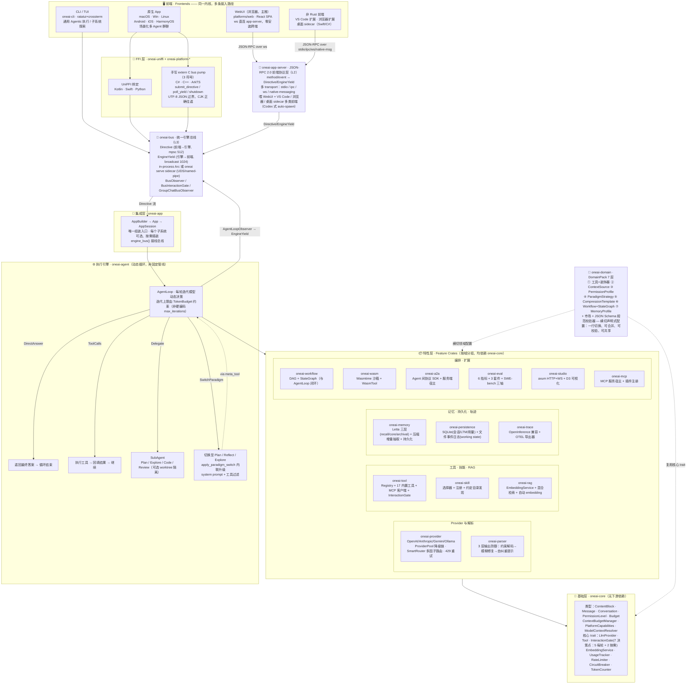

# OneAI 架构与技术设计

> One AI, Every Platform —— 一套 Rust 内核打到六端。本文是技术总览，入口在 [README](../README.md)。

OneAI 是一个用 Rust 编写的全栈 Agent 框架，提供构建、运行、评测 AI Agent 所需的一切：从 LLM Provider 抽象到工具执行、记忆管理、工作流编排、领域专属配置、多 Agent 协作、轨迹日志，全部支持跨平台。**LLM Provider 是可选的**——纯工具或纯工作流的使用无需 Provider。

## 设计原则

- **模块化** —— 31 个独立 crate，各司其职，按需使用。
- **类型安全** —— 密封枚举层级（公开枚举都加 `#[non_exhaustive]`）、trait 驱动抽象，无字符串配置。
- **统一引擎总线 + 前端协议三层** —— [oneai-bus](bus-mechanism.md) 是引擎与一切前端之间的唯一 seam：`Directive`（前端→引擎）+ `EngineYield`（引擎→前端）两通道，TUI / 六端原生 App / `oneai serve` sidecar 全走它，前端只当「Directive writer + Yield reader」。非 Rust 前端（IDE / web / TS-JS / 桌面 Swift·C#）不直说 newline-JSON，而经 [oneai-app-server](app-server-mechanism.md) 的 JSON-RPC 2.0 前端协议层（L2 适配器，映射到 L3 bus 的 Directive/EngineYield），一个引擎进程并发喂 [WebUI](webui-mechanism.md)（浏览器，零安装主推）/ VS Code / 浏览器 / macOS·Windows 桌面 sidecar 四类前端——`oneai web` 一行起引擎 + SPA + `/ws`。
- **领域可插拔** —— [DomainPack](domain-pack-mechanism.md) 让领域知识声明式、可组合、一行切换；可对照 JSON Schema 校验，并通过 pack 市场共享。
- **多 Agent 原生** —— 模型驱动的 SubAgent 分层委托（`delegate` 元工具，一轮多委托 + 依赖感知并行波次调度）+ 范式切换（`switch_paradigm` 进入 Plan/Reflect/Explore 图流）+ 引擎级 [GroupChat](multi-agent-mechanism.md) 原语驱动场景化多角色对话（群聊 yield 带 `speaker` 标签经 bus 发出）。
- **生产级基础设施** —— [ProviderPool](provider-mechanism.md) 降级链、SmartRouter 多因子路由、用量统计、限流、熔断、Token 感知的上下文管理。
- **跨平台** —— [UniFFI + 手写 extern "C" bus pump](cross-platform-mechanism.md) 支持 macOS / Windows / Linux / Android / iOS / HarmonyOS，同一套 Rust 内核；**正从 in-process FFI 迁向 JSON-RPC 2.0 / 分离进程**——桌面/IDE/web 走 `oneai app-server` sidecar（WebUI/VS Code/浏览器已全量、macOS opt-in），移动端 on-device 保留 in-process（C-ABI 表面已塌成 3 符号 bus pump，与 sidecar 同一 `Directive`/`EngineYield` 协议）。
- **可评测可自演进** —— 内置 [OpenInference 兼容轨迹](trace-mechanism.md) + 独立[评测框架](eval-mechanism.md)（6 指标、3 套件 + SWE-bench 三轴）+ [自演进外循环](self-evolution-mechanism.md)（GEPA 式在 pack/loop 配置空间变异 + Pareto 选择，不动权重）。
- **人机协作 + 沙箱** —— 高风险工具通过[原生 UI 对话框审批](permission-mechanism.md)；执行前的 Plan 模式审批门；`code_interpreter` / `shell` 在 Seatbelt（mac）/ Bubblewrap（linux）沙箱内执行，出网经本地 CONNECT 代理 + per-host 审批白名单。
- **动态 Agentic Loop** —— 不是固定管线；每轮迭代动态决策（直接回答 / 工具调用 / 委托子 Agent / 切换范式）。

## 依赖分层

下层 crate 不得依赖上层：

```
oneai-core                      基础：类型 + 核心 trait（无下游依赖）
      ↑
oneai-bus                       引擎↔前端协议（Directive/EngineYield + EngineBus，依赖 core）
      ↑
oneai-app-server                JSON-RPC 2.0 前端协议层（L2 适配器：method/event ↔ Directive/EngineYield，
                                多 transport stdio/ipc/ws/native-messaging，喂非 Rust 前端；依赖 bus + supervisor）
      ↑
oneai-provider / -parser / -memory / -tool / -skill / -rag
/ -workflow / -domain / -trace / -persistence / -a2a / -wasm
/ -eval / -studio / -mcp / -scheduler / -gateway / -supervisor / -vector   特性 crate（依赖 core）
      ↑
oneai-agent                     执行引擎：AgentLoop + 范式 + 委托（接 bus：BusObserver/BusInteractionGate）
      ↑
oneai-app                       集成层：AppBuilder → App → AppSession（唯一组装入口，engine_bus() 接线）
      ↑
oneai-uniffi + oneai-platform-* FFI / 原生平台适配（c_facade 3 符号 bus 泵 / oneai serve sidecar）
```

> `oneai-app-server` 位置特别：它在 bus 之上、特性 crate 之外，是「协议适配层」而非「特性层」——只把 JSON-RPC schema 映射到 bus 的 Directive/EngineYield，不含业务逻辑；CLI（`oneai app-server`）构建引擎后把 `Arc<InProcessBus>` 传给它的 `serve_all`。它依赖 `oneai-bus` + `oneai-supervisor`（取 `IpcListener`），不依赖 `oneai-app`。

集成入口是 **`oneai-app` 的 `AppBuilder`**（`crates/oneai-app/src/builder.rs`）。每个子系统都是可选的、通过 builder 方法插装（LLM Provider 也是可选的）。改子系统的构造或接线，这是唯一要动的地方。深入到贡献者级别的工作指引见 [CLAUDE.md](../CLAUDE.md)。

## 架构图



> 箭头方向 = 依赖 / 数据流向（上层依赖下层）。实线为编译期依赖与运行时调用，虚线为横切声明式配置。`oneai-domain` 不是某一层级，而是横切所有特性层的声明式配置层——`AppBuilder::domain_pack(...)` 一行即可切换整套领域行为。

## Crate 总览

| Crate | 说明 |
|-------|------|
| `oneai-core` | 核心类型、trait、PermissionLevel、Budget、PlatformCapabilities、ModelContextResolver |
| `oneai-bus` | 统一引擎↔前端协议 —— Directive/EngineYield + EngineBus（in-process + sidecar wire codec） |
| `oneai-app-server` | JSON-RPC 2.0 前端协议层（L2 适配器：method/event ↔ Directive/EngineYield，多 transport stdio/ipc/ws/native-messaging，喂 IDE/web/桌面四类非 Rust 前端） |
| `oneai-provider` | LLM Provider（OpenAI/Anthropic/Gemini/Ollama）+ ProviderPool + SmartRouter |
| `oneai-parser` | 3 层输出解析防御 |
| `oneai-memory` | 记忆系统（三层 + 压缩增量抽取 + 持久化，接 `oneai-vector` 默认栈） |
| `oneai-tool` | 工具注册、MCP 客户端、InteractionGate、执行器、17 内置工具 |
| `oneai-skill` | 技能选择器 + 注册 + 内置领域技能 + 生命周期 |
| `oneai-domain` | DomainPack 系统（7 层）、CodingPack、市场、规范校验器 |
| `oneai-agent` | AgentLoop + SubAgent + ReAct/Plan/Reflect/Explore + delegate/switch_paradigm 元工具 + GroupChat |
| `oneai-rag` | RAG + EmbeddingService（多 provider + auto 探测 + fallback） |
| `oneai-vector` | 默认检索栈 — InMemory/SqliteVec/usearch + Tantivy BM25 + BGE-M3/reranker + RRF |
| `oneai-workflow` | Workflow DAG + StateGraph + 编译器 + 执行器 |
| `oneai-scheduler` | 内存任务调度（cron/ISO/NL，CAS at-most-once） |
| `oneai-persistence` | SQLite（会话/LTM/用量）+ 文件事件日志（working state / 跨 session 续接） |
| `oneai-a2a` | A2A 协议 SDK — 客户端 + 服务端宿主 + DomainPack→AgentCard |
| `oneai-wasm` | WASM 沙箱引擎 — Wasmtime + WasmTool + 模块注册 |
| `oneai-eval` | 评测框架 — 用例/指标/Runner/3 套件 + SWE-bench 三轴 |
| `oneai-evolve` | 自演进外循环 — 轨迹采集→EDD 评分→子图诊断→GEPA 变异/Pareto 选择（不动权重，CLI 驱动） |
| `oneai-studio` | Studio Web UI — axum HTTP+WS + D3.js StateGraph 可视化 + Checkpoint 时间旅行 |
| `oneai-mcp` | MCP 服务生态 — 宿主 + 插件注册 + 配置 |
| `oneai-gateway` | 消息网关 — axum webhook + 飞书/企业微信/Loopback adapter |
| `oneai-supervisor` | headless 监督 daemon — 持久实例 + 崩溃恢复 + IPC |
| `oneai-app` | 应用集成层（AppBuilder + 默认检索栈接线） |
| `oneai-trace` | OpenInference 兼容轨迹日志器 + OTEL 导出 |
| `oneai-uniffi` | UniFFI 绑定定义 + 手写 `extern "C"` facade |
| `oneai-platform-desktop` | 桌面平台（macOS/Windows/Linux 原生 Gate） |
| `oneai-platform-android` | Android 平台（JNI 桥 + 原生 Gate） |
| `oneai-platform-ios` | iOS 平台 |
| `oneai-platform-harmony` | HarmonyOS 平台 |

> 全工作区约 2100 测试（以 `cargo test --workspace` 为准，逐 crate 计数易漂移故不列）。17 个内置工具（含 `code_interpreter` 沙箱化 CPython）。另有 `oneai-staticlib`（crate-type=staticlib 的打包 crate，排除在 `default-members` 之外，故不计入上表）。

## 模块设计文档索引

| 模块 | 文档 | 一句话 |
|---|---|---|
| 引擎总线 | [bus-mechanism.md](bus-mechanism.md) | Directive/EngineYield 协议 + in-process/sidecar 双形态 |
| App-Server | [app-server-mechanism.md](app-server-mechanism.md) | JSON-RPC 2.0 前端协议层 + 多 transport + 四类非 Rust 前端 |
| WebUI（浏览器前端）| [webui-mechanism.md](webui-mechanism.md) | React SPA + ws JSON-RPC + 投影/节流/场景 + `oneai web` 一行启动 |
| AgentLoop / 委托 / GroupChat | [multi-agent-mechanism.md](multi-agent-mechanism.md) | 动态循环 + 模型驱动委托 + 场景化多角色对话 |
| 记忆 | [memory-mechanism.md](memory-mechanism.md) | Letta 三层 + 压缩增量抽取 + 持久化 |
| 上下文管理 | [context-management-mechanism.md](context-management-mechanism.md) | 持久/瞬时分离装配 + token 预算 + 三层模型上下文解析 |
| Working State | [working-state-mechanism.md](working-state-mechanism.md) | 文件事件日志 + 投影 + 跨 session 续接 |
| DomainPack | [domain-pack-mechanism.md](domain-pack-mechanism.md) | 7 层声明式领域配置，一行切换 |
| 权限 / InteractionGate | [permission-mechanism.md](permission-mechanism.md) | 三级权限 + 7 决策点统一 gate（5 每轮 + 2 按需） |
| 工具系统 | [tool-mechanism.md](tool-mechanism.md) | Tool trait + 17 工具 + Footprint ladder + ToolExposure + 沙箱网络授权 |
| 技能 | [skill-mechanism.md](skill-mechanism.md) | 渐进式披露 + 约定目录发现 + 生命周期 + curator |
| Provider / 路由 / 解析器 | [provider-mechanism.md](provider-mechanism.md) | Provider 抽象 + 降级池 + SmartRouter + 3 层解析 |
| RAG / Embedding | [rag-mechanism.md](rag-mechanism.md) | EmbeddingService + auto 探测 + 默认检索栈 |
| 工作流 / StateGraph | [workflow-mechanism.md](workflow-mechanism.md) | DAG + 有环图，与 AgentLoop 闭环 |
| 评测 | [eval-mechanism.md](eval-mechanism.md) | Eval 框架 + SWE-bench 三轴 |
| 自演进 | [self-evolution-mechanism.md](self-evolution-mechanism.md) | GEPA 式外循环 + Pareto + 安全闸/回归闸 |
| A2A | [a2a-mechanism.md](a2a-mechanism.md) | Agent 间协议 SDK（客户端 + 服务端 + DomainPack→AgentCard） |
| WASM 沙箱 | [wasm-mechanism.md](wasm-mechanism.md) | Wasmtime 沙箱 + WasmTool + fuel/epoch 限量 |
| MCP | [mcp-mechanism.md](mcp-mechanism.md) | 服务宿主 + 客户端 + 插件注册 + OAuth/elicitation/lazy |
| Studio | [studio-mechanism.md](studio-mechanism.md) | axum HTTP+WS + D3 可视化 + 检查点时间旅行 |
| Scheduler | [scheduler-mechanism.md](scheduler-mechanism.md) | 内存计时器 + 持久 cron + CAS at-most-once |
| Gateway | [gateway-mechanism.md](gateway-mechanism.md) | 消息平台桥接（飞书/企微/Loopback）+ 流式 coalescer |
| Supervisor | [supervisor-mechanism.md](supervisor-mechanism.md) | headless daemon + 实例注册表 + 崩溃恢复 + IPC |
| 轨迹日志 | [trace-mechanism.md](trace-mechanism.md) | OpenInference 兼容 + OTEL 导出 |
| 持久化 | [persistence-mechanism.md](persistence-mechanism.md) | SQLite + 文件事件日志双通路 |
| 跨平台 | [cross-platform-mechanism.md](cross-platform-mechanism.md) | UniFFI + 3 符号 C-ABI bus pump，一套内核六端；正迁向 JSON-RPC 分离进程 |

> 演进背景与缺口分析见 [evolution-plan-2026-07.md](evolution-plan-2026-07.md) 与 [gap-analysis-2026-07.md](gap-analysis-2026-07.md)（内部规划文档）。
