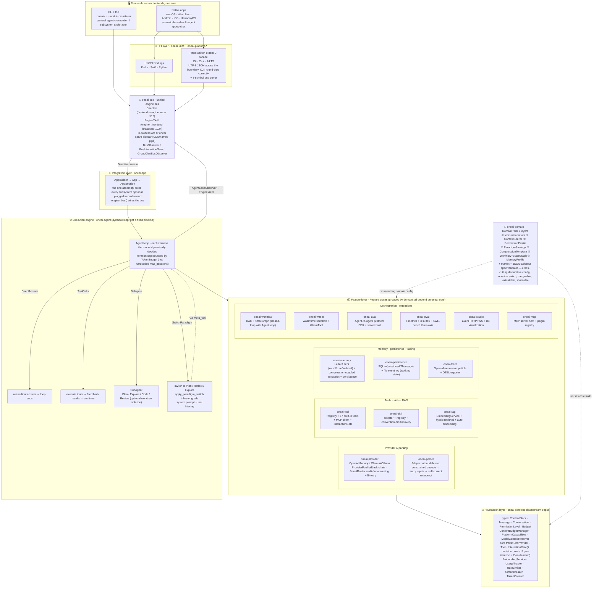

# OneAI Architecture & Technical Design

> One AI, Every Platform — one Rust core, six targets. This is the technical overview; the entry point is [README](../README_EN.md).

OneAI is a full-stack agent framework written in Rust, providing everything needed to build, run, and evaluate AI agents: from LLM-provider abstraction to tool execution, memory management, workflow orchestration, domain-specific config, multi-agent collaboration, and tracing — all cross-platform. **The LLM provider is optional** — tool-only or workflow-only usage needs no provider.

## Design principles

- **Modular** — 29 independent crates, each with one job, used on demand.
- **Type-safe** — sealed-enum hierarchies (every public enum is `#[non_exhaustive]`), trait-driven abstractions, no string-config.
- **Unified engine bus** — [oneai-bus](bus-mechanism_EN.md) is the single seam between the engine and every frontend: two channels `Directive` (frontend → engine) + `EngineYield` (engine → frontend). TUI / Studio web / six native apps / the `oneai serve` sidecar all consume it; a frontend is just a "Directive writer + Yield reader".
- **Domain-pluggable** — [DomainPack](domain-pack-mechanism_EN.md) makes domain knowledge declarative, composable, one-line-switchable; validatable against a JSON Schema and shareable via a pack market.
- **Natively multi-agent** — model-driven SubAgent hierarchical delegation (`delegate` meta-tool, multi-delegate per turn + dependency-aware parallel-wave scheduling) + paradigm switch (`switch_paradigm` into Plan/Reflect/Explore graph flows) + engine-level [GroupChat](multi-agent-mechanism_EN.md) primitive for scenario-based multi-role conversations (group-chat yields carry a `speaker` tag over the bus).
- **Production-grade infrastructure** — [ProviderPool](provider-mechanism_EN.md) fallback chain, SmartRouter multi-factor routing, usage tracking, rate limiting, circuit breaking, token-aware context management.
- **Cross-platform** — [UniFFI + hand-written extern "C" facade](cross-platform-mechanism_EN.md) for macOS / Windows / Linux / Android / iOS / HarmonyOS, one Rust core.
- **Evaluable & self-evolving** — built-in [OpenInference-compatible tracing](trace-mechanism_EN.md) + a standalone [eval framework](eval-mechanism_EN.md) (6 metrics, 3 suites + SWE-bench three-axis) + an [outer self-evolution loop](self-evolution-mechanism_EN.md) (GEPA-style mutation + Pareto selection over the pack/loop config space, no weight updates).
- **Human-in-the-loop & sandboxed** — high-risk tools gated by [native UI dialogs](permission-mechanism_EN.md); a Plan-mode approval gate before execution; `code_interpreter` / `shell` run inside a Seatbelt (mac) / Bubblewrap (linux) sandbox, with outbound network funnelled through a local CONNECT proxy + per-host approval allowlist.
- **Dynamic Agentic Loop** — not a fixed pipeline; each iteration dynamically decides (direct answer / tool call / delegate to a sub-agent / switch paradigm).

## Dependency layering

Lower crates must not depend on higher ones:

```
oneai-core                      foundation: types + core traits (no downstream deps)
      ↑
oneai-bus                       engine↔frontend protocol (Directive/EngineYield + EngineBus, depends on core)
      ↑
oneai-provider / -parser / -memory / -tool / -skill / -rag
/ -workflow / -domain / -trace / -persistence / -a2a / -wasm
/ -eval / -studio / -mcp / -scheduler / -gateway / -supervisor / -vector   feature crates (depend on core)
      ↑
oneai-agent                     execution engine: AgentLoop + paradigms + delegation (bus: BusObserver/BusInteractionGate)
      ↑
oneai-app                       integration layer: AppBuilder → App → AppSession (the one assembly point; engine_bus() wires the bus)
      ↑
oneai-uniffi + oneai-platform-* FFI / native adapters (c_facade 3-symbol bus pump / oneai serve sidecar)
```

The integration point is **`oneai-app`'s `AppBuilder`** (`crates/oneai-app/src/builder.rs`). Every subsystem is optional and plugged in via builder methods (the LLM provider included). When changing how a subsystem is constructed or wired, this is the single place to update. For contributor-grade working guidance see [CLAUDE.md](../CLAUDE.md).

## Architecture diagram



> Arrow direction = dependency / data flow (upper depends on lower). Solid lines are compile-time deps and runtime calls; dashed lines are cross-cutting declarative config. `oneai-domain` is not a layer but a declarative-config layer cross-cutting all feature layers — `AppBuilder::domain_pack(...)` switches the whole domain behavior in one line.

## Crate map

| Crate | Description |
|-------|------|
| `oneai-core` | Core types, traits, PermissionLevel, Budget, PlatformCapabilities, ModelContextResolver |
| `oneai-bus` | Unified engine↔frontend protocol — Directive/EngineYield + EngineBus (in-process + sidecar wire codec) |
| `oneai-provider` | LLM provider (OpenAI/Anthropic/Gemini/Ollama) + ProviderPool + SmartRouter |
| `oneai-parser` | 3-layer output-parser defense |
| `oneai-memory` | Memory system (3 tiers + compression-coupled extraction + persistence, wired to the `oneai-vector` default stack) |
| `oneai-tool` | Tool registry, MCP client, InteractionGate, executor, 17 built-in tools |
| `oneai-skill` | Skill selector + registry + built-in domain skills + lifecycle |
| `oneai-domain` | DomainPack system (7 layers), CodingPack, market, spec validator |
| `oneai-agent` | AgentLoop + SubAgent + ReAct/Plan/Reflect/Explore + delegate/switch_paradigm meta-tools + GroupChat |
| `oneai-rag` | RAG + EmbeddingService (multi-provider + auto-probe + fallback) |
| `oneai-vector` | Default retrieval stack — InMemory/SqliteVec/usearch + Tantivy BM25 + BGE-M3/reranker + RRF |
| `oneai-workflow` | Workflow DAG + StateGraph + compiler + executor |
| `oneai-scheduler` | In-memory task scheduling (cron/ISO/NL, CAS at-most-once) |
| `oneai-persistence` | SQLite (sessions/LTM/usage) + file event log (working state / cross-session continuation) |
| `oneai-a2a` | A2A protocol SDK — client + server host + DomainPack→AgentCard |
| `oneai-wasm` | WASM sandbox engine — Wasmtime + WasmTool + module registry |
| `oneai-eval` | Eval framework — cases/metrics/Runner/3 suites + SWE-bench three-axis |
| `oneai-evolve` | Self-evolution outer loop — trajectory collection → EDD scoring → subgraph diagnosis → GEPA mutation/Pareto selection (no weight updates, CLI-driven) |
| `oneai-studio` | Studio Web UI — axum HTTP+WS + D3.js StateGraph visualization + Checkpoint time-travel |
| `oneai-mcp` | MCP ecosystem — host + plugin registry + config |
| `oneai-gateway` | Message gateway — axum webhook + Feishu/WeChat/Loopback adapters |
| `oneai-supervisor` | headless supervisor daemon — persistent instances + crash recovery + IPC |
| `oneai-app` | Application integration layer (AppBuilder + default retrieval-stack wiring) |
| `oneai-trace` | OpenInference-compatible trace logger + OTEL export |
| `oneai-uniffi` | UniFFI binding defs + hand-written `extern "C"` facade |
| `oneai-platform-desktop` | Desktop platform (macOS/Windows/Linux native gate) |
| `oneai-platform-android` | Android platform (JNI bridge + native gate) |
| `oneai-platform-ios` | iOS platform |
| `oneai-platform-harmony` | HarmonyOS platform |

> The whole workspace has roughly 2100 tests (per `cargo test --workspace`; per-crate counts drift so they're not listed). 17 built-in tools (including the sandboxed-CPython `code_interpreter`). There's also `oneai-staticlib` (a crate-type=staticlib packaging crate, excluded from `default-members`, so not counted above).

## Module design-doc index

| Module | Doc | One-liner |
|---|---|---|
| Engine bus | [bus-mechanism_EN.md](bus-mechanism_EN.md) | Directive/EngineYield protocol + in-process/sidecar dual form |
| AgentLoop / delegation / GroupChat | [multi-agent-mechanism_EN.md](multi-agent-mechanism_EN.md) | Dynamic loop + model-driven delegation + scenario multi-role chat |
| Memory | [memory-mechanism_EN.md](memory-mechanism_EN.md) | Letta 3 tiers + compression-coupled extraction + persistence |
| Context management | [context-management-mechanism_EN.md](context-management-mechanism_EN.md) | Durable/ephemeral separation + token budget + 3-layer model-context resolution |
| Working state | [working-state-mechanism_EN.md](working-state-mechanism_EN.md) | File event log + projection + cross-session continuation |
| DomainPack | [domain-pack-mechanism_EN.md](domain-pack-mechanism_EN.md) | 7-layer declarative domain config, one-line switch |
| Permissions / InteractionGate | [permission-mechanism_EN.md](permission-mechanism_EN.md) | 3-tier permissions + unified 7-point gate (5 per-iteration + 2 on-demand) |
| Tool system | [tool-mechanism_EN.md](tool-mechanism_EN.md) | Tool trait + 17 tools + Footprint ladder + ToolExposure + sandboxed egress |
| Skill | [skill-mechanism_EN.md](skill-mechanism_EN.md) | Progressive disclosure + convention discovery + lifecycle + curator |
| Provider / routing / parser | [provider-mechanism_EN.md](provider-mechanism_EN.md) | Provider abstraction + fallback pool + SmartRouter + 3-layer parser |
| RAG / Embedding | [rag-mechanism_EN.md](rag-mechanism_EN.md) | EmbeddingService + auto-probe + default retrieval stack |
| Workflow / StateGraph | [workflow-mechanism_EN.md](workflow-mechanism_EN.md) | DAG + cyclic graph, closed-loop with AgentLoop |
| Eval | [eval-mechanism_EN.md](eval-mechanism_EN.md) | Eval framework + SWE-bench three-axis |
| Self-evolution | [self-evolution-mechanism_EN.md](self-evolution-mechanism_EN.md) | GEPA-style outer loop + Pareto + safety/regression gates |
| A2A | [a2a-mechanism_EN.md](a2a-mechanism_EN.md) | Inter-agent protocol SDK (client + server + DomainPack→AgentCard) |
| WASM sandbox | [wasm-mechanism_EN.md](wasm-mechanism_EN.md) | Wasmtime sandbox + WasmTool + fuel/epoch limiting |
| MCP | [mcp-mechanism_EN.md](mcp-mechanism_EN.md) | Server host + client + plugin registry + OAuth/elicitation/lazy |
| Studio | [studio-mechanism_EN.md](studio-mechanism_EN.md) | axum HTTP+WS + D3 visualization + checkpoint time-travel |
| Scheduler | [scheduler-mechanism_EN.md](scheduler-mechanism_EN.md) | In-memory timers + durable cron + CAS at-most-once |
| Gateway | [gateway-mechanism_EN.md](gateway-mechanism_EN.md) | Message-platform bridge (Feishu/WeChat/Loopback) + streaming coalescer |
| Supervisor | [supervisor-mechanism_EN.md](supervisor-mechanism_EN.md) | Headless daemon + instance registry + crash recovery + IPC |
| Tracing | [trace-mechanism_EN.md](trace-mechanism_EN.md) | OpenInference-compatible + OTEL export |
| Persistence | [persistence-mechanism_EN.md](persistence-mechanism_EN.md) | SQLite + file event log, two paths |
| Cross-platform | [cross-platform-mechanism_EN.md](cross-platform-mechanism_EN.md) | UniFFI + extern C facade, one core six targets |

> Evolution background and gap analysis in [evolution-plan-2026-07.md](evolution-plan-2026-07.md) and [gap-analysis-2026-07.md](gap-analysis-2026-07.md) (Chinese — internal planning docs).
