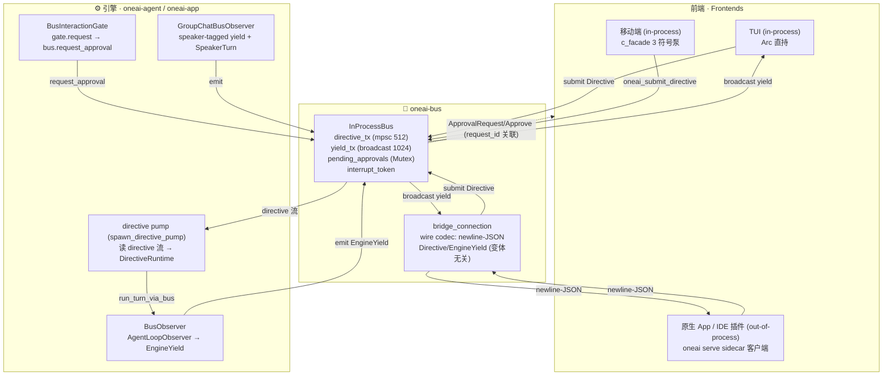

# OneAI 引擎总线机制

> `oneai-bus` —— 引擎与一切前端之间的唯一 seam：`Directive`（前端→引擎）+ `EngineYield`（引擎→前端）两个通道，把 TUI 直连、Studio WebSocket、A2A JSON-RPC+SSE、Supervisor 换行-JSON IPC 这四条并行线收敛成一套协议。前端只当「Directive writer + Yield reader」，in-process 或经 `oneai serve` sidecar 跨 UDS/named-pipe 都成立。

## 1. 概述（是什么）

`oneai-bus` 是 OneAI 引擎与前端之间的统一总线。在它之前，OneAI 有四条互不收敛的前端通路：TUI 直连 `AppSession`、Studio 走 WebSocket 广播、A2A 走 JSON-RPC + SSE、Supervisor 走换行分隔 JSON 的 IPC——每条都各自定义事件形状与审批回路。`oneai-bus` 把它们收敛成一个协议：前端写 [`Directive`]、读 [`EngineYield`]，引擎反之。

> 非同一语言的前端（IDE 插件 / web / TS-JS / 桌面 macOS-Swift·Windows-C#）不直接说 newline-JSON——它们说 [`oneai-app-server`](app-server-mechanism.md) 的 JSON-RPC 2.0 前端协议（L2 适配器，映射到本层 `Directive`/`EngineYield`）。本层（L3）仍是内部 canonical；TUI in-process 直连，跳过 L2 零序列化；`oneai serve` 的 newline-JSON passthrough 降为选配 escape hatch。

它在依赖分层里位置很特别：只依赖 `oneai-core`（一个无下游依赖的 crate），却被 `oneai-agent`（引擎侧 `BusObserver`/`BusInteractionGate`）与 `oneai-uniffi`/`oneai-app`（前端侧 c_facade 泵、`oneai serve` sidecar）共同消费。这是因为它是「协议 crate」——类型必须对所有上下游都可见，而协议本身只引用 `oneai-core` 的 `Serialize` 类型（`ContentBlock`/`InteractionRequest`/`ToolOutput` 等），不引用 `oneai-agent` 的类型（那些以 DTO 投影形式重新定义在本 crate，agent 侧提供 `From` 转换）。

两个枚举都标 `#[non_exhaustive]`：新变体可在小版本里加而不破坏消费者（承 v0.2.0 / 1.x 稳定承诺，P3-1），wire 消费者必须优雅处理未知变体。

## 2. 职责与能力（做什么）

**两条通道。** `directive`——`mpsc::Sender<Directive>`（bounded 512），前端提交、引擎 driver 读；`yield`——`broadcast::Sender<EngineYield>`（1024），引擎发、每个前端各订阅一个 receiver，落后的 receiver 会 `Lagged` 丢事件（codex 用无界，OneAI 封顶以约束高频流式下的内存）。

**Directive 全变体。** 控制类（`Approve`/`Interrupt`）由总线**自解**——`Approve` 按 `request_id` 找到 pending oneshot 并 fulfill，`Interrupt` fire 引擎 turn 开始时注册的 `CancellationToken`；其余（`UserMessage`/`SwitchParadigm`/`UpdateConfig`/`Compact`/`InitProject`/`CreateSession`/`LoadSession`/`ClearSession`/`DeleteSession`/`Init`/`Shutdown` + 群聊 `StartGroupChat`/`GroupStart`/`GroupUserMessage`/`GroupSetScriptedOrder`）转发给引擎 driver 的 directive 流。

**EngineYield 全变体 1:1 映射 `AgentLoopObserver` 回调**：`TurnStart`/`IterationStart`/`StreamChunk`/`Thinking`/`DirectAnswer`/`ToolCalls`/`ToolResult`/`Delegate`/`DelegateComplete`/`ParadigmSwitch`/`ApprovalRequest`/`WorkingState`/`ContextAccounting`/`PlanUpdate`/`ToolsAdded`/`TokenUsage`/`Error`/`TurnComplete` + 会话生命周期 `SessionCreated`/`SessionLoaded`/`SessionCleared`/`SessionDeleted`/`SessionEnded` + `/init`·`/compact` 结果 `InitResult`/`CompactResult`。`BusObserver` 把每个回调翻译成一个 yield 同步发出去（`broadcast::send` 是同步的，故能从 `AgentLoop` 调的同步 observer 方法里直发）。

**群聊 `speaker` 标签。** 所有「fragment」变体（`StreamChunk`/`Thinking`/`DirectAnswer`/`ToolCalls`/`ToolResult`/`Delegate`/`DelegateComplete`）带 `speaker: Option<String>`——群聊回合里是 member id，单 agent 路径恒 `None`（序列化为 `"speaker":null`，两端同版本故字段恒在；老前端忽略多余键）。群聊还多发 `SpeakerTurn`（某成员回合开始），让前端能正确给气泡配对。`GroupChatBusObserver` 负责这套带标 yield。

**审批关联。** 引擎调 [`EngineBus::request_approval(req)`]：总线分配 `request_id`（`apr_N`），建 oneshot、登记进 `pending_approvals`，广播 `EngineYield::ApprovalRequest{request_id, request}`，然后 await oneshot。前端读到这条 yield 后提交 `Directive::Approve{request_id, response}`，总线按 id 取出 oneshot 并 fulfill。这把审批统一到两条通道——不再有 per-frontend 的 ad-hoc mpsc（取代了 `ChannelInteractionGate` 的 per-request oneshot 面）。

**中断。** 引擎在每个 turn 开始调 [`EngineBus::register_interrupt(token)`] 注册 `CancellationToken`；前端提交 `Directive::Interrupt{reason}`，总线 `token.cancel()`，在迭代边界生效。

**显式不做什么**：不定义 `Directive::Init` 的引擎构建逻辑（那是 c_facade 泵的活，泵在总线转发前拦截 `Init`）；不解析 LLM 输出；不持有会话状态——yield 是事件流，状态归 `AppSession`/`GroupChatSession`；sidecar 的 wire bridge 不 inspect payload（变体无关，故 approval 关联与 interrupt 跨线不变）。

## 3. 设计动机（为什么这样实现）

| 决策 | 理由 | 否决的替代方案 |
|---|---|---|
| 取名 `Directive`/`EngineYield` 而非 codex `Op`/`Event` | `Directive` 强调「引擎必须执行的控制指令」，避 `Command`(CLI)/`Request`(`InteractionRequest`)/`Intent`(Android)；`EngineYield` 是 Directive 的对偶——引擎「让出」什么，避 `Event`(codex+`TaskEvent`)/`Signal`(unix)/`Emission`(中文「排放物」联想)。`yield` 是 Rust 保留字，故枚举类型名 `EngineYield` 而通道/字段仍叫 `yield` | 直接套 codex `Op`/`Event` → 语义混淆、与既有 `TaskEvent`/`InteractionRequest` 撞名 |
| 两条通道（directive mpsc + yield broadcast） | 入站需 back-pressure（前端别盖过引擎）→ bounded mpsc；出站需多订阅者（多个前端同时看）→ broadcast。对偶 codex submission/event | 单通道双向 → 审批关联与背压都难表达 |
| 控制类（`Approve`/`Interrupt`）由总线自解 | 这两条是「对总线状态的操作」而非「对引擎的指令」——前者解 pending oneshot、后者 fire cancel token，都在总线内部状态里，转发给引擎反而绕路 | 全转发给引擎 driver → 引擎要反向调总线 API 解自己发出的审批，循环 |
| `EngineYield` 1:1 映射 `AgentLoopObserver` | 引擎已有的回调面是同步的、粒度对前端正好；把回调翻成 yield 是机械活，复用既有面 | 新定义一套引擎产出 API → 引擎要双写、漂移 |
| `speaker` 字段加在所有 fragment 变体 | 群聊要把每个成员的流式片段归属到 member，单 agent 路径恒 None；两端同版本故字段恒在 wire 上，老前端忽略多余键即可 | 群聊单开一套 yield 变体 → 枚举翻倍、前端要双路径 |
| `#[non_exhaustive]` 两枚举 + wire 消费者必须处理未知变体 | 协议会随前端需求长变体；稳定承诺下不能每加一个变体就 break 老前端 | 密封枚举 → 每加变体破坏下游 |
| 协议 crate 只依赖 `oneai-core` | 协议类型要对 agent/app/uniffi 都可见；只引 core 的 `Serialize` 类型，agent 侧类型用 DTO 投影 + `From` 转换，依赖方向干净 | 依赖 `oneai-agent` → app/uniffi 反向依赖 agent，分层破 |
| in-process `Arc<InProcessBus>` 与 sidecar wire 共用 `bridge_connection` | 同一 `EngineBus` 抽象两种形态：in-process 直发 broadcast，sidecar 把 broadcast drain 成 newline-JSON 写线；引擎代码无感 | 两套实现 → 协议漂移 |
| 收敛四条并行线到一套协议 | TUI 直连/Studio WS/A2A JSON-RPC+SSE/Supervisor IPC 各定义事件形状与审批回路，维护漂移、新前端要重复接四套 | 保留四条 → 每加一个前端重做协议适配 |

## 4. 架构与核心抽象



核心 trait 与类型：

```rust
#[async_trait]
pub trait EngineBus: Send + Sync {
    async fn submit(&self, directive: Directive) -> Result<()>;        // 控制类自解，余转发
    fn subscribe_yields(&self) -> broadcast::Receiver<EngineYield>;
    fn emit(&self, y: EngineYield) -> Result<()>;                       // 同步——从 sync observer 直发
    async fn request_approval(&self, req: InteractionRequest) -> Result<InteractionResponse>;
    fn register_interrupt(&self, token: CancellationToken);
}

pub struct InProcessBus {
    directive_tx: mpsc::Sender<Directive>,
    yield_tx: broadcast::Sender<EngineYield>,
    pending_approvals: Mutex<HashMap<String, oneshot::Sender<InteractionResponse>>>,
    next_request_id: AtomicU64,
    interrupt_token: Mutex<Option<CancellationToken>>,
}
```

## 5. 参与的流程

**in-process turn（TUI）。**
1. `AppBuilder::engine_bus()` 返 `(builder, directive_rx)`——同时装 `BusInteractionGate` 进 `App`、把 bus 存上 builder。
2. 前端持 `Arc<InProcessBus>`，`subscribe_yields()` 拿 receiver，`submit(Directive::UserMessage{…})` 提交。
3. `spawn_directive_pump(directive_rx, runtime, interrupt_slot, bus)` 起 pump：读 directive 流，调 `DirectiveRuntime::run_turn`（单 agent）或 group 方法。
4. pump 造 `BusObserver{bus, turn_id}`，调 `session.run_turn_via_bus(task, slot)`——引擎跑 `AgentLoop`，每个 observer 回调被 `BusObserver` 翻成一个 `EngineYield` 经 `bus.emit` 发出。
5. 前端 drain `receiver.recv()` 渲染。`TurnComplete` 后本轮结束。

**sidecar turn（原生 App）。** `oneai serve`（`examples/cli/src/cmd_serve.rs`）起一个 `AppSession` + `EngineBus`，监听 UDS（Unix）/ named pipe（Win）socket `~/.oneai/serve.sock`。每个连接跑 `bridge_connection(stream, bus)`：yield forwarder（`bus.subscribe_yields()` → 每条 yield 序列化成一行 JSON 写回）与 directive reader（读一行 → `parse_directive` → `bus.submit`）并发跑，任一端关闭即拆。原生前端是 socket 上的 Directive writer + Yield reader（`examples/native/{macos,windows}/OneAIBusClient.*`，newline-JSON passthrough）。区别于 `oneai supervisor serve`：supervisor 是实例注册 RPC（request/response `spawn/list/stop`），sidecar 是双向并发总线（任意时 directive ↔ 任意时 yield + 审批 `request_id` 关联），用分离 socket 故两者共存。

> **`oneai app-server`（推荐）** 是 sidecar 的 JSON-RPC 2.0 升级版——同一引擎 + bus，但 wire 讲 JSON-RPC 前端协议（`turn/run`/`event`/…），喂 IDE/web/桌面四类非 Rust 前端，见 [app-server-mechanism.md](app-server-mechanism.md)。`oneai serve` 的 newline-JSON passthrough 降为选配 escape hatch；TUI in-process 不变。

**审批回路。** 引擎遇需审批的工具/计划 → `BusInteractionGate::request(req)` → `bus.request_approval(req)`：分配 `apr_N`、登记 oneshot、广播 `ApprovalRequest{request_id, req}`、await。前端读到后提交 `Approve{request_id, response}`，总线按 id fulfill oneshot，引擎 `request_approval` 返回 `response`。in-process 同步前端可用 `InProcessBus::resolve_approval(id, resp)`（不经 async `submit`）。

**中断。** 引擎 turn 开始 `bus.register_interrupt(token)`；前端 `Directive::Interrupt{reason}` → `token.cancel()` → 迭代边界生效（同 `AgentLoop` 的 `CancellationToken` 机制）。

**群聊。** `Directive::StartGroupChat{scenario}` 建多 agent `GroupChatSession`；`GroupStart` 跑 opener；`GroupUserMessage{user_input}` 按轮次策略跑到用户回合；`GroupSetScriptedOrder{order}` 运行时换固定顺序。引擎经 `GroupChatBusObserver` 把每个成员的回合发 `SpeakerTurn{speaker}` + 带标 fragment yield；单 agent 路径从不开 `SpeakerTurn`，fragment 的 `speaker` 恒 None。

## 6. 依赖关系

| 方向 | 谁 | 内容 |
|---|---|---|
| 上游 | `oneai-core` | `ContentBlock`/`InteractionRequest`/`InteractionResponse`/`InterruptReason`/`TaskEventPayload`/`ToolOutput`/`ContextAccounting`/`Message`（均 `Serialize`/`Deserialize`，直接引用非 DTO 投影）|
| 上游 | `tokio`/`tokio-util`/`serde`/`async-trait`/`thiserror` | 通道、CancellationToken、序列化、trait、错误 |
| 下游 | `oneai-agent` | `BusObserver`/`BusInteractionGate`/`GroupChatBusObserver`（`AgentLoopObserver`→`EngineYield` + gate→`request_approval`）|
| 下游 | `oneai-app` | `AppBuilder::engine_bus()` + `spawn_directive_pump` + `AppSession::run_turn_via_bus` + `DirectiveRuntime` trait |
| 下游 | `oneai-uniffi` | c_facade 3 符号泵（`Directive::Init` 建引擎、`oneai_submit_directive`、`oneai_poll_yield`）+ `CFacadeRuntime: DirectiveRuntime` |
| 下游 | `examples/cli` | `oneai serve` sidecar（`bridge_connection` over `IpcListener`）|

## 7. 关键类型与文件

| 项 | 位置 |
|---|---|
| crate doc + 导出 + `BusError` | `crates/oneai-bus/src/lib.rs:1,41,56` |
| `Directive`（17 变体）+ `EngineYield`（30 变体）+ DTO（`BusEngineConfig`/`BusGroupScenario`/`BusAgentSpec`…）| `crates/oneai-bus/src/protocol.rs:242,321` |
| `EngineBus` trait + `InProcessBus` + `resolve_approval` | `crates/oneai-bus/src/bus.rs:42,77,222` |
| `bridge_connection` wire bridge + `forward_yields`/`read_directives` | `crates/oneai-bus/src/serve.rs:41,74,102` |
| newline-JSON codec（`parse_directive`/`serialize_yield`…）| `crates/oneai-bus/src/wire.rs` |
| `BusObserver`（AgentLoopObserver→EngineYield + `From` DTO 转换）| `crates/oneai-agent/src/bus_observer.rs:91` |
| `BusInteractionGate`（gate→`bus.request_approval` + `enabled` 关 PreInfer/PostInfer）| `crates/oneai-agent/src/bus_interaction_gate.rs:24` |
| `GroupChatBusObserver`（speaker-tagged yield + `SpeakerTurn`）| `crates/oneai-agent/src/group_chat_bus_observer.rs` |
| `run_turn_via_bus` | `crates/oneai-app/src/session.rs:1477` |
| `spawn_directive_pump` + `DirectiveRuntime` trait | `crates/oneai-app/src/directive_pump.rs:165` |
| `AppBuilder::engine_bus()` | `crates/oneai-app/src/builder.rs:488` |
| c_facade 3 符号泵 + `CFacadeRuntime` | `crates/oneai-uniffi/src/c_facade.rs:1,261` |
| `oneai serve` sidecar | `examples/cli/src/cmd_serve.rs:1` |

## 8. 与业界对比

| 系统 | 模型 | OneAI 取舍 |
|---|---|---|
| **codex** | `Op`/`Event` + submission/event 队列 | OneAI 借鉴双通道结构，但重命名 `Directive`/`EngineYield`（语义更准、避撞名）；yield 通道封顶 1024 broadcast 而非无界；审批用 `request_id` 关联而非独立通道 |
| **LSP** | JSON-RPC request/response + notification | OneAI 的 directive/yield 是异步流而非严格 req/resp（一轮 turn 产生 N 个 yield），审批是少数阻塞点；sidecar wire 借 newline-JSON 帧 |
| **Tauri IPC** | invoke(command) 单向 RPC | OneAI 是双向并发流（任意时 directive ↔ 任意时 yield），且 approval/interrupt 跨线不变；不止 request/response |
| **既有 OneAI 多线（Studio WS / A2A JSON-RPC+SSE / Supervisor IPC）** | 各自定义事件 + 审批回路 | OneAI 收敛成一套——新前端只需 impl Directive writer + Yield reader，不再适配四套协议 |

OneAI 独特点：**一套协议双形态**（in-process `Arc<InProcessBus>` ↔ sidecar newline-JSON，引擎无感）+ **审批/中断内建进协议**（`request_id` 关联 + `CancellationToken`，跨线不变）+ **群聊 `speaker` 标签**让多角色流式片段可归属——多数总线只管单 agent。

## 9. 扩展点与配置

- **in-process 接线**：`AppBuilder::engine_bus()` 返 `(builder, directive_rx)`，`spawn_directive_pump` 起 pump，`session.run_turn_via_bus(task, slot)` 跑回合。
- **sidecar**：`oneai serve [--socket ~/.oneai/serve.sock]`；原生前端连 socket，写 `Directive` JSON 行、读 `EngineYield` JSON 行。
- **移动端 in-process**：c_facade 3 符号泵——`Directive::Init{config}` 首调建引擎+bus+pump（`OnceLock`），`oneai_submit_directive` 提交，`oneai_poll_yield` 拉输出。
- **加新 Directive 变体**：在 `protocol.rs` 加变体（`#[non_exhaustive]` 允许），更新 `InProcessBus::submit` 的转发分支（控制类 vs 转发类），pump 的 `DirectiveRuntime` 加 arm。
- **加新 EngineYield 变体**：在 `protocol.rs` 加，`BusObserver` 加对应 observer 回调翻译；wire 消费者靠 `#[non_exhaustive]` 优雅处理。
- **自定义审批 UI**：前端订阅 yield，遇 `ApprovalRequest{request_id, request}` 弹原生对话框，回 `Directive::Approve{request_id, response}`。

## 10. 深入阅读

- [architecture.md — 依赖分层 / 架构图](architecture.md) —— bus 在分层与图里的位置
- [permission-mechanism.md](permission-mechanism.md) —— `BusInteractionGate` 作为 gate 实现之一 + 7 决策点
- [multi-agent-mechanism.md](multi-agent-mechanism.md) —— GroupChat + `GroupChatBusObserver` 的 speaker 标签
- [cross-platform-mechanism.md](cross-platform-mechanism.md) —— c_facade 3 符号泵与 `oneai serve` 的端侧对接
- [cli-reference.md](cli-reference.md) —— `oneai serve` 子命令
- 源码：`crates/oneai-bus/src/`（5 文件）+ `crates/oneai-agent/src/{bus_observer,bus_interaction_gate,group_chat_bus_observer}.rs` + `crates/oneai-app/src/{directive_pump,session,builder}.rs` + `examples/cli/src/cmd_serve.rs`
