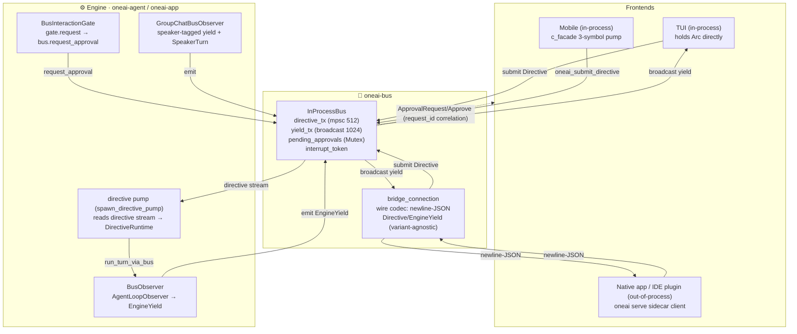

# OneAI Engine Bus Mechanism

> `oneai-bus` — the single seam between the engine and every frontend: two channels `Directive` (frontend → engine) + `EngineYield` (engine → frontend), collapsing four parallel wires (TUI direct-drive, Studio WebSocket, A2A JSON-RPC+SSE, Supervisor newline-JSON IPC) into one protocol. A frontend is just a "Directive writer + Yield reader", in-process or over the `oneai serve` sidecar on UDS/named-pipe.

## 1. Overview (what it is)

`oneai-bus` is the unified bus between the OneAI engine and frontends. Before it, OneAI had four non-converging frontend paths: the TUI drove `AppSession` directly, Studio broadcast over WebSocket, A2A used JSON-RPC + SSE, and Supervisor used newline-delimited JSON over IPC — each defining its own event shape and approval loop. `oneai-bus` collapses them into one protocol: a frontend writes [`Directive`]s and reads [`EngineYield`]s; the engine does the reverse.

Its place in the dependency layering is unusual: it depends only on `oneai-core` (a no-downstream-deps crate), yet is consumed by both `oneai-agent` (engine side: `BusObserver`/`BusInteractionGate`) and `oneai-uniffi`/`oneai-app` (frontend side: the c_facade pump, the `oneai serve` sidecar). That is because it is a *protocol crate* — its types must be visible to all upstream/downstream, but the protocol references only `oneai-core`'s `Serialize` types (`ContentBlock`/`InteractionRequest`/`ToolOutput` …), never `oneai-agent`'s types (those are re-defined here as serializable DTO projections; the agent side provides `From` conversions).

Both enums are `#[non_exhaustive]`: new variants may be added in a minor version without breaking consumers (per the v0.2.0 / 1.x stability commitment, P3-1); wire consumers must handle unknown variants gracefully.

## 2. Responsibilities (what it does)

**Two channels.** `directive` — `mpsc::Sender<Directive>` (bounded 512), frontends submit / engine driver reads; `yield` — `broadcast::Sender<EngineYield>` (1024), engine emits / each frontend subscribes its own receiver, lagging receivers see `Lagged` (codex uses unbounded; OneAI caps to bound memory under high-frequency streaming).

**Directive variants.** Control directives (`Approve`/`Interrupt`) are **resolved by the bus itself** — `Approve` looks up the pending oneshot by `request_id` and fulfills it, `Interrupt` fires the `CancellationToken` the engine registered at turn start; the rest (`UserMessage`/`SwitchParadigm`/`UpdateConfig`/`Compact`/`InitProject`/`CreateSession`/`LoadSession`/`ClearSession`/`DeleteSession`/`Init`/`Shutdown` plus group-chat `StartGroupChat`/`GroupStart`/`GroupUserMessage`/`GroupSetScriptedOrder`) are forwarded to the engine driver's directive stream.

**EngineYield variants map 1:1 to `AgentLoopObserver` callbacks**: `TurnStart`/`IterationStart`/`StreamChunk`/`Thinking`/`DirectAnswer`/`ToolCalls`/`ToolResult`/`Delegate`/`DelegateComplete`/`ParadigmSwitch`/`ApprovalRequest`/`WorkingState`/`ContextAccounting`/`PlanUpdate`/`ToolsAdded`/`TokenUsage`/`Error`/`TurnComplete` + session lifecycle `SessionCreated`/`SessionLoaded`/`SessionCleared`/`SessionDeleted`/`SessionEnded` + `/init`·`/compact` results `InitResult`/`CompactResult`. `BusObserver` translates each callback into a yield and emits it synchronously (`broadcast::send` is sync, so it works from the sync observer methods `AgentLoop` calls).

**Group-chat `speaker` tag.** Every "fragment" variant (`StreamChunk`/`Thinking`/`DirectAnswer`/`ToolCalls`/`ToolResult`/`Delegate`/`DelegateComplete`) carries `speaker: Option<String>` — a member id in a group-chat turn, always `None` on the single-agent path (serialized as `"speaker":null`; both ends are the same crate version so the field is always present on the wire, an older frontend just ignores the extra key). Group chat additionally emits `SpeakerTurn` (a member's turn is starting) so a frontend can bracket a member's bubble. `GroupChatBusObserver` owns this tagged-yield machinery.

**Approval correlation.** The engine calls [`EngineBus::request_approval(req)`]: the bus allocates a `request_id` (`apr_N`), creates a oneshot, registers it in `pending_approvals`, broadcasts `EngineYield::ApprovalRequest{request_id, request}`, and awaits the oneshot. The frontend reads that yield, submits `Directive::Approve{request_id, response}`, the bus looks up the oneshot by id and fulfills it. This unifies approval onto the two channels — no per-frontend ad-hoc mpsc (it replaces `ChannelInteractionGate`'s per-request oneshot surface).

**Interrupt.** The engine calls [`EngineBus::register_interrupt(token)`] at turn start to register its `CancellationToken`; the frontend submits `Directive::Interrupt{reason}`, the bus `token.cancel()`s it, effective at the next iteration boundary.

**Explicitly not its job**: it does not define the engine-build logic for `Directive::Init` (that is the c_facade pump's job — it intercepts `Init` *before* the bus forwards anything); it does not parse LLM output; it does not hold session state — yields are an event stream, state lives in `AppSession`/`GroupChatSession`; the sidecar wire bridge does not inspect payloads (variant-agnostic, so approval correlation and interrupt work unchanged over the wire).

## 3. Design motivation (why this way)

| Decision | Rationale | Rejected alternative |
|---|---|---|
| Names `Directive`/`EngineYield` over codex `Op`/`Event` | `Directive` stresses "a control instruction the engine must act on", avoiding `Command`(CLI)/`Request`(`InteractionRequest`)/`Intent`(Android); `EngineYield` is Directive's dual — what the engine yields back, avoiding `Event`(codex+`TaskEvent`)/`Signal`(unix)/`Emission`(awkward Chinese connotation). `yield` is a Rust reserved-for-future keyword, so the enum type is `EngineYield` while the channel/fields stay `yield` | Reuse codex `Op`/`Event` → semantic blur, collides with existing `TaskEvent`/`InteractionRequest` |
| Two channels (directive mpsc + yield broadcast) | Inbound needs back-pressure (frontend shouldn't overrun the engine) → bounded mpsc; outbound needs multiple subscribers (several frontends watching at once) → broadcast. Mirrors codex submission/event | One bidirectional channel → approval correlation and back-pressure both awkward |
| Control directives (`Approve`/`Interrupt`) self-resolved | These operate on bus state, not on the engine — the former resolves a pending oneshot, the latter fires a cancel token, both internal to the bus; forwarding to the engine would be a detour | Forward all → engine would call back into the bus to resolve its own approval, circular |
| `EngineYield` 1:1 with `AgentLoopObserver` | The engine's existing callback surface is sync and the right granularity for frontends; turning callbacks into yields is mechanical, reuses the surface | A new engine-output API → double-writing, drift |
| `speaker` field on every fragment variant | Group chat must attribute each member's streaming fragment to its member; single-agent is always None; both ends share a version so the field is always on the wire, an older frontend ignores the extra key | Separate group-chat yield variants → the enum doubles, frontends need two paths |
| Both enums `#[non_exhaustive]` + wire consumers must handle unknown | The protocol grows variants with frontend needs; under the stability commitment you can't break old frontends per variant | Sealed enums → each variant breaks downstream |
| Protocol crate depends only on `oneai-core` | Protocol types must be visible to agent/app/uniffi; it references only core `Serialize` types, agent-side types via DTO projections + `From`, keeping the dependency direction clean | Depend on `oneai-agent` → app/uniffi reverse-depend on agent, layering breaks |
| in-process `Arc<InProcessBus>` and sidecar wire share `bridge_connection` | One `EngineBus` abstraction, two forms: in-process emits to broadcast directly, sidecar drains the broadcast into newline-JSON on the wire; the engine is unaware | Two implementations → protocol drift |
| Collapse four parallel wires into one protocol | TUI direct-drive / Studio WS / A2A JSON-RPC+SSE / Supervisor IPC each defined event shapes and approval loops — maintenance drift, every new frontend re-adapts four | Keep four → each frontend redoes protocol adaptation |

## 4. Architecture & core abstractions



Core trait and types:

```rust
#[async_trait]
pub trait EngineBus: Send + Sync {
    async fn submit(&self, directive: Directive) -> Result<()>;        // control self-resolved, rest forwarded
    fn subscribe_yields(&self) -> broadcast::Receiver<EngineYield>;
    fn emit(&self, y: EngineYield) -> Result<()>;                       // sync — emits from sync observers
    async fn request_approval(&self, req: InteractionRequest) -> Result<InteractionResponse>;
    fn register_interrupt(&self, token: CancellationToken);
}

pub struct InProcessBus {
    directive_tx: mpsc::Sender<Directive>,
    yield_tx: broadcast::Sender<EngineYield>,
    pending_approvals: Mutex<HashMap<String, oneshot::Sender<InteractionResponse>>>,
    next_request_id: AtomicU64,
    interrupt_token: Mutex<Option<CancellationToken>>,
}
```

## 5. Participating flows

**In-process turn (TUI).**
1. `AppBuilder::engine_bus()` returns `(builder, directive_rx)` — also installs `BusInteractionGate` into the `App` and stores the bus on the builder.
2. The frontend holds `Arc<InProcessBus>`, calls `subscribe_yields()` for a receiver, `submit(Directive::UserMessage{…})` to submit.
3. `spawn_directive_pump(directive_rx, runtime, interrupt_slot, bus)` starts the pump: it reads the directive stream and calls `DirectiveRuntime::run_turn` (single-agent) or the group methods.
4. The pump constructs a `BusObserver{bus, turn_id}` and calls `session.run_turn_via_bus(task, slot)` — the engine runs `AgentLoop`; each observer callback is turned into an `EngineYield` by `BusObserver` and emitted via `bus.emit`.
5. The frontend drains `receiver.recv()` to render. `TurnComplete` ends the turn.

**Sidecar turn (native app).** `oneai serve` (`examples/cli/src/cmd_serve.rs`) spins up an `AppSession` + `EngineBus` and listens on a UDS (Unix) / named pipe (Windows) socket at `~/.oneai/serve.sock`. Each connection runs `bridge_connection(stream, bus)`: a yield forwarder (`bus.subscribe_yields()` → serialize each yield as one JSON line → write back) and a directive reader (read one line → `parse_directive` → `bus.submit`) run concurrently; either ending tears down the connection. A native frontend is a Directive writer + Yield reader over the socket (`examples/native/{macos,windows}/OneAIBusClient.*`). Differs from `oneai supervisor serve`: the supervisor is an instance-registry RPC (request/response `spawn/list/stop`); the sidecar is a bidirectional concurrent bus (arbitrary-time directives ↔ arbitrary-time yields + approval `request_id` correlation), on a separate socket so both coexist.

**Approval loop.** The engine hits a tool/plan needing approval → `BusInteractionGate::request(req)` → `bus.request_approval(req)`: allocates `apr_N`, registers a oneshot, broadcasts `ApprovalRequest{request_id, req}`, awaits. The frontend reads it, submits `Approve{request_id, response}`, the bus fulfills the oneshot by id, the engine's `request_approval` returns `response`. A sync in-process frontend may use `InProcessBus::resolve_approval(id, resp)` (bypassing async `submit`).

**Interrupt.** The engine calls `bus.register_interrupt(token)` at turn start; the frontend sends `Directive::Interrupt{reason}` → `token.cancel()` → effective at the next iteration boundary (same `CancellationToken` mechanism as `AgentLoop`).

**Group chat.** `Directive::StartGroupChat{scenario}` builds a multi-agent `GroupChatSession`; `GroupStart` runs the opener; `GroupUserMessage{user_input}` runs the round's speakers per turn policy until it's the user's turn again; `GroupSetScriptedOrder{order}` hot-swaps a fixed scripted order at runtime. The engine emits `SpeakerTurn{speaker}` + tagged fragment yields via `GroupChatBusObserver`; the single-agent path never emits `SpeakerTurn` and the fragment `speaker` is always None.

## 6. Dependencies

| Direction | Who | What |
|---|---|---|
| Upstream | `oneai-core` | `ContentBlock`/`InteractionRequest`/`InteractionResponse`/`InterruptReason`/`TaskEventPayload`/`ToolOutput`/`ContextAccounting`/`Message` (all `Serialize`/`Deserialize`, referenced directly, not DTO-projected) |
| Upstream | `tokio`/`tokio-util`/`serde`/`async-trait`/`thiserror` | channels, CancellationToken, serde, trait, errors |
| Downstream | `oneai-agent` | `BusObserver`/`BusInteractionGate`/`GroupChatBusObserver` (AgentLoopObserver→EngineYield + gate→`request_approval`) |
| Downstream | `oneai-app` | `AppBuilder::engine_bus()` + `spawn_directive_pump` + `AppSession::run_turn_via_bus` + `DirectiveRuntime` trait |
| Downstream | `oneai-uniffi` | c_facade 3-symbol pump (`Directive::Init` builds the engine, `oneai_submit_directive`, `oneai_poll_yield`) + `CFacadeRuntime: DirectiveRuntime` |
| Downstream | `examples/cli` | `oneai serve` sidecar (`bridge_connection` over `IpcListener`) |

## 7. Key types & files

| Item | Location |
|---|---|
| crate doc + exports + `BusError` | `crates/oneai-bus/src/lib.rs:1,41,56` |
| `Directive` (17 variants) + `EngineYield` (30 variants) + DTOs (`BusEngineConfig`/`BusGroupScenario`/`BusAgentSpec`…) | `crates/oneai-bus/src/protocol.rs:242,321` |
| `EngineBus` trait + `InProcessBus` + `resolve_approval` | `crates/oneai-bus/src/bus.rs:42,77,222` |
| `bridge_connection` wire bridge + `forward_yields`/`read_directives` | `crates/oneai-bus/src/serve.rs:41,74,102` |
| newline-JSON codec (`parse_directive`/`serialize_yield`…) | `crates/oneai-bus/src/wire.rs` |
| `BusObserver` (AgentLoopObserver→EngineYield + `From` DTO conversions) | `crates/oneai-agent/src/bus_observer.rs:91` |
| `BusInteractionGate` (gate→`bus.request_approval` + `enabled` turns off PreInfer/PostInfer) | `crates/oneai-agent/src/bus_interaction_gate.rs:24` |
| `GroupChatBusObserver` (speaker-tagged yield + `SpeakerTurn`) | `crates/oneai-agent/src/group_chat_bus_observer.rs` |
| `run_turn_via_bus` | `crates/oneai-app/src/session.rs:1477` |
| `spawn_directive_pump` + `DirectiveRuntime` trait | `crates/oneai-app/src/directive_pump.rs:165` |
| `AppBuilder::engine_bus()` | `crates/oneai-app/src/builder.rs:488` |
| c_facade 3-symbol pump + `CFacadeRuntime` | `crates/oneai-uniffi/src/c_facade.rs:1,261` |
| `oneai serve` sidecar | `examples/cli/src/cmd_serve.rs:1` |

## 8. Comparison with industry

| System | Model | OneAI's trade-off |
|---|---|---|
| **codex** | `Op`/`Event` + submission/event queues | OneAI borrows the two-channel structure but renames to `Directive`/`EngineYield` (more precise semantics, avoids name collisions); the yield channel is a capped 1024 broadcast rather than unbounded; approval correlates via `request_id` instead of a separate channel |
| **LSP** | JSON-RPC request/response + notification | OneAI's directive/yield is an async stream, not strict req/resp (one turn yields N events); approval is one of the few blocking points; the sidecar wire borrows newline-JSON framing |
| **Tauri IPC** | invoke(command) one-way RPC | OneAI is a bidirectional concurrent stream (arbitrary-time directive ↔ arbitrary-time yield), and approval/interrupt survive the wire unchanged; not just request/response |
| **Pre-bus OneAI (Studio WS / A2A JSON-RPC+SSE / Supervisor IPC)** | each defined its own events + approval loop | OneAI collapses to one — a new frontend only implements Directive writer + Yield reader, no four-protocol adaptation |

OneAI's unique points: **one protocol, two forms** (in-process `Arc<InProcessBus>` ↔ sidecar newline-JSON, engine-agnostic) + **approval/interrupt built into the protocol** (`request_id` correlation + `CancellationToken`, unchanged over the wire) + **group-chat `speaker` tag** attributing multi-role streaming fragments — most buses only handle a single agent.

## 9. Extension points & config

- **In-process wiring**: `AppBuilder::engine_bus()` returns `(builder, directive_rx)`, `spawn_directive_pump` starts the pump, `session.run_turn_via_bus(task, slot)` runs the turn.
- **Sidecar**: `oneai serve [--socket ~/.oneai/serve.sock]`; a native frontend connects to the socket, writes `Directive` JSON lines, reads `EngineYield` JSON lines.
- **Mobile in-process**: the c_facade 3-symbol pump — `Directive::Init{config}` builds engine+bus+pump on first call (`OnceLock`), `oneai_submit_directive` submits, `oneai_poll_yield` drains output.
- **Adding a Directive variant**: add it in `protocol.rs` (`#[non_exhaustive]` allows it), update `InProcessBus::submit`'s forward branch (control vs forwarded), add an arm to the pump's `DirectiveRuntime`.
- **Adding an EngineYield variant**: add it in `protocol.rs`, add the observer-callback translation in `BusObserver`; wire consumers handle it gracefully via `#[non_exhaustive]`.
- **Custom approval UI**: the frontend subscribes to yields, on `ApprovalRequest{request_id, request}` shows a native dialog, replies `Directive::Approve{request_id, response}`.

## 10. Further reading

- [architecture_EN.md — Dependency layering / diagram](architecture_EN.md) — where the bus sits in the layers and graph
- [permission-mechanism_EN.md](permission-mechanism_EN.md) — `BusInteractionGate` as one gate impl + the 7 decision points
- [multi-agent-mechanism_EN.md](multi-agent-mechanism_EN.md) — GroupChat + `GroupChatBusObserver`'s speaker tag
- [cross-platform-mechanism_EN.md](cross-platform-mechanism_EN.md) — the c_facade 3-symbol pump and the `oneai serve` per-target wiring
- [cli-reference_EN.md](cli-reference_EN.md) — the `oneai serve` subcommand
- Source: `crates/oneai-bus/src/` (5 files) + `crates/oneai-agent/src/{bus_observer,bus_interaction_gate,group_chat_bus_observer}.rs` + `crates/oneai-app/src/{directive_pump,session,builder}.rs` + `examples/cli/src/cmd_serve.rs`
