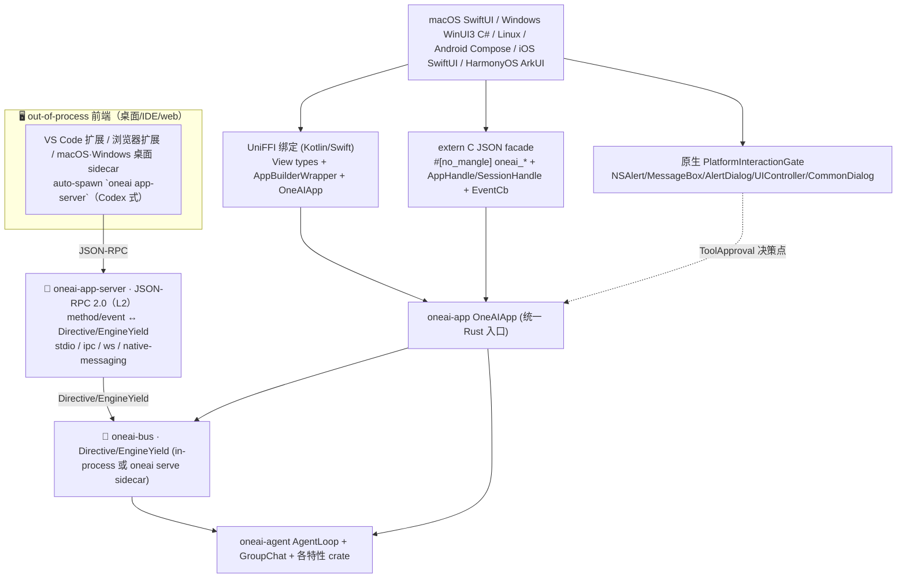

# OneAI 跨平台机制

> 一套 Rust 内核（`oneai-core`+`oneai-app`）经**两种前端连接模型**打到六端原生 App：①**in-process FFI**（UniFFI 绑定 Kotlin/Swing 覆盖 Android·Apple，手写 `extern "C"` JSON facade 覆盖 Windows C#·HarmonyOS ArkTS——因 `uniffi-bindgen` 0.32 无 C#/ArkTS 生成器）；②**out-of-process app-server sidecar**（桌面/IDE/web 前端经 [`oneai-app-server`](app-server-mechanism.md) 的 JSON-RPC 2.0 协议 + auto-spawn 接引擎，不内嵌 Rust 库）。所有字符串以 UTF-8 过界、CJK 正确往返。

## 1. 概述（是什么）

OneAI 的跨平台不是 WebView 套壳，而是让同一份 Rust 引擎逻辑以**原生 App**形态在 macOS/Windows/Linux/Android/iOS/HarmonyOS 上运行。前端接入引擎有**两种连接模型**，按「前端能否/是否需要 spawn 引擎进程」分派：

- **in-process FFI**（默认，移动端唯一选项）：外语 UI 进程直接内嵌 Rust 静态库/动态库，经 UniFFI 或 extern C facade 调 `OneAIApp`。移动端 on-device 无 spawn 能力也无云端引擎兜底，故**只能**走这条。桌面 App 的 FFI 路径是已验证的默认 transport。
- **out-of-process app-server sidecar**（桌面/IDE/web）：前端不内嵌 Rust 库，而是由前端（或其宿主）auto-spawn `oneai app-server` 子进程，经 JSON-RPC 2.0（stdio/ipc/ws/native-messaging）对话。VS Code 扩展、浏览器扩展、macOS/Windows 桌面 sidecar 走这条——Codex 式「能 spawn 的前端自己 owns spawn」，用户永不手动起 server。详见 [App-Server 机制](app-server-mechanism.md)。

两种模型背后是**同一个 `oneai-bus` 协议**（`Directive`/`EngineYield`）：in-process 直连 `Arc<InProcessBus>`（零序列化），app-server 把 JSON-RPC method/event 适配到 bus 的 Directive/EngineYield（L2 适配器）。故审批关联（`request_id`）、中断（`CancellationToken`）、群聊 `speaker` 标签跨两种模型行为一致。

`oneai-uniffi` 是 FFI 绑定层，把 `oneai-app` 的 `AppBuilder`/`App`/`AppSession` 暴露给外语；`oneai-platform-{desktop,android,ios,harmony}` 各自提供原生 `InteractionGate`（NSAlert/MessageBox/AlertDialog/UIController/CommonDialog）；`oneai-staticlib` 是薄 staticlib 打包 crate，产出 `liboneai.a` 供 Apple xcframework 与 HarmonyOS NAPI 链接。

绑定策略分两层：UniFFI 生成器覆盖 Kotlin/Swift（Android、Apple），手写 `extern "C"` JSON facade 覆盖 C#（Windows P/Invoke）与 ArkTS（HarmonyOS NAPI）。两条 FFI 通路都汇到同一个 `OneAIApp` Rust 入口。一个关键 FFI 纪律：extern C 传 String 必须用 `CString::new().as_ptr()`（NUL 结尾），`String::as_ptr` 非 NUL 会导致 `CStr::from_ptr` 越界 UB——macOS 侥幸绿、Linux CI 必崩。

> 本页聚焦 **in-process FFI** 连接模型（§2-§9）。out-of-process app-server sidecar 模型见 [App-Server 机制](app-server-mechanism.md)（含四前端接入现状、Codex 式 auto-spawn、JSON-RPC schema 表、各前端真机实测状态）。

## 2. 职责与能力（做什么）

**UniFFI 绑定（Kotlin/Swift）。** View 类型（`RiskLevelView`/`ApprovalRequestView`/`ChatEventView` 等）用 UniFFI derive 宏；trait 是 Rust-only（外语用具体实现）；工厂方法造预配置实例；`AppBuilderWrapper`/`OneAIApp` 提供地道外语 API。

**手写 extern C JSON facade。** `#[no_mangle] extern "C"` 符号（`oneai_create_app`/`oneai_free_app`/`oneai_create_session`/`oneai_list_conversations`/…）+ `AppHandle`/`SessionHandle` opaque 句柄 + `EventCb` 回调。头文件 `bindings/c/oneai_c.h`。所有数据以 UTF-8 JSON 过界，CJK 正确往返。

**原生 InteractionGate。** `PlatformInteractionGate` 各端实现：macOS `MacOSInteractionGate`（NSAlert）、Windows `WindowsInteractionGate`（MessageBox/AlertDialog）、Linux `LinuxCliInteractionGate`（stdin/stdout）、Android `AndroidInteractionGate`（AlertDialog，JNI 桥）、iOS `IOSInteractionGate`（UIController，callback bridge）、HarmonyOS `HarmonyInteractionGate`（CommonDialog，callback bridge）。

**staticlib 打包。** `oneai-staticlib` 产 `liboneai.a`（~900MB archive），crate-type=staticlib，排除在 `default-members` 外，仅打包原生库时显式构建（`scripts/build_apple.sh`、`build_harmony.sh`）。

**六端共享设计。** 场景化多 Agent 群聊（5 内置预设）、流式 20fps 合并渲染（`StreamCoalescer`）、Markdown 渲染、暗色跟随系统、命令面板、产物画布。macOS App 是参考实现，其他端镜像之。

**显式不做什么**：不实现各端 UI 框架（归各 `platforms/*/` 工程）；不做 WebView 套壳；不打包全平台单二进制（各端独立构建）；staticlib 不在 default-members（不污染日常 `cargo build`）。

## 3. 设计动机（为什么这样实现）

| 决策 | 理由 | 否决的替代方案 |
|---|---|---|
| 双 FFI 通路而非单 UniFFI | `uniffi-bindgen` 0.32 无 C#/ArkTS 生成器；Windows（C#）与 HarmonyOS（ArkTS）必须走手写 extern C facade；UniFFI 覆盖它能覆盖的 Kotlin/Swift | 全走 extern C → Kotlin/Swift 失去地道 API、手写量大 |
| View 类型 + derive 宏而非直接暴露内部类型 | UniFFI 不支持 trait object（`dyn LlmProvider`）直接暴露；View 类型是扁平的 DTO，derive 宏生 binding，trait 留 Rust-only | 直接暴露 trait object → UniFFI 编译失败 |
| 工厂方法造预配置实例 | 外语无法 impl Rust trait，但能调工厂方法得到预配置具体实例（如 default_tools、provider_config）| 要求外语 impl trait → 不可能 |
| extern C 用 JSON 过界而非裸结构体 | C ABI 结构体布局跨平台/跨编译器易错（padding/对齐/ABI）；JSON 字符串过界简单可靠、版本容忍、调试可读 | 裸结构体 → ABI 脆弱、跨编译器漂移 |
| UTF-8 + CJK 正确往返 | 中文用户默认；JSON UTF-8 是安全边界；需保证 `CString` NUL 结尾、外语侧正确解码 | 用系统 locale 编码 → CJK 乱码 |
| `CString::new().as_ptr()` 而非 `String::as_ptr` | extern C 传 String 必须 NUL 结尾，否则 `CStr::from_ptr` 越界 UB；macOS 侥幸绿、Linux CI 必崩（实测 `create_app_with_mock_provider_in_env`）| `String::as_ptr` → 越界 UB，CI 必崩 |
| `oneai-staticlib` 独立 crate + 排除 default-members | staticlib 产 ~900MB archive，不应污染日常 `cargo build`/`cargo test`；独立 crate 让只有打包原生库时才显式构建 | 把 staticlib crate-type 放 uniffi → 每次构建都产 900MB |
| 各端独立原生 Gate 而非统一回调桥 | 各端 UI 框架差异大（NSAlert vs AlertDialog vs CommonDialog），原生 Gate 各自实现最地道；统一桥会丢原生体验 | 统一回调桥 → UI 不地道、各端体验降级 |
| `self: Arc<Self>` 方法消费 handle 必须接住返回值 | UniFFI 0.32 builder 方法消费 self 返 Arc<Self>，外语侧若不接住返回值则 build 无 provider → runTask 报"No LLM provider configured"（实测坑）| 用 `&self` 不可变 builder → UniFFI 0.32 不支持 |

## 4. 架构与核心抽象



**核心抽象（c_facade）：**

```rust
pub type AppHandle = *mut c_void;
pub type SessionHandle = *mut c_void;
pub type EventCb = extern "C" fn(ctx: *mut c_void, event_json: *const c_char);

#[no_mangle]
pub extern "C" fn oneai_create_app(config_json: *const c_char) -> AppHandle;
#[no_mangle]
pub extern "C" fn oneai_create_session(h: AppHandle, id: *const c_char) -> SessionHandle;
#[no_mangle]
pub extern "C" fn oneai_list_conversations(h: AppHandle) -> *mut c_char;   // UTF-8 JSON
// 头文件 bindings/c/oneai_c.h
```

**平台 Gate（trait 在 core）：**

```rust
pub trait PlatformInteractionGate: InteractionGate { /* 原生 UI 对话框 */ }
// 各端：MacOSInteractionGate / WindowsInteractionGate / LinuxCliInteractionGate
//      AndroidInteractionGate / IOSInteractionGate / HarmonyInteractionGate
```

## 5. 参与的流程

**原生 App 启动：**

1. 外语侧（SwiftUI/Compose/C#/ArkUI）启动，调 `oneai_create_app(config_json)`（或 UniFFI `AppBuilderWrapper`）造 Rust `OneAIApp`，得 `AppHandle`。
2. `oneai_create_session(handle, id)` 造 `AppSession`，得 `SessionHandle`。
3. 注册 `EventCb` 回调，Rust 侧流式 token 经回调以 UTF-8 JSON 推给外语侧渲染（`StreamCoalescer` 20fps 合并，防淹没主队列）。
4. 高风险工具执行时 Rust 调各端原生 `PlatformInteractionGate`（NSAlert/AlertDialog…），等用户 Proceed/Abort。

**构建打包：**

1. `./scripts/build_apple.sh` 产 macOS `.dylib` + iOS xcframework（链 `liboneai.a` staticlib）。
2. `./scripts/build_windows.ps1` 产 `oneai.dll`（C# P/Invoke facade）。
3. `./scripts/build_android.sh` 跨 4 ABI 编译 + `generate_bindings.sh` 出 Kotlin binding。
4. `./scripts/build_harmony.sh` 产 NAPI 模块（C++ 包裹 facade）。
5. staticlib 仅在打包时显式构建（`cargo build -p oneai-staticlib`），不在日常 build。

**macOS 流式 20fps 合并**：per-token DispatchQueue.main.async 会淹没主队列；`StreamCallback` coalesce hot fragment 20fps flush，非 hot 立即按序（详见 [stream 机制](#)）。

### App-Server sidecar turn（桌面/IDE/web 前端）

不内嵌 Rust 库的前端走这条——前端（或其宿主）auto-spawn `oneai app-server --listen <transport>` 子进程，经 JSON-RPC 2.0 对话引擎：

1. **spawn**：VS Code 扩展激活时 `child_process.spawn(oneai, app-server --listen stdio)`；浏览器经 native-messaging 注册的 host 由浏览器按需 spawn；macOS/Windows 桌面 App 的 `EngineProcessManager` spawn `--listen ipc://<ephemeral>`。用户**永不手动起 server**（Codex 式）。
2. **turn/run**：前端发 `turn/run {content}`，适配器提交 `Directive::UserMessage`，引擎起回合——`turn/run` 在 TurnStart 即返 `turn_id`（非阻塞到回合结束）。
3. **event 流**：引擎每个 observer 回调经 `BusObserver` 翻成 `EngineYield`，适配器广播单一 `event` 通知（`params` = 完整 yield，含 `kind` tag：`stream_chunk`/`thinking`/`tool_calls`/`tool_result`/`speaker_turn`/…）。前端按 `params.kind` 渲染。
4. **审批回路**：遇 `event` 的 `approval_request`（带 `request_id`），前端弹原生对话框，回 `approval/respond {request_id, response}`——与 in-process 的 `BusInteractionGate` 走的是同一对 bus 通道，行为一致。
5. **回合结束**：前端收到 `turn_complete` 的 `event` 收尾。

完整 JSON-RPC method 表、`event` yield 变体、四前端接入现状与「待实测」诚实标记见 [App-Server 机制](app-server-mechanism.md)（§4 schema、§7 前端接入现状表、§11 auto-spawn）。

## 6. 依赖关系

| 方向 | 谁 | 内容 |
|---|---|---|
| 上游 | `oneai-app` | `AppBuilder`/`App`/`AppSession`（被绑定的核心入口）|
| 上游 | `oneai-agent`/`oneai-memory`/`oneai-persistence`/`oneai-core`/`oneai-parser` | re-export 全引擎 |
| 上游 | `uniffi`/`tokio`/`serde_json` | 绑定生成、异步 runtime、JSON 过界 |
| 下游 | 各 `platforms/*/` 工程 | 原生 UI（SwiftUI/WinUI3/Compose/SwiftUI/ArkUI）|
| 横切接入 | `oneai-platform-*` | 原生 `PlatformInteractionGate` 实现各端 |
| 横切接入 | 脚本 | `scripts/build_{apple,windows.ps1,android,harmony}.sh` + `generate_bindings.sh` |

## 7. 关键类型与文件

| 项 | 位置 |
|---|---|
| `AppBuilderWrapper`（self:Arc<Self> 链式）| `crates/oneai-uniffi/src/app_builder.rs:43`（`provider_config:115`/`default_tools:82`/`sqlite_persistence_at:226`）|
| `OneAIApp` + `AppSession` wrapper | `crates/oneai-uniffi/src/app.rs` |
| GroupChat FFI | `crates/oneai-uniffi/src/group_chat.rs` |
| `ChatEventCallback` + `ChatEventView` | `crates/oneai-uniffi/src/callback.rs:46` |
| extern C facade（`oneai_*` 符号 + `AppHandle`/`SessionHandle`/`EventCb`）| `crates/oneai-uniffi/src/c_facade.rs:364,433,449,469`（`EventCb:332`）|
| C 头文件 | `bindings/c/oneai_c.h` |
| View 类型 | `crates/oneai-uniffi/src/types.rs` |
| 桌面 Gate（macOS NSAlert / Windows MessageBox / Linux CLI）| `crates/oneai-platform-desktop/src/{macos,windows,linux,bridge_common}.rs` |
| Android JNI 桥 + Gate | `crates/oneai-platform-android/src/{jni_bridge,gate}.rs` |
| iOS callback bridge + Gate | `crates/oneai-platform-ios/src/{callback_bridge,gate}.rs` |
| HarmonyOS callback bridge + Gate | `crates/oneai-platform-harmony/src/{callback_bridge,gate}.rs` |
| `oneai-staticlib`（产 `liboneai.a`）| `crates/oneai-staticlib/src/lib.rs`（crate-type=staticlib，排除 default-members）|

## 8. 与业界对比

| 系统 | 模型 | OneAI 取舍 |
|---|---|---|
| **React Native / Flutter** | JS/Dart 跨平台 UI，单一二进制 | OneAI 是 Rust 内核 + 各端原生 UI（SwiftUI/WinUI3/Compose…），非跨平台统一 UI——保留各端原生体验，引擎共享 |
| **UniFFI 标准用法** | 单一生成器覆盖所有目标语言 | OneAI 双通路：UniFFI 覆盖 Kotlin/Swift，手写 extern C facade 覆盖 C#/ArkTS（因 0.32 无生成器），务实务实 |
| **Rust + JNI（Android）** | 手写 JNI bindings | OneAI Android 走 UniFFI Kotlin binding + JNI 桥做 Gate，比纯手写 JNI 省力 |
| **Tauri / Electron** | WebView 套壳 + JS | OneAI 明确不做套壳，原生 UI + 原生 Gate 对话框，性能与体验更原生 |
| **Mozilla application-services** | Rust + UniFFI 多端 SDK | OneAI 同源思路（UniFFI 把 Rust 暴露给多端），但多一手写 extern C facade 覆盖 UniFFI 未支持的语言 |

OneAI 独特点：**Rust 内核 + 各端原生 UI（非套壳）+ 双 FFI 通路务实覆盖**（UniFFI 能覆盖的用它，不能的手写 facade）+ **staticlib 隔离 900MB archive 不污染日常 build**。

## 9. 扩展点与配置

- **接新平台**：impl `PlatformInteractionGate`（原生对话框）+ 经 UniFFI 或 extern C facade 暴露 `OneAIApp`。
- **造 App（外语）**：UniFFI `AppBuilderWrapper` 链式（注意 `self:Arc<Self>` 方法必须接住返回值）；或 extern C `oneai_create_app(config_json)`。
- **流式回调**：注册 `EventCb`，Rust 推 UTF-8 JSON，`StreamCoalescer` 20fps 合并防淹没。
- **打包**：`scripts/build_{apple,windows.ps1,android,harmony}.sh` + `generate_bindings.sh {swift\|kotlin\|...}`。
- **staticlib**：`cargo build -p oneai-staticlib`（仅打包时）。
- **各端 README**：`platforms/{macos,windows,android,harmony}/README.md`。
- **macOS 须 release 构建**：debug 慢 5-10×，流式与滚动需 release（见 [Issue #11](#)）。

## 10. 深入阅读

- [permission-mechanism.md](permission-mechanism.md) —— `PlatformInteractionGate` 与 7 决策点
- [multi-agent-mechanism.md](multi-agent-mechanism.md) —— GroupChat FFI + 场景化多角色对话
- [bus-mechanism.md](bus-mechanism.md) —— 引擎↔前端统一协议（两种连接模型的共同底座）
- [app-server-mechanism.md](app-server-mechanism.md) —— out-of-process app-server sidecar 连接模型：JSON-RPC schema、四前端接入现状、auto-spawn
- [memory-mechanism.md](memory-mechanism.md) —— `sqlite_persistence_at` 跨重启记忆
- [CLAUDE.md — 跨平台 / Network proxy 章节](../CLAUDE.md)
- 源码：`crates/oneai-uniffi/src/`（8 文件 / ~3.9K LOC）+ `crates/oneai-platform-{desktop,android,ios,harmony}/src/` + `crates/oneai-staticlib/` + `crates/oneai-app-server/src/`
- 各端工程：`platforms/{macos,windows,android,harmony,vscode,browser,npm}/`
