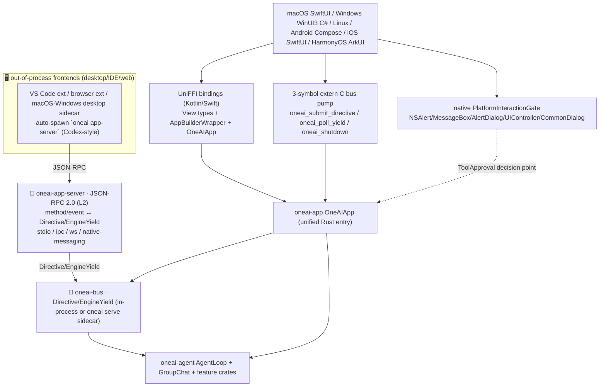

# OneAI Cross-Platform Mechanism

> One Rust core (`oneai-core`+`oneai-app`) reaches six native-app targets. The architecture is **migrating from in-process FFI (the foreign process embeds the Rust lib) to JSON-RPC 2.0 / separate-process** — a frontend talks to the engine via a `oneai app-server` sidecar instead of embedding Rust. Both paths share the **same `oneai-bus` protocol** (`Directive`/`EngineYield`), so a frontend is just a "Directive writer + Yield reader" and never knows whether the engine is in-process. All strings cross the boundary as UTF-8, CJK round-trips correctly.

## 1. Overview (what it is)

OneAI's cross-platform story is not a WebView shell — it runs the same Rust engine logic as **native apps** on macOS/Windows/Linux/Android/iOS/HarmonyOS. **The architecture is moving from "in-process FFI (embedded Rust lib)" to "JSON-RPC 2.0 / separate-process"** — the frontend no longer embeds a Rust library; it talks to the engine via a `oneai app-server` sidecar over JSON-RPC. Both paths run on the **same `oneai-bus` protocol** (`Directive`/`EngineYield`), so a frontend is only a "Directive writer + Yield reader" and is blind to whether the engine lives in its process.

Two connection models, dispatched by "can the frontend spawn the engine process":

- **out-of-process app-server sidecar (migration target; the desktop/IDE/web main line)**: the frontend (or its host) auto-spawns a `oneai app-server` subprocess and talks JSON-RPC 2.0 (stdio/ipc/ws/native-messaging) — the Codex-style "a frontend that can spawn owns the spawn", so the user never starts a server. WebUI / VS Code extension / browser extension **already run entirely on this**; the macOS sidecar is available (opt-in, the migration path); Windows has a spawn + client skeleton (see the §5 migration-status table). See [App-Server mechanism](app-server-mechanism_EN.md).
- **in-process FFI (retained; the only mobile option + the macOS current default)**: the foreign-language UI process directly embeds the Rust static/dynamic lib. Mobile has no on-device spawn and no cloud-engine fallback, so it **must** use this path; the macOS app currently defaults to FFI (embedded `liboneai.a`) with the sidecar as its opt-in migration path. The in-process C-ABI surface has **collapsed from the legacy 29-symbol full `OneAIApp` facade to a 3-symbol bus pump** (`oneai_submit_directive`/`oneai_poll_yield`/`oneai_shutdown`, see §4) — i.e. in-process also speaks only the bus's `Directive`/`EngineYield`, zero-serialization, directly over `Arc<InProcessBus>`, the same protocol as the sidecar. Swift/Kotlin frontends can still use the full UniFFI `OneAIApp` binding (macOS·Android today).

Regardless of path, approval correlation (`request_id`), interrupt (`CancellationToken`), and the group-chat `speaker` tag behave identically (the same pair of bus channels).

`oneai-uniffi` is the FFI binding layer: a 3-symbol C-ABI bus pump (`c_facade.rs`, for C#/ArkTS targets that have no UniFFI generator) + the full UniFFI `OneAIApp` binding (Swift/Kotlin); `oneai-platform-{desktop,android,ios,harmony}` each provide a native `InteractionGate` (NSAlert/MessageBox/AlertDialog/UIController/CommonDialog); `oneai-staticlib` is a thin staticlib packaging crate producing `liboneai.a` for the Apple xcframework and HarmonyOS NAPI to link.

One key FFI discipline: passing a String over extern C must use `CString::new().as_ptr()` (NUL-terminated); `String::as_ptr` is not NUL-terminated and causes `CStr::from_ptr` out-of-bounds UB — macOS happens to pass, Linux CI crashes.

> The out-of-process app-server sidecar model is in [App-Server mechanism](app-server-mechanism_EN.md) (four-frontend access status, Codex-style auto-spawn, JSON-RPC schema tables, per-frontend real-machine test status); this page focuses on in-process FFI (§2-§9) and its convergence onto the sidecar.

## 2. Responsibilities & capabilities (what it does)

**UniFFI bindings (Kotlin/Swift).** View types (`RiskLevelView`/`ApprovalRequestView`/`ChatEventView`, etc.) use UniFFI derive macros; traits are Rust-only (foreign code uses concrete impls); factory methods build pre-configured instances; `AppBuilderWrapper`/`OneAIApp` provide idiomatic foreign-language APIs.

**Hand-written extern C bus pump (3 symbols).** The legacy 29-symbol full `OneAIApp` C facade (`oneai_create_app`/`oneai_session_run_task`/`oneai_list_conversations`/…) was collapsed in P4 to a 3-symbol bus pump: `oneai_submit_directive(json)` (submit a `Directive` JSON; the first `Directive::Init{config}` builds the engine+bus+pump) / `oneai_poll_yield()` (pull the next `EngineYield` as JSON, thread-local buffer, do not free) / `oneai_shutdown()`. The in-process side speaks only the bus protocol — same protocol as the sidecar, different transport (direct C ABI vs JSON-RPC over the wire). > `bindings/c/oneai_c.h` still documents the legacy 29 symbols and **needs to be re-aligned** to the 3-symbol pump; the Windows C# app still P/Invokes the legacy symbols (stale, see §5).

**Native InteractionGate.** `PlatformInteractionGate` per-target impl: macOS `MacOSInteractionGate` (NSAlert), Windows `WindowsInteractionGate` (MessageBox/AlertDialog), Linux `LinuxCliInteractionGate` (stdin/stdout), Android `AndroidInteractionGate` (AlertDialog, JNI bridge), iOS `IOSInteractionGate` (UIController, callback bridge), HarmonyOS `HarmonyInteractionGate` (CommonDialog, callback bridge).

**Staticlib packaging.** `oneai-staticlib` produces `liboneai.a` (~900MB archive), crate-type=staticlib, excluded from `default-members`, built explicitly only when packaging a native lib (`scripts/build_apple.sh`, `build_harmony.sh`).

**Six-target shared design.** scenario-based multi-agent group chat (5 built-in presets), streaming 20fps coalesced rendering (`StreamCoalescer`), Markdown rendering, dark-mode following system, command palette, artifact canvas. The macOS app is the reference impl; other targets mirror it.

**Explicitly does not**: no per-target UI-framework implementation (that's each `platforms/*/` project); no WebView shell; no single all-platform binary (each target builds independently); staticlib not in default-members (doesn't pollute daily `cargo build`).

## 3. Design motivation (why this way)

| Decision | Rationale | Rejected alternative |
|---|---|---|
| Migrating to JSON-RPC separate-process (in-process kept as fallback) | Desktop/IDE/web can spawn: a sidecar decouples frontend/engine release cadence, isolates crashes, enables hot engine swap, and removes per-target C/Kotlin/Swift binding-surface maintenance; in-process stays only for mobile (no spawn) + the macOS current default, and its C-ABI already collapsed to a 3-symbol bus pump speaking the same protocol as the sidecar | All in-process → every target's binding tracks the engine API; desktop UX pinned to the static-lib version |
| Two FFI paths, not UniFFI only | `uniffi-bindgen` 0.32 has no C#/ArkTS generator; Windows (C#)/HarmonyOS (ArkTS) go through a hand-written extern C bus pump, UniFFI covers what it can (Kotlin/Swift); both paths speak only the bus protocol | All extern C → Kotlin/Swift lose idiomatic APIs, more hand-writing |
| View types + derive macros, not exposing internal types directly | UniFFI doesn't support exposing trait objects (`dyn LlmProvider`) directly; View types are flat DTOs, derive macros generate bindings, traits stay Rust-only | Expose trait objects directly → UniFFI fails to compile |
| Factory methods build pre-configured instances | Foreign code can't impl Rust traits but can call factory methods to get pre-configured concrete instances (e.g. default_tools, provider_config) | Require foreign code to impl traits → impossible |
| extern C uses JSON across the boundary, not raw structs | C-ABI struct layout is error-prone cross-platform/cross-compiler (padding/alignment/ABI); a JSON string is simple, reliable, version-tolerant, debuggable | Raw structs → ABI fragility, cross-compiler drift |
| UTF-8 + CJK correct round-trip | Chinese users are the default; JSON UTF-8 is the safe boundary; must ensure `CString` NUL-termination and correct decoding on the foreign side | System-locale encoding → CJK garbled |
| `CString::new().as_ptr()`, not `String::as_ptr` | Passing a String over extern C must be NUL-terminated, or `CStr::from_ptr` goes out of bounds; macOS happens to pass, Linux CI crashes (verified `create_app_with_mock_provider_in_env`) | `String::as_ptr` → out-of-bounds UB, CI crashes |
| `oneai-staticlib` a separate crate + excluded from default-members | The staticlib produces a ~900MB archive that should not pollute daily `cargo build`/`cargo test`; a separate crate means it's built explicitly only when packaging a native lib | Put the staticlib crate-type in uniffi → every build emits 900MB |
| Per-target native Gate, not a unified callback bridge | Each target's UI framework differs (NSAlert vs AlertDialog vs CommonDialog), a native Gate per target is most idiomatic; a unified bridge would lose native experience | Unified callback bridge → non-idiomatic UI, downgraded experience |
| `self: Arc<Self>` methods consuming the handle must接住 the return value | UniFFI 0.32 builder methods consume self and return Arc<Self>; if the foreign side doesn't接住 the return value, build has no provider → runTask reports "No LLM provider configured" (a verified pitfall) | `&self` immutable builder → UniFFI 0.32 doesn't support |

## 4. Architecture & core abstractions



**Core abstractions (c_facade 3-symbol bus pump):**

```rust
#[no_mangle] pub extern "C" fn oneai_submit_directive(json: *const c_char) -> i32;
#[no_mangle] pub extern "C" fn oneai_poll_yield() -> *const c_char;   // next EngineYield JSON, thread-local buffer, do not free
#[no_mangle] pub extern "C" fn oneai_shutdown() -> i32;
// The first oneai_submit_directive(Directive::Init{config}) builds engine+bus+pump;
// every other Directive is forwarded to the bus; yields come back via oneai_poll_yield.
// In-process holds Arc<InProcessBus> directly (zero serialization) — same Directive/EngineYield protocol as the sidecar.
```

**Platform Gate (trait in core):**

```rust
pub trait PlatformInteractionGate: InteractionGate { /* native UI dialogs */ }
// per-target: MacOSInteractionGate / WindowsInteractionGate / LinuxCliInteractionGate
//             AndroidInteractionGate / IOSInteractionGate / HarmonyInteractionGate
```

## 5. Flows it participates in

**Native app launch:**

1. The foreign side (SwiftUI/Compose/C#/ArkUI) starts and submits `Directive::Init{config}` (UniFFI `AppBuilderWrapper` for Swift/Kotlin, or the 3-symbol `oneai_submit_directive` pump for C#/ArkTS) — the Rust side builds the engine + bus + pump on first call.
2. Subsequent turns are `Directive::UserMessage` / `Directive::Approve` / `Directive::Interrupt` submitted to the same bus; the foreign side polls `EngineYield` back (UniFFI callback, or `oneai_poll_yield`).
3. The Rust side streams tokens as UTF-8 JSON to the foreign side for rendering (`StreamCoalescer` 20fps coalesced, anti-flooding the main queue).
4. On high-risk tool execution the Rust side calls each target's native `PlatformInteractionGate` (NSAlert/AlertDialog…), awaiting Proceed/Abort.

**Build packaging:**

1. `./scripts/build_apple.sh` produces macOS `.dylib` + iOS xcframework (links `liboneai.a` staticlib).
2. `./scripts/build_windows.ps1` produces `oneai.dll` (the 3-symbol C-ABI pump; the C# app's P/Invoke declarations are still the legacy symbols and need migration — see the table below).
3. `./scripts/build_android.sh` cross-compiles 4 ABIs + `generate_bindings.sh` emits Kotlin bindings.
4. `./scripts/build_harmony.sh` produces a NAPI module (C++ wrapping the facade).
5. The staticlib is built explicitly only when packaging (`cargo build -p oneai-staticlib`), not in daily builds.

> **macOS sidecar engine binary**: `platforms/macos/build_macos.sh` bundles `target/release/oneai` into the `.app` at `Contents/Resources/bin/oneai` (the sidecar transport's `EngineProcessManager` looks for `oneai app-server` there first, then PATH). So run `cargo build --release -p oneai-cli` before `build_macos.sh` — otherwise the .app ships without the sidecar binary and the sidecar transport can only use `oneai` on PATH. After changing engine code you must rebuild the release binary too (`build_macos.sh` only stages, it doesn't build — skipping the rebuild bundles a stale engine). The macOS app defaults to in-process FFI (embedded staticlib, no process, no socket); switch to sidecar with `defaults write oneai_provider oneai_engine_transport sidecar`, delete the key to return to FFI.

**Per-target migration status (honest)** — in-process FFI → JSON-RPC separate-process:

| Frontend | Connection model | Status |
|---|---|---|
| WebUI | sidecar (ws) | ✅ fully on it; recommended |
| VS Code extension | sidecar (stdio) | ✅ fully on it |
| Browser extension | sidecar (native-messaging) | ✅ macOS/Linux |
| macOS app | in-process FFI (full UniFFI, default) + sidecar (opt-in) | ✅ FFI default works; sidecar migration path live (opt-in) |
| Windows app | in-process FFI (c_facade P/Invoke) + sidecar skeleton | ⚠️ FFI P/Invoke is still the legacy 29-symbol surface (c_facade collapsed to 3 symbols → the current `oneai.dll` no longer exports those symbols, **needs migration**); sidecar is only a spawn+client skeleton, not wired into WinUI; no MSVC locally, not build-verified |
| Android | in-process (full UniFFI) | ✅ retained (on-device, no spawn) |
| iOS / HarmonyOS | in-process (target: 3-symbol pump / full UniFFI) | 🚧 in progress |

> In short: desktop/IDE/web have migrated or are migrating to the sidecar; mobile stays in-process on-device (with the C-ABI surface unified onto the bus pump); Windows is the largest open migration gap.

**macOS streaming 20fps coalescing**: per-token DispatchQueue.main.async floods the main queue; `StreamCallback` coalesces hot fragments 20fps flush, non-hot immediate in-order (see the stream mechanism).

### App-Server sidecar turn (desktop/IDE/web frontends)

Frontends that don't embed the Rust lib use this path — the frontend (or its host) auto-spawns a `oneai app-server --listen <transport>` subprocess and talks JSON-RPC 2.0 to the engine:

1. **spawn**: the VS Code extension spawns `oneai app-server --listen stdio` on activation; the browser spawns it via the registered native-messaging host on demand; the macOS/Windows desktop `EngineProcessManager` spawns `--listen ipc://<ephemeral>`. The user **never starts a server manually** (Codex-style).
2. **turn/run**: the frontend sends `turn/run {content}`; the adapter submits `Directive::UserMessage` and the engine starts the turn — `turn/run` returns `turn_id` at TurnStart (non-blocking until turn end).
3. **event stream**: each engine observer callback is translated by `BusObserver` into an `EngineYield`; the adapter broadcasts a single `event` notification (`params` = the full yield, with a `kind` tag: `stream_chunk`/`thinking`/`tool_calls`/`tool_result`/`speaker_turn`/…). The frontend renders by `params.kind`.
4. **approval loop**: on an `event` with `approval_request` (carrying `request_id`), the frontend shows a native dialog and replies `approval/respond {request_id, response}` — the same pair of bus channels as the in-process `BusInteractionGate`, identical behavior.
5. **turn end**: the frontend finishes on the `turn_complete` `event`.

The full JSON-RPC method table, `event` yield variants, four-frontend access status, and honest "awaiting real-machine test" markers are in [App-Server mechanism](app-server-mechanism_EN.md) (§4 schema, §7 frontend-access table, §11 auto-spawn).

## 6. Dependencies

| Direction | Who | What |
|---|---|---|
| Upstream | `oneai-app` | `AppBuilder`/`App`/`AppSession` (the bound core entry) |
| Upstream | `oneai-agent`/`oneai-memory`/`oneai-persistence`/`oneai-core`/`oneai-parser` | re-exports the whole engine |
| Upstream | `uniffi`/`tokio`/`serde_json` | binding generation, async runtime, JSON across the boundary |
| Downstream | each `platforms/*/` project | native UI (SwiftUI/WinUI3/Compose/SwiftUI/ArkUI) |
| Cross-cutting | `oneai-platform-*` | native `PlatformInteractionGate` impls per target |
| Cross-cutting | scripts | `scripts/build_{apple,windows.ps1,android,harmony}.sh` + `generate_bindings.sh` |

## 7. Key types & files

| Item | Location |
|---|---|
| `AppBuilderWrapper` (self:Arc<Self> chain) | `crates/oneai-uniffi/src/app_builder.rs:43` (`provider_config:115`/`default_tools:82`/`sqlite_persistence_at:226`) |
| `OneAIApp` + `AppSession` wrapper | `crates/oneai-uniffi/src/app.rs` |
| GroupChat FFI | `crates/oneai-uniffi/src/group_chat.rs` |
| `ChatEventCallback` + `ChatEventView` | `crates/oneai-uniffi/src/callback.rs:46` |
| 3-symbol C-ABI bus pump (`oneai_submit_directive`/`oneai_poll_yield`/`oneai_shutdown`) | `crates/oneai-uniffi/src/c_facade.rs` (`:437`/`:490`/`:522`) |
| C header (legacy 29 symbols, pending re-align to 3 symbols) | `bindings/c/oneai_c.h` |
| View types | `crates/oneai-uniffi/src/types.rs` |
| Desktop gates (macOS NSAlert / Windows MessageBox / Linux CLI) | `crates/oneai-platform-desktop/src/{macos,windows,linux,bridge_common}.rs` |
| Android JNI bridge + gate | `crates/oneai-platform-android/src/{jni_bridge,gate}.rs` |
| iOS callback bridge + gate | `crates/oneai-platform-ios/src/{callback_bridge,gate}.rs` |
| HarmonyOS callback bridge + gate | `crates/oneai-platform-harmony/src/{callback_bridge,gate}.rs` |
| `oneai-staticlib` (produces `liboneai.a`) | `crates/oneai-staticlib/src/lib.rs` (crate-type=staticlib, excluded from default-members) |

## 8. Industry comparison

| System | Model | OneAI's trade-off |
|---|---|---|
| **React Native / Flutter** | JS/Dart cross-platform UI, one binary | OneAI is a Rust core + per-target native UI (SwiftUI/WinUI3/Compose…), not a unified cross-platform UI — preserves native experience, shares the engine |
| **UniFFI standard usage** | one generator covers all target languages | OneAI's two paths: UniFFI covers Kotlin/Swift, a hand-written extern C bus pump covers C#/ArkTS (0.32 has no generator), pragmatic |
| **Rust + JNI (Android)** | hand-written JNI bindings | OneAI's Android uses UniFFI Kotlin bindings + a JNI bridge for the Gate, less effort than pure hand-written JNI |
| **Tauri / Electron** | WebView shell + JS | OneAI explicitly avoids shells; native UI + native Gate dialogs, more native performance and experience |
| **Mozilla application-services** | Rust + UniFFI multi-target SDK | OneAI is the same idea (UniFFI exposes Rust to multiple targets), plus a hand-written extern C bus pump for languages UniFFI doesn't support, and desktop is migrating to JSON-RPC separate-process |

OneAI's distinct points: **Rust core + per-target native UI (no shell)** + **two FFI paths pragmatic coverage** (UniFFI where it works, hand-written bus pump where it doesn't) + **migrating from in-process FFI to JSON-RPC separate-process** (converging on one bus protocol) + **staticlib isolates the 900MB archive from daily builds**.

## 9. Extension points & config

- **Add a target**: if it can spawn → go through the app-server sidecar (JSON-RPC, recommended, zero binding maintenance); on-device and can't spawn → impl `PlatformInteractionGate` (native dialogs) + reach the engine via UniFFI (Swift/Kotlin) or the 3-symbol C-ABI bus pump (C#/ArkTS).
- **Build an App (foreign)**: sidecar frontends use a `oneai app-server` JSON-RPC client; in-process frontends use the UniFFI `AppBuilderWrapper` chain (note `self:Arc<Self>` methods must capture the return value), or the 3-symbol pump (`oneai_submit_directive`/`oneai_poll_yield`).
- **Streaming**: the UniFFI path registers a callback; the pump path polls `oneai_poll_yield`. Rust pushes UTF-8 JSON; `StreamCoalescer` 20fps coalesces anti-flooding.
- **Packaging**: `scripts/build_{apple,windows.ps1,android,harmony}.sh` + `generate_bindings.sh {swift\|kotlin\|...}`.
- **Staticlib**: `cargo build -p oneai-staticlib` (packaging only).
- **macOS sidecar binary**: `cargo build --release -p oneai-cli`, then run `build_macos.sh` to bundle the engine into the .app (see §5).
- **Per-target README**: `platforms/{macos,windows,android,harmony}/README.md`.
- **macOS needs a release build**: debug is 5-10× slower; streaming and scrolling need release (see Issue #11).

## 10. Further reading

- [permission-mechanism](permission-mechanism_EN.md) — `PlatformInteractionGate` and the 7 decision points
- [multi-agent-mechanism](multi-agent-mechanism_EN.md) — GroupChat FFI + scenario multi-role chat
- [bus-mechanism](bus-mechanism_EN.md) — unified engine↔frontend protocol (the shared foundation of both connection models)
- [app-server-mechanism](app-server-mechanism_EN.md) — the out-of-process app-server sidecar connection model: JSON-RPC schema, four-frontend access status, auto-spawn
- [memory-mechanism](memory-mechanism_EN.md) — `sqlite_persistence_at` cross-restart memory
- [CLAUDE.md — Cross-platform / Network proxy](../CLAUDE.md)
- Source: `crates/oneai-uniffi/src/` (8 files / ~3.9K LOC) + `crates/oneai-platform-{desktop,android,ios,harmony}/src/` + `crates/oneai-staticlib/` + `crates/oneai-app-server/src/`
- Per-target projects: `platforms/{macos,windows,android,harmony,vscode,browser,npm}/`
