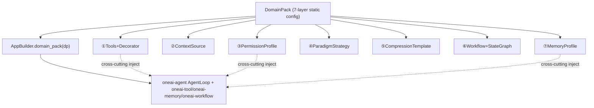

# OneAI DomainPack Mechanism

> 7-layer declarative domain-config pack — tools+decorators / ContextSource / PermissionProfile / ParadigmStrategy / CompressionTemplate / Workflow+StateGraph / MemoryProfile: extracts "domain knowledge" from hardcode into a declarative, mergeable (strictest-wins), validatable (JSON Schema), one-line-switchable, market-installable, shareable config pack.

## 1. Overview (what it is)

DomainPack is OneAI's central extension mechanism. The difference between a coding agent and a research agent is not the engine but the domain knowledge — which tools, what environment to sense, which operations need approval, which task goes to which paradigm, what to preserve on compression, which workflows to run, how to manage memory. OneAI explicitly splits these seven classes of domain knowledge into seven config layers, wraps them in a `DomainPack`, so the same engine switches between domains in one line via `AppBuilder::domain_pack(...)`, with no code change.

The key insight comes from the reference impl CodingPack: a coding agent implicitly embeds its workflow via five layers of config (tool set, environment sensing, permissions, paradigm, compression priorities). OneAI makes these five layers explicit, adds Workflow and Memory to make seven, making them declarative, pluggable, composable. Multiple DomainPacks can merge to build a multi-domain agent — with explicit merge rules: permissions take the strictest (strictest-wins, safety first), context sources merge by priority, core memory budget takes min, tools take OR. This layer cross-cuts all feature layers; `oneai-domain` is not a layer but a declarative-config layer.

## 2. Responsibilities & capabilities (what it does)

| Layer | Component | Role |
|---|---|---|
| ① | Tools + ToolDecorator | domain-specific tool set + tool description overrides (changes the description the model sees, not the tool impl) |
| ② | ContextSource | domain-specific environment sensing, with `RefreshPolicy` (EveryIteration/OnChange/OnceAtStart/OnResume/Periodic) |
| ③ | PermissionProfile | permission grading: `deny_by_default`/`auto_approve`/`require_confirmation`/`permission_overrides` |
| ④ | ParadigmStrategy | task→paradigm mapping, declaring when to enter Plan/ReAct/Reflect/Explore + SubAgent definitions |
| ⑤ | CompressionTemplate | compression preservation priorities: `preserve_fields`/`template`/`truncate_rules` |
| ⑥ | Workflow + StateGraph | domain-predefined workflows and cyclic graphs (react/plan/reflect/explore) |
| ⑦ | MemoryProfile | memory policy: extraction schema/recall config/core budget/self-managed tools/cross-session habits/working-state/decay |

**Companion capabilities:** `DomainPackBuilder` chain-builds the seven layers; the `merge` module does multi-pack merging (strictest-wins); `DomainPackSpec` emits a JSON Schema (draft-2020-12, cross-language validatable); `DomainPackValidator` does structural + semantic validation; `market` (`PackSource`/`PackRegistry`) installs and indexes from local/git; `CodingPack`/`ResearchPack` are built-in reference impls; `ContainerizedCodingPack` is the Gondolin mode (VM/container as security boundary).

**Explicitly does not**: no tool execution (that's `oneai-tool`); no LLM inference (that's the provider); no runtime-state persistence (a pack is static config); no engine-behavior definition (it only declaratively configures the engine); `MemoryProfile` carries policy but does not implement the memory mechanism itself (that's `oneai-memory`).

## 3. Design motivation (why this way)

| Decision | Rationale | Rejected alternative |
|---|---|---|
| Seven explicit layers, not a monolithic config | The five classes of domain knowledge a coding agent implicitly embeds are real separation-of-concerns; explicit layers let each evolve, validate, merge independently | One big config object → touch one, affect all, no layered merge |
| Declarative, not code | Domain config must be storable, installable from git, cross-session reusable, writable by non-Rust pack authors | Code-defined → not declarative, not shareable, needs recompile |
| `AppBuilder::domain_pack(...)` one-line switch | Switching domains is frequent (coding→research→general); should be one line, not scattered wiring | Multi-place wiring of tools/permissions/paradigms → easy to miss, drift |
| Multi-pack merge strictest-wins (permissions) | When stacking a multi-domain agent, security must take the strictest — a research pack allows web_fetch, a coding pack requires shell confirmation, the stack should require confirmation | Take lenient → security downgrades; take OR → always allow |
| `ContextSource` with `RefreshPolicy` | Environment info changes at different rates (git status per turn, project config stable); refreshing all every turn wastes tokens; OnChange/OnceAtStart/OnResume/Periodic on demand | All every turn → token waste; all once → info goes stale |
| `OnResume` as a distinct policy | Cross-session continuation needs a one-time ground-truth reconciliation (§8.2) at resume — not per-turn, not once, fires once at resume time | EveryIteration/Once → reconciliation has nowhere to live |
| JSON Schema + semantic validation | Pack authors write wrong config (self-deps, orphan nodes, missing approval gate); structural validation checks syntax, semantic checks cross-layer consistency — two layers needed | Structural only → semantic errors surface at runtime |
| `ToolDecorator` overrides description, not impl | The same tool needs different descriptions in different domains (shell is "run builds" in coding, "manage services" in ops); only the description the model sees changes, not execution | Rewrite tools per domain → duplication |
| `ContainerizedCodingPack` drop-in replacement | The Gondolin mode swaps same-named tools for VM-backed impls; the VM is the security boundary, no permission cut (discipline #1), pack-level drop-in doesn't touch the engine | Engine-level change → cross-domain pollution |

## 4. Architecture & core abstractions



`DomainPack` is an aggregate of seven layer fields, chain-built by `DomainPackBuilder`:

```rust
pub struct DomainPack {
    pub name: String, pub description: String, pub system_prompt: Option<String>,
    // ①
    pub tools: Vec<Arc<dyn Tool>>, pub tool_decorators: Vec<ToolDecorator>,
    pub context_sources: Vec<Arc<dyn ContextSource>>,   // ②
    pub permission_profile: PermissionProfile,           // ③
    pub paradigm_strategies: Vec<ParadigmStrategy>,      // ④
    pub compression_template: Option<CompressionTemplate>, // ⑤
    pub workflows: Vec<WorkflowConfig>, pub state_graphs: Vec<StateGraph>, // ⑥
    pub memory_profile: MemoryProfile,                  // ⑦
    pub sub_agent_definitions: Vec<SubAgentTypeDefinition>,
}
```

`ContextSource`'s refresh policy is this layer's key abstraction:

```rust
#[non_exhaustive]
pub enum RefreshPolicy {
    EveryIteration,   // every turn (git status)
    OnChange,         // produce new tokens only on diff (OpenCode Context Epoch)
    OnceAtStart,      // once at startup (project config)
    OnResume,         // once at resume (ground-truth reconciliation, take pattern)
    Periodic(Duration),
}
```

## 5. Flows it participates in

**Assembly (AppBuilder):** `AppBuilder::domain_pack(dp)` injects the pack's seven layers across the engine — ① tools register in `ToolRegistry`, ② ContextSources register in `ContextAssembler`, ③ PermissionProfile converts to `PermissionResolver` injected into `ToolExecutor`, ④ ParadigmStrategy injects into AgentLoop paradigm routing, ⑤ CompressionTemplate injects into `ContextCompressor`, ⑥ Workflow/StateGraph register in `StateGraphExecutor`, ⑦ MemoryProfile injects into `MemoryManager` + the working-state store. One-line switch swaps the whole set.

**Runtime (each iteration):** When the AgentLoop calls `ContextAssembler` to assemble context each turn, it decides per ContextSource whether to `load()` by `refresh_policy` — `EveryIteration` every turn, `OnChange` on diff detection, `OnResume` takes once on the resume first turn. `build_tool_definitions_for_paradigm` filters the tool set per ④ ParadigmStrategy's `tool_filter`, resolves permissions via ③ PermissionProfile through `PermissionResolver`. On compression, `ContextCompressor` preserves key fields per ⑤ CompressionTemplate's `preserve_fields`, truncates per `truncate_rules`, renders the summary prompt per `template`.

**Merging (multi-domain):** `DomainPack::merge(packs)` applies strictest-wins to permissions (`require_confirmation` beats `auto_approve`), merges context sources by priority, takes min for core budget, OR for tools, and `MemoryProfile::merge` for schema/habits.

## 6. Dependencies

| Direction | Who | What |
|---|---|---|
| Upstream | `oneai-core` | `Tool`/shared types (`PermissionLevel`/`MemoryFact`, etc.) |
| Upstream | `oneai-workflow` | `WorkflowConfig`/`StateGraph` types (layer 6 references) |
| Upstream | `serde`/`serde_json`/`regex` | config serialization, JSON Schema gen, deny-pattern regex |
| Downstream | `oneai-app` | `AppBuilder::domain_pack(...)` — the single assembly entry |
| Downstream | `oneai-agent` | AgentLoop consumes paradigm/context/tool-filter |
| Downstream | `oneai-tool` | `PermissionProfile` → `PermissionResolver` injected into `ToolExecutor` |
| Downstream | `oneai-memory` | `MemoryProfile` injected into `MemoryManager` |
| Cross-cutting | engine layers | DomainPack is not a layer but a declarative-config layer cross-cutting all feature layers |

## 7. Key types & files

| Item | Location |
|---|---|
| `DomainPack` (7-layer aggregate) + `DomainPackBuilder` | `crates/oneai-domain/src/domain_pack.rs:50,198` |
| `ContextSource` trait + `RefreshPolicy` (5 variants) | `crates/oneai-domain/src/context_source.rs:73,31` |
| `PermissionProfile` + `DenyPattern` | `crates/oneai-domain/src/permission_profile.rs:118,37` |
| `ParadigmStrategy` + `SubAgentTypeDefinition` + `SubAgentMergeStrategy` | `crates/oneai-domain/src/paradigm_strategy.rs:314,88,280` |
| `CompressionTemplate` | `crates/oneai-domain/src/compression_template.rs:44` |
| `MemoryProfile` + `WorkingStatePolicy` + `CompactionConfig` | `crates/oneai-domain/src/memory_profile.rs` |
| `merge` (strictest-wins + priority + core min) | `crates/oneai-domain/src/merge.rs:99` |
| `DomainPackSpec` (JSON Schema draft-2020-12) | `crates/oneai-domain/src/spec.rs:33` (`schema():43`) |
| `DomainPackSpecFile` (validate→build) | `crates/oneai-domain/src/spec_file.rs` |
| `DomainPackValidator` + `ValidationIssue`/`Result`/`Severity` (structural+semantic) | `crates/oneai-domain/src/validator.rs` |
| `PackSource`/`PackIndexEntry`/`PackRegistry` (market) | `crates/oneai-domain/src/market.rs:35,55,81` |
| `CodingPack` reference impl | `crates/oneai-domain/src/coding_pack.rs` |
| `ResearchPack` | `crates/oneai-domain/src/research_pack.rs` |
| `ContainerizedCodingPack` (Gondolin VM mode) | `crates/oneai-domain/src/containerized_pack.rs` |
| `config_parser` (YAML/TOML→pack) | `crates/oneai-domain/src/config_parser.rs` |
| `builtin_sources` + `repo_map` + `project_info` | `crates/oneai-domain/src/{builtin_sources,repo_map,project_info}.rs` |

## 8. Industry comparison

| System | Model | OneAI's trade-off |
|---|---|---|
| **Claude Code** | implicit coding-agent config (tools/sandbox/permissions scattered in code) | OneAI makes the implicit config explicit as 7 declarative layers, switchable, mergeable, validatable, shareable; Claude Code has no pack concept |
| **Cursor / Cline** | domain config via prompt + rules files | OneAI is more than prompt — of the seven layers, ContextSource/Permission/Workflow/Memory are engine-level wiring, prompt is only part of ①+④ |
| **OpenAI Custom GPTs** | a single system prompt + tools config | OneAI adds five layers — permission tiers, paradigm mapping, compression template, workflows, memory policy — and strictest-wins merge makes multi-domain stacking safe |
| **LangChain Hub prompts** | shared prompt templates | OneAI packs are complete domain-config bundles (tools/permissions/workflows), JSON-Schema-validated, market-installable |
| **AutoGen AgentConfig** | agent-level config | OneAI is domain-level (one pack reused across agents), and the seven layers cover compression/memory/workflows AutoGen doesn't |

OneAI's distinct point: **7 declarative layers + strictest-wins merge** — multi-domain agents' security never downgrades on stacking, and the whole pack is JSON-Schema-validatable and market-installable, one of few frameworks to make "domain knowledge" a first-class shareable asset.

## 9. Extension points & config

- **Switch domain**: `AppBuilder::domain_pack(coding_pack("/dir"))` one line, or `domain_pack_from_dir` auto-detects config.
- **Write a custom pack**: `DomainPackBuilder::new(name)` chain-builds the seven layers; or write YAML/TOML, `config_parser` converts to a pack.
- **Multi-domain merge**: register multiple packs; `merge` auto-applies strictest-wins.
- **Validate a pack**: `DomainPackSpec::schema()` emits a JSON Schema for any validator; `DomainPackValidator` does structural + semantic validation.
- **Market install**: `PackRegistry` installs from `PackSource::Git`/local, index cached in `~/.oneai/packs`.
- **Gondolin mode**: `ContainerizedCodingPack` drop-in replaces CodingPack; same-named tools take a VM backend.
- **CLI**: `oneai pack list/show/install/validate/spec/check` (see [cli-reference](cli-reference_EN.md)).

## 10. Further reading

- [memory-mechanism](memory-mechanism_EN.md) — the downstream mechanism of layer 7 `MemoryProfile`
- [permission-mechanism](permission-mechanism_EN.md) — layer 3 `PermissionProfile` → `PermissionResolver`
- [context-management-mechanism](context-management-mechanism_EN.md) — layer 2 ContextSource + layer 5 CompressionTemplate
- [workflow-mechanism](workflow-mechanism_EN.md) — layer 6 Workflow+StateGraph
- [multi-agent-mechanism](multi-agent-mechanism_EN.md) — layer 4 ParadigmStrategy
- [tool-mechanism](tool-mechanism_EN.md) — layer 1 Tools+Decorator + Footprint ladder
- [CLAUDE.md — DomainPack](../CLAUDE.md)
- Source: `crates/oneai-domain/src/` (20 files / ~12.4K LOC)
