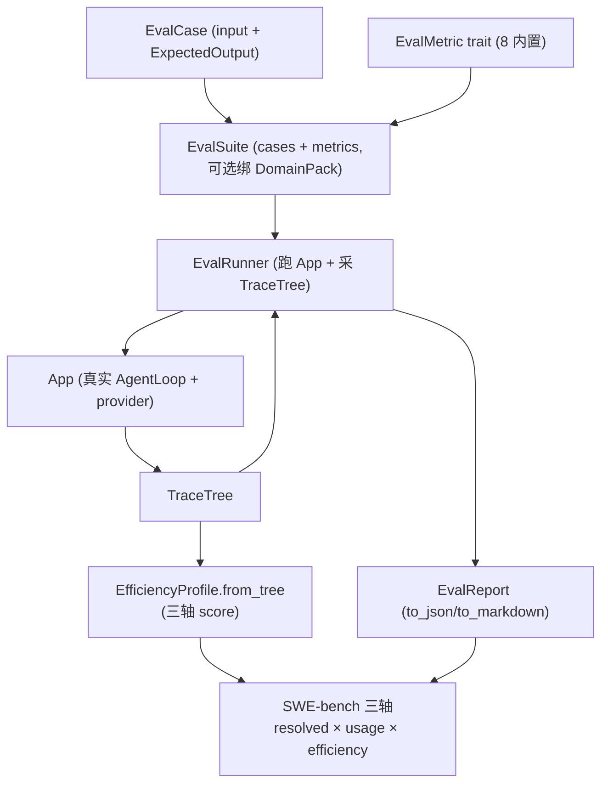

# OneAI 评测机制

> `EvalCase`/`ExpectedOutput`/`EvalMetric`/`EvalRunner`/`EvalReport` + 6 内置指标 + 4 套件 + 记忆评测子套件：让 Agent 的好坏可量化；SWE-bench 三轴（能力×用量×效率）做 coding agent 真实仓库评测，避免"只看 resolved"的单一视角。

## 1. 概述（是什么）

`oneai-eval` 是 OneAI 的结构化评测框架。它把"agent 好不好"拆成可复现的工程问题：定义用例（`EvalCase` + `ExpectedOutput`）、选打分策略（`EvalMetric` trait）、跑执行引擎（`EvalRunner` 跑用例对 App、采轨迹、打分）、出聚合报告（`EvalReport`，JSON/Markdown）。它还提供记忆子系统专用评测（`memory` 子模块，对齐 LongMemEval 5 能力 + Mem0 F1/BLEU1 + Recall@k/NDCG），以及 SWE-bench 三轴接入——用真实仓库 + 外部 harness 判定，按能力/用量/效率三轴采集。

这一层位于特性层、依赖 `oneai-core`（`LlmProvider`/`UsageTracker`）与 `oneai-trace`（`TraceTree`→效率轴），被 `oneai-app`（`AppBuilder` 造被测 App）与 CLI `oneai eval` 消费。设计姿态是"评测与执行同源"——`EvalRunner` 直驱真实 `App` 跑真实 AgentLoop，记忆评测则直驱 `MemoryManager`（replay 多会话 planted facts → 召回 → 确定性打分），消除 evaluator 自身不确定性污染子系统分。

## 2. 职责与能力（做什么）

**用例与期望。** `EvalCase`（input + `ExpectedOutput` + 可选 DomainPack/轨迹期望）；`ExpectedOutput` 六变体 `#[non_exhaustive]`：`Exact`/`Contains`/`Regex`/`LlmJudge{rubric,min_score}`/`Trajectory{expected_tools,max_iterations}`/`Custom`（`EvalJudge` impl，不可序列化、仅程序用）。

**指标 trait。** `EvalMetric` trait + 8 内置：`ExactMatchMetric`/`ContainsMatchMetric`/`RegexMatchMetric`/`TrajectoryMetric`/`LlmJudgeMetric`（带 provider）/`CustomJudgeMetric`/`CompositeMetric`（加权/等权组合）/`EfficiencyMetric`（带 token/latency 上限）。

**执行与报告。** `EvalRunner`（+ `EvalRunnerConfig`）跑用例对 `App`、采 `TraceTree`、打分；`EvalReport` 聚合统计 + `to_json`/`to_markdown`。

**套件。** `EvalSuite` + `EvalSuiteBuilder`；内置 `coding_suite`/`tool_use_suite`/`general_suite`/`efficiency_suite` + `get_builtin_suite(name)`。

**记忆评测子套件。** `oneai-eval::memory`：LongMemEval 5 能力（IE/MR/TR/KU/ABS）+ Mem0 F1/BLEU1 + Recall@k/NDCG@k；`DeterministicEmbeddingService`（字节直方图）离线占位，CI 无 key 可演示语义召回增益。

**效率轴。** `EfficiencyProfile`：`from_tree(TraceTree)` 派生 `cache_hit_ratio`/`tokens_per_iter`/`inference_ratio` + `three_axis_score(quality)`（能力×用量×效率，cheap 胜 pricey）。

**SWE-bench 三轴。** 接 SWE-bench Lite/Verified：能力轴外部 harness 判 `resolved`（`SwebenchJudge` 调 Python subprocess）、用量轴 `UsageTracker`（纯 token 无 USD）、效率轴 `TraceMetrics` + 阶段 wall-clock 拆解。

**显式不做什么**：不实现 LLM 推理（跑真实 provider/AgentLoop）；不做 USD 成本（已移除，可比口径是 `api_calls`/token）；不训练/微调模型；不取代轨迹（消费 `oneai-trace`）。

## 3. 设计动机（为什么这样实现）

| 决策 | 理由 | 否决的替代方案 |
|---|---|---|
| `EvalMetric` trait + 多变体而非单一分数 | agent 质量是多维的（精确匹配/包含/正则/LLM 裁判/轨迹/效率），不同用例要不同打分；trait 让指标可组合（`CompositeMetric`）| 单一分数 → 无法定位短板、不可组合 |
| `ExpectedOutput` 含 `Trajectory`（期望工具路径）| agent 不只看结果对不对，还要看走对没有（数学题该用 calculator、研究题该用 search）；轨迹期望让"执行路径正确"可评 | 只评结果 → 走错路得对结果也被判过 |
| `LlmJudgeMetric` 用 LLM 裁判而非纯规则 | 开放式问答无精确匹配标准；LLM 按 rubric 0-10 打分能评语义质量；规则评不了语义 | 纯规则 → 开放问答无法评 |
| `Custom` 变体不可序列化、仅程序用 | 程序用例可能需自定义 `EvalJudge` impl（闭包/复杂逻辑），无法序列化；其余变体可序列化以存盘共享 | 强制全可序列化 → 自定义逻辑无处安放 |
| 评测直驱真实 `App`/AgentLoop 而非 mock | 评测要反映真实行为，mock 会掩盖真实问题；`EvalRunner` 跑真实 App 采真实轨迹 | mock provider → 评测失真 |
| 记忆评测直驱 `MemoryManager`、不依赖完整 AgentLoop | 记忆子系统分要隔离 evaluator 自身不确定性；replay 多会话 planted facts → 召回 → 确定性 answer → 打分，消除 agent loop 不确定性污染 | 走完整 AgentLoop → 评测分混入推理不确定性 |
| `DeterministicEmbeddingService` 离线占位 | CI 无 API key 也要能演示语义召回增益（§12.1 keyword recall@5=0 vs 语义=1.0）；字节直方图向量作离线替身 | CI 必须有 key → CI 脆弱 |
| SWE-bench 三轴而非单一 resolved | "resolved"只看结果，忽略"用 10× token 解出"与"用 5 轮 vs 50 轮"；三轴（能力×用量×效率）让 trade-off 可见 | 只看 resolved → 高成本低效率方案被高估 |
| 用量轴纯 token、移除 USD | 定价易变、且与整体"无 USD 成本"决策一致；可比口径是 `api_calls`/token | 记 USD → 依赖易变定价、跨版本不可比 |
| `EfficiencyProfile.three_axis_score` cheap 胜 pricey | 三轴分数应让"同等能力更省"得分更高；cheap 的 token/latency 低 → 分数高 | 不区分成本 → 无法激励提效 |

## 4. 架构与核心抽象



**核心类型：**

```rust
#[non_exhaustive]
pub enum ExpectedOutput {
    Exact { answer: String },
    Contains { substrings: Vec<String>, case_sensitive: bool },
    Regex { pattern: String },
    LlmJudge { rubric: String, min_score: f64 },
    Trajectory { expected_tools: Vec<String>, max_iterations: usize },
    Custom { /* EvalJudge impl，不序列化 */ },
}

pub trait EvalMetric: Send + Sync { /* score(output, trace) -> f64 */ }

pub struct EfficiencyProfile {
    pub fn from_tree(tree: &TraceTree) -> Self;
    pub fn three_axis_score(&self, quality: f64) -> f64;   // cheap > pricey
    pub fn cache_hit_ratio(&self) -> f64;
}
```

## 5. 参与的流程

**通用评测：**

1. `EvalSuiteBuilder` 组 case + metric（可选绑 DomainPack 让被测 App 走特定领域配置）。
2. `EvalRunner::run(suite)` 对每个 case 造/复用 `App`，跑真实 AgentLoop，采 `TraceTree`。
3. 各 `EvalMetric::score(output, trace)` 打分；`Trajectory` 查 trace 里 `expected_tools` 是否被调、`max_iterations` 是否超。
4. `EvalReport` 聚合 + `to_markdown`/`to_json`。

**记忆评测（`oneai-eval::memory`）：**

1. `builtin_suite()`（10 用例覆盖 5 能力 + 同义反例）或 `load_suite_jsonl`（兼容 LongMemEval/Mem0 schema）。
2. runner replay 多会话 planted facts → `recall_facts_with_config` → 合成确定性 answer → 打分（`recall_at_k`/`ndcg_at_k` 纯 Rust、`f1`/`bleu1` CJK 按字符切分、`abstention`、可选 `llm_judge`）。
3. `--no-embedding` 对比 keyword 基线 vs 语义召回增益。

**SWE-bench 三轴：** 每条实例 `git clone` → `checkout base_commit` → `problem_statement` 驱动 agent（CodingPack 提供 read/edit/grep/glob/shell）→ `git diff` 收 patch → 外部 harness 判 `resolved`（`SwebenchJudge` 调 Python subprocess）→ 三轴（resolved / `UsageTracker` / `TraceMetrics`+wall-clock）写 `EvalResult`。产物 `predictions.jsonl` + `leaderboard.json`（swebench.com 提交 schema，USD 字段已移除）。

## 6. 依赖关系

| 方向 | 谁 | 内容 |
|---|---|---|
| 上游 | `oneai-core` | `LlmProvider`/`UsageTracker`/`Conversation` |
| 上游 | `oneai-trace` | `TraceTree`→效率轴/轨迹指标 |
| 上游 | `serde`/`regex` | 用例/报告序列化、正则匹配 |
| 下游 | `oneai-app` | `AppBuilder` 造被测 App |
| 下游 | `oneai-memory` | 记忆评测子套件直驱 `MemoryManager` |
| 下游 | CLI | `eval list/run/score/replay/swebench/memory` |
| 横切接入 | DomainPack | 套件可选绑 DomainPack，让被测 App 走特定领域配置 |
| 横切接入 | SWE-bench 脚本 | `scripts/swebench/`（`export_dataset.py` 等）|

## 7. 关键类型与文件

| 项 | 位置 |
|---|---|
| `EvalCase` + `ExpectedOutput`（6 变体）| `crates/oneai-eval/src/eval_case.rs:31,111` |
| `EvalMetric` trait + 8 内置指标 | `crates/oneai-eval/src/eval_metric.rs:122` + `builtin_metrics.rs:31,105,202,278,455,664,723,810` |
| `EvalSuite` + `EvalSuiteBuilder` | `crates/oneai-eval/src/eval_suite.rs:37,110` |
| `EvalRunner` + `EvalRunnerConfig` | `crates/oneai-eval/src/eval_runner.rs:104,42` |
| `EvalReport`（`to_json`/`to_markdown`）| `crates/oneai-eval/src/eval_result.rs:295,322,327` |
| 内置套件（coding/tool_use/general/efficiency）| `crates/oneai-eval/src/builtin_suites.rs:28,110,170,238` |
| `EfficiencyProfile`（`three_axis_score`/`from_tree`/`cache_hit_ratio`）| `crates/oneai-eval/src/efficiency.rs:27,187,68,157` |
| 记忆评测子套件 | `crates/oneai-eval/src/memory.rs` + `memory/{case,metrics,suite,runner}.rs` |
| replay（确定性重放）| `crates/oneai-eval/src/replay.rs` |
| 报告格式 | `crates/oneai-eval/src/report_format.rs` |
| SWE-bench 脚本 | `scripts/swebench/` |
| CLI 子命令 | `examples/cli/src/cmd_eval.rs` |

## 8. 与业界对比

| 系统 | 模型 | OneAI 取舍 |
|---|---|---|
| **SWE-bench** | 真实仓库 PR 评测 coding agent（resolved 单一指标）| OneAI 接入并扩展为三轴（能力×用量×效率），让 trade-off 可见而非只看 resolved |
| **LangSmith/Eval** | SaaS 评测 + dataset + LLM judge | OneAI 自托管等价：`EvalCase`/`EvalMetric`/`EvalRunner` 全在 crate 内，`LlmJudgeMetric` 同源思路 |
| **DeepEval / promptfoo** | LLM 单元测试框架（指标库）| OneAI 多了 `TrajectoryMetric`（评执行路径）+ `EfficiencyProfile`（评成本效率），不止评输出 |
| **LongMemEval / Mem0 bench** | 记忆系统专用基准（5 能力 / F1+BLEU+judge）| OneAI `oneai-eval::memory` 直接对齐这两套，且 `DeterministicEmbeddingService` 让 CI 无 key 可跑 |
| **OpenAI Evals** | 评测框架 + runner | OneAI 同类，但评测直驱真实 AgentLoop（非 mock）+ 与轨迹同源（`TraceTree`→指标）|

OneAI 独特点：**评测与执行/轨迹同源**（直驱真实 App + `TraceTree` 派生指标）+ **三轴让 trade-off 可见**（不只 resolved）+ **记忆子系统评测隔离 evaluator 不确定性**（直驱 `MemoryManager`）。

## 9. 扩展点与配置

- **写用例**：`EvalCase::new(input, ExpectedOutput::Exact{...})` 或 JSONL（`load_suite_jsonl`）。
- **自定义指标**：impl `EvalMetric`，或用 `CompositeMetric` 加权组合现有指标。
- **绑 DomainPack**：套件绑 pack 让被测 App 走特定领域配置。
- **LLM judge**：`LlmJudgeMetric::with_provider(provider)` + rubric。
- **记忆评测**：`oneai eval memory --suite builtin` vs `--no-embedding` 对比。
- **SWE-bench**：`oneai eval swebench`（需 `scripts/swebench/` + Python harness）。
- **CLI**：`eval list/run/score/replay/swebench/memory`（详见 [cli-reference](cli-reference.md)）。

## 10. 深入阅读

- [trace-mechanism.md](trace-mechanism.md) —— `TraceTree`→效率轴的数据来源
- [memory-mechanism.md](memory-mechanism.md) —— 记忆评测子套件对齐 LongMemEval/Mem0
- [provider-mechanism.md](provider-mechanism.md) —— 用量轴的 `UsageTracker`（纯 token 无 USD）
- [domain-pack-mechanism.md](domain-pack-mechanism.md) —— 套件绑 DomainPack
- 源码：`crates/oneai-eval/src/`（22 文件 / ~5K LOC）
- [CLAUDE.md — UsageTracker 章节](../CLAUDE.md)
