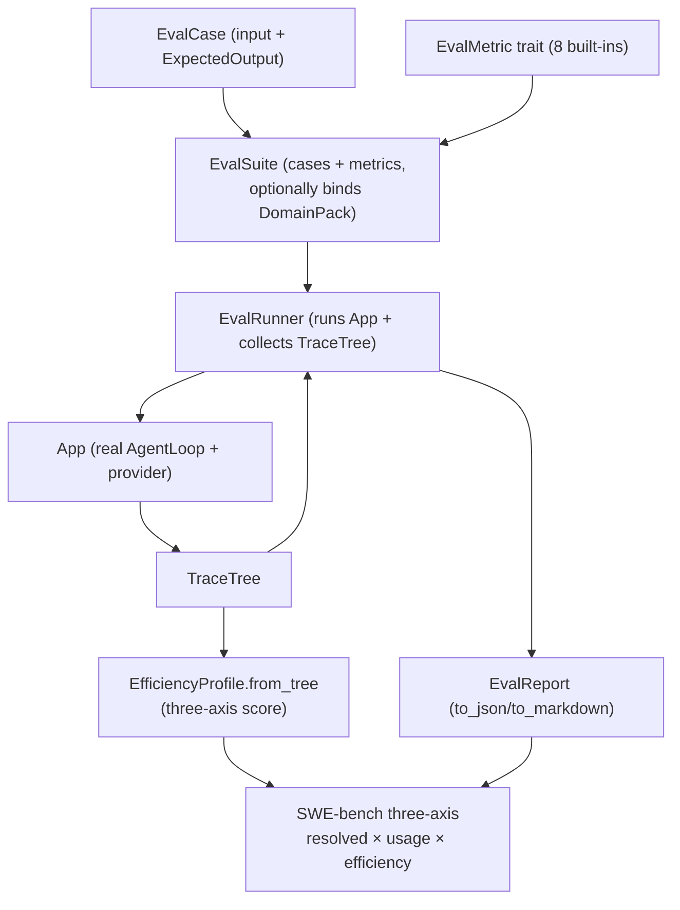

# OneAI Eval Mechanism

> `EvalCase`/`ExpectedOutput`/`EvalMetric`/`EvalRunner`/`EvalReport` + 8 built-in metrics + 4 suites + a memory eval sub-suite: makes agent quality quantifiable; SWE-bench three-axis (quality × usage × efficiency) does real-repo coding-agent eval, avoiding the "resolved-only" single view.

## 1. Overview (what it is)

`oneai-eval` is OneAI's structured evaluation framework. It breaks "is the agent good" into a reproducible engineering problem: define cases (`EvalCase` + `ExpectedOutput`), pick scoring strategies (the `EvalMetric` trait), run the execution engine (`EvalRunner` runs cases against an App, collects traces, scores), and produce an aggregated report (`EvalReport`, JSON/Markdown). It also provides a memory-subsystem-specific eval (the `memory` sub-module, aligned with LongMemEval 5 abilities + Mem0 F1/BLEU1 + Recall@k/NDCG), and SWE-bench three-axis integration — real repos + external harness judging, collecting along quality/usage/efficiency.

This layer sits in the feature layer, depending on `oneai-core` (`LlmProvider`/`UsageTracker`) and `oneai-trace` (`TraceTree`→efficiency axis), consumed by `oneai-app` (`AppBuilder` builds the App under test) and CLI `oneai eval`. The posture is "eval and execution same-source" — `EvalRunner` drives a real `App` running the real AgentLoop; the memory eval drives `MemoryManager` directly (replay multi-session planted facts → recall → deterministic scoring), eliminating evaluator uncertainty polluting the subsystem score.

## 2. Responsibilities & capabilities (what it does)

**Cases & expectations.** `EvalCase` (input + `ExpectedOutput` + optional DomainPack/trajectory expectation); `ExpectedOutput` six variants `#[non_exhaustive]`: `Exact`/`Contains`/`Regex`/`LlmJudge{rubric,min_score}`/`Trajectory{expected_tools,max_iterations}`/`Custom` (an `EvalJudge` impl, not serializable, programmatic only).

**Metric trait.** `EvalMetric` trait + 8 built-ins: `ExactMatchMetric`/`ContainsMatchMetric`/`RegexMatchMetric`/`TrajectoryMetric`/`LlmJudgeMetric` (with provider)/`CustomJudgeMetric`/`CompositeMetric` (weighted/equal-weight compose)/`EfficiencyMetric` (with token/latency caps).

**Execution & report.** `EvalRunner` (+ `EvalRunnerConfig`) runs cases against an `App`, collects `TraceTree`, scores; `EvalReport` aggregates stats + `to_json`/`to_markdown`.

**Suites.** `EvalSuite` + `EvalSuiteBuilder`; built-in `coding_suite`/`tool_use_suite`/`general_suite`/`efficiency_suite` + `get_builtin_suite(name)`.

**Memory eval sub-suite.** `oneai-eval::memory`: LongMemEval 5 abilities (IE/MR/TR/KU/ABS) + Mem0 F1/BLEU1 + Recall@k/NDCG@k; `DeterministicEmbeddingService` (byte histogram) as an offline placeholder, CI without a key can demonstrate the semantic-recall gain.

**Efficiency axis.** `EfficiencyProfile`: `from_tree(TraceTree)` derives `cache_hit_ratio`/`tokens_per_iter`/`inference_ratio` + `three_axis_score(quality)` (quality × usage × efficiency, cheap beats pricey).

**SWE-bench three-axis.** Integrates SWE-bench Lite/Verified: quality axis external harness judges `resolved` (`SwebenchJudge` calls a Python subprocess), usage axis `UsageTracker` (token-only, no USD), efficiency axis `TraceMetrics` + per-stage wall-clock breakdown.

**Explicitly does not**: no LLM inference (runs the real provider/AgentLoop); no USD cost (removed, the comparable axis is `api_calls`/tokens); no model training/fine-tuning; does not replace tracing (consumes `oneai-trace`).

## 3. Design motivation (why this way)

| Decision | Rationale | Rejected alternative |
|---|---|---|
| `EvalMetric` trait + multi-variant, not a single score | Agent quality is multi-dimensional (exact/contains/regex/LLM-judge/trajectory/efficiency); different cases need different scoring; the trait lets metrics compose (`CompositeMetric`) | Single score → can't locate weak spots, not composable |
| `ExpectedOutput` includes `Trajectory` (expected tool path) | An agent is judged not only on the result but on taking the right path (a math problem should use calculator, a research question should use search); trajectory expectations make "the execution path is correct" evaluable | Result-only → wrong path to a right result judged as pass |
| `LlmJudgeMetric` uses an LLM judge, not pure rules | Open-ended Q&A has no exact-match standard; an LLM scoring 0-10 by rubric evaluates semantic quality; rules can't evaluate semantics | Pure rules → can't evaluate open-ended semantics |
| `Custom` variant not serializable, programmatic only | A programmatic case may need a custom `EvalJudge` impl (closure/complex logic), not serializable; the other variants are serializable for storage/sharing | Force all serializable → custom logic has nowhere to live |
| Eval drives a real `App`/AgentLoop, not a mock | Eval must reflect real behavior; mocks hide real issues; `EvalRunner` runs a real App collecting real traces | Mock provider → eval skewed |
| Memory eval drives `MemoryManager` directly, not the full AgentLoop | The memory-subsystem score must isolate evaluator uncertainty; replay multi-session planted facts → recall → deterministic answer → score, eliminating agent-loop uncertainty | Full AgentLoop → the score mixes in inference uncertainty |
| `DeterministicEmbeddingService` offline placeholder | CI without an API key can still demonstrate the semantic-recall gain (§12.1 keyword recall@5=0 vs semantic=1.0); a byte-histogram vector as an offline stand-in | CI must have a key → CI brittle |
| SWE-bench three-axis, not single resolved | "resolved" sees only the result, ignoring "solved with 10× tokens" and "5 turns vs 50"; three-axis (quality × usage × efficiency) makes the trade-off visible | resolved-only → high-cost low-efficiency solutions overrated |
| Usage axis token-only, USD removed | Pricing is volatile and consistent with the "no USD cost" decision; the comparable axis is `api_calls`/tokens | Record USD → depends on volatile pricing, not comparable across versions |
| `EfficiencyProfile.three_axis_score` cheap beats pricey | The three-axis score should reward "same quality, cheaper"; cheap's lower tokens/latency → higher score | No cost distinction → no incentive to optimize efficiency |

## 4. Architecture & core abstractions



**Core types:**

```rust
#[non_exhaustive]
pub enum ExpectedOutput {
    Exact { answer: String },
    Contains { substrings: Vec<String>, case_sensitive: bool },
    Regex { pattern: String },
    LlmJudge { rubric: String, min_score: f64 },
    Trajectory { expected_tools: Vec<String>, max_iterations: usize },
    Custom { /* EvalJudge impl, not serialized */ },
}

pub trait EvalMetric: Send + Sync { /* score(output, trace) -> f64 */ }

pub struct EfficiencyProfile {
    pub fn from_tree(tree: &TraceTree) -> Self;
    pub fn three_axis_score(&self, quality: f64) -> f64;   // cheap > pricey
    pub fn cache_hit_ratio(&self) -> f64;
}
```

## 5. Flows it participates in

**General eval:**

1. `EvalSuiteBuilder` composes cases + metrics (optionally binds a DomainPack so the App under test uses a specific domain config).
2. `EvalRunner::run(suite)` builds/reuses an `App` per case, runs the real AgentLoop, collects `TraceTree`.
3. Each `EvalMetric::score(output, trace)` scores; `Trajectory` checks `expected_tools` were called and `max_iterations` not exceeded.
4. `EvalReport` aggregates + `to_markdown`/`to_json`.

**Memory eval (`oneai-eval::memory`):**

1. `builtin_suite()` (10 cases covering 5 abilities + synonym counter-examples) or `load_suite_jsonl` (LongMemEval/Mem0 schema-compatible).
2. The runner replays multi-session planted facts → `recall_facts_with_config` → composes a deterministic answer → scores (`recall_at_k`/`ndcg_at_k` pure Rust, `f1`/`bleu1` CJK char-split, `abstention`, optional `llm_judge`).
3. `--no-embedding` compares the keyword baseline vs semantic-recall gain.

**SWE-bench three-axis:** per instance `git clone` → `checkout base_commit` → drive the agent with `problem_statement` (CodingPack provides read/edit/grep/glob/shell) → `git diff` collect patch → external harness judges `resolved` (`SwebenchJudge` calls a Python subprocess) → three-axis (resolved / `UsageTracker` / `TraceMetrics`+wall-clock) written to `EvalResult`. Outputs `predictions.jsonl` + `leaderboard.json` (swebench.com submission schema, USD fields removed).

## 6. Dependencies

| Direction | Who | What |
|---|---|---|
| Upstream | `oneai-core` | `LlmProvider`/`UsageTracker`/`Conversation` |
| Upstream | `oneai-trace` | `TraceTree`→efficiency axis/trajectory metrics |
| Upstream | `serde`/`regex` | case/report serialization, regex matching |
| Downstream | `oneai-app` | `AppBuilder` builds the App under test |
| Downstream | `oneai-memory` | the memory eval sub-suite drives `MemoryManager` directly |
| Downstream | CLI | `eval list/run/score/replay/swebench/memory` |
| Cross-cutting | DomainPack | a suite may bind a DomainPack so the App under test uses a specific domain config |
| Cross-cutting | SWE-bench scripts | `scripts/swebench/` (`export_dataset.py`, etc.) |

## 7. Key types & files

| Item | Location |
|---|---|
| `EvalCase` + `ExpectedOutput` (6 variants) | `crates/oneai-eval/src/eval_case.rs:31,111` |
| `EvalMetric` trait + 8 built-in metrics | `crates/oneai-eval/src/eval_metric.rs:122` + `builtin_metrics.rs:31,105,202,278,455,664,723,810` |
| `EvalSuite` + `EvalSuiteBuilder` | `crates/oneai-eval/src/eval_suite.rs:37,110` |
| `EvalRunner` + `EvalRunnerConfig` | `crates/oneai-eval/src/eval_runner.rs:104,42` |
| `EvalReport` (`to_json`/`to_markdown`) | `crates/oneai-eval/src/eval_result.rs:295,322,327` |
| Built-in suites (coding/tool_use/general/efficiency) | `crates/oneai-eval/src/builtin_suites.rs:28,110,170,238` |
| `EfficiencyProfile` (`three_axis_score`/`from_tree`/`cache_hit_ratio`) | `crates/oneai-eval/src/efficiency.rs:27,187,68,157` |
| Memory eval sub-suite | `crates/oneai-eval/src/memory.rs` + `memory/{case,metrics,suite,runner}.rs` |
| replay (deterministic replay) | `crates/oneai-eval/src/replay.rs` |
| Report format | `crates/oneai-eval/src/report_format.rs` |
| SWE-bench scripts | `scripts/swebench/` |
| CLI subcommand | `examples/cli/src/cmd_eval.rs` |

## 8. Industry comparison

| System | Model | OneAI's trade-off |
|---|---|---|
| **SWE-bench** | real-repo PR eval of coding agents (single resolved metric) | OneAI integrates and extends to three-axis (quality × usage × efficiency), making the trade-off visible, not just resolved |
| **LangSmith/Eval** | SaaS eval + dataset + LLM judge | OneAI self-hosted equivalent: `EvalCase`/`EvalMetric`/`EvalRunner` all in-crate; `LlmJudgeMetric` the same idea |
| **DeepEval / promptfoo** | LLM unit-test frameworks (metric libraries) | OneAI adds `TrajectoryMetric` (eval the execution path) + `EfficiencyProfile` (eval cost-efficiency), not just output |
| **LongMemEval / Mem0 bench** | memory-system-specific benchmarks (5 abilities / F1+BLEU+judge) | OneAI's `oneai-eval::memory` directly aligns with these two, and `DeterministicEmbeddingService` lets CI run without a key |
| **OpenAI Evals** | eval framework + runner | OneAI is similar, but eval drives the real AgentLoop (not mock) + same-source with tracing (`TraceTree`→metrics) |

OneAI's distinct points: **eval same-source with execution/tracing** (drives the real App + `TraceTree` derives metrics) + **three-axis makes the trade-off visible** (not just resolved) + **memory-subsystem eval isolates evaluator uncertainty** (drives `MemoryManager` directly).

## 9. Extension points & config

- **Write a case**: `EvalCase::new(input, ExpectedOutput::Exact{...})` or JSONL (`load_suite_jsonl`).
- **Custom metric**: impl `EvalMetric`, or use `CompositeMetric` to weighted-compose existing metrics.
- **Bind DomainPack**: a suite binds a pack so the App under test uses a specific domain config.
- **LLM judge**: `LlmJudgeMetric::with_provider(provider)` + rubric.
- **Memory eval**: `oneai eval memory --suite builtin` vs `--no-embedding` compare.
- **SWE-bench**: `oneai eval swebench` (needs `scripts/swebench/` + Python harness).
- **CLI**: `eval list/run/score/replay/swebench/memory` (see [cli-reference](cli-reference_EN.md)).

## 10. Further reading

- [trace-mechanism](trace-mechanism_EN.md) — the `TraceTree` data source for the efficiency axis
- [memory-mechanism](memory-mechanism_EN.md) — the memory eval sub-suite aligns with LongMemEval/Mem0
- [provider-mechanism](provider-mechanism_EN.md) — the usage axis's `UsageTracker` (token-only, no USD)
- [domain-pack-mechanism](domain-pack-mechanism_EN.md) — a suite binds a DomainPack
- Source: `crates/oneai-eval/src/` (22 files / ~5K LOC)
- [CLAUDE.md — UsageTracker](../CLAUDE.md)
