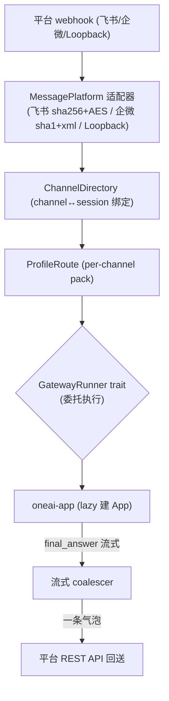

# OneAI Gateway 机制

> 消息平台桥接——把 OneAI 变成可达的 Agent：飞书 bot / 企业微信公众号 / 任意推送 webhook 到 HTTP 的平台。入站消息驱动真实 AgentLoop 一轮，`final_answer` 经平台 REST API 回送；纯协议 crate、零 `oneai-*` 依赖，坐在 `oneai-app` 之下同 `oneai-studio`/`oneai-supervisor`。

## 1. 概述（是什么）

`oneai-gateway` 让 OneAI 从"单进程 UI 客户端"变成"可达的 Agent"。原生 App（macOS/Win/iOS/Android/HarmonyOS）是单进程 UI，但飞书 bot、企业微信公众号等平台经 HTTP webhook 推消息进来——gateway 接这些 webhook，把入站消息驱动一轮真实 `AgentLoop`，再把 agent 的 `final_answer` 经平台 REST API 回送。

它是**纯协议 crate、零 `oneai-*` 依赖**——故意坐在 `oneai-app` 之下而非特性层，与 `oneai-studio`/`oneai-supervisor` 同构（都是挂载在 app 侧的辅助服务，trait 由 CLI/app 注入、不加 `AppBuilder` 方法）。执行逻辑经 `GatewayRunner` trait 委托，gateway 自身不跑 AgentLoop。这一设计让 gateway 能在最小依赖下复用——`oneai-a2a` 就依赖它复用 axum/HTTP 基座。

## 2. 职责与能力（做什么）

**通道目录。** `ChannelDirectory`（`ChannelBinding`）持久化 channel ↔ 会话绑定，`resolve_or_mint` 解析或铸造绑定，`get`/`list`/`forget` 管理；`default_root` 落 `~/.oneai`，`in_memory` 测试用。

**路由画像。** `ProfileRoute`（per-channel pack 路由）+ `RouteEntry` + `resolve(channel)` 决定该 channel 用哪个 DomainPack（per-channel pack lazy App）。

**平台适配器。** `MessagePlatform` trait + 适配器：飞书（sha256 签名 + AES 解密）、企业微信（sha1 签名 + quick-xml）、Loopback（测试）。

**事件模型。** `ChannelId`（platform + raw）+ `Sender`（`anonymous` 等）+ `Event` 抽象入站消息。

**webhook + 投递。** axum webhook 接入站 + `GatewayRunner` trait 委托执行 + `deliver_scheduled`（被 `oneai-scheduler` 复用作 cron 投递 seam）+ 流式 coalescer（防淹没，飞书一条气泡）。

**GatewayRunner trait。** 执行委托 seam——gateway 不跑 AgentLoop，runner 由注入决定（app 侧 lazy 建 App）。

**显式不做什么**：不跑 AgentLoop（委托 runner）；不持久化对话（归 persistence）；不实现平台 SDK（只协议层：签名校验 + 消息收发）；不加 `AppBuilder` 方法（trait 由 CLI 注入）。

## 3. 设计动机（为什么这样实现）

| 决策 | 理由 | 否决的替代方案 |
|---|---|---|
| 纯协议 crate、零 `oneai-*` 依赖 | gateway 是协议桥接，不该拖入整个引擎依赖；坐在 app 下同 studio/supervisor，trait 由 CLI/app 注入 | 依赖 app → 反向依赖、循环 |
| `GatewayRunner` trait 委托执行 | gateway 不应自己跑 AgentLoop（与 app 双重装配）；trait 让执行委托，gateway 只管协议 + 消息收发 | 自跑 AgentLoop → 装配重复、与真实行为漂移 |
| per-channel pack lazy App | 不同 channel（飞书/企微）可能要不同 DomainPack（客服 vs 运维）；lazy 建首消息时才装配 App，省资源 | 全 channel 共一 App → 领域无法分流 |
| `ChannelDirectory` 持久绑定 | 同一 channel 多条消息要归同一会话（上下文连续）；directory 持久 channel↔session 绑定 | 每次新建会话 → 上下文断 |
| 飞书 sha256 + AES / 企微 sha1 + quick-xml | 各平台签名/加密协议不同，按平台原生协议实现；quick-xml 0.41 修 RUSTSEC | 统一一种 → 不符合平台原生、被拒 |
| 流式 coalescer | agent 流式输出多 token，若 per-token 推平台会淹没（飞书限频）；coalescer 合并成一条气泡 | per-token 推 → 被限频、消息碎片 |
| `deliver_scheduled` 复用作 cron seam | scheduler 需投递目标，gateway 已有投递链路，复用不重复造 | scheduler 自建投递 → 重复 |
| 不加 `AppBuilder` 方法 | gateway 同 studio/supervisor 是挂载服务，trait 由 CLI 注入更一致，不让 AppBuilder 膨胀 | 加 AppBuilder 方法 → builder 膨胀、与同类服务不一致 |

## 4. 架构与核心抽象



**核心类型：**

```rust
pub struct ChannelDirectory { /* resolve_or_mint/get/list/forget */ }
pub struct ProfileRoute { pub fn resolve(&self, channel: &ChannelId) -> String; /* pack 名 */ }
pub trait MessagePlatform: Send + Sync { /* 飞书/企微/Loopback 适配 */ }
pub trait GatewayRunner: Send + Sync { /* 委托执行 AgentLoop */ }
pub struct ChannelId { platform, raw }   // key() 唯一标识
```

## 5. 参与的流程

**入站消息驱动一轮：**

1. 平台 webhook POST 到 gateway，适配器（飞书/企微）校验签名（sha256/sha1）+ 解密（AES/xml）。
2. `ChannelDirectory::resolve_or_mint(channel)` 解析该 channel 的会话绑定（无则铸造）。
3. `ProfileRoute::resolve(channel)` 决定用哪个 DomainPack，lazy 建对应 App（首消息才装配）。
4. `GatewayRunner` 驱动一轮真实 AgentLoop，消息作为 user message。
5. agent 的 `final_answer` 经流式 coalescer 合并成一条气泡，经平台 REST API 回送。

**cron 投递：** `oneai-scheduler` 的 `CronRunner` 投递 seam 复用 `Gateway.deliver_scheduled`，把定时触发的消息走同一入站链路。

## 6. 依赖关系

| 方向 | 谁 | 内容 |
|---|---|---|
| 上游 | `axum`/`reqwest`/`quick-xml`/`aes`/`sha2` | webhook、平台 REST API、企微 xml、飞书 AES、签名 |
| 上游 | **零 `oneai-*` 依赖** | 故意不依赖引擎 crate |
| 下游 | `oneai-app` / CLI | 注入 `GatewayRunner`（lazy 建 App）|
| 下游 | `oneai-a2a` | 复用 axum/HTTP 基座（代码复用非概念耦合）|
| 下游 | `oneai-scheduler` | `deliver_scheduled` 投递 seam |
| 横切接入 | env | 平台密钥/Token env |
| 横切接入 | CLI | `oneai gateway` 相关 |

## 7. 关键类型与文件

| 项 | 位置 |
|---|---|
| `ChannelDirectory` + `ChannelBinding`（`resolve_or_mint`/`get`/`list`/`forget`）| `crates/oneai-gateway/src/directory.rs:47,25,129,165,170,175` |
| `ProfileRoute` + `RouteEntry`（per-channel pack）| `crates/oneai-gateway/src/profile.rs:68,75,100` |
| `MessagePlatform` trait + 注册 | `crates/oneai-gateway/src/platform.rs:84,89` |
| `GatewayRunner` trait + `final_answer` | `crates/oneai-gateway/src/runner.rs:80,37` |
| `ChannelId` + `Sender` + `Event` | `crates/oneai-gateway/src/event.rs:16,40` |
| webhook + axum router | `crates/oneai-gateway/src/web.rs` |
| 飞书/企微/Loopback 适配器 | `crates/oneai-gateway/src/`（adapters 或 platform 内）|
| `GatewayError` | `crates/oneai-gateway/src/error.rs:8` |

## 8. 与业界对比

| 系统 | 模型 | OneAI 取舍 |
|---|---|---|
| **n8n / Zapier** | 触发+动作 DAG 集成平台 | OneAI gateway 是 agent 入站桥接，入站消息驱动一轮 AgentLoop 而非固定动作 DAG |
| **LangChain agent + Slack/Teams integration** | agent 接消息平台 | OneAI gateway 同源，但纯协议 crate 零引擎依赖 + per-channel pack 路由 + 流式 coalescer |
| **Botpress / Rasa** | 对话 bot 框架 | OneAI gateway 不是 bot 框架，是协议桥接——执行委托真实 AgentLoop，bot 逻辑在引擎 |
| **飞书/企微开放平台 SDK** | 平台原生 SDK | OneAI gateway 复用其协议（签名/AES/xml）但不依赖其 SDK，纯 Rust 实现 |

OneAI 独特点：**纯协议 crate 零引擎依赖**（坐 app 下同 studio/supervisor）+ **per-channel pack lazy App**（不同 channel 不同领域）+ **流式 coalescer 防平台限频** + **`deliver_scheduled` 复用作 cron 投递 seam**。

## 9. 扩展点与配置

- **接平台**：impl `MessagePlatform`（飞书 sha256+AES / 企微 sha1+xml / Loopback）。
- **per-channel pack**：`ProfileRoute` 配 channel→pack 路由。
- **注入 runner**：`GatewayRunner` trait 由 CLI/app 注入（lazy 建 App）。
- **通道目录**：`ChannelDirectory::default_root()` 落 `~/.oneai`。
- **cron 投递**：`deliver_scheduled` 复用。
- **CLI**：`oneai gateway` 相关子命令（详见 [cli-reference](cli-reference.md)）。

## 10. 深入阅读

- [scheduler-mechanism.md](scheduler-mechanism.md) —— `deliver_scheduled` 投递 seam 复用
- [a2a-mechanism.md](a2a-mechanism.md) —— 复用 gateway 的 axum/HTTP 基座
- [supervisor-mechanism.md](supervisor-mechanism.md) —— 同为 app 侧辅助服务
- [multi-agent-mechanism.md](multi-agent-mechanism.md) —— 入站消息驱动的 AgentLoop
- 源码：`crates/oneai-gateway/src/`（9 文件 / ~1.8K LOC）
