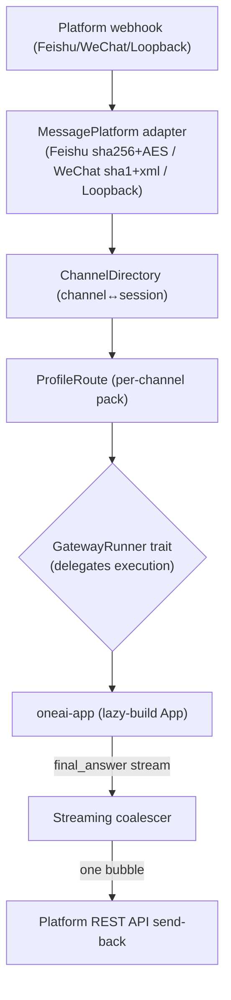

# OneAI Gateway Mechanism

> Message-platform bridge — turns OneAI into a reachable agent: a Feishu bot, a WeChat Official Account, or any platform that pushes events to an HTTP webhook. Inbound messages drive a real `AgentLoop` turn; the agent's `final_answer` is sent back over the platform's REST API. A pure protocol crate with **no `oneai-*` deps**, sitting below `oneai-app` alongside `oneai-studio`/`oneai-supervisor`.

## 1. Overview (what it is)

`oneai-gateway` turns OneAI from "a single-process UI client" into "a reachable agent." Native apps (macOS/Win/iOS/Android/HarmonyOS) are single-process UIs, but Feishu bots, WeChat Official Accounts, etc. push messages in via HTTP webhook — the gateway receives these, drives a real `AgentLoop` turn with the inbound message, and sends the agent's `final_answer` back via the platform's REST API.

It is a **pure protocol crate with zero `oneai-*` dependencies** — deliberately sitting below `oneai-app` (not the feature layer), isomorphic with `oneai-studio`/`oneai-supervisor` (app-side auxiliary services whose traits are injected by CLI/app, no `AppBuilder` methods). Execution logic is delegated via the `GatewayRunner` trait; the gateway itself does not run the AgentLoop. This design lets the gateway be reused with minimal deps — `oneai-a2a` depends on it to reuse the axum/HTTP base.

## 2. Responsibilities & capabilities (what it does)

**Channel directory.** `ChannelDirectory` (`ChannelBinding`) persists channel↔session bindings; `resolve_or_mint` resolves or mints a binding; `get`/`list`/`forget` manage; `default_root` lands in `~/.oneai`; `in_memory` for tests.

**Profile routing.** `ProfileRoute` (per-channel pack routing) + `RouteEntry` + `resolve(channel)` decides which DomainPack a channel uses (per-channel pack lazy App).

**Platform adapters.** `MessagePlatform` trait + adapters: Feishu (sha256 signature + AES decrypt), WeChat (sha1 signature + quick-xml), Loopback (test).

**Event model.** `ChannelId` (platform + raw) + `Sender` (`anonymous`, etc.) + `Event` abstracts inbound messages.

**Webhook + delivery.** axum webhook intake + `GatewayRunner` trait delegates execution + `deliver_scheduled` (reused by `oneai-scheduler` as the cron delivery seam) + streaming coalescer (anti-flooding, one Feishu bubble).

**GatewayRunner trait.** Execution delegation seam — the gateway does not run the AgentLoop; the runner is injected (app-side lazy-builds the App).

**Explicitly does not**: no AgentLoop execution (delegates to runner); no conversation persistence (persistence's job); no platform SDK (protocol layer only: signature verification + message send/receive); no `AppBuilder` method (trait injected by CLI).

## 3. Design motivation (why this way)

| Decision | Rationale | Rejected alternative |
|---|---|---|
| Pure protocol crate, zero `oneai-*` deps | The gateway is protocol bridging; it should not drag in the whole engine; sitting below app alongside studio/supervisor, trait injected by CLI/app | Depend on app → reverse dep, cycle |
| `GatewayRunner` trait delegates execution | The gateway should not run the AgentLoop itself (double-assembly with app); the trait delegates; the gateway only does protocol + message I/O | Self-run AgentLoop → duplicate assembly, drift |
| Per-channel pack lazy App | Different channels (Feishu/WeChat) may want different DomainPacks (support vs ops); lazy-build the App on first message saves resources | One shared App for all channels → no domain routing |
| `ChannelDirectory` persistent binding | Multiple messages from one channel must land in the same session (continuous context); the directory persists channel↔session | New session each time → context breaks |
| Feishu sha256 + AES / WeChat sha1 + quick-xml | Each platform's signature/crypto protocol differs; implement per native protocol; quick-xml 0.41 fixes RUSTSEC | Unify on one → doesn't match platform, rejected |
| Streaming coalescer | The agent streams many tokens; per-token pushes would flood platforms (Feishu rate-limits); the coalescer merges into one bubble | Per-token push → rate-limited, fragmented messages |
| `deliver_scheduled` reused as cron seam | The scheduler needs a delivery target; the gateway already has the delivery path; reuse, don't reinvent | Scheduler builds its own delivery → duplication |
| No `AppBuilder` method | The gateway, like studio/supervisor, is a mounted service; trait injected by CLI is more consistent, keeps AppBuilder lean | Add AppBuilder method → builder bloat, inconsistent with peers |

## 4. Architecture & core abstractions



**Core types:**

```rust
pub struct ChannelDirectory { /* resolve_or_mint/get/list/forget */ }
pub struct ProfileRoute { pub fn resolve(&self, channel: &ChannelId) -> String; /* pack name */ }
pub trait MessagePlatform: Send + Sync { /* Feishu/WeChat/Loopback adapters */ }
pub trait GatewayRunner: Send + Sync { /* delegate AgentLoop execution */ }
pub struct ChannelId { platform, raw }   // key() unique id
```

## 5. Flows it participates in

**Inbound message drives a turn:**

1. A platform webhook POSTs to the gateway; the adapter (Feishu/WeChat) verifies the signature (sha256/sha1) + decrypts (AES/xml).
2. `ChannelDirectory::resolve_or_mint(channel)` resolves the session binding for the channel (mints if absent).
3. `ProfileRoute::resolve(channel)` decides which DomainPack to use; lazy-builds the corresponding App (first message only).
4. `GatewayRunner` drives a real `AgentLoop` turn, the message as the user message.
5. The agent's `final_answer` is merged by the streaming coalescer into one bubble and sent back via the platform REST API.

**Cron delivery:** `oneai-scheduler`'s `CronRunner` delivery seam reuses `Gateway.deliver_scheduled`, routing the scheduled message through the same inbound path.

## 6. Dependencies

| Direction | Who | What |
|---|---|---|
| Upstream | `axum`/`reqwest`/`quick-xml`/`aes`/`sha2` | webhook, platform REST API, WeChat xml, Feishu AES, signatures |
| Upstream | **zero `oneai-*` deps** | deliberately no engine-crate deps |
| Downstream | `oneai-app` / CLI | injects `GatewayRunner` (lazy-build App) |
| Downstream | `oneai-a2a` | reuses axum/HTTP base (code reuse, not conceptual coupling) |
| Downstream | `oneai-scheduler` | `deliver_scheduled` delivery seam |
| Cross-cutting | env | platform secret/token env |
| Cross-cutting | CLI | `oneai gateway` related |

## 7. Key types & files

| Item | Location |
|---|---|
| `ChannelDirectory` + `ChannelBinding` (`resolve_or_mint`/`get`/`list`/`forget`) | `crates/oneai-gateway/src/directory.rs:47,25,129,165,170,175` |
| `ProfileRoute` + `RouteEntry` (per-channel pack) | `crates/oneai-gateway/src/profile.rs:68,75,100` |
| `MessagePlatform` trait + register | `crates/oneai-gateway/src/platform.rs:84,89` |
| `GatewayRunner` trait + `final_answer` | `crates/oneai-gateway/src/runner.rs:80,37` |
| `ChannelId` + `Sender` + `Event` | `crates/oneai-gateway/src/event.rs:16,40` |
| webhook + axum router | `crates/oneai-gateway/src/web.rs` |
| Feishu/WeChat/Loopback adapters | `crates/oneai-gateway/src/` (adapters or platform) |
| `GatewayError` | `crates/oneai-gateway/src/error.rs:8` |

## 8. Industry comparison

| System | Model | OneAI's trade-off |
|---|---|---|
| **n8n / Zapier** | Trigger+action DAG integration platforms | OneAI gateway is agent inbound bridging; inbound messages drive an AgentLoop turn, not a fixed action DAG |
| **LangChain agent + Slack/Teams integration** | Agent on message platforms | OneAI gateway is similar, but a pure protocol crate with zero engine deps + per-channel pack routing + streaming coalescer |
| **Botpress / Rasa** | Conversational bot frameworks | OneAI gateway is not a bot framework — it's a protocol bridge; execution delegates to the real AgentLoop; bot logic is in the engine |
| **Feishu/WeChat open-platform SDKs** | Platform-native SDKs | OneAI gateway reuses their protocols (signature/AES/xml) but does not depend on their SDKs — pure Rust |

OneAI's distinct points: **pure protocol crate, zero engine deps** (sits below app alongside studio/supervisor) + **per-channel pack lazy App** (different channels, different domains) + **streaming coalescer prevents platform rate-limiting** + **`deliver_scheduled` reused as the cron delivery seam**.

## 9. Extension points & config

- **Add platform**: impl `MessagePlatform` (Feishu sha256+AES / WeChat sha1+xml / Loopback).
- **Per-channel pack**: `ProfileRoute` configures channel→pack routing.
- **Inject runner**: `GatewayRunner` trait injected by CLI/app (lazy-build App).
- **Channel directory**: `ChannelDirectory::default_root()` lands in `~/.oneai`.
- **Cron delivery**: `deliver_scheduled` reuse.
- **CLI**: `oneai gateway` related subcommands (see [cli-reference](cli-reference_EN.md)).

## 10. Further reading

- [scheduler-mechanism](scheduler-mechanism_EN.md) — the `deliver_scheduled` delivery seam reused
- [a2a-mechanism](a2a-mechanism_EN.md) — reuses the gateway's axum/HTTP base
- [supervisor-mechanism](supervisor-mechanism_EN.md) — fellow app-side auxiliary service
- [multi-agent-mechanism](multi-agent-mechanism_EN.md) — the AgentLoop the inbound message drives
- Source: `crates/oneai-gateway/src/` (9 files / ~1.8K LOC)
