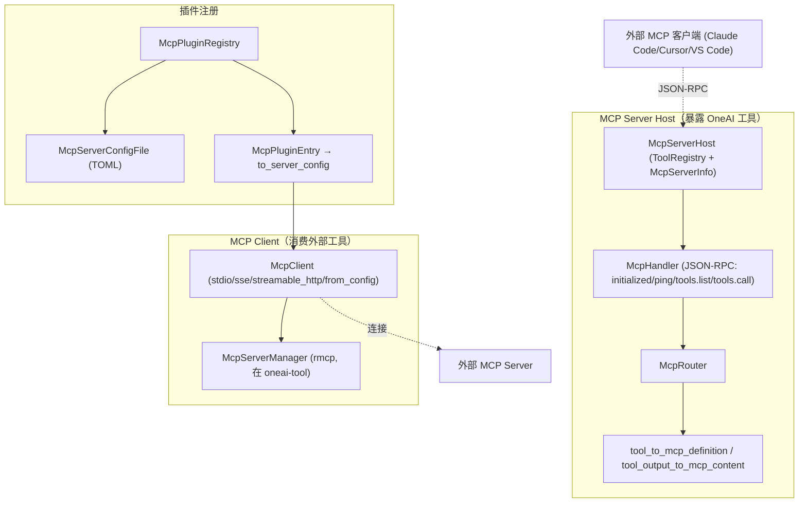

# OneAI MCP 机制

> MCP（Model Context Protocol）服务宿主 + 客户端 + 插件注册——让 OneAI 既是 MCP 服务端（把自己的工具暴露给 Claude Code/Cursor/VS Code 等外部 MCP 客户端），又是 MCP 客户端（连接外部 MCP server 复用其工具）；JSON-RPC 协议 + TOML 配置 + stdio/SSE/streamable-http 传输。

## 1. 概述（是什么）

`oneai-mcp` 是 OneAI 接入 MCP 生态的三合一能力。第一，**MCP Server Host**——把 OneAI 的 `ToolRegistry` 暴露成 MCP server，外部 MCP 客户端（Claude Code、Cursor、VS Code）能经 JSON-RPC 发现并调用 OneAI 工具。第二，**MCP Client**——连接外部 MCP server、发现其工具、调用它们，包装成更简洁的独立 API。第三，**McpPluginRegistry**——发现/配置/连接 MCP 插件，TOML 配置文件管理。

它位于特性层、依赖 `oneai-core`（`Tool` trait）与 `oneai-tool`（复用 `McpServerManager`/`rmcp` 基础设施），被 `oneai-app`（`AppBuilder` MCP 集成）与 CLI `oneai mcp` 消费。`oneai-tool` 的 `mcp_real.rs` 是客户端底层实现（基于 `rmcp`），本 crate 在其上包出更简洁的 `McpClient` API + 服务端宿主 + 插件注册。OneAI 因此是 MCP 的对等双向参与者——既能暴露工具也能消费工具。

## 2. 职责与能力（做什么）

**MCP Server Host。** `McpServerHost`（持 `ToolRegistry` + `McpServerInfo`）把 OneAI 工具暴露为 MCP 工具定义（`tool_to_mcp_definition`）+ 工具输出转 MCP content（`tool_output_to_mcp_content`）+ `McpHandler` 处理 JSON-RPC（`handle_initialized_notification`/`handle_ping`/tools/list/tools/call）+ `McpRouter`。

**MCP Client。** `McpClient`（`stdio`/`sse`/`streamable_http`/`from_config` 四构造器）+ `connect`/`discover_tools`/`call_tool`/`disconnect`/`is_connected`，包装 `McpServerManager` 出简洁独立 API。

**插件注册。** `McpPluginRegistry`（`from_config_file`/`from_config_path`/`add_entry`/`remove_entry`）+ `McpPluginEntry`（→`to_server_config`）+ `McpServerConfigFile`（`load_default`/`load_from`/`save_default`/`save_to` TOML）+ `default_config` + `default_path`。

**传输。** stdio（本地子进程）/SSE/streamable-http 三传输（复用 `oneai-tool` 的 `rmcp` 实现）。

**显式不做什么**：不实现 MCP 协议本身（基于 `rmcp`）；不做 LLM 推理；不持久化插件连接状态（每次 connect 独立）；客户端底层实现归 `oneai-tool/mcp_real.rs`（本 crate 包装）。

## 3. 设计动机（为什么这样实现）

| 决策 | 理由 | 否决的替代方案 |
|---|---|---|
| 服务端 + 客户端同 crate | OneAI 既是 MCP 服务端（暴露工具）又是客户端（消费工具），同 crate 保证两端协议一致 | 分两 crate → 协议实现漂移 |
| 复用 `oneai-tool` 的 `rmcp` 基础设施 | MCP 协议 + 传输已在 `mcp_real.rs` 实现（`McpServerManager`/`McpTransport`/`McpFramingParser`）；本 crate 在其上包更简洁 API，不重复造轮子 | 重写协议 → 重复、易漂移 |
| Server Host 暴露 `ToolRegistry` | OneAI 工具已实现 `Tool` trait，`tool_to_mcp_definition` 把它转 MCP 定义，复用现有工具面 | 为 MCP 单独实现一套工具 → 重复 |
| `McpPluginRegistry` + TOML 配置 | MCP 插件需跨 session 持久配置（哪些 server、怎么连）；TOML 可人编辑可存盘，`load_default`/`save_default` 管 `~/.oneai` 下 | 运行时硬编码 → 不可配、不可持久 |
| 三传输（stdio/sse/streamable-http）| 本地 MCP server 走 stdio、远程走 SSE/streamable-http，覆盖全场景；复用 `oneai-tool` 已有实现 | 只 stdio → 远程 server 不可接 |
| `McpClient` 简洁独立 API | `McpServerManager` 是完整管理器（生命周期复杂），`McpClient` 包出 connect/discover/call/disconnect 简洁面，降低使用门槛 | 直接暴露 Manager → API 复杂、门槛高 |
| `McpHandler` JSON-RPC handler | MCP 协议是 JSON-RPC（initialize/initialized/ping/tools.list/tools.call）；handler 显式分派各 method，便于扩展 | 通用 JSON-RPC 路由 → MCP 语义丢失 |

## 4. 架构与核心抽象



**核心类型：**

```rust
pub struct McpServerHost { tool_registry, server_info }
impl McpServerHost {
    pub fn tool_to_mcp_definition(tool: &Arc<dyn Tool>) -> serde_json::Value;
    pub fn tool_output_to_mcp_content(output: &ToolOutput) -> Vec<serde_json::Value>;
}
pub struct McpClient { /* stdio/sse/streamable_http/from_config */
    pub async fn connect(&self) -> Result<Vec<String>>;
    pub async fn discover_tools(&self) -> Result<Vec<McpToolInfo>>;
    pub async fn call_tool(&self, name: &str, args: &Value) -> Result<ToolOutput>;
}
pub struct McpPluginRegistry { /* from_config_file/add_entry/remove_entry */ }
pub struct McpServerConfigFile { /* load_default/save_default TOML */ }
```

## 5. 参与的流程

**作为服务端（暴露工具给外部 MCP 客户端）：**

1. `McpServerHost::new(tool_registry)` 或 `with_server_info` 造宿主。
2. `McpRouter` + `McpHandler` 处理 JSON-RPC：外部客户端 `initialize` → `initialized` 通知 → `ping` → `tools/list`（`tool_to_mcp_definition` 把 `ToolRegistry` 全工具转 MCP 定义）→ `tools/call`（执行工具 + `tool_output_to_mcp_content` 转结果）。
3. 经 stdio 或 HTTP 传输与外部客户端通信。

**作为客户端（消费外部 MCP server）：**

1. `McpClient::stdio(command, args)` 或 `sse(url)`/`streamable_http(url)`/`from_config(config)` 造客户端。
2. `connect()` 连接（底层 `McpServerManager` 启动子进程或 HTTP）。
3. `discover_tools()` 拉远端工具列表（`McpToolInfo`）。
4. `call_tool(name, args)` 调远端工具，返 `ToolOutput`。
5. `disconnect()` 断开。

**插件管理：** `McpPluginRegistry::from_config_file()` 从 `~/.oneai` TOML 加载插件配置，`add_entry`/`remove_entry` 增删，`McpPluginEntry::to_server_config` 转连接配置，`McpClient::from_config` 连接。

## 6. 依赖关系

| 方向 | 谁 | 内容 |
|---|---|---|
| 上游 | `oneai-core` | `Tool`/`ToolOutput`/`PermissionLevel` |
| 上游 | `oneai-tool` | `McpServerManager`/`McpTransport`/`McpFramingParser`/`McpToolWrapper`（rmcp 基础设施）|
| 上游 | `rmcp`/`tokio`/`serde`/`toml` | MCP 协议、异步、序列化、配置 |
| 下游 | `oneai-app` | `AppBuilder` MCP 集成 |
| 下游 | CLI | `oneai mcp serve/list/add/remove/connect` |
| 横切接入 | 配置 | `~/.oneai` TOML 插件配置 |

## 7. 关键类型与文件

| 项 | 位置 |
|---|---|
| `McpServerHost` + `tool_to_mcp_definition`/`tool_output_to_mcp_content` | `crates/oneai-mcp/src/server.rs:36,127,138` |
| `McpHandler`（JSON-RPC: initialized/ping/tools.list/tools.call）| `crates/oneai-mcp/src/handler.rs:29,79,235` |
| `McpRouter` | `crates/oneai-mcp/src/router.rs:29` |
| `McpClient`（stdio/sse/streamable_http/from_config + connect/discover/call/disconnect）| `crates/oneai-mcp/src/client.rs:50,69,91,112,130,150,167,190,215,229` |
| `McpPluginRegistry` + `McpPluginEntry` | `crates/oneai-mcp/src/plugin.rs:143,61`（`to_server_config:89`）|
| `McpServerConfigFile`（TOML load/save + `default_path`/`default_config`）| `crates/oneai-mcp/src/config.rs:34,42,52,75,105,113` |
| `discovery`（发现外部 server）| `crates/oneai-mcp/src/discovery.rs` |
| `transport`（stdio/SSE/streamable-http）| `crates/oneai-mcp/src/transport.rs` |
| 底层实现（rmcp 包装）| `crates/oneai-tool/src/mcp_real.rs` |

## 8. 与业界对比

| 系统 | 模型 | OneAI 取舍 |
|---|---|---|
| **MCP（Anthropic 规范）** | 工具暴露协议（JSON-RPC + stdio/SSE/streamable-http）| OneAI 是该规范的对等双向实现——既暴露工具（Server Host）又消费工具（Client），且插件 TOML 配置管理 |
| **Claude Code（MCP 客户端）** | 连接外部 MCP server 复用工具 | OneAI 既是同类客户端，又额外提供 Server Host 让自己被 Claude Code 连接——双向 |
| **Cursor / VS Code MCP** | IDE 内 MCP 客户端 | OneAI 是引擎级 MCP，可在无 IDE 场景跑（CLI/原生 App）；且 `McpPluginRegistry` 持久配置 |
| **LangChain MCP adapters** | MCP 客户端集成 | OneAI 多了 Server Host + 插件注册 + TOML 配置，覆盖完整生态 |

OneAI 独特点：**MCP 双向对等**（Server Host + Client 同 crate）+ **复用 `rmcp` 不重写协议** + **`ToolRegistry` 一键转 MCP 定义**（OneAI 工具即 MCP 工具，零重复）+ **TOML 插件配置跨 session 持久**。

## 9. 扩展点与配置

- **暴露工具**：`McpServerHost::new(tool_registry)` + `McpRouter`，起 JSON-RPC 服务。
- **连外部 server**：`McpClient::stdio/sse/streamable_http/from_config` + `connect`/`discover_tools`/`call_tool`。
- **插件配置**：`McpPluginRegistry::from_config_file`，编辑 `~/.oneai` TOML；`add_entry`/`remove_entry`。
- **AppBuilder 集成**：`AppBuilder` MCP 方法注册。
- **CLI**：`oneai mcp serve/list/add/remove/connect`（详见 [cli-reference](cli-reference.md)）。

## 10. 深入阅读

- [tool-mechanism.md](tool-mechanism.md) —— `Tool` trait + `McpToolWrapper`（`oneai-tool` 的 MCP 客户端底层）
- [a2a-mechanism.md](a2a-mechanism.md) —— A2A 是 Agent 间，MCP 是 Agent↔工具，互补
- 源码：`crates/oneai-mcp/src/`（10 文件 / ~2.8K LOC）+ `crates/oneai-tool/src/mcp_real.rs`
