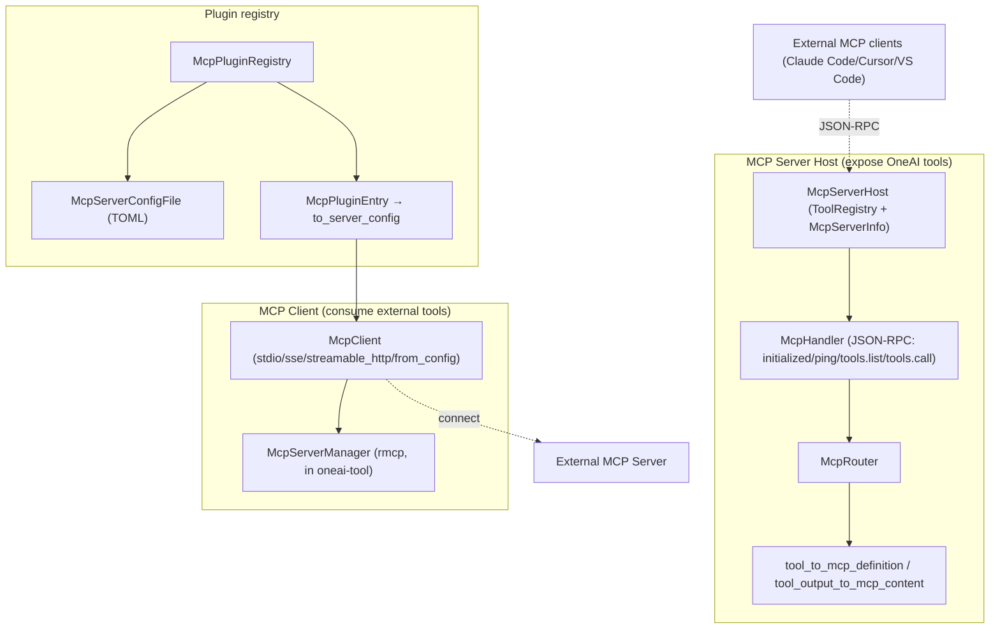

# OneAI MCP Mechanism

> MCP (Model Context Protocol) server host + client + plugin registry — OneAI is both an MCP server (exposing its tools to external MCP clients like Claude Code / Cursor / VS Code) and an MCP client (connecting to external MCP servers to reuse their tools); JSON-RPC protocol + TOML config + stdio/SSE/streamable-http transports + OAuth 2.0 PKCE + bidirectional elicitation + model-transparent lazy connect.

## 1. Overview (what it is)

`oneai-mcp` is OneAI's three-in-one integration with the MCP ecosystem. First, **MCP Server Host** — expose OneAI's `ToolRegistry` as an MCP server so external MCP clients (Claude Code, Cursor, VS Code) can discover and invoke OneAI tools via JSON-RPC. Second, **MCP Client** — connect to external MCP servers, discover their tools, invoke them, wrapped as a simpler standalone API. Third, **McpPluginRegistry** — discover/configure/connect MCP plugins, managed via a TOML config file.

It sits in the feature layer, depending on `oneai-core` (`Tool` trait) and `oneai-tool` (reusing the `McpServerManager`/`rmcp` infrastructure), consumed by `oneai-app` (`AppBuilder` MCP integration) and CLI `oneai mcp`. `oneai-tool`'s `mcp_real.rs` is the client-side底层 implementation (based on `rmcp`); this crate wraps it with a simpler `McpClient` API + server host + plugin registry. OneAI is thus a peer bidirectional MCP participant — it both exposes and consumes tools.

## 2. Responsibilities & capabilities (what it does)

**MCP Server Host.** `McpServerHost` (holds `ToolRegistry` + `McpServerInfo`) exposes OneAI tools as MCP tool definitions (`tool_to_mcp_definition`) + converts tool output to MCP content (`tool_output_to_mcp_content`) + `McpHandler` handles JSON-RPC (`handle_initialized_notification`/`handle_ping`/tools/list/tools/call) + `McpRouter`.

**MCP Client.** `McpClient` (four constructors: `stdio`/`sse`/`streamable_http`/`from_config`) + `connect`/`discover_tools`/`call_tool`/`disconnect`/`is_connected`, wrapping `McpServerManager` for a simpler standalone API.

**Plugin registry.** `McpPluginRegistry` (`from_config_file`/`from_config_path`/`add_entry`/`remove_entry`) + `McpPluginEntry` (→`to_server_config`) + `McpServerConfigFile` (`load_default`/`load_from`/`save_default`/`save_to` TOML) + `default_config` + `default_path`.

**Transports.** stdio (local subprocess) / SSE / streamable-http (reusing `oneai-tool`'s `rmcp` impl).

**Explicitly does not**: no MCP protocol implementation itself (based on `rmcp`); no LLM inference; no persistent plugin connection state (each connect is independent); client底层 impl lives in `oneai-tool/mcp_real.rs` (this crate wraps it).

## 3. Design motivation (why this way)

| Decision | Rationale | Rejected alternative |
|---|---|---|
| Server + client in one crate | OneAI is both an MCP server (expose tools) and a client (consume tools); one crate keeps both protocol implementations consistent | Two crates → protocol drift |
| Reuse `oneai-tool`'s `rmcp` infrastructure | The MCP protocol + transports are already implemented in `mcp_real.rs` (`McpServerManager`/`McpTransport`/`McpFramingParser`); this crate wraps a simpler API on top rather than reinventing | Rewrite protocol → duplication, drift |
| Server Host exposes `ToolRegistry` | OneAI tools already implement `Tool`; `tool_to_mcp_definition` converts them to MCP definitions, reusing the existing tool surface | Implement a separate tool set for MCP → duplication |
| `McpPluginRegistry` + TOML config | MCP plugins need cross-session persistent config (which servers, how to connect); TOML is human-editable and storable; `load_default`/`save_default` manages `~/.oneai` | Runtime hardcoding → not configurable, not persistent |
| Three transports (stdio/sse/streamable-http) | Local MCP servers via stdio, remote via SSE/streamable-http, covering all scenarios; reusing `oneai-tool`'s existing impl | stdio only → can't reach remote servers |
| `McpClient` simple standalone API | `McpServerManager` is a full manager (complex lifecycle); `McpClient` wraps connect/discover/call/disconnect as a simpler surface, lowering the barrier | Expose Manager directly → complex API, high barrier |
| `McpHandler` JSON-RPC handler | MCP is JSON-RPC (initialize/initialized/ping/tools.list/tools.call); the handler explicitly dispatches each method, easy to extend | Generic JSON-RPC router → loses MCP semantics |

## 4. Architecture & core abstractions



**Core types:**

```rust
pub struct McpServerHost { tool_registry, server_info }
impl McpServerHost {
    pub fn tool_to_mcp_definition(tool: &Arc<dyn Tool>) -> serde_json::Value;
    pub fn tool_output_to_mcp_content(output: &ToolOutput) -> Vec<serde_json::Value>;
}
pub struct McpClient { /* stdio/sse/streamable_http/from_config */
    pub async fn connect(&self) -> Result<Vec<String>>;
    pub async fn discover_tools(&self) -> Result<Vec<McpToolInfo>>;
    pub async fn call_tool(&self, name: &str, args: &Value) -> Result<ToolOutput>;
}
pub struct McpPluginRegistry { /* from_config_file/add_entry/remove_entry */ }
pub struct McpServerConfigFile { /* load_default/save_default TOML */ }
```

## 5. Flows it participates in

**As server (expose tools to external MCP clients):**

1. `McpServerHost::new(tool_registry)` or `with_server_info` builds the host.
2. `McpRouter` + `McpHandler` handle JSON-RPC: external client `initialize` → `initialized` notification → `ping` → `tools/list` (`tool_to_mcp_definition` converts all `ToolRegistry` tools to MCP definitions) → `tools/call` (execute tool + `tool_output_to_mcp_content` converts result).
3. Communicates with the external client via stdio or HTTP transport.

**As client (consume external MCP server):**

1. `McpClient::stdio(command, args)` or `sse(url)`/`streamable_http(url)`/`from_config(config)`.
2. `connect()` (underlying `McpServerManager` spawns subprocess or HTTP).
3. `discover_tools()` fetches the remote tool list (`McpToolInfo`).
4. `call_tool(name, args)` invokes a remote tool, returns `ToolOutput`.
5. `disconnect()`.

**Plugin management:** `McpPluginRegistry::from_config_file()` loads plugin config from `~/.oneai` TOML; `add_entry`/`remove_entry` mutate; `McpPluginEntry::to_server_config` converts to connection config; `McpClient::from_config` connects.

**Multi-server & enterprise capabilities (#31 Stage 1–5).** OneAI's MCP client is not just "connect one server" — it is an enterprise-grade multi-source manager:

- **Multi-server connection management (Stage 1+2)**: `McpPluginRegistry` manages multiple servers; each `McpPluginEntry` carries `McpToolPermissions` (default `Standard`/`Direct`, zero behavior change) setting that server's tools' `PermissionLevel` + `ToolExposure`. Discovered tools are registered under **namespaced names** `mcp__<server>__<tool>` (`normalize_tool_name`), so two servers exposing a same-named tool don't collide. The DomainPack `PermissionProfile` can still tighten on top (e.g. force `mcp__filesystem__delete_file` to `Full`/`Hidden`).
- **OAuth 2.0 PKCE full flow (Stage 3)**: HTTP-transport servers run discovery → (dynamic) registration → authorize → exchange → store → refresh → retry. Two login UXes: loopback redirect (default — a one-shot `127.0.0.1` listener + system browser launch) or manual paste (`--manual`, SSH/headless-friendly, no port bound). Tokens persist at `~/.oneai/mcp_oauth/<server>.json` carrying everything needed to refresh, so the transport-level 401-retry can refresh without consulting the registry config. PKCE uses S256; `state` is a random hex CSRF token.
- **Immutable `McpBinding` snapshot + connection-identity separation (Stage 4-1)**: a connection produces an immutable binding snapshot (tool list + metadata frozen), separated from the "connection identity" (which connect) — concurrent calls see a consistent snapshot, no drift from mid-flight reconnect/refresh.
- **Tool catalog cache LRU + generation (Stage 4-2)**: `tools/list` results are cached per server, LRU-evicted + generation-stamped — on reconnect/config change the generation bumps and the cache is invalidated wholesale, so the model never uses stale tool definitions.
- **Bidirectional elicitation (Stage 4-3)**: an external server mid-`tools/call` sends `elicitation/create` asking the user back (for a credential / a value). Routed through `InteractionGate::McpElicitation` (on-demand, not per-iteration) — a run with UI pops a native dialog, a no-UI `NoopInteractionGate` **declines** (no fabricated data sent back to the server).
- **Multi-source registration + priority merge (Stage 4-4)**: MCP tools can come from 5 sources (TOML config / DomainPack declaration / runtime add / lazy trigger / discovery), merged + deduped by priority — on a name clash the higher-priority source wins.
- **Model-transparent lazy connect (Stage 5)**: a server marked `lazy: true` is not connected at startup (`connect_all_enabled` skips it), and its `mcp__<server>__<tool>` wrappers aren't registered — the model can neither see nor call them. `McpLazyConnectTool` (one per lazy server, `ToolExposure::Deferred`) is discovered via `tool_search` and then triggers: `ensure_connected` (connect + discover) → `DataLayerReloader::reload_data_layer` (register the real wrappers into the live registry) → returns the discovered tool names. After a successful connect the trigger's `service_available()` returns false, so it **vanishes from `tool_search` too** (the real tools are now in the registry, the trigger is redundant) — codex's "LazyWhenCached + vanish-after-cache" pattern. The next AgentLoop iteration reads the live registry, and the real `mcp__<server>__<tool>` tools surface to the model automatically.

## 6. Dependencies

| Direction | Who | What |
|---|---|---|
| Upstream | `oneai-core` | `Tool`/`ToolOutput`/`PermissionLevel` |
| Upstream | `oneai-tool` | `McpServerManager`/`McpTransport`/`McpFramingParser`/`McpToolWrapper` (rmcp infrastructure) |
| Upstream | `rmcp`/`tokio`/`serde`/`toml` | MCP protocol, async, serialization, config |
| Downstream | `oneai-app` | `AppBuilder` MCP integration |
| Downstream | CLI | `oneai mcp serve/list/add/remove/connect` |
| Cross-cutting | config | `~/.oneai` TOML plugin config |

## 7. Key types & files

| Item | Location |
|---|---|
| `McpServerHost` + `tool_to_mcp_definition`/`tool_output_to_mcp_content` | `crates/oneai-mcp/src/server.rs:36,127,138` |
| `McpHandler` (JSON-RPC: initialized/ping/tools.list/tools.call) | `crates/oneai-mcp/src/handler.rs:29,79,235` |
| `McpRouter` | `crates/oneai-mcp/src/router.rs:29` |
| `McpClient` (stdio/sse/streamable_http/from_config + connect/discover/call/disconnect) | `crates/oneai-mcp/src/client.rs:50,69,91,112,130,150,167,190,215,229` |
| `McpPluginRegistry` + `McpPluginEntry` | `crates/oneai-mcp/src/plugin.rs:143,61` (`to_server_config:89`) |
| `McpServerConfigFile` (TOML load/save + `default_path`/`default_config`) | `crates/oneai-mcp/src/config.rs:34,42,52,75,105,113` |
| `discovery` (discover external servers) | `crates/oneai-mcp/src/discovery.rs` |
| OAuth 2.0 PKCE full flow + 401 refresh + persistence | `crates/oneai-mcp/src/oauth.rs` |
| Model-transparent lazy-connect trigger (`McpLazyConnectTool`) | `crates/oneai-mcp/src/lazy_connect.rs` |
| Immutable `McpBinding` snapshot + catalog cache LRU/generation | `crates/oneai-mcp/src/{plugin,client}.rs` |
| `transport` (stdio/SSE/streamable-http) | `crates/oneai-mcp/src/transport.rs` |
| Underlying impl (rmcp wrapper) | `crates/oneai-tool/src/mcp_real.rs` |

## 8. Industry comparison

| System | Model | OneAI's trade-off |
|---|---|---|
| **MCP (Anthropic spec)** | Tool-exposure protocol (JSON-RPC + stdio/SSE/streamable-http) | OneAI is a peer bidirectional implementation — both Server Host and Client, plus TOML plugin config |
| **Claude Code (MCP client)** | Connects to external MCP servers to reuse tools | OneAI is a similar client and additionally provides a Server Host so Claude Code can connect to it — bidirectional |
| **Cursor / VS Code MCP** | In-IDE MCP clients | OneAI is engine-level MCP, runnable without an IDE (CLI/native app); and `McpPluginRegistry` persists config |
| **LangChain MCP adapters** | MCP client integration | OneAI adds Server Host + plugin registry + TOML config, covering the full ecosystem |

OneAI's distinct points: **bidirectional MCP peer** (Server Host + Client in one crate) + **reuses `rmcp`, no protocol rewrite** + **`ToolRegistry` one-click to MCP definitions** (OneAI tools are MCP tools, zero duplication) + **TOML plugin config cross-session persistent**.

## 9. Extension points & config

- **Expose tools**: `McpServerHost::new(tool_registry)` + `McpRouter`, start a JSON-RPC server.
- **Connect external server**: `McpClient::stdio/sse/streamable_http/from_config` + `connect`/`discover_tools`/`call_tool`.
- **Plugin config**: `McpPluginRegistry::from_config_file`, edit `~/.oneai` TOML; `add_entry`/`remove_entry`.
- **AppBuilder integration**: `AppBuilder` MCP methods.
- **CLI**: `oneai mcp serve/list/add/remove/connect` (see [cli-reference](cli-reference_EN.md)).

## 10. Further reading

- [tool-mechanism](tool-mechanism_EN.md) — `Tool` trait + `McpToolWrapper` (the MCP client底层 in `oneai-tool`)
- [a2a-mechanism](a2a-mechanism_EN.md) — A2A is inter-agent; MCP is agent↔tool; complementary
- Source: `crates/oneai-mcp/src/` (10 files / ~2.8K LOC) + `crates/oneai-tool/src/mcp_real.rs`
