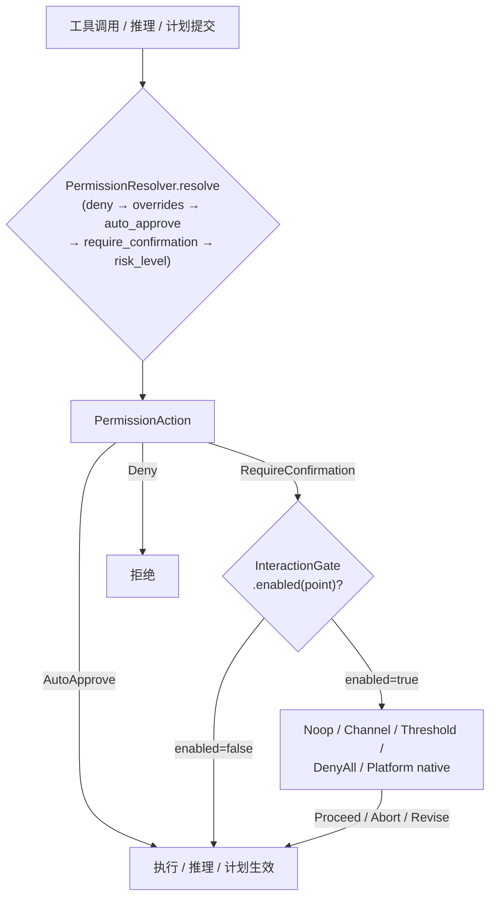

# OneAI 权限与 InteractionGate 机制

> 三级权限（Read/Standard/Full）+ 统一 7 决策点 gate（5 个每轮迭代决策点 PreInfer/PostInfer/ToolApproval/PlanDecision/PlanReview + 2 个按需触发点 NetworkApproval/McpElicitation）：把"该不该让模型做这件事"收敛到一个可替换的 trait，运行时按 `deny_by_default → overrides → auto_approve → require_confirmation → tool.risk_level` 五级解析，可对接无放行/通道桥 UI/阈值放行/全拒/原生对话框/引擎总线。

## 1. 概述（是什么）

权限不是"全放行"也不是"一刀切审批"。OneAI 的权限模型把风险分成三档——`Read`（只观察、自动批准）、`Standard`（常见操作、视策略）、`Full`（强力操作、必审批），再由 `InteractionGate` 这个 trait 在五个关键决策点统一把守。这个 trait 是可替换的：测试场景用全放行的 Noop，TUI 用通道桥 UI，生产原生端用 NSAlert/AlertDialog。这样"谁来批准"与"批准什么"被解耦——前者随部署形态切换，后者由 DomainPack 声明。

权限逻辑横跨四个 crate：`PermissionLevel`/`InteractionGate`/`PermissionAction` 类型与 trait 定义在 `oneai-core`，gate 的四个内置实现在 `oneai-tool`，原生 UI 实现在 `oneai-platform-*`，域策略 `PermissionProfile` 在 `oneai-domain`。`PermissionResolver` trait 特意放在 core，是为了让 `oneai-tool` 的 `ToolExecutor` 能消费域策略而不反向依赖 `oneai-domain`。

## 2. 职责与能力（做什么）

**三级权限分级。** `PermissionLevel { Read, Standard, Full }`，与老 `RiskLevel { Low, Medium, High }` 双向转换（`from_risk_level`/`to_risk_level`），并提供 `should_auto_approve(threshold)` 矩阵——给定审批阈值判断是否免批。

**五级运行时解析。** `PermissionResolver::resolve(tool_name, args)` 返回 `PermissionAction`：`Deny{reason}` / `AutoApprove` / `RequireConfirmation` / `UseDefaultPermission{level}`。解析顺序：`deny_by_default` → `permission_overrides` → `auto_approve` → `require_confirmation` → 工具自身 `risk_level`。

**5 决策点 + 2 按需点统一 gate。** `InteractionGate` 把守 `PreInfer`（推理前改写/跳过）、`PostInfer`（推理后校验/替换）、`ToolApproval`（高风险工具放行）、`PlanDecision`（规划权衡）、`PlanReview`（最终计划 accept/reject/Revise）五个**每轮迭代决策点**，外加 `NetworkApproval`（沙箱进程出网、按需触发）与 `McpElicitation`（外部 MCP server 反向问用户、按需触发）两个**非每轮**点。`enabled(point)` 是性能杠杆：返 false 即跳过整个交互块（无锁、无 channel、无分配），让 TUI 能只开 `PlanDecision`/`PlanReview`/`ToolApproval` 而关掉每轮 `PreInfer`/`PostInfer`。`NetworkApproval`/`McpElicitation` 默认 enabled——无 UI 的 run 用 `NoopInteractionGate`（NetworkApproval=Proceed 放行、McpElicitation=decline 不伪造数据），`DenyAllInteractionGate` 全拒。

**六种 gate 实现。** `NoopInteractionGate`（全放行，测试/SDK）、`ChannelInteractionGate`（mpsc + oneshot 桥 UI 线程，按决策点可配）、`ThresholdInteractionGate`（低风险阈值放行、余走通道）、`DenyAllInteractionGate`（全拒）、`PlatformInteractionGate`（平台侧原生对话框处理 `ToolApproval`）、`BusInteractionGate`（[引擎总线](bus-mechanism.md)消费者——`gate.request` 走 `bus.request_approval`，把审批统一到 `EngineYield::ApprovalRequest`↔`Directive::Approve` 两条通道，取代 `ChannelInteractionGate` 的 ad-hoc per-request oneshot；只开人机决策点、关 `PreInfer`/`PostInfer`）。

**显式不做什么**：不定义工具的固有风险（归 `Tool::risk_level`）；不持久化审批决定（每次执行独立解析）；不做 USD 成本门禁（已移除成本维度）；`PreInfer`/`PostInfer` 默认关，不每轮中断循环。

## 3. 设计动机（为什么这样实现）

| 决策 | 理由 | 否决的替代方案 |
|---|---|---|
| `PermissionLevel` 三级而非连续 risk | 离散三档（Read/Standard/Full）对应"自动/视策略/必审批"三种处置，决策清晰、可枚举、可作 `should_auto_approve` 矩阵维度 | 连续 risk 分数 → 处置边界模糊、难声明式配置 |
| `PermissionResolver` trait 放 `oneai-core` | `ToolExecutor` 在 `oneai-tool`，要消费域策略又不反向依赖 `oneai-domain`；trait 放 core、实现在 domain，依赖方向正确 | trait 放 domain → tool 反向依赖 domain，分层破 |
| 7 决策点（5 每轮 + 2 按需）统一一个 `InteractionGate` 而非多个 gate | 推理前/后、工具、计划、复审都是"要不要让模型继续"的同类决策；一个 trait 五个每轮 point + 两个按需点复用，替换一处即换全部 | 每点一个 trait → 替换/组合配置爆炸 |
| `enabled(point)` 默认 true、可覆写 false | 多数部署只关心 `ToolApproval`/`PlanReview`，不想要每轮 `PreInfer`/`PostInfer` 中断；`enabled` 让 gate 精确声明关心哪些点，热路径跳过不关心的 | 默认每轮都调 request → 中断开销与 channel 分配污染每轮 |
| `PermissionProfile` 折进 DomainPack 第③层 | 权限策略是领域属性（编码域放行 grep、生产域必审批 shell），声明式可组合、strictest-wins 合并 | 权限策略写死在代码 → 不可声明、不可按域切换 |
| `PermissionAction::UseDefaultPermission` 兜底 | 域策略不必覆盖每个工具；没命中规则的工具回退到自身 `risk_level`，保证总有处置 | 域必须全覆盖 → 配置负担重、漏配即 undefined |
| 旧 `ApprovalGate`/`on_plan_submitted` 移除 | 它们是 `ToolApproval`/`PlanReview` 的窄特例，统一进 5 点 gate 后重复且分裂 | 保留 → 两套审批语义并存、维护漂移 |
| `StubPlatformInteractionGate` 各平台构造器 | 平台端未必有原生 UI（Linux CLI 无对话框）；提供 `macos()/windows()/android()/ios()/harmony()` 占位，可用时换真实现 | 强制每平台实现真 UI → 无 UI 平台无法编译 |

## 4. 架构与核心抽象



**核心类型（trait 与枚举在 core）：**

```rust
#[non_exhaustive]
pub enum PermissionLevel { Read, Standard, Full }   // 与 RiskLevel 双向转换

#[non_exhaustive]
pub enum PermissionAction {
    Deny { reason: String },
    AutoApprove,                 // 跳过 gate
    RequireConfirmation,         // 走 gate，强制 Full 审批
    UseDefaultPermission { level: PermissionLevel },  // 回退工具自身级别
}

pub trait InteractionGate: Send + Sync {
    async fn request(&self, req: InteractionRequest) -> Result<InteractionResponse>;
    fn enabled(&self, _point: InteractionPoint) -> bool { true }   // 性能杠杆
}

#[non_exhaustive]
pub enum InteractionPoint {
    // 5 个每轮迭代决策点
    PreInfer, PostInfer, ToolApproval, PlanDecision, PlanReview,
    // 2 个按需触发点（非每轮、由 egress proxy / MCP server 在事件点发起）
    NetworkApproval,   // 沙箱进程（code_interpreter / shell）出网 → 本地 CONNECT 代理拦下问
    McpElicitation,    // 外部 MCP server 发 elicitation/create 反向问用户
}

pub trait PlatformInteractionGate: InteractionGate { /* 原生 UI 对话框 */ }
```

## 5. 参与的流程

**工具审批链路**（与 [tool-mechanism](tool-mechanism.md) 联动）：

1. `ToolExecutor::execute` 先调 `PermissionResolver::resolve(tool_name, args)`，按五级顺序解析：命中 `deny_by_default` 直接返 `Deny`；否则查 `permission_overrides`；再查 `auto_approve`（命中返 `AutoApprove`）；再查 `require_confirmation`（命中返 `RequireConfirmation`）；都没命中返 `UseDefaultPermission{tool 自身 risk_level 转换}`。
2. `AutoApprove` 跳过 gate 直接执行；`Deny` 直接返失败结果；`RequireConfirmation` 与 `UseDefaultPermission`（若级别需审批）走 gate。
3. 走 gate 时先查 `enabled(ToolApproval)`——返 false 则短路放行（镜像 `NoopInteractionGate` 行为）；返 true 才发 `InteractionRequest::ToolApproval{approval}`。
4. gate 实现决定去向：`ChannelInteractionGate` 把请求塞 mpsc 给 UI 线程、等 oneshot 回复；`ThresholdInteractionGate` 用 `should_auto_approve` 阈值放行低风险、余走 channel；`PlatformInteractionGate` 弹 NSAlert/AlertDialog。
5. 响应五种：`Proceed` 执行 / `ProceedWith(ReplaceToolArgs)` 改参执行 / `Abort` 拒绝 / `Revise{feedback}` 上抛反馈 / 未知变体默认放行（`#[non_exhaustive]` 留扩展位）。

**Plan 审批链路**：`PlanDecision` 在计划权衡点（主 loop 控制工具 `request_plan_decision` + PlanAgent 两阶段）触发；`PlanReview` 在最终计划提交时触发，三按钮 Revise 带输入。`PlanDecision` 双轨：主 loop 内联控制工具触发，或 PlanAgent 两阶段触发。

**沙箱出网审批链路（`NetworkApproval`，#28）**：`code_interpreter` / `shell` 在 Seatbelt/bwrap 沙箱里被限到 loopback-only 出网，脚本的 HTTPS 请求经 `HTTPS_PROXY` 漏到本地 HTTP CONNECT 代理（`network_proxy.rs`）。代理查 `HostAllowlistStore`——已批准直连、已拒直接 403；未知 host 按 `NetworkApprovalMode`：`Prompt`（默认）阻塞调 `gate.request(NetworkApproval)`，UI 放行/拒绝后落 `host_allowlist`/`host_denylist`（互斥），下次同 host 不再问；`Defer` 先隧道再后台问（"先执行后审批"，只对真正未知的 host）；`Deny` 不问直接拒。`InteractionResponse::Proceed` 放行且记会话 allowlist，`Abort` 拒且落 denylist。详见 [tool-mechanism § #28 沙箱网络授权](tool-mechanism.md)。

**ExecPolicy 审批后热替换（#28 Stage 4-5）**：shell 命令审批不只是放行——`GuardianContext` 命中 `ExecPolicy` 规则时可跳过 reviewer（`apply` 命中即放行），审批通过后 `record_shell_approval` 把该 argv 写成一条 amendment 加进 `ExecPolicyStore`（`live = base ∪ amendments`，`RwLock` 热替换 + JSONL 持久化、dedup），下次同模式命令自动放行。这是"审一次、学一次"的闭合：审批决策落规则，规则前置 gate。

## 6. 依赖关系

| 方向 | 谁 | 内容 |
|---|---|---|
| 上游 | `oneai-core` | `PermissionLevel`/`RiskLevel`/`PermissionAction`/`InteractionGate`/`InteractionPoint`/`InteractionRequest`/`InteractionResponse`/`PermissionResolver` trait/`ApprovalRequest` |
| 上游 | `oneai-tool` | `Noop`/`Channel`/`Threshold`/`DenyAll` gate + `InteractionGateConfig` + `should_auto_approve` + `into_shared` |
| 上游 | `oneai-domain` | `PermissionProfile`（`deny_by_default`/`auto_approve`/`require_confirmation`/`permission_overrides`）+ `PermissionResolver` 实现 |
| 上游 | `oneai-platform-*` | `PlatformInteractionGate` 原生 UI（macOS NSAlert / Windows AlertDialog / Linux CLI / Android/iOS/Harmony）|
| 下游 | `oneai-tool` | `ToolExecutor` 注入 `PermissionResolver` + `InteractionGate` |
| 下游 | `oneai-agent` | `AgentLoop` 在 `ToolApproval`/`PlanDecision`/`PlanReview` 点调 gate |
| 下游 | `oneai-workflow` | `HumanApproval` 节点走同一 gate |
| 横切接入 | DomainPack 第③层 | `PermissionProfile` 声明式权限策略，strictest-wins 合并 |

## 7. 关键类型与文件

| 项 | 位置 |
|---|---|
| `PermissionLevel`（+ `from/to_risk_level` + `should_auto_approve`）| `crates/oneai-core/src/types.rs:771` |
| `PermissionAction`（4 变体）| `crates/oneai-core/src/types.rs:855` |
| `InteractionPoint`（7 点：5 每轮 + 2 按需）+ `InteractionRequest`/`InteractionResponse` | `crates/oneai-core/src/types.rs:1643` |
| `InteractionGate` trait（`request` + `enabled`）| `crates/oneai-core/src/traits.rs:253` |
| `PlatformInteractionGate` trait + `StubPlatformInteractionGate` | `crates/oneai-core/src/platform.rs:28,38` |
| `Noop`/`DenyAll`/`Channel`/`Threshold` gate | `crates/oneai-tool/src/interaction_gate.rs:35,57,152,223` |
| `BusInteractionGate`（gate→`bus.request_approval`，[bus-mechanism](bus-mechanism.md)）| `crates/oneai-agent/src/bus_interaction_gate.rs:24` |
| `NetworkApprovalMode`（Prompt/Defer/Deny）+ 本地 CONNECT 代理 | `crates/oneai-tool/src/network_proxy.rs` |
| `HostAllowlistStore` trait + `SqliteHostAllowlist` | `crates/oneai-core/src/traits.rs` + `crates/oneai-persistence/src/host_allowlist.rs` |
| `ExecPolicyStore`（RwLock 热替换 + JSONL 持久化）| `crates/oneai-tool/src/exec_policy.rs:290` |
| `ApprovalPolicy`（Never/OnFailure/OnRequest/OnUntrustedDir，4 级）| `crates/oneai-core/src/types.rs:1010` |
| `InteractionGateConfig`（`tui_default`）+ `InteractionPendingItem` | `crates/oneai-tool/src/interaction_gate.rs:79,137` |
| `should_auto_approve`/`into_shared` | `crates/oneai-tool/src/interaction_gate.rs:366,381` |
| `PermissionProfile`（`deny_by_default`/`auto_approve`/`require_confirmation`）| `crates/oneai-domain/src/permission_profile.rs` |
| CodingPack 默认 `PermissionProfile` | `crates/oneai-domain/src/coding_pack.rs:354` |
| `PermissionResolver` 解析路径 | `crates/oneai-tool/src/executor.rs:164`（4 分支消费）|
| 原生 gate（Linux CLI / 各端）| `crates/oneai-platform-desktop/src/{linux,bridge_common}.rs` + `oneai-platform-{android,ios,harmony}/src/` |

## 8. 与业界对比

| 系统 | 模型 | OneAI 取舍 |
|---|---|---|
| **Claude Code** | Bash 沙箱黑名单 + permission modes（plan/accept-edits/default） | OneAI 把权限做进 trait + DomainPack 第③层声明，三级 + 7 决策点 + 原生 UI 审批；Claude Code 的 mode 概念在 OneAI 对应 `InteractionMode`（TUI 侧）+ `PermissionProfile`（引擎侧）|
| **AutoGen** | user proxy 把关工具 | OneAI 不依赖外部 proxy，权限内建为 gate trait，可对接原生 UI 或通道桥 |
| **LangChain** | 无内建权限分级 | OneAI 三级 + 解析序 + strictest-wins 合并，是生产级人机协作的一等公民 |
| **OpenAI Computer Use** | 工具执行需 user confirmation | OneAI 的 `ToolApproval` 同类，但多出 `PreInfer`/`PostInfer`/`PlanDecision`/`PlanReview` 四个点，覆盖推理前/后与计划审批，不只是工具 |

OneAI 独特点：**7 决策点（5 每轮 + 2 按需）统一一个可替换 gate** + **域策略声明式且 strictest-wins 合并**（多 DomainPack 叠加时取最严），且 `enabled(point)` 让"关心哪些点"成为性能杠杆而非全有或全无。

## 9. 扩展点与配置

- **换 gate**：`AppBuilder` 或 `ToolExecutor::with_interaction_gate` 注入；TUI 用 `ChannelInteractionGate`，原生端用 `PlatformInteractionGate`，测试用 `Noop`。
- **配阈值**：`ThresholdInteractionGate::new(buffer_size, threshold, config)` 或 `new_manual_only`（全走审批）。
- **域权限策略**：DomainPack 第③层 `PermissionProfile`——`deny_by_default`（黑名单正则）、`auto_approve`（白名单工具名）、`require_confirmation`、`permission_overrides`。
- **TUI InteractionMode**：Normal/Auto/Plan 三模式（Shift+Tab 切换），Plan 模式阻断工具执行。
- **CLI**：经 `provider`/`agent` 路径间接；TUI 内 Shift+Tab 切模式。
- **安全护栏细节**：见 [evolution-plan §1.4](evolution-plan-2026-07.md)（输出上限 / 三路径解析 / ThresholdGate 迁 PermissionLevel / ShellTool 黑名单+path traversal+沙箱）。

## 10. 深入阅读

- [tool-mechanism.md](tool-mechanism.md) —— `ToolExecutor` 如何消费 `PermissionResolver` 与 `InteractionGate`
- [domain-pack-mechanism.md](domain-pack-mechanism.md) —— 第③层 `PermissionProfile` 声明
- [multi-agent-mechanism.md](multi-agent-mechanism.md) —— `PlanDecision`/`PlanReview` 在 AgentLoop 与 PlanAgent 中的触发
- [cross-platform-mechanism.md](cross-platform-mechanism.md) —— 各端原生 `PlatformInteractionGate` 实现
- [CLAUDE.md — 权限模型章节](../CLAUDE.md)
- 源码：`crates/oneai-core/src/{traits,types,platform}.rs` + `crates/oneai-tool/src/interaction_gate.rs` + `crates/oneai-domain/src/permission_profile.rs`
