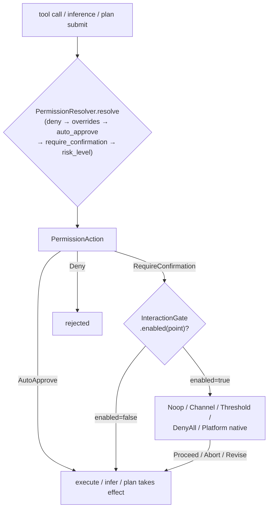

# OneAI Permission & InteractionGate Mechanism

> 3-tier permissions (Read/Standard/Full) + a unified 7-decision-point gate (5 per-iteration points PreInfer/PostInfer/ToolApproval/PlanDecision/PlanReview + 2 on-demand points NetworkApproval/McpElicitation): collapses "should the model do this" into one replaceable trait, resolved at runtime by `deny_by_default → overrides → auto_approve → require_confirmation → tool.risk_level`, wiring to no-op / channel-bridge UI / threshold / deny-all / native dialogs / engine bus.

## 1. Overview (what it is)

Permissions are neither "allow all" nor "approve everything uniformly." OneAI's permission model tiers risk into three — `Read` (observe-only, auto-approved), `Standard` (common ops, policy-dependent), `Full` (powerful ops, always approved) — then guards them at five key decision points by the `InteractionGate` trait. The trait is replaceable: tests use the allow-all Noop, TUI uses a channel-bridge UI, production native targets use NSAlert/AlertDialog. This decouples "who approves" from "what is approved" — the former switches by deployment, the latter is declared by DomainPack.

Permission logic spans four crates: `PermissionLevel`/`InteractionGate`/`PermissionAction` types and traits are defined in `oneai-core`, the four built-in gate impls live in `oneai-tool`, native UI impls in `oneai-platform-*`, the domain policy `PermissionProfile` in `oneai-domain`. The `PermissionResolver` trait is deliberately placed in core so that `oneai-tool`'s `ToolExecutor` can consume domain policy without reverse-depending on `oneai-domain`.

## 2. Responsibilities & capabilities (what it does)

**3-tier permission grading.** `PermissionLevel { Read, Standard, Full }`, with bidirectional conversion to the legacy `RiskLevel { Low, Medium, High }` (`from_risk_level`/`to_risk_level`), plus a `should_auto_approve(threshold)` matrix — given an approval threshold, decide whether to skip approval.

**5-level runtime resolution.** `PermissionResolver::resolve(tool_name, args)` returns a `PermissionAction`: `Deny{reason}` / `AutoApprove` / `RequireConfirmation` / `UseDefaultPermission{level}`. Resolution order: `deny_by_default` → `permission_overrides` → `auto_approve` → `require_confirmation` → the tool's own `risk_level`.

**5 decision points + 2 on-demand points, unified gate.** `InteractionGate` guards `PreInfer` (pre-inference rewrite/skip), `PostInfer` (post-inference validate/replace), `ToolApproval` (high-risk tool release), `PlanDecision` (plan trade-off), `PlanReview` (final plan accept/reject/Revise) — five **per-iteration decision points** — plus `NetworkApproval` (sandboxed process egress, on-demand) and `McpElicitation` (an external MCP server asking the user back, on-demand) — two **non-per-iteration** points. `enabled(point)` is the performance lever: returning false skips the entire interaction block (no lock, no channel, no allocation), letting a TUI enable only `PlanDecision`/`PlanReview`/`ToolApproval` and turn off per-iteration `PreInfer`/`PostInfer`. `NetworkApproval`/`McpElicitation` are default-enabled — a no-UI run uses `NoopInteractionGate` (NetworkApproval=Proceed allow, McpElicitation=decline so no fabricated data), `DenyAllInteractionGate` denies all.

**Six gate impls.** `NoopInteractionGate` (allow all, tests/SDK), `ChannelInteractionGate` (mpsc + oneshot bridge to UI thread, configurable per point), `ThresholdInteractionGate` (low-risk threshold release, rest through channel), `DenyAllInteractionGate` (deny all), `PlatformInteractionGate` (platform-native dialogs for `ToolApproval`), `BusInteractionGate` ([engine bus](bus-mechanism_EN.md) consumer — `gate.request` goes through `bus.request_approval`, unifying approval onto the `EngineYield::ApprovalRequest`↔`Directive::Approve` pair, replacing `ChannelInteractionGate`'s ad-hoc per-request oneshot; enables only human-facing points, disabling `PreInfer`/`PostInfer`).

**Explicitly does not**: does not define a tool's inherent risk (that's `Tool::risk_level`); no persistent approval decisions (each execution resolves independently); no USD cost gating (cost dimension removed); `PreInfer`/`PostInfer` default off, no per-iteration interruption.

## 3. Design motivation (why this way)

| Decision | Rationale | Rejected alternative |
|---|---|---|
| `PermissionLevel` three tiers, not continuous risk | Discrete tiers (Read/Standard/Full) map to "auto/policy/approve" dispositions, clear, enumerable, usable as `should_auto_approve` matrix dimensions | Continuous risk score → fuzzy dispositions, hard to declare |
| `PermissionResolver` trait in `oneai-core` | `ToolExecutor` is in `oneai-tool` and must consume domain policy without reverse-depending on `oneai-domain`; the trait in core, impl in domain, keeps the dep direction correct | Trait in domain → tool reverse-depends on domain, layering breaks |
| One `InteractionGate` for 7 points (5 per-iteration + 2 on-demand), not multiple gates | Pre/post-inference, tool, plan, review are all "should the model continue" decisions of the same kind; one trait, five per-iteration points + two on-demand points, reuse, one replacement swaps all | One trait per point → replacement/config explosion |
| `enabled(point)` default true, overridable to false | Most deployments only care about `ToolApproval`/`PlanReview`, not per-iteration `PreInfer`/`PostInfer`; `enabled` lets a gate precisely declare which points it cares about, hot path skipping the rest | Default request every turn → interrupt overhead and channel allocation pollute every turn |
| `PermissionProfile` folds into DomainPack layer 3 | Permission policy is a domain property (coding allows grep, production requires shell approval), declarative, composable, strictest-wins merge | Hardcoded → not declarative, not switchable per domain |
| `PermissionAction::UseDefaultPermission` fallback | Domain policy need not cover every tool; tools not matching a rule fall back to their own `risk_level`, guaranteeing a disposition always | Domain must cover all → config burden, undefined on miss |
| Old `ApprovalGate`/`on_plan_submitted` removed | They were narrow special cases of `ToolApproval`/`PlanReview`, unified into the 5-point gate they duplicate and split | Keep → two approval semantics coexist, drift |
| `StubPlatformInteractionGate` per-platform constructors | A platform target may lack native UI (Linux CLI has no dialog); `macos()/windows()/android()/ios()/harmony()` placeholders, swap to real impl when available | Force real UI per platform → no-UI platforms can't compile |

## 4. Architecture & core abstractions



**Core types (traits & enums in core):**

```rust
#[non_exhaustive]
pub enum PermissionLevel { Read, Standard, Full }   // bidirectional convert to RiskLevel

#[non_exhaustive]
pub enum PermissionAction {
    Deny { reason: String },
    AutoApprove,                 // skip gate
    RequireConfirmation,         // through gate, force Full approval
    UseDefaultPermission { level: PermissionLevel },  // fall back to tool's own level
}

pub trait InteractionGate: Send + Sync {
    async fn request(&self, req: InteractionRequest) -> Result<InteractionResponse>;
    fn enabled(&self, _point: InteractionPoint) -> bool { true }   // performance lever
}

#[non_exhaustive]
pub enum InteractionPoint {
    // 5 per-iteration decision points
    PreInfer, PostInfer, ToolApproval, PlanDecision, PlanReview,
    // 2 on-demand points (not per-iteration — raised by the egress proxy / an MCP server at event time)
    NetworkApproval,   // sandboxed process (code_interpreter / shell) egress → local CONNECT proxy intercepts
    McpElicitation,    // external MCP server sends elicitation/create, asking the user back
}

pub trait PlatformInteractionGate: InteractionGate { /* native UI dialogs */ }
```

## 5. Flows it participates in

**Tool approval chain** (interplays with [tool-mechanism](tool-mechanism_EN.md)):

1. `ToolExecutor::execute` first calls `PermissionResolver::resolve(tool_name, args)`, resolving in the five-level order: a `deny_by_default` hit returns `Deny` directly; else `permission_overrides`; then `auto_approve` (hit → `AutoApprove`); then `require_confirmation` (hit → `RequireConfirmation`); none hit → `UseDefaultPermission{tool's own risk_level converted}`.
2. `AutoApprove` skips the gate and executes; `Deny` returns a failure result; `RequireConfirmation` and `UseDefaultPermission` (if the level needs approval) go through the gate.
3. Through the gate, `enabled(ToolApproval)` is checked first — false short-circuits to proceed (mirroring `NoopInteractionGate`); true sends `InteractionRequest::ToolApproval{approval}`.
4. The gate impl decides where: `ChannelInteractionGate` pushes the request to the UI thread via mpsc, awaiting a oneshot reply; `ThresholdInteractionGate` releases low-risk via `should_auto_approve` threshold, rest through channel; `PlatformInteractionGate` pops an NSAlert/AlertDialog.
5. Five responses: `Proceed` executes / `ProceedWith(ReplaceToolArgs)` executes with modified args / `Abort` rejects / `Revise{feedback}` surfaces feedback / unknown variants default to proceed (the `#[non_exhaustive]` extension slot).

**Plan approval chain**: `PlanDecision` at the plan trade-off point (the main-loop control tool `request_plan_decision` + the PlanAgent two-stage); `PlanReview` on final plan submission, three buttons with Revise taking input. `PlanDecision` is dual-track: main-loop inline control tool, or PlanAgent two-stage.

**Sandbox egress approval chain (`NetworkApproval`, #28)**: `code_interpreter` / `shell` are restricted to loopback-only egress inside the Seatbelt/bwrap sandbox; the script's HTTPS requests are funnelled via `HTTPS_PROXY` to a local HTTP CONNECT proxy (`network_proxy.rs`). The proxy checks `HostAllowlistStore` — an approved host tunnels straight through, a denied host is 403'd without re-prompting; for an unknown host the `NetworkApprovalMode` decides: `Prompt` (default) blocks on `gate.request(NetworkApproval)`, and after the UI admits/denies the host is recorded into `host_allowlist`/`host_denylist` (mutually exclusive) so the same host isn't re-prompted; `Defer` tunnels immediately and asks in the background ("execute first, approve later" — only for genuinely-unknown hosts); `Deny` rejects without a prompt. `InteractionResponse::Proceed` admits and records a session allowlist entry; `Abort` denies and lands in the denylist. See [tool-mechanism § #28 sandboxed egress](tool-mechanism_EN.md).

**ExecPolicy post-approval hot-swap (#28 Stage 4-5)**: shell-command approval is not just release — `GuardianContext` can skip the reviewer when an `ExecPolicy` rule matches (`apply` hit = release), and after approval `record_shell_approval` writes that argv as an amendment into `ExecPolicyStore` (`live = base ∪ amendments`, `RwLock` hot-swap + JSONL persistence, dedup) so the next identical-pattern command auto-releases. This is the "approve once, learn once" closure: an approval decision lands as a rule, the rule gates upfront.

## 6. Dependencies

| Direction | Who | What |
|---|---|---|
| Upstream | `oneai-core` | `PermissionLevel`/`RiskLevel`/`PermissionAction`/`InteractionGate`/`InteractionPoint`/`InteractionRequest`/`InteractionResponse`/`PermissionResolver` trait/`ApprovalRequest` |
| Upstream | `oneai-tool` | `Noop`/`Channel`/`Threshold`/`DenyAll` gate + `InteractionGateConfig` + `should_auto_approve` + `into_shared` |
| Upstream | `oneai-domain` | `PermissionProfile` (`deny_by_default`/`auto_approve`/`require_confirmation`/`permission_overrides`) + `PermissionResolver` impl |
| Upstream | `oneai-platform-*` | `PlatformInteractionGate` native UI (macOS NSAlert / Windows AlertDialog / Linux CLI / Android/iOS/Harmony) |
| Downstream | `oneai-tool` | `ToolExecutor` injects `PermissionResolver` + `InteractionGate` |
| Downstream | `oneai-agent` | `AgentLoop` calls the gate at `ToolApproval`/`PlanDecision`/`PlanReview` |
| Downstream | `oneai-workflow` | `HumanApproval` nodes go through the same gate |
| Cross-cutting | DomainPack layer 3 | `PermissionProfile` declarative permission policy, strictest-wins merge |

## 7. Key types & files

| Item | Location |
|---|---|
| `PermissionLevel` (+ `from/to_risk_level` + `should_auto_approve`) | `crates/oneai-core/src/types.rs:771` |
| `PermissionAction` (4 variants) | `crates/oneai-core/src/types.rs:855` |
| `InteractionPoint` (7 points: 5 per-iteration + 2 on-demand) + `InteractionRequest`/`InteractionResponse` | `crates/oneai-core/src/types.rs:1643` |
| `InteractionGate` trait (`request` + `enabled`) | `crates/oneai-core/src/traits.rs:253` |
| `PlatformInteractionGate` trait + `StubPlatformInteractionGate` | `crates/oneai-core/src/platform.rs:28,38` |
| `Noop`/`DenyAll`/`Channel`/`Threshold` gate | `crates/oneai-tool/src/interaction_gate.rs:35,57,152,223` |
| `BusInteractionGate` (gate→`bus.request_approval`, [bus-mechanism](bus-mechanism_EN.md)) | `crates/oneai-agent/src/bus_interaction_gate.rs:24` |
| `NetworkApprovalMode` (Prompt/Defer/Deny) + local CONNECT proxy | `crates/oneai-tool/src/network_proxy.rs` |
| `HostAllowlistStore` trait + `SqliteHostAllowlist` | `crates/oneai-core/src/traits.rs` + `crates/oneai-persistence/src/host_allowlist.rs` |
| `ExecPolicyStore` (RwLock hot-swap + JSONL persistence) | `crates/oneai-tool/src/exec_policy.rs:290` |
| `ApprovalPolicy` (Never/OnFailure/OnRequest/OnUntrustedDir, 4 levels) | `crates/oneai-core/src/types.rs:1010` |
| `InteractionGateConfig` (`tui_default`) + `InteractionPendingItem` | `crates/oneai-tool/src/interaction_gate.rs:79,137` |
| `should_auto_approve`/`into_shared` | `crates/oneai-tool/src/interaction_gate.rs:366,381` |
| `PermissionProfile` (`deny_by_default`/`auto_approve`/`require_confirmation`) | `crates/oneai-domain/src/permission_profile.rs` |
| CodingPack default `PermissionProfile` | `crates/oneai-domain/src/coding_pack.rs:354` |
| `PermissionResolver` resolution path | `crates/oneai-tool/src/executor.rs:164` (4-branch consumer) |
| Native gates (Linux CLI / per-target) | `crates/oneai-platform-desktop/src/{linux,bridge_common}.rs` + `crates/oneai-platform-{android,ios,harmony}/src/` |
| Permission-decision audit (`PermissionAuditEvent`/`PermissionAuditLog` + Noop/InMemory/Jsonl) | `crates/oneai-core/src/audit.rs` |

## 8. Industry comparison

| System | Model | OneAI's trade-off |
|---|---|---|
| **Claude Code** | Bash sandbox blacklist + permission modes (plan/accept-edits/default) | OneAI bakes permissions into a trait + DomainPack layer 3 declaration, 3 tiers + 7 decision points + native UI approval; Claude Code's mode concept maps to OneAI's `InteractionMode` (TUI side) + `PermissionProfile` (engine side) |
| **AutoGen** | user proxy gates tools | OneAI has no external proxy; permissions are an in-built gate trait, wiring to native UI or channel bridge |
| **LangChain** | no built-in permission tiers | OneAI's 3 tiers + resolution order + strictest-wins merge make human-in-the-loop a first-class citizen |
| **OpenAI Computer Use** | tool execution needs user confirmation | OneAI's `ToolApproval` is similar, but adds `PreInfer`/`PostInfer`/`PlanDecision`/`PlanReview` covering pre/post-inference and plan approval, not just tools |

OneAI's distinct points: **7 decision points (5 per-iteration + 2 on-demand) unified in one replaceable gate** + **domain policy declarative and strictest-wins** (multi-DomainPack stacking takes the strictest), and `enabled(point)` makes "which points matter" a performance lever, not all-or-nothing.

## 9. Extension points & config

- **Swap gate**: `AppBuilder` or `ToolExecutor::with_interaction_gate` inject; TUI uses `ChannelInteractionGate`, native targets `PlatformInteractionGate`, tests `Noop`.
- **Configure threshold**: `ThresholdInteractionGate::new(buffer_size, threshold, config)` or `new_manual_only` (all through approval).
- **Domain permission policy**: DomainPack layer 3 `PermissionProfile` — `deny_by_default` (regex blacklist), `auto_approve` (whitelist tool names), `require_confirmation`, `permission_overrides`.
- **TUI InteractionMode**: Normal/Auto/Plan (Shift+Tab toggle); Plan mode blocks tool execution.
- **Decision audit log**: `AppBuilder::permission_audit_log(Arc<dyn PermissionAuditLog>)` (CLI config `permission_audit_log = "~/.oneai/permission-audit.jsonl"`). Every terminal permission decision (policy deny/auto-approve, Guardian verdict, human approve/abort/revise, direct execution, exposure-guard rejection) is recorded as one structured event; args are stored as a SHA-256 digest only, never in plaintext. Record sites: `execute_with_approval` (ToolExecutor + code_interpreter bridge), `AgentLoop::execute_tool_calls`/`handle_approval`, StateGraph tool nodes, ReActAgent; sub-agent loops inherit the same log via Clone.
- **CLI**: indirectly via `provider`/`agent` paths; in TUI Shift+Tab toggles mode.
- **Security hardening detail**: see [evolution-plan §1.4](evolution-plan-2026-07.md) (output cap / 3-path resolution / ThresholdGate migrated to PermissionLevel / ShellTool blacklist + path traversal + sandbox).

## 10. Further reading

- [tool-mechanism](tool-mechanism_EN.md) — how `ToolExecutor` consumes `PermissionResolver` and `InteractionGate`
- [domain-pack-mechanism](domain-pack-mechanism_EN.md) — layer 3 `PermissionProfile` declaration
- [multi-agent-mechanism](multi-agent-mechanism_EN.md) — `PlanDecision`/`PlanReview` triggering in AgentLoop and PlanAgent
- [cross-platform-mechanism](cross-platform-mechanism_EN.md) — per-target native `PlatformInteractionGate` impls
- [CLAUDE.md — Permission model](../CLAUDE.md)
- Source: `crates/oneai-core/src/{traits,types,platform}.rs` + `crates/oneai-tool/src/interaction_gate.rs` + `crates/oneai-domain/src/permission_profile.rs`
