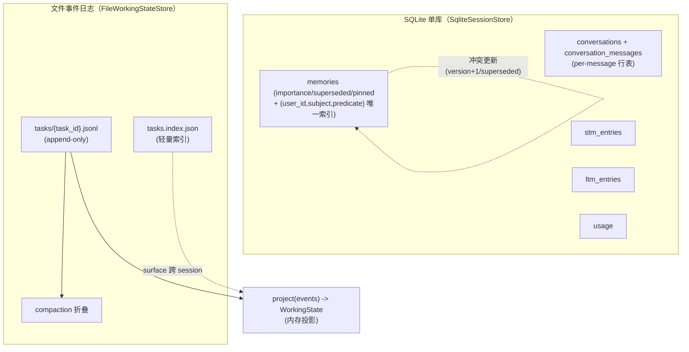

# OneAI 持久化机制

> SQLite（会话/STM/LTM/事实/用量）+ 文件事件日志（working state/跨 session 续接）双通路：让 Agent 的两类状态在不同时间尺度上存活——关系型状态走 SQLite，任务工作状态走 append-only 事件流，后者独立于 session、跨 session 可续接。

## 1. 概述（是什么）

`oneai-persistence` 把 Agent 状态按时间尺度分两条通路。对话历史、长期事实、用量记录是关系型状态，需要按 session/user/时间查询，走 SQLite——单库多表（conversations/stm_entries/ltm_entries/memories/usage）。任务的工作状态（目标/步骤/决策/卡点）是 per-task 的 append-only 事件流，需要人可读可改、git 可版本化、跨 session 发现，走文件事件日志——`<root>/tasks/{task_id}.jsonl` + `tasks.index.json`。这两条通路职责正交：SQLite 存"对话与记忆"，文件日志存"任务进度"，互不耦合。

这一层位于特性层、依赖 `oneai-core`（`Conversation`/`MemoryFact`/`TaskEvent`/`UsageTracker`/`MemoryPersistence` trait），被 `oneai-memory`（`MemoryManager` 持久化）、`oneai-agent`（`LoopState` 投影）、`oneai-app`（`AppSession` 启停保存）消费。旧的 `ProgressiveCheckpointManager`/`auto_checkpoint`/`AppSession::save_checkpoint` 已移除，只留 `FilePersistence`/`StatePersistence` 供 Studio 的 checkpoint 浏览器用。

## 2. 职责与能力（做什么）

**SQLite 会话存储。** `SqliteSessionStore` 持四类关系型表：`conversations`（会话元数据 + 消息）、`stm_entries`（短期记忆）、`ltm_entries`（长期记忆）、`memories`（原子事实，带 `importance`/`superseded`/`pinned` 列 + `(user_id,subject,predicate)` 唯一索引做 Mem0 式冲突更新）。`AppSession` 每次运行后自动保存。

**per-message 行表。** Issue #11 修复：旧实现用 `json_each(messages_json)` 计消息数与分页会解析全 blob（O(n)）；改 `conversation_messages` per-message 行表后分页/计数走 SQL，真 O(page)。

**用量追踪。** `SqliteUsageTracker` 实现 `UsageTracker` trait，按 token 维度记录（无 USD 成本），`from_store` 复用 session store 的库。

**文件事件日志。** `FileWorkingStateStore` 持 per-task append-only JSONL 事件流 + `tasks.index.json` 索引 + compaction（`with_compaction(event_threshold, keep_recent)`）+ `project(events) -> WorkingState` 投影。

**Studio checkpoint 后端。** `FilePersistence`/`StatePersistence` 仅供 Studio 的 checkpoint 时间旅行浏览器用（旧 progressive-checkpoint 基础设施已删）。

**显式不做什么**：不做记忆策略（归 `MemoryManager` + `MemoryProfile`）；不做 working-state 投影消费（归 `LoopState`）；`session resume <id>` 是 print-only 预览（不跑 agent loop、不 rehydrate working state——live 续接走 `tasks continue <id>`）；不做 USD 成本（已移除）。

## 3. 设计动机（为什么这样实现）

| 决策 | 理由 | 否决的替代方案 |
|---|---|---|
| 双通路（SQLite + 文件）而非统一 DB | 对话/记忆是关系型（按 session/user 查询），任务工作状态是文档型（人可读可改、git 可版本化、append-only）；两类性质不同，混在一个 DB 会牺牲文件通路的 git-diff 对账与人可编辑 | 全塞 SQLite → working state 失去人可读/git 可版本化/零依赖 |
| `memories` 表 `(user_id,subject,predicate)` 唯一索引 | Mem0 式冲突更新：新事实落库时按三元组匹配旧事实，命中则 `version+1` + `superseded=1` + `superseded_at`，而非 append 重复 | 无唯一约束 → 同一事实多版本并存、召回出旧值 |
| `memories.pinned` 列独立持久化 | core memory pin 一个 fact 后，重启 `pinned` 列仍在、`enforce_budget` 不驱逐它；pin 不只在内存 | pin 只在内存 → 重启丢 pin |
| per-message 行表替代 `json_each` | `json_each` 计数/分页解析全 blob O(n)；per-message 行表让侧边栏计数与分页走 SQL，真 O(page) | 沿用 json_each → 长会话侧边栏计数慢、分页解析全 blob |
| working-state 热路径走内存投影 | 每轮读 `LoopState.working_state` 内存投影零 IO；文件只作 durable mirror，启动 derive 一次 | 每轮查 store → 文件 IO 污染每轮热路径 |
| 事件日志 append-only + `project` 投影可重建 | source of truth 是事件流，内存 working state 是 derive 的 projection，随时可 rebuild；崩溃后用事件重建 | 投影即真相 → 崩溃后状态不可恢复 |
| compaction 有界增长 | append-only 无限增长会让 `read_events` 越来越慢；`with_compaction(event_threshold, keep_recent)` 在阈值后折叠历史、保留近期 | 无 compaction → 长任务事件日志膨胀 |
| 旧 progressive-checkpoint 移除 | 它与 working-state 事件日志功能重叠且分裂；移除后单一持久化路径，仅留 `FilePersistence` 供 Studio 浏览 | 保留两套 → 维护漂移、行为不一致 |
| 用量按 token 维度、无 USD | 定价表易变、且与整体"无 USD 成本"决策一致（见 [provider](provider-mechanism.md)）| 记 USD → 依赖易变定价 |

## 4. 架构与核心抽象



**关键类型：**

```rust
pub struct SqliteSessionStore { /* 单库多表 + WAL + busy_timeout */ }
pub struct FileWorkingStateStore { root: PathBuf, /* compaction 配置 */ }
pub struct SqliteUsageTracker { /* 复用 session store 库 */ }

// memories 冲突更新（Mem0 式）
// INSERT ... ON CONFLICT(user_id,subject,predicate) DO UPDATE
//   SET value=excluded.value, version=version+1, superseded=1, superseded_at=now

pub fn project(events: &[TaskEvent]) -> Option<WorkingState>;  // 事件→投影
```

## 5. 参与的流程

**会话保存/恢复：** `AppSession` 每次运行结束把 `Conversation` 写 `conversations` + 消息逐条写 `conversation_messages`；记忆事实写 `memories`（按三元组冲突更新）；短期/长期记忆写 `stm_entries`/`ltm_entries`；用量写 `usage`。`session list` 用 SQL 计 per-session 消息数（侧边栏计数，Issue #14 折叠多输出轮）；`session resume <id>` 是 print-only 预览，不 rehydrate。

**记忆持久化：** `MemoryManager` 经 `MemoryPersistence` trait（在 core）调 `SqliteSessionStore`——`archive_facts` 落 `memories` 表时统一嵌入 embedding（1.1.0 修复），core memory pin 落 `pinned` 列跨重启，`run_decay` 软失效走 `superseded` 列。详见 [memory-mechanism](memory-mechanism.md)。

**working-state：** `append_event` 是唯一写路径，在每个 plan-control-tool 变更点（exit_plan_mode/task_update/decision）调用。热路径每轮读 `LoopState.working_state` 内存投影零 IO。新 session 启动读一次 `tasks.index.json` surface `[Unfinished Work From Previous Sessions]`，`tasks continue <id>` 绑定并经 `project(read_events)` 重建状态。compaction 在 `event_threshold` 后折叠历史保近期。详见 [working-state-mechanism](working-state-mechanism.md)。

**Studio checkpoint 浏览：** `FilePersistence`/`StatePersistence` 供 Studio 时间旅行浏览器读历史快照（旧 progressive-checkpoint 基础设施的残留用途）。

## 6. 依赖关系

| 方向 | 谁 | 内容 |
|---|---|---|
| 上游 | `oneai-core` | `Conversation`/`MemoryFact`/`TaskEvent`/`TaskEventType`/`WorkingState`/`UsageTracker`/`MemoryPersistence` trait |
| 上游 | `rusqlite`/`serde`/`tokio` | SQLite、序列化、异步 |
| 下游 | `oneai-memory` | `MemoryManager` 经 `MemoryPersistence` trait 持久化事实 |
| 下游 | `oneai-agent` | `LoopState.working_state` 内存投影（热读路径）+ `OnResume` 对账 |
| 下游 | `oneai-app` | `AppSession` 启停保存 + `sqlite_persistence_at` + `working_state(root)` |
| 下游 | `oneai-studio` | checkpoint 浏览器读 `FilePersistence` |
| 横切接入 | DomainPack 第⑦层 | `MemoryProfile.working_state` 声明持久化策略 |
| 横切接入 | CLI | `session list/resume/delete/info/decay/export-hf`、`tasks list/show/continue/archive`、`memory search/list`、`usage report/session/export` |

## 7. 关键类型与文件

| 项 | 位置 |
|---|---|
| `SqliteSessionStore`（单库多表）| `crates/oneai-persistence/src/sqlite_store.rs:112`（`with_defaults:131`）|
| 表 schema（conversations/stm/ltm/memories/usage）| `crates/oneai-persistence/src/sqlite_store.rs:173,183,194,203` + `conversation_messages` 行表 |
| `memories` 冲突更新（version+1/superseded）| `crates/oneai-persistence/src/sqlite_store.rs:1047,1057` |
| `memories.pinned` 列 + `importance`/`superseded` 迁移 | `crates/oneai-persistence/src/sqlite_store.rs:248,233,240` |
| per-message 行表（Issue #11 修复）| `crates/oneai-persistence/src/sqlite_store.rs`（`conversation_messages`）|
| 侧边栏计数（Issue #14 折叠）| `crates/oneai-persistence/src/sqlite_store.rs:861,867` |
| `FileWorkingStateStore` + compaction + `read_events` | `crates/oneai-persistence/src/working_state_store.rs:36,55,96` |
| `project(events) -> WorkingState` | `crates/oneai-persistence/src/working_state_store.rs:245` |
| `SqliteUsageTracker`（token 维度，无 USD）| `crates/oneai-persistence/src/usage_tracker.rs:37`（`from_store:57`）|
| `FilePersistence`/`StatePersistence`（Studio 浏览）| `crates/oneai-persistence/src/checkpoint.rs:23` + `state.rs` |

## 8. 与业界对比

| 系统 | 模型 | OneAI 取舍 |
|---|---|---|
| **Claude Code** | `~/.claude/projects/{cwd}/{id}.jsonl` append-only session storage | OneAI working-state 走同类文件方案（人可读/git 可版本化）；对话/记忆另走 SQLite 做关系查询——Claude Code 全文件，OneAI 双通路按性质分流 |
| **Letta / Mem0** | 记忆系统自带 SQLite/向量持久化 | OneAI 把 `MemoryPersistence` trait 抽到 core、实现在 persistence，记忆系统（memory crate）接同一后端，持久化与记忆策略解耦 |
| **LangGraph checkpoint** | checkpoint 持久化 + 时间旅行 | OneAI 移除 progressive-checkpoint，改用事件溯源 + 投影可重建（更强：崩溃后可 rebuild，非依赖快照）；Studio 浏览器复用残留 `FilePersistence` |
| **RALPH / agent-session-resume** | TASKS.md + git 做 working state | OneAI 同源思路（文件 + git-diff 对账），但用 JSONL 事件流 + `project` 投影，结构化可校验 |
| **Temporal event sourcing** | append-only 事件 + projection | OneAI working-state 是 event sourcing 的精简版（per-task JSONL + 内存投影 + compaction），面向本地单用户而非分布式 |

OneAI 独特点：**双通路按状态性质分流**（关系型走 SQLite、文档型走文件事件流）+ **事件溯源可重建**（投影崩溃可 rebuild，非依赖快照）+ **memories 三元组冲突更新**（Mem0 式，无重复多版本）。

## 9. 扩展点与配置

- **接持久化**：`AppBuilder::sqlite_persistence_at(path)` + `working_state(root)`。
- **compaction**：`FileWorkingStateStore::with_compaction(event_threshold, keep_recent)`。
- **跨 session 续接**：`tasks continue <id>` 绑定新 session 到旧任务，`project(read_events)` 重建。
- **session 预览**：`session resume <id>`（print-only）；live 续接走 `tasks continue`。
- **记忆查询**：`memory search/list --user`（跨会话持久事实）。
- **用量**：`usage report/session/export`（纯 token 维度）。
- **导出**：`session export-hf`（live+archival 快照 stitch → OpenAI messages JSONL + regex 脱敏）。
- **CLI**：详见 [cli-reference](cli-reference.md)。

## 10. 深入阅读

- [working-state-mechanism.md](working-state-mechanism.md) —— 文件事件日志 + 投影 + 跨 session 发现的完整机制
- [memory-mechanism.md](memory-mechanism.md) —— `memories` 表冲突更新 + `pinned` 列 + decay 软失效
- [domain-pack-mechanism.md](domain-pack-mechanism.md) —— 第⑦层 `MemoryProfile.working_state` 策略
- [rag-mechanism.md](rag-mechanism.md) —— sqlite-vec 向量后端复用 SQLite
- [CLAUDE.md — Persistence 章节](../CLAUDE.md)
- 源码：`crates/oneai-persistence/src/`（6 文件 / ~3.9K LOC）
