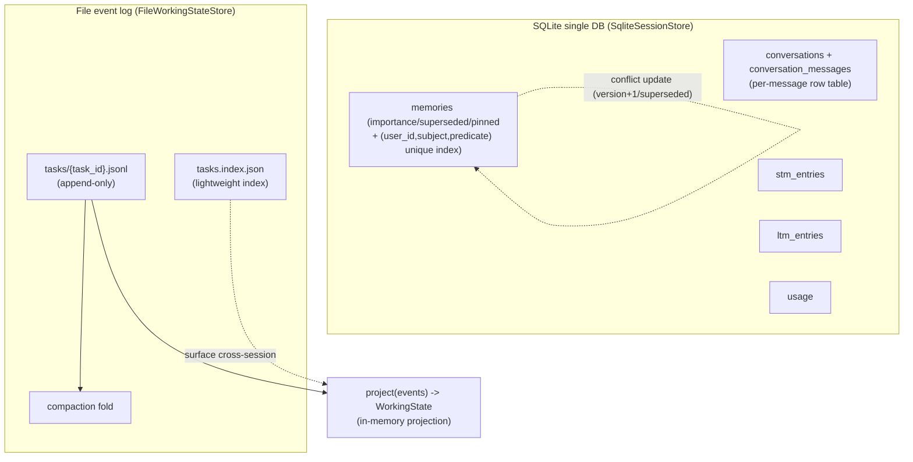

# OneAI Persistence Mechanism

> SQLite (sessions/STM/LTM/facts/usage) + a file event log (working state / cross-session continuation), two complementary persistence paths: relational state via SQLite, task working-state via an append-only event stream — the latter session-independent, cross-session continuable.

## 1. Overview (what it is)

`oneai-persistence` splits agent state by time-scale into two paths. Conversation history, long-term facts, and usage records are relational state — queryable by session/user/time — going through SQLite: one DB, multiple tables (conversations/stm_entries/ltm_entries/memories/usage). A task's working state (goal/steps/decisions/blockers) is a per-task append-only event stream — human-readable/editable, git-versionable, cross-session discoverable — going through a file event log: `<root>/tasks/{task_id}.jsonl` + `tasks.index.json`. The two paths are orthogonal: SQLite stores "conversation and memory", the file log stores "task progress", not coupled.

This layer sits in the feature layer, depending on `oneai-core` (`Conversation`/`MemoryFact`/`TaskEvent`/`UsageTracker`/`MemoryPersistence` traits), consumed by `oneai-memory` (`MemoryManager` persistence), `oneai-agent` (`LoopState` projection), `oneai-app` (`AppSession` startup/shutdown save). The old `ProgressiveCheckpointManager`/`auto_checkpoint`/`AppSession::save_checkpoint` are removed; only `FilePersistence`/`StatePersistence` remain for Studio's checkpoint browser.

## 2. Responsibilities & capabilities (what it does)

**SQLite session store.** `SqliteSessionStore` holds four relational tables: `conversations` (session metadata + messages), `stm_entries` (short-term memory), `ltm_entries` (long-term memory), `memories` (atomic facts, with `importance`/`superseded`/`pinned` columns + a `(user_id,subject,predicate)` unique index for Mem0-style conflict update). `AppSession` auto-saves after each run.

**Per-message row table.** The Issue #11 fix: the old impl used `json_each(messages_json)` to count/page messages, parsing the whole blob (O(n)); switching to a `conversation_messages` per-message row table moved paging/counting to SQL, true O(page).

**Usage tracking.** `SqliteUsageTracker` impls the `UsageTracker` trait, records token-only (no USD), `from_store` reuses the session store's DB.

**File event log.** `FileWorkingStateStore` holds a per-task append-only JSONL event stream + `tasks.index.json` index + compaction (`with_compaction(event_threshold, keep_recent)`) + `project(events) -> WorkingState` projection.

**Studio checkpoint backend.** `FilePersistence`/`StatePersistence` are only for Studio's checkpoint time-travel browser (the old progressive-checkpoint infra is deleted).

**Explicitly does not**: no memory policy (that's `MemoryManager` + `MemoryProfile`); no working-state projection consumption (that's `LoopState`); `session resume <id>` is print-only preview (does not run the agent loop, does not rehydrate working state — live continuation goes through `tasks continue <id>`); no USD cost (removed).

## 3. Design motivation (why this way)

| Decision | Rationale | Rejected alternative |
|---|---|---|
| Two paths (SQLite + file), not a unified DB | Conversation/memory is relational (query by session/user), task working-state is document-shaped (human-readable/editable, git-versionable, append-only); the two have different natures — mixing in one DB sacrifices the file path's git-diff reconciliation and human editability | All in SQLite → working state loses human-readable/git-versionable/zero-dep |
| `memories` table `(user_id,subject,predicate)` unique index | Mem0-style conflict update: on insert a new fact matches old facts by triple, on hit `version+1` + `superseded=1` + `superseded_at`, not append-duplicate | No unique constraint → same fact multi-version, recall returns stale |
| `memories.pinned` column persisted independently | After pinning a fact in core memory, the `pinned` column survives restart and `enforce_budget` won't evict it; pin not only in memory | Pin in memory only → restart loses pin |
| Per-message row table replacing `json_each` | `json_each` count/paging parses the whole blob O(n); a per-message row table moves sidebar count and paging to SQL, true O(page) | Keep json_each → long-session sidebar count slow, paging parses full blob |
| Working-state hot path via in-memory projection | Each turn reads `LoopState.working_state` in-memory projection zero-IO; the file is only a durable mirror, derived once at startup | Query the store every turn → file IO pollutes the hot path |
| Event log append-only + `project` rebuildable | The source of truth is the event stream; the in-memory working state is a derived projection, rebuildable at any time; after a crash rebuilt from events | Projection as truth → state unrecoverable after crash |
| Compaction bounds growth | Append-only unbounded growth makes `read_events` slower over time; `with_compaction(event_threshold, keep_recent)` folds history past the threshold, keeping the recent tail | No compaction → long-task event log bloats |
| Old progressive-checkpoint removed | It duplicated working-state event-log functionality and split it; removing it leaves one persistence path, only `FilePersistence` for Studio browsing | Keep two → maintenance drift, inconsistent behavior |
| Usage token-only, no USD | Pricing tables are volatile and consistent with the "no USD cost" decision (see [provider](provider-mechanism_EN.md)) | Record USD → depends on volatile pricing |

## 4. Architecture & core abstractions



**Key types:**

```rust
pub struct SqliteSessionStore { /* single DB multi-table + WAL + busy_timeout */ }
pub struct FileWorkingStateStore { root: PathBuf, /* compaction config */ }
pub struct SqliteUsageTracker { /* reuses the session store DB */ }

// memories conflict update (Mem0-style)
// INSERT ... ON CONFLICT(user_id,subject,predicate) DO UPDATE
//   SET value=excluded.value, version=version+1, superseded=1, superseded_at=now

pub fn project(events: &[TaskEvent]) -> Option<WorkingState>;  // events→projection
```

## 5. Flows it participates in

**Session save/restore:** `AppSession` writes the `Conversation` to `conversations` + messages row-by-row to `conversation_messages` after each run; memory facts to `memories` (conflict-update by triple); short/long-term memory to `stm_entries`/`ltm_entries`; usage to `usage`. `session list` uses SQL to count per-session messages (sidebar count, Issue #14 folds multi-output rounds); `session resume <id>` is print-only preview, no rehydrate.

**Memory persistence:** `MemoryManager` via the `MemoryPersistence` trait (in core) calls `SqliteSessionStore` — `archive_facts` lands in `memories` with uniform embedding (the 1.1.0 fix), core-memory pin lands in the `pinned` column surviving restart, `run_decay` soft-invalidation via the `superseded` column. See [memory-mechanism](memory-mechanism_EN.md).

**Working-state:** `append_event` is the only write path, called at every plan-control-tool mutation (exit_plan_mode/task_update/decision). The hot path reads `LoopState.working_state` in-memory projection zero-IO each turn. A new session reads `tasks.index.json` once to surface `[Unfinished Work From Previous Sessions]`; `tasks continue <id>` binds and rebuilds state via `project(read_events)`. Compaction folds history past `event_threshold`, keeping the recent tail. See [working-state-mechanism](working-state-mechanism_EN.md).

**Studio checkpoint browsing:** `FilePersistence`/`StatePersistence` for Studio's time-travel browser reading historical snapshots (a residual use of the old progressive-checkpoint infra).

## 6. Dependencies

| Direction | Who | What |
|---|---|---|
| Upstream | `oneai-core` | `Conversation`/`MemoryFact`/`TaskEvent`/`TaskEventType`/`WorkingState`/`UsageTracker`/`MemoryPersistence` traits |
| Upstream | `rusqlite`/`serde`/`tokio` | SQLite, serialization, async |
| Downstream | `oneai-memory` | `MemoryManager` persists facts via the `MemoryPersistence` trait |
| Downstream | `oneai-agent` | `LoopState.working_state` in-memory projection (hot read path) + `OnResume` reconciliation |
| Downstream | `oneai-app` | `AppSession` startup/shutdown save + `sqlite_persistence_at` + `working_state(root)` |
| Downstream | `oneai-studio` | checkpoint browser reads `FilePersistence` |
| Cross-cutting | DomainPack layer 7 | `MemoryProfile.working_state` declares the persistence policy |
| Cross-cutting | CLI | `session list/resume/delete/info/decay/export-hf`, `tasks list/show/continue/archive`, `memory search/list`, `usage report/session/export` |

## 7. Key types & files

| Item | Location |
|---|---|
| `SqliteSessionStore` (single DB multi-table) | `crates/oneai-persistence/src/sqlite_store.rs:112` (`with_defaults:131`) |
| table schema (conversations/stm/ltm/memories/usage) | `crates/oneai-persistence/src/sqlite_store.rs:173,183,194,203` + `conversation_messages` row table |
| `memories` conflict update (version+1/superseded) | `crates/oneai-persistence/src/sqlite_store.rs:1047,1057` |
| `memories.pinned` column + `importance`/`superseded` migrations | `crates/oneai-persistence/src/sqlite_store.rs:248,233,240` |
| per-message row table (Issue #11 fix) | `crates/oneai-persistence/src/sqlite_store.rs` (`conversation_messages`) |
| sidebar count (Issue #14 fold) | `crates/oneai-persistence/src/sqlite_store.rs:861,867` |
| `FileWorkingStateStore` + compaction + `read_events` | `crates/oneai-persistence/src/working_state_store.rs:36,55,96` |
| `project(events) -> WorkingState` | `crates/oneai-persistence/src/working_state_store.rs:245` |
| `SqliteUsageTracker` (token-only, no USD) | `crates/oneai-persistence/src/usage_tracker.rs:37` (`from_store:57`) |
| `FilePersistence`/`StatePersistence` (Studio browsing) | `crates/oneai-persistence/src/checkpoint.rs:23` + `state.rs` |

## 8. Industry comparison

| System | Model | OneAI's trade-off |
|---|---|---|
| **Claude Code** | `~/.claude/projects/{cwd}/{id}.jsonl` append-only session storage | OneAI working-state takes the same file approach (human-readable/git-versionable); conversation/memory goes through SQLite for relational queries — Claude Code is all-file, OneAI splits by nature into two paths |
| **Letta / Mem0** | memory systems with their own SQLite/vector persistence | OneAI pulls the `MemoryPersistence` trait to core, impl in persistence; the memory system (memory crate) takes the same backend, persistence and memory policy decoupled |
| **LangGraph checkpoint** | checkpoint persistence + time-travel | OneAI removes progressive-checkpoint, switching to event-sourcing + rebuildable projection (stronger: rebuildable after crash, not snapshot-dependent); the Studio browser reuses the residual `FilePersistence` |
| **RALPH / agent-session-resume** | TASKS.md + git for working state | OneAI is the same idea (file + git-diff reconciliation), but uses a JSONL event stream + `project` projection, structured and validatable |
| **Temporal event sourcing** | append-only events + projection | OneAI working-state is a slim event-sourcing version (per-task JSONL + in-memory projection + compaction), for local single-user not distributed |

OneAI's distinct points: **two paths split by state nature** (relational via SQLite, document via file event log) + **event-sourcing rebuildable** (projection rebuildable after crash, not snapshot-dependent) + **memories triple conflict update** (Mem0-style, no duplicate multi-version).

## 9. Extension points & config

- **Wire persistence**: `AppBuilder::sqlite_persistence_at(path)` + `working_state(root)`.
- **Compaction**: `FileWorkingStateStore::with_compaction(event_threshold, keep_recent)`.
- **Cross-session continuation**: `tasks continue <id>` binds a new session to an old task, `project(read_events)` rebuilds.
- **Session preview**: `session resume <id>` (print-only); live continuation via `tasks continue`.
- **Memory query**: `memory search/list --user` (cross-session persistent facts).
- **Usage**: `usage report/session/export` (token-only).
- **Export**: `session export-hf` (live+archival snapshot stitch → OpenAI messages JSONL + regex redaction).
- **CLI**: see [cli-reference](cli-reference_EN.md).

## 10. Further reading

- [working-state-mechanism](working-state-mechanism_EN.md) — the full mechanism of the file event log + projection + cross-session discovery
- [memory-mechanism](memory-mechanism_EN.md) — `memories` table conflict update + `pinned` column + decay soft-invalidation
- [domain-pack-mechanism](domain-pack-mechanism_EN.md) — layer 7 `MemoryProfile.working_state` policy
- [rag-mechanism](rag-mechanism_EN.md) — the sqlite-vec vector backend reuses SQLite
- [CLAUDE.md — Persistence](../CLAUDE.md)
- Source: `crates/oneai-persistence/src/` (6 files / ~3.9K LOC)
