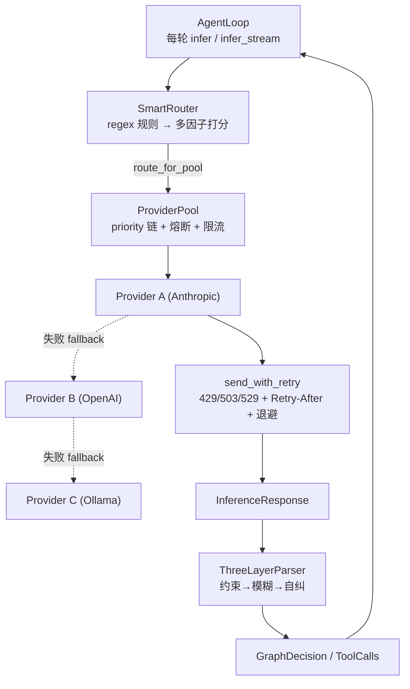

# OneAI Provider / 路由 / 解析器机制

> LLM Provider 抽象 + 降级池 + 多因子路由 + 3 层输出解析防御：把多家厂商统一在一个 trait 之上，叠两层韧性应对「provider 会挂」，再用三层解析器应对「模型会胡说」；**Provider 是可选的**——纯工具/纯工作流用法无需 Provider。

## 1. 概述（是什么）

`oneai-provider` 与 `oneai-parser` 是 OneAI 与外部 LLM 打交道的两层：前者统一调用、做韧性路由，后者防御不可靠输出。两者都位于特性层、依赖 `oneai-core` 的 `LlmProvider`/`OutputParser` trait，被 `oneai-app` 的 `AppBuilder` 装配、`oneai-agent` 的 `AgentLoop` 消费。

`oneai-provider` 内置四个原生 provider——OpenAI、Anthropic、Gemini、Ollama——并通过 `Compat` 抽象覆盖任意 OpenAI 兼容网关（DeepSeek、智谱、百炼、Groq、vLLM、LM Studio 等）。在单 provider 之上叠两层韧性：`ProviderPool` 做降级链（provider 挂了自动切下一个），`SmartRouter` 做多因子路由（按延迟/质量/健康打分选优）。`oneai-parser` 则把模型输出当不可信数据处理，用约束解码→模糊修复→自纠重提示三层兜底。

一个常被忽略的设计点：OneAI 不再以 USD 成本做路由。用量只按 token 维度记录（见 [usage 机制](#)），SmartRouter 的打分维度是延迟、质量、健康、上下文契合度，不掺价格——这让路由决策不依赖易变的定价表。

## 2. 职责与能力（做什么）

**Provider 抽象与实现。** `LlmProvider` trait 提供 `infer` + `infer_stream`，四个原生 provider 各自实现。`ProviderFactory::create(config)` 按 `ModelConfig` 造 provider；`Compat::detect` 按配置自动判定协议族（`OpenAICompat`/`AnthropicCompat`/`GeminiCompat`/`OllamaCompat`）与认证风格（`AuthStyle`）。

**降级池。** `ProviderPool` 持一组 `ProviderEntry`（带 priority 与 cooldown），自带熔断器、限流器、用量追踪、fallback 日志、降级规则（`DegradationRule`，如 Anthropic→OpenAI→本地）。某 provider 抛错即按链 fallback，`FallbackEvent` 记录原因。

**多因子路由。** `SmartRouter` 在 `ProviderPool` 之上做细粒度选优：先用 regex 规则匹配，匹配失败或策略覆盖时按 `RoutingStrategy`（延迟优先/质量优先/均衡/自定义）对全部 provider 打分，叠加熔断、限流、上下文窗口契合度（`ContextFitResult`），每次决策落 `SmartRouteDecision` 日志。

**429 重试。** `ProviderRetryConfig` + `send_with_retry` 识别可重试状态码（429/503/529），解析 `Retry-After`（整秒或 RFC 2822 日期），指数退避且 `Retry-After` 优先于估算、封顶 `max_delay`。

**三层解析。** `ThreeLayerParser` 实现 `OutputParser` trait：第一层约束解码（`ConstrainedDecoder` trait，流式增量结构约束，`StubConstrainedDecoder` 占位）、第二层模糊 JSON 修复（`FuzzyJsonRepair` 补括号、正则提取、嵌入式 JSON 检测）、第三层回退自纠（`FallbackLoop.self_correct` 构造自纠提示让模型重生）。

**显式不做什么**：不解析非 LLM 输出（只管 tool_calls/决策）；不做 USD 成本/预算（已移除）；不持有会话状态（无状态调用）；不直接装配上下文（归 `context_assembler`）；provider 的协议探测是同步缓存读、不每轮发网络（见模型上下文三层解析）。

## 3. 设计动机（为什么这样实现）

| 决策 | 理由 | 否决的替代方案 |
|---|---|---|
| `LlmProvider` trait 在 core，实现在 provider crate | trait 是跨 crate 契约（agent/memory/eval 都要消费），定义下沉到无下游依赖的 core | trait 放本 crate → 反向依赖 |
| `Compat` 协议族抽象而非每厂商一个 crate | DeepSeek/智谱/Groq/vLLM 都说 OpenAI 兼容，一个 `OpenAICompat` + `Compat::detect` 即覆盖，不必为每家造 crate | 每家一 crate → 数量爆炸、维护负担 |
| `AuthStyle` 显式建模而非硬编码 | Bearer / x-api-key / OAuth 是 per-family 的真实属性，显式建模才能被 `token compat` 探测、为未来 §4.3 Api/Provider split 留位 | 硬编码在各 provider → 探测与扩展困难 |
| 两层韧性（ProviderPool + SmartRouter）而非合一 | 降级（挂了切下一个）与选优（多个都活着挑哪个）是两个正交问题；池管可用性、路由管择优，职责清晰 | 单一大路由器 → 两类逻辑纠缠 |
| 移除 USD 成本维度 | 定价表易变、维护负担重，且 OneAI 用量只按 token 维度记录；路由按延迟/质量/健康/上下文足够 | 保留成本路由 → 依赖易变定价、且与"无 USD 成本"的整体决策冲突 |
| 429/503/529 可重试 + `Retry-After` 优先 | 这三个是瞬态过载，重试通常能恢复；provider 给的 `Retry-After` 比本地估算准，应优先采纳但封顶防过长 | 全错码都 fallback → 瞬态错误浪费降级链 |
| 三层解析而非单次 `serde_json::from_str` | LLM 输出常带尾随逗号、未闭合括号、嵌入散文；单次解析失败就把整轮作废太脆；三层逐级兜底，最后一层还能让模型自纠 | 单次解析 → 一次失败即整轮失败 |
| `FallbackLoop` 用 LLM 自纠而非纯规则修复 | 规则修复能补括号但不能补"模型把 tool_call 写成自然语言"这类语义错；让模型重生一次成功率更高 | 纯规则 → 只能修语法、修不了语义 |

## 4. 架构与核心抽象



**Provider 抽象（trait 在 core）：**

```rust
#[async_trait]
pub trait LlmProvider: Send + Sync {
    async fn infer(&self, req: InferenceRequest) -> Result<InferenceResponse>;
    async fn infer_stream(...) -> ...;
    fn probe_context_window(&self) -> Option<u32> { None }   // L2 服务商 API 探测（默认 None）
}
```

**协议族与认证：**

```rust
#[non_exhaustive]
pub enum CompatFamily { OpenAICompat, AnthropicCompat, GeminiCompat, OllamaCompat }
#[non_exhaustive]
pub enum AuthStyle { /* Bearer / x-api-key / … */ }
pub struct Compat { /* family + auth + endpoint + detect()/from_config() */ }
```

## 5. 参与的流程

**推理-解析链路（每轮迭代）：**

1. **路由**：AgentLoop 把 `InferenceRequest` 交给 `SmartRouter::route`。router 先跑 regex 规则匹配模型名；命中且校验通过则直接用；否则按 `RoutingStrategy` 对全部 provider 的 `ModelQualityProfile`（含 `estimated_latency_ms`）打分，叠加熔断状态、限流、`ContextFitResult`（上下文窗口契合度），选出最优，落 `SmartRouteDecision` 日志。
2. **降级**：router 调 `route_for_pool` 把请求交给 `ProviderPool`。池按 priority 取活跃 provider 执行；若该 provider 熔断或抛错，按 `DegradationRule` 找下一个并记 `FallbackEvent`。
3. **重试**：`send_with_retry` 在单 provider 内处理瞬态错误——`is_retryable_status`（429/503/529）为真时，`parse_retry_after` 读 `Retry-After`（整秒或 RFC 2822 日期），`compute_backoff_delay` 算指数退避，`Retry-After` 优先但封顶 `max_delay`，重试到 `max_retries` 才上抛触发降级。
4. **流式**：`infer_stream` 边收边由 `streaming.rs` 增量检测 tool_use，首 token 空闲超时则走可重试错误（见 [stream 机制](#)）。
5. **解析**：`InferenceResponse` 交 `ThreeLayerParser::parse_tool_calls`：第一层约束解码（流式增量结构约束）→ 失败则第二层 `FuzzyJsonRepair`（补括号、正则提取、嵌入式 JSON）→ 仍失败则第三层 `FallbackLoop::self_correct` 构造自纠提示让模型重生。结果为结构化 `GraphDecision`/`ToolCalls`，回填 AgentLoop。

**模型上下文三层解析**：provider 的 `probe_context_window` 是 L2 服务商 API 探测，与 L1 用户配置、L3 内置库合成上下文窗口（详见 [context-management](context-management-mechanism.md)），探测结果同步缓存读、不每轮发网络。

## 6. 依赖关系

| 方向 | 谁 | 内容 |
|---|---|---|
| 上游 | `oneai-core` | `LlmProvider`/`OutputParser`/`ParsingLayer`/`InferenceRequest`/`InferenceResponse`/`ContextFitResult`/`TokenCounter`/`CircuitBreaker`/`RateLimiter`/`UsageTracker` trait |
| 上游 | `reqwest`/`chrono`/`regex`/`serde` | HTTP、Retry-After 日期、规则、序列化 |
| 下游 | `oneai-agent` | `AgentLoop` 调 `infer`/`route`，`streaming.rs` 增量解析 |
| 下游 | `oneai-app` | `AppBuilder` 装配 `default_provider_pool_*` + `default_smart_router_*` |
| 横切接入 | env 变量 | `HTTPS_PROXY`/`HTTP_PROXY`/`ALL_PROXY`/`NO_PROXY` 全端统一代理（reqwest 自动读） |
| 横切接入 | CLI | `provider status/fallback-log/test`、`route/route-log/route-config`、`token probe/models/context` |

## 7. 关键类型与文件

| 项 | 位置 |
|---|---|
| `LlmProvider` trait | `crates/oneai-core/src/traits.rs`（trait 在 core）|
| OpenAI / Anthropic / Gemini / Ollama | `crates/oneai-provider/src/{openai,anthropic,gemini,ollama}.rs`（Anthropic `:38` + prompt cache 断点 `:179-262`）|
| `CompatFamily`/`AuthStyle`/`Compat`（detect/from_config）| `crates/oneai-provider/src/compat.rs:39,69,90`（`detect:163`/`from_config:208`）|
| `ProviderFactory::create` | `crates/oneai-provider/src/provider_factory.rs:41` |
| `ProviderEntry`/`ProviderPool` + 降级链 | `crates/oneai-provider/src/provider_pool.rs:64,152`（`route_for_pool` + `DegradationRule` + `FallbackEvent`）|
| `SmartRouter` + 多因子打分 | `crates/oneai-provider/src/smart_router.rs:60`（`route:178`/`route_for_pool:408`/`route_for_degradation:507`）|
| `SmartRouteConfig`/`SmartRouteDecision`/`RoutingStrategy`/`ModelQualityProfile` | `crates/oneai-provider/src/smart_router.rs` |
| `ProviderRetryConfig`/`send_with_retry`/`is_retryable_status`/`parse_retry_after`/`compute_backoff_delay` | `crates/oneai-provider/src/retry.rs:33,124,137,172` |
| `ModelRouter`/`RouteDecision`/`RouteRule`（regex 规则路由）| `crates/oneai-provider/src/model_router.rs` |
| 上下文窗口探测（L2）| `crates/oneai-provider/src/{anthropic,ollama,gemini}.rs`（`parse_*_context_window`）|
| `ThreeLayerParser` | `crates/oneai-parser/src/three_layer.rs:16`（`parse_tool_calls:66`）|
| `ConstrainedDecoder` trait + Stub | `crates/oneai-parser/src/constrained.rs:14,29` |
| `FuzzyJsonRepair` | `crates/oneai-parser/src/fuzzy.rs:14`（`repair_and_parse:37`）|
| `FallbackLoop`（自纠重提示）| `crates/oneai-parser/src/fallback.rs:14`（`self_correct:39`）|

## 8. 与业界对比

| 系统 | 模型 | OneAI 取舍 |
|---|---|---|
| **LangChain** | `BaseChatModel` + Runnable 路由 | OneAI 的 `Compat` 把"OpenAI 兼容"做成一等抽象，一个 family 覆盖十余家网关；SmartRouter 的多因子打分 + 上下文契合度比 LangChain 的 Runnable 路由更生产级 |
| **LiteLLM** | 统一 API + 100+ provider 路由 | LiteLLM 以成本路由见长；OneAI **显式移除 USD 成本维度**，只按延迟/质量/健康路由——不依赖易变定价表，路由决策稳定可复现 |
| **OpenAI SDK** | 单厂商，无降级链 | OneAI 两层韧性（Pool 降级 + SmartRouter 选优）开箱即用，429/503/529 自动重试 + `Retry-After` 解析 |
| **Portkey / OpenRouter** | 网关聚合 + 路由 | OneAI 是自托管等价物：协议探测 + 降级 + 多因子路由 + 决策日志全在 crate 内，不依赖外部网关服务 |
| **Instructor / Outlines** | 结构化输出（约束解码/函数校验） | OneAI 三层解析是同类思路但更韧：约束解码失败有模糊修复兜底，模糊修复失败有 LLM 自纠，三层逐级降级而非一次失败即报错 |

OneAI 独特点：**两层韧性正交**（降级管可用、路由管择优）+ **三层解析逐级兜底**（语法→语义→自纠），且**不以价格路由**——稳定性与可复现性优先于成本优化。

## 9. 扩展点与配置

- **加 provider**：impl `LlmProvider`（建议同时 impl `probe_context_window` 喂 L2 探测），经 `ProviderFactory` 或 `AppBuilder` 注册。
- **OpenAI 兼容网关**：配 `ModelConfig` 指向网关 endpoint，`Compat::detect` 自动判 family。
- **降级链**：`ProviderPool::new(entries, config)` 按priority排，配 `DegradationRule`；或 `AppBuilder::default_provider_pool_anthropic()`。
- **路由策略**：`SmartRouteConfig.strategy`（延迟/质量/均衡/自定义）+ `add_quality_profile`；`AppBuilder::default_smart_router_balanced()`。
- **重试**：`ProviderRetryConfig::new/aggressive/no_retry`，或 CLI `default_rate_limiter`。
- **代理 env**：`HTTPS_PROXY`/`ALL_PROXY`/`NO_PROXY`（含 SOCKS5）。
- **CLI**：`provider status/fallback-log/test`、`route/route-log/route-config`、`token probe/models/context`（详见 [cli-reference](cli-reference.md)）。

## 10. 深入阅读

- [context-management-mechanism.md](context-management-mechanism.md) —— 模型上下文三层解析（L2 探测在此）+ token 计数
- [multi-agent-mechanism.md](multi-agent-mechanism.md) —— AgentLoop 如何调 `infer` 与解析决策
- [tool-mechanism.md](tool-mechanism.md) —— 解析出的 `ToolCalls` 如何执行
- [CLAUDE.md — Network proxy / Provider 章节](../CLAUDE.md)
- 源码：`crates/oneai-provider/src/`（11 文件 / ~9.3K LOC）+ `crates/oneai-parser/src/`（5 文件 / ~731 LOC）
