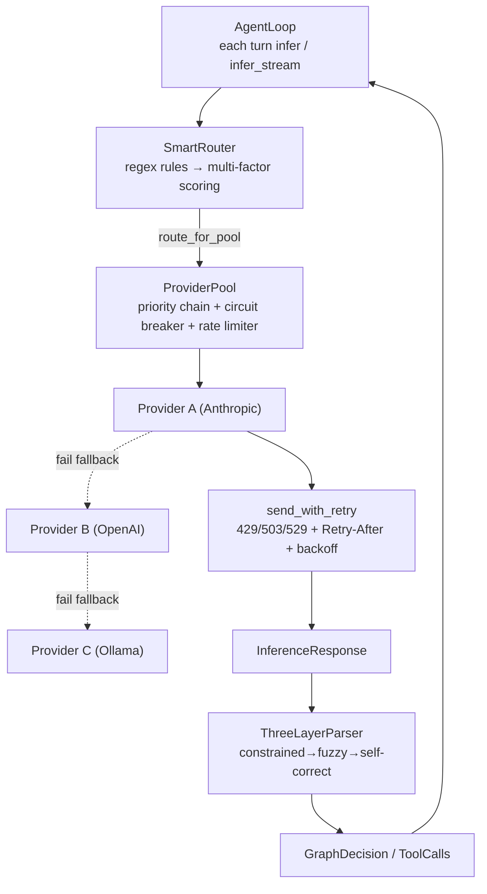

# OneAI Provider / Routing / Parser Mechanism

> LLM Provider abstraction + fallback pool + multi-factor routing + 3-layer output parsing defense: unifies multiple vendors on one trait, stacks two layers of resilience against "providers go down", and a three-layer parser against "the model makes things up"; **the provider is optional** — tool-only or workflow-only usage needs no provider.

## 1. Overview (what it is)

`oneai-provider` and `oneai-parser` are OneAI's two layers for talking to external LLMs: the former unifies calls and does resilient routing, the latter defends unreliable output. Both sit in the feature layer, depending on `oneai-core`'s `LlmProvider`/`OutputParser` traits, consumed by `oneai-app`'s `AppBuilder` and `oneai-agent`'s `AgentLoop`.

`oneai-provider` ships four native providers — OpenAI, Anthropic, Gemini, Ollama — and covers any OpenAI-compatible gateway (DeepSeek, Zhipu, Bailian, Groq, vLLM, LM Studio, …) via the `Compat` abstraction. On top of a single provider it stacks two resilience layers: `ProviderPool` as a fallback chain (auto-switch when a provider fails), `SmartRouter` as multi-factor routing (scoring by latency/quality/health). `oneai-parser` treats model output as untrusted data, with a three-layer fallback: constrained decode → fuzzy repair → self-correct re-prompt.

An often-overlooked design point: OneAI no longer routes by USD cost. Usage is recorded token-only (see the usage mechanism), and `SmartRouter` scores by latency, quality, health, and context fit — no price dimension — so routing decisions do not depend on a volatile pricing table.

## 2. Responsibilities & capabilities (what it does)

**Provider abstraction & impls.** The `LlmProvider` trait offers `infer` + `infer_stream`; four native providers each implement it. `ProviderFactory::create(config)` builds a provider from `ModelConfig`; `Compat::detect` auto-detects the protocol family (`OpenAICompat`/`AnthropicCompat`/`GeminiCompat`/`OllamaCompat`) and auth style (`AuthStyle`).

**Fallback pool.** `ProviderPool` holds a set of `ProviderEntry` (with priority and cooldown), with a circuit breaker, rate limiter, usage tracker, fallback log, and degradation rules (`DegradationRule`, e.g. Anthropic→OpenAI→local). A provider error triggers fallback along the chain; `FallbackEvent` records the reason.

**Multi-factor routing.** `SmartRouter` does fine-grained selection atop `ProviderPool`: first regex-rule matching, and on match failure or strategy override, scores all providers by `RoutingStrategy` (latency-first/quality-first/balanced/custom), stacking circuit-breaker state, rate limiting, and context-window fit (`ContextFitResult`); each decision lands a `SmartRouteDecision` log.

**429 retry.** `ProviderRetryConfig` + `send_with_retry` recognize retryable statuses (429/503/529), parse `Retry-After` (integer seconds or RFC 2822 date), exponential backoff where `Retry-After` overrides the estimate, capped at `max_delay`.

**Three-layer parsing.** `ThreeLayerParser` implements the `OutputParser` trait: layer 1 constrained decoding (`ConstrainedDecoder` trait, streaming incremental structural constraint, `StubConstrainedDecoder` placeholder), layer 2 fuzzy JSON repair (`FuzzyJsonRepair` closes brackets, regex extracts, embedded-JSON detection), layer 3 fallback self-correction (`FallbackLoop.self_correct` constructs a self-correct prompt for the model to regenerate).

**Explicitly does not**: no parsing of non-LLM output (only tool_calls/decisions); no USD cost/budget (removed); no session state (stateless calls); no direct context assembly (that's `context_assembler`'s); provider context-window probing is a synchronous cached read, not a network call per turn (see 3-layer model-context resolution).

## 3. Design motivation (why this way)

| Decision | Rationale | Rejected alternative |
|---|---|---|
| `LlmProvider` trait in core, impl in provider crate | The trait is a cross-crate contract (agent/memory/eval all consume it); the definition sinks to core with no downstream deps | Trait in this crate → reverse dep |
| `Compat` protocol-family abstraction, not one crate per vendor | DeepSeek/Zhipu/Groq/vLLM all claim OpenAI compatibility; one `OpenAICompat` + `Compat::detect` covers them, no need for a crate per vendor | One crate per vendor → explosion, maintenance burden |
| `AuthStyle` explicit, not hardcoded | Bearer / x-api-key / OAuth are per-family real properties; explicit modeling lets `token compat` probe them and reserves room for the future §4.3 Api/Provider split | Hardcoded per provider → probing and extension hard |
| Two resilience layers (ProviderPool + SmartRouter), not unified | Fallback (switch when down) and selection (pick the best among the up) are two orthogonal problems; the pool manages availability, the router optimizes choice | One big router → the two concerns entangled |
| Remove the USD cost dimension | Pricing tables are volatile and maintenance-heavy, and OneAI records usage token-only; latency/quality/health/context is enough for routing | Keep cost routing → depends on volatile pricing, conflicts with the "no USD cost" decision |
| 429/503/529 retryable + `Retry-After` preferred | These three are transient overload, retry usually recovers; the provider's `Retry-After` is more accurate than a local estimate, should be preferred but capped against overly long waits | Fallback on all errors → transient errors waste the chain |
| Three-layer parsing, not a single `serde_json::from_str` | LLM output often has trailing commas, unclosed brackets, embedded prose; a single parse failure discards the whole turn — too fragile; three layers fall back progressively, the last layer even lets the model self-correct | Single parse → one failure kills the turn |
| `FallbackLoop` uses LLM self-correction, not pure rule repair | Rule repair closes brackets but cannot fix "the model wrote a tool_call as natural language" — a semantic error; letting the model regenerate once has a higher success rate | Pure rules → fix syntax, not semantics |

## 4. Architecture & core abstractions



**Provider abstraction (trait in core):**

```rust
#[async_trait]
pub trait LlmProvider: Send + Sync {
    async fn infer(&self, req: InferenceRequest) -> Result<InferenceResponse>;
    async fn infer_stream(...) -> ...;
    fn probe_context_window(&self) -> Option<u32> { None }   // L2 provider API probe (default None)
}
```

**Protocol families & auth:**

```rust
#[non_exhaustive]
pub enum CompatFamily { OpenAICompat, AnthropicCompat, GeminiCompat, OllamaCompat }
#[non_exhaustive]
pub enum AuthStyle { /* Bearer / x-api-key / … */ }
pub struct Compat { /* family + auth + endpoint + detect()/from_config() */ }
```

## 5. Flows it participates in

**Inference-parsing chain (each iteration):**

1. **Routing**: the AgentLoop hands `InferenceRequest` to `SmartRouter::route`. The router first runs regex rules to match a model name; on a validated hit it uses it directly; otherwise it scores all providers' `ModelQualityProfile` (incl. `estimated_latency_ms`) by `RoutingStrategy`, stacking circuit-breaker state, rate limiting, and `ContextFitResult` (context-window fit), picks the best, logs `SmartRouteDecision`.
2. **Fallback**: the router calls `route_for_pool` to hand the request to `ProviderPool`. The pool takes the active provider by priority; if that provider is circuit-broken or errors, it finds the next per `DegradationRule` and records a `FallbackEvent`.
3. **Retry**: `send_with_retry` handles transient errors within a single provider — when `is_retryable_status` (429/503/529) is true, `parse_retry_after` reads `Retry-After` (integer seconds or RFC 2822 date), `compute_backoff_delay` computes exponential backoff, `Retry-After` preferred but capped at `max_delay`, retrying up to `max_retries` before surfacing to trigger fallback.
4. **Streaming**: `infer_stream` is consumed incrementally by `streaming.rs` to detect tool_use; first-token idle timeout surfaces as a retryable error (see the stream mechanism).
5. **Parsing**: `InferenceResponse` goes to `ThreeLayerParser::parse_tool_calls`: layer 1 constrained decoding (streaming incremental structural constraint) → on failure layer 2 `FuzzyJsonRepair` (close brackets, regex extract, embedded JSON) → still failing, layer 3 `FallbackLoop::self_correct` constructs a self-correct prompt for the model to regenerate. The result is a structured `GraphDecision`/`ToolCalls`, fed back to the AgentLoop.

**3-layer model-context resolution**: the provider's `probe_context_window` is the L2 provider API probe, combined with L1 user config and L3 builtin library into the context window (see [context-management](context-management-mechanism_EN.md)); the probe result is synchronously cached, not a network call per turn.

## 6. Dependencies

| Direction | Who | What |
|---|---|---|
| Upstream | `oneai-core` | `LlmProvider`/`OutputParser`/`ParsingLayer`/`InferenceRequest`/`InferenceResponse`/`ContextFitResult`/`TokenCounter`/`CircuitBreaker`/`RateLimiter`/`UsageTracker` traits |
| Upstream | `reqwest`/`chrono`/`regex`/`serde` | HTTP, Retry-After date, rules, serialization |
| Downstream | `oneai-agent` | `AgentLoop` calls `infer`/`route`; `streaming.rs` incremental parsing |
| Downstream | `oneai-app` | `AppBuilder` wires `default_provider_pool_*` + `default_smart_router_*` |
| Cross-cutting | env | `HTTPS_PROXY`/`HTTP_PROXY`/`ALL_PROXY`/`NO_PROXY` unified proxy (reqwest auto-reads) |
| Cross-cutting | CLI | `provider status/fallback-log/test`, `route/route-log/route-config`, `token probe/models/context` |

## 7. Key types & files

| Item | Location |
|---|---|
| `LlmProvider` trait | `crates/oneai-core/src/traits.rs` (trait in core) |
| OpenAI / Anthropic / Gemini / Ollama | `crates/oneai-provider/src/{openai,anthropic,gemini,ollama}.rs` (Anthropic `:38` + prompt-cache breakpoints `:179-262`) |
| `CompatFamily`/`AuthStyle`/`Compat` (detect/from_config) | `crates/oneai-provider/src/compat.rs:39,69,90` (`detect:163`/`from_config:208`) |
| `ProviderFactory::create` | `crates/oneai-provider/src/provider_factory.rs:41` |
| `ProviderEntry`/`ProviderPool` + fallback chain | `crates/oneai-provider/src/provider_pool.rs:64,152` (`route_for_pool` + `DegradationRule` + `FallbackEvent`) |
| `SmartRouter` + multi-factor scoring | `crates/oneai-provider/src/smart_router.rs:60` (`route:178`/`route_for_pool:408`/`route_for_degradation:507`) |
| `SmartRouteConfig`/`SmartRouteDecision`/`RoutingStrategy`/`ModelQualityProfile` | `crates/oneai-provider/src/smart_router.rs` |
| `ProviderRetryConfig`/`send_with_retry`/`is_retryable_status`/`parse_retry_after`/`compute_backoff_delay` | `crates/oneai-provider/src/retry.rs:33,124,137,172` |
| `ModelRouter`/`RouteDecision`/`RouteRule` (regex rule routing) | `crates/oneai-provider/src/model_router.rs` |
| Context-window probe (L2) | `crates/oneai-provider/src/{anthropic,ollama,gemini}.rs` (`parse_*_context_window`) |
| `ThreeLayerParser` | `crates/oneai-parser/src/three_layer.rs:16` (`parse_tool_calls:66`) |
| `ConstrainedDecoder` trait + Stub | `crates/oneai-parser/src/constrained.rs:14,29` |
| `FuzzyJsonRepair` | `crates/oneai-parser/src/fuzzy.rs:14` (`repair_and_parse:37`) |
| `FallbackLoop` (self-correct re-prompt) | `crates/oneai-parser/src/fallback.rs:14` (`self_correct:39`) |

## 8. Industry comparison

| System | Model | OneAI's trade-off |
|---|---|---|
| **LangChain** | `BaseChatModel` + Runnable routing | OneAI's `Compat` makes "OpenAI-compatible" a first-class abstraction, one family covering a dozen gateways; SmartRouter's multi-factor scoring + context fit is more production-grade than LangChain's Runnable routing |
| **LiteLLM** | unified API + 100+ provider routing | LiteLLM excels at cost routing; OneAI **explicitly removes the USD cost dimension**, routing only by latency/quality/health — no volatile pricing table, routing decisions stable and reproducible |
| **OpenAI SDK** | single vendor, no fallback chain | OneAI's two resilience layers (Pool fallback + SmartRouter selection) work out of the box; 429/503/529 auto-retry + `Retry-After` parsing |
| **Portkey / OpenRouter** | gateway aggregation + routing | OneAI is a self-hosted equivalent: protocol detection + fallback + multi-factor routing + decision logs all in-crate, no external gateway service |
| **Instructor / Outlines** | structured output (constrained decoding/function validation) | OneAI's three-layer parsing is the same idea but more resilient: constrained-decode failure has fuzzy repair, fuzzy-repair failure has LLM self-correction, three layers of progressive fallback rather than one-shot failure |

OneAI's distinct points: **two orthogonal resilience layers** (fallback for availability, router for selection) + **three-layer progressive parsing** (syntax → semantics → self-correction), and **no price routing** — stability and reproducibility over cost optimization.

## 9. Extension points & config

- **Add a provider**: impl `LlmProvider` (recommend also impl `probe_context_window` to feed L2 probing), register via `ProviderFactory` or `AppBuilder`.
- **OpenAI-compatible gateway**: set `ModelConfig` to point at the gateway endpoint; `Compat::detect` auto-detects the family.
- **Fallback chain**: `ProviderPool::new(entries, config)` ordered by priority, configure `DegradationRule`; or `AppBuilder::default_provider_pool_anthropic()`.
- **Routing strategy**: `SmartRouteConfig.strategy` (latency/quality/balanced/custom) + `add_quality_profile`; `AppBuilder::default_smart_router_balanced()`.
- **Retry**: `ProviderRetryConfig::new/aggressive/no_retry`, or CLI `default_rate_limiter`.
- **Proxy env**: `HTTPS_PROXY`/`ALL_PROXY`/`NO_PROXY` (incl. SOCKS5).
- **CLI**: `provider status/fallback-log/test`, `route/route-log/route-config`, `token probe/models/context` (see [cli-reference](cli-reference_EN.md)).

## 10. Further reading

- [context-management-mechanism](context-management-mechanism_EN.md) — 3-layer model-context resolution (L2 probe here) + token counting
- [multi-agent-mechanism](multi-agent-mechanism_EN.md) — how the AgentLoop calls `infer` and parses decisions
- [tool-mechanism](tool-mechanism_EN.md) — how parsed `ToolCalls` execute
- [CLAUDE.md — Network proxy / Provider](../CLAUDE.md)
- Source: `crates/oneai-provider/src/` (11 files / ~9.3K LOC) + `crates/oneai-parser/src/` (5 files / ~731 LOC)
