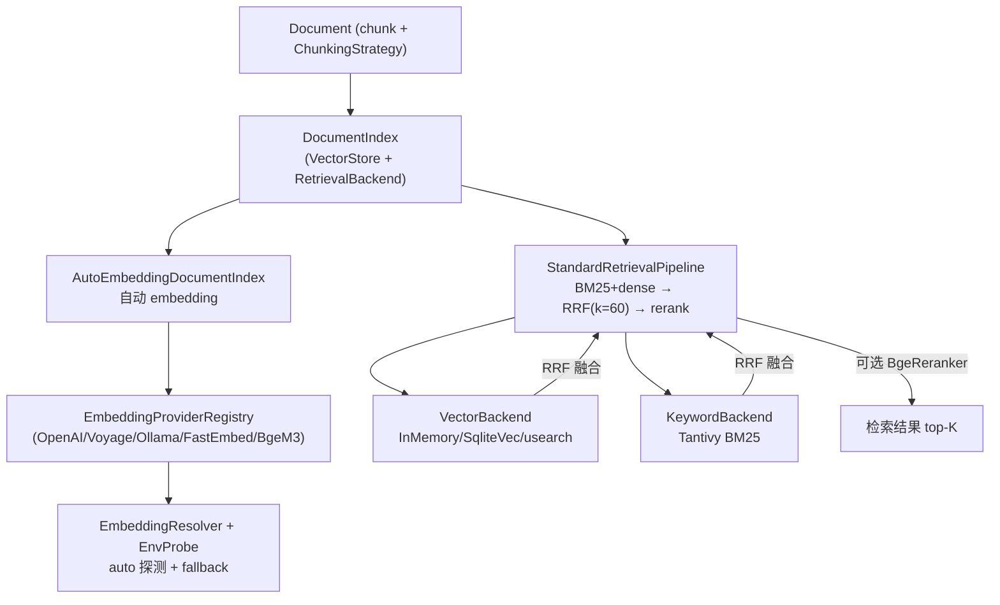

# OneAI RAG / Embedding 机制

> `EmbeddingService` trait + adapter 注册表 + auto 探测 + fallback + 默认检索栈（BM25+dense→RRF→rerank）：长期记忆语义召回与文档检索的向量层，默认零配置——不填任何 embedding 字段即走 auto 探测，全无可用时降级关键词召回，不报错。

## 1. 概述（是什么）

`oneai-rag` 与 `oneai-vector` 共同构成 OneAI 的检索增强层。前者定义 embedding 接入与文档索引，后者提供默认检索后端栈。两者位于特性层、依赖 `oneai-core` 的 `EmbeddingService`/`VectorBackend`/`KeywordBackend`/`RetrievalBackend`/`RerankerProvider` trait，被 `oneai-memory`（记忆语义召回）与 `oneai-app`（`AppBuilder` 默认检索栈接线）消费。

这一层的设计姿态是"零负担"：默认不填任何 embedding 配置，引擎按顺序探测可用 provider，挑第一个能用的；全无可用时降级为关键词召回，不报错、不阻塞。embedding key 与主模型 key 相互独立——中转站大概率没有 embedding 端点，因此 auto 不复用主模型 key；Anthropic 无原生 embedding API，真实路径走 Voyage。默认检索栈是 `StandardRetrievalPipeline`——BM25 + dense 向量并行检索、RRF 融合、可选 cross-encoder 重排，这套流程来自 Anthropic "Contextual Retrieval" 评测（top-20 检索失败率降 67%）。

## 2. 职责与能力（做什么）

**Embedding 接入。** `EmbeddingService` trait（在 core）+ 多 adapter：`OpenAiAdapter`/`OpenAiCompatAdapter`（中转站）/`VoyageAdapter`/`OllamaAdapter`/`FastEmbedAdapter`（本地 ONNX）/`BgeM3Adapter`（ort，opt-in）。`EmbeddingProviderRegistry` 注册、`EmbeddingResolver` + `EnvProbe` 做 auto 探测与 fallback。

**auto 探测链。** 按固定顺序探测：①openai-compat（需 `ONEAI_EMBEDDING_API_KEY`+`ONEAI_EMBEDDING_BASE_URL`）②voyage（`VOYAGE_API_KEY`）③openai（`OPENAI_API_KEY`）④ollama（本地可达且装了 embedding 模型）⑤fastembed（本地 ONNX，无 key，首次下载 ~22MB）⑥全无 → 关键词召回。

**fallback。** 主 provider 失败时自动切换备用，构建期 + 运行期共享一套 `should_continue` 错误分类（429/5xx/传输错/缺 key 降级，其它报错）。

**文档索引。** `Document` + `Chunk` + `ChunkingStrategy`，`DocumentIndex` 双后端（`VectorStore` + `RetrievalBackend`），`with_default_stack` 一行接默认栈，`AutoEmbeddingDocumentIndex` 自动 embedding。

**输入切分。** `enforce_max_input_tokens` 按 token 上限分批，`split_to_utf8_byte_limit` 按 UTF-8 字节二分切分（CJK 不截断）。

**默认检索栈（`oneai-vector`）。** `InMemoryVectorBackend`（brute-force cosine，测试）/`SqliteVecBackend`（`vec0` exact KNN，mobile）/`UsearchBackend`（HNSW+mmap+pre-filter）三向量后端 + `TantivyBm25Backend`（tantivy-jieba CJK BM25）+ `BgeM3Embedder`/`BgeRerankerOnnx`（ort 本地）+ `StandardRetrievalPipeline`（BM25+dense→RRF(k=60)→rerank top-150→top-K）+ `dbsf_fuse`（备用融合）。

**显式不做什么**：不做 LLM 推理（归 provider）；不持有记忆策略（归 `oneai-memory` 的 `MemoryProfile`）；不做 USD 成本统计；不实现压缩（归 `ContextCompressor`）。

## 3. 设计动机（为什么这样实现）

| 决策 | 理由 | 否决的替代方案 |
|---|---|---|
| `EmbeddingService` trait 在 core，实现在 rag | embedding 是跨 crate 契约（memory/rag/vector 都要 impl 或消费），定义下沉 core；trait 与 `LlmProvider` 分离，因 LLM 与 embedding 是两项独立能力 | 复用 `LlmProvider` 加 embed 方法 → 强行耦合两能力，无 embedding 的 provider 难表达 |
| embedding key 与主模型 key 独立、auto 不复用 | 中转站大概率无 embedding 端点，复用主 key 必失败；Anthropic 无原生 embedding API；独立 key + 探测链才能"能用什么用什么" | 复用主 key → 中转站用户永远调不通 |
| 默认零配置 + auto 探测 + 降级关键词 | 多数用户不会预先配 embedding；零配置让"开箱即用"成立，全无可用降级关键词而非报错阻塞 | 强制配 embedding → 上手门槛高、首跑即失败 |
| fallback 共享 `should_continue` 错误分类 | 主 provider 瞬态失败（429/5xx）应切备用，但有些错（参数错）切了也没用；共享分类让构建期与运行期降级逻辑一致、不漂移 | 各 provider 各自 fallback → 分类分裂、行为不可预期 |
| 默认检索栈 BM25+dense→RRF→rerank | Anthropic Contextual Retrieval 评测显示这套把 top-20 失败率降 67%；BM25 对中文短查询与唯一标识符查关键，dense 对语义同义强，RRF 融合两者长处，rerank 精排 | 只用 dense → 中文短查询/唯一 ID 查召回差；只用 BM25 → 同义召回差 |
| `oneai-vector` 独立 crate + feature flags | 检索后端依赖重（ort/tantivy/usearch），独立 crate + feature 让不需要 RAG 的场景不编译这些依赖；`default=["sqlite","usearch","tantivy"]` 无网络可构建 | 全塞进 rag → 所有人背上重依赖 |
| `InMemoryVectorBackend` 默认 + 生产可换 | 默认内存后端让首跑零依赖可用；生产显式 `retrieval_backend()` 接 Qdrant 等；trait 抽象让后端可换 | 默认接外部服务 → 首跑需起 Qdrant |
| `BgeM3`/`BgeReranker` 用 ort 本地、opt-in | 本地 embedding/rerank 免 key 免网络，但 ort 重；opt-in 让不需要本地模型的场景不编译 | 默认引入 ort → 编译重、移动端包体大 |
| UTF-8 字节二分切分 | CJK 字符多字节，按字节二分会截断字符；`split_to_utf8_byte_limit` 保证不截断 | 按字符切 → token 上限估算不准 |

## 4. 架构与核心抽象



**核心 trait（在 core，本 crate 实现/消费）：**

```rust
#[async_trait]
pub trait EmbeddingService: Send + Sync {
    async fn embed(&self, texts: &[String]) -> Result<Vec<Vec<f32>>>;
    fn dimension(&self) -> Option<usize>;     // None → 运行时探测
    fn max_input_tokens(&self) -> usize;
}

pub trait VectorBackend: Send + Sync { /* upsert / search(knn) */ }
pub trait KeywordBackend: Send + Sync { /* bm25 search */ }
pub trait RetrievalBackend: Send + Sync { /* 组合 vector+keyword */ }
pub trait RerankerProvider: Send + Sync { /* cross-encoder rerank */ }
```

## 5. 参与的流程

**文档入库（auto embedding）：**

1. `Document::new(content).chunk(strategy)` 切分（`ChunkingStrategy` 按字符/token/语义）。
2. `DocumentIndex::add_document` → `AutoEmbeddingDocumentIndex` 对每个 chunk 调 `EmbeddingService::embed`（先 `enforce_max_input_tokens` 按 token 上限分批，超长 `split_to_utf8_byte_limit` 二分不截断 CJK）。
3. `IndexedChunk` 存入 `VectorBackend`（向量）+ `KeywordBackend`（原文用于 BM25）。

**检索（StandardRetrievalPipeline）：**

1. query 经 `EmbeddingService` 得 dense 向量。
2. 并行：`VectorBackend::search`（KNN dense）+ `KeywordBackend::search`（BM25 稀疏）。
3. `rrf_fuse(legs, k=60)` 把两路结果按倒数排名融合（`dbsf_fuse` 备用）。
4. 可选 `BgeRerankerOnnx` cross-encoder 精排 top-150 → top-K。
5. 返回 top-K 检索结果。

**记忆语义召回衔接：** `oneai-memory` 的 `MemoryFactStore` 接 `VectorBackend`，事实入库时由 `archive_facts` 统一 embedding（1.1.0 修复——此前 embedding 恒 None 退化关键词），召回时三因子（相关度+近因+重要度）打分，相关度走 `search_hybrid`（语义），无 embedding 时回退关键词 `recency`。详见 [memory-mechanism](memory-mechanism.md)。

**auto 探测（启动期）：** `EmbeddingResolver` + `EnvProbe` 按六步顺序探测可用 provider，挑第一个；显式覆盖三处均可：CLI `--provider` / `~/.oneai/config.toml [embedding]` / 各平台 App 设置面板。模型名为自由字符串，未知名称运行时探测维度。

## 6. 依赖关系

| 方向 | 谁 | 内容 |
|---|---|---|
| 上游 | `oneai-core` | `EmbeddingService`/`VectorBackend`/`KeywordBackend`/`RetrievalBackend`/`RerankerProvider` trait + `MemoryFact` 共享类型 |
| 上游 | `reqwest`/`serde`/`tokio` | HTTP embedding API、序列化、异步 |
| 上游 | `oneai-vector` | 默认检索后端栈（`rag` 引 `vector` 的 `StandardRetrievalPipeline`）|
| 上游 | `sqlite-vec`/`usearch`/`tantivy`/`ort` | 向量/BM25/本地模型后端（feature-gated）|
| 下游 | `oneai-memory` | `MemoryFactStore` 接 `VectorBackend` 做语义召回 |
| 下游 | `oneai-app` | `AppBuilder::default_retrieval_stack()` + `embedding_service()` |
| 横切接入 | env 变量 | `ONEAI_EMBEDDING_API_KEY`/`_BASE_URL`/`VOYAGE_API_KEY`/`OPENAI_API_KEY` + 代理 env |
| 横切接入 | CLI | `embed generate/batch/list/health/dimension` |

## 7. 关键类型与文件

| 项 | 位置 |
|---|---|
| `EmbeddingService` trait | `crates/oneai-core/src/traits.rs` |
| adapter 注册表 + `EmbeddingResolver`/`EnvProbe`/`Availability` | `crates/oneai-rag/src/provider_adapter.rs` |
| embedding 实现（OpenAI/Ollama/FastEmbed/Voyage）| `crates/oneai-rag/src/embedding.rs` |
| `Document`/`Chunk`/`ChunkingStrategy` | `crates/oneai-rag/src/document.rs:14,80,138` |
| `DocumentIndex`（双后端）+ `with_default_stack` + `AutoEmbeddingDocumentIndex` | `crates/oneai-rag/src/index.rs:47,107` |
| 输入切分（`enforce_max_input_tokens`/`split_to_utf8_byte_limit`/`build_batches`）| `crates/oneai-rag/src/chunk_split.rs:46,25,67` |
| 混合检索 / 召回 | `crates/oneai-rag/src/retrieval.rs` |
| `InMemoryVectorBackend` | `crates/oneai-vector/src/in_memory.rs:17` |
| `SqliteVecBackend`（`vec0` KNN）| `crates/oneai-vector/src/sqlite_vec.rs:65` |
| `UsearchBackend`（HNSW+mmap）| `crates/oneai-vector/src/usearch_backend.rs:91` |
| `TantivyBm25Backend`（CJK BM25）| `crates/oneai-vector/src/tantivy_bm25.rs` |
| `BgeM3Embedder`/`BgeRerankerOnnx`（ort）| `crates/oneai-vector/src/{bge_m3,bge_reranker}.rs:36,28` |
| `rrf_fuse`/`dbsf_fuse` | `crates/oneai-vector/src/fusion.rs:24,56` |
| `StandardRetrievalPipeline` + builder | `crates/oneai-vector/src/pipeline.rs:64,206` |
| `cosine` | `crates/oneai-vector/src/lib.rs:92` |

## 8. 与业界对比

| 系统 | 模型 | OneAI 取舍 |
|---|---|---|
| **LangChain Retriever** | VectorStore + MultiQuery + ContextualCompression | OneAI 默认栈内置 BM25+dense+RRF+rerank 全流程，且 CJK 走 tantivy-jieba 分词；LangChain 需自己组装 |
| **LlamaIndex** | 检索框架，重 indexing pipeline | OneAI 把检索后端 trait 抽到 core，默认栈在 `oneai-vector`，可一行换 Qdrant；trait docs 显式警告"跳过 BM25 会降中文短查询召回" |
| **Anthropic Contextual Retrieval** | BM25+向量+RRF+rerank 评测 | OneAI `StandardRetrievalPipeline` 是这套方法的直接实现（RRF k=60、rerank top-150→top-K），并引用其 67% 失败率下降结论 |
| **Qdrant / Weaviate** | 外部向量数据库服务 | OneAI 默认栈零外部服务（sqlite-vec/usearch 内存或本地），trait 抽象可接 Qdrant；不强制起外部服务 |
| **Mem0 / Letta archival** | 记忆系统自带召回 | OneAI 把召回后端做成独立 trait（`oneai-vector`），记忆系统（`oneai-memory`）接同一后端，检索与记忆不耦合 |

OneAI 独特点：**零负担默认栈**（auto 探测 + 降级关键词 + 默认内存后端，首跑零外部服务）+ **CJK-aware 全流程**（tantivy-jieba BM25 + UTF-8 安全切分）+ **检索与记忆共享同一向量后端** trait。

## 9. 扩展点与配置

- **接 embedding provider**：`AppBuilder::embedding_service(...)` 显式，或留空走 auto 探测。
- **换检索后端**：`AppBuilder::default_retrieval_stack()`（内存默认）或 `retrieval_backend(...)` 接 Qdrant/自实现。
- **接本地模型**：feature `ort` 开启 `BgeM3`/`BgeReranker`，`model_dir` 指向 ONNX 模型。
- **自定义融合**：`rrf_fuse`（默认 k=60）或 `dbsf_fuse`。
- **chunking 策略**：`ChunkingStrategy`（字符/token/语义）。
- **预拉 fastembed 模型**：代理网络下跑 `./scripts/download_fastembed_models.sh`（curl 尊重代理）。
- **CLI**：`embed generate/batch/list/health/dimension`（详见 [cli-reference](cli-reference.md)）。
- **env**：`ONEAI_EMBEDDING_API_KEY`/`_BASE_URL`/`VOYAGE_API_KEY` + 代理 env。

## 10. 深入阅读

- [memory-mechanism.md](memory-mechanism.md) —— 记忆语义召回接同一 `VectorBackend`
- [persistence-mechanism.md](persistence-mechanism.md) —— sqlite-vec 后端的 SQLite 持久化
- [context-management-mechanism.md](context-management-mechanism.md) —— ContextSource 注入与检索结果回填
- [CLAUDE.md — RAG / Network proxy 章节](../CLAUDE.md)
- 源码：`crates/oneai-rag/src/`（7 文件 / ~4K LOC）+ `crates/oneai-vector/src/`（9 文件 / ~2.5K LOC）
