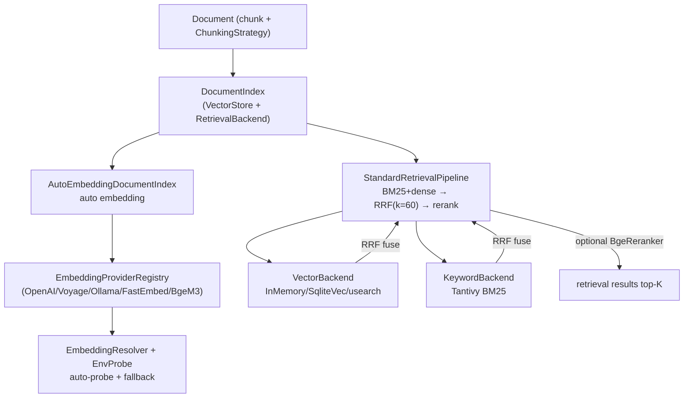

# OneAI RAG / Embedding Mechanism

> `EmbeddingService` trait + adapter registry + auto-probe + fallback + a default retrieval stack (BM25+dense→RRF→rerank): the vector layer for long-term-memory semantic recall and document retrieval, zero-config by default — no embedding field set means auto-probe, degrades to keyword recall when nothing's available, never errors.

## 1. Overview (what it is)

`oneai-rag` and `oneai-vector` together form OneAI's retrieval-augmentation layer. The former defines embedding integration and document indexing, the latter provides the default retrieval-backend stack. Both sit in the feature layer, depending on `oneai-core`'s `EmbeddingService`/`VectorBackend`/`KeywordBackend`/`RetrievalBackend`/`RerankerProvider` traits, consumed by `oneai-memory` (memory semantic recall) and `oneai-app` (`AppBuilder` default-retrieval-stack wiring).

This layer's posture is "zero-burden": by default no embedding config is set, the engine probes available providers in order and picks the first usable; with nothing available it degrades to keyword recall, no error, no block. The embedding key is independent of the main model key — a relay gateway likely has no embedding endpoint, so auto-probe does not reuse the main key; Anthropic has no native embedding API, the real path goes through Voyage. The default retrieval stack is `StandardRetrievalPipeline` — BM25 + dense vectors retrieved in parallel, RRF-fused, optional cross-encoder rerank — a recipe from Anthropic's "Contextual Retrieval" evaluation (top-20 retrieval failure rate down 67%).

## 2. Responsibilities & capabilities (what it does)

**Embedding integration.** `EmbeddingService` trait (in core) + multiple adapters: `OpenAiAdapter`/`OpenAiCompatAdapter` (relay gateway)/`VoyageAdapter`/`OllamaAdapter`/`FastEmbedAdapter` (local ONNX)/`BgeM3Adapter` (ort, opt-in). `EmbeddingProviderRegistry` registers, `EmbeddingResolver` + `EnvProbe` do auto-probe and fallback.

**Auto-probe chain.** Probes in a fixed order: ①openai-compat (needs `ONEAI_EMBEDDING_API_KEY`+`ONEAI_EMBEDDING_BASE_URL`) ②voyage (`VOYAGE_API_KEY`) ③openai (`OPENAI_API_KEY`) ④ollama (local reachable with an embedding model) ⑤fastembed (local ONNX, no key, ~22MB first download) ⑥nothing → keyword recall.

**Fallback.** On main-provider failure auto-switch to backup, build-time + runtime share one `should_continue` error classification (429/5xx/transport/missing-key degrades, other errors).

**Document indexing.** `Document` + `Chunk` + `ChunkingStrategy`, `DocumentIndex` dual-backend (`VectorStore` + `RetrievalBackend`), `with_default_stack` wires the default stack in one line, `AutoEmbeddingDocumentIndex` auto-embeds.

**Input splitting.** `enforce_max_input_tokens` batches by token limit, `split_to_utf8_byte_limit` splits by UTF-8 byte limit (CJK not truncated).

**Default retrieval stack (`oneai-vector`).** `InMemoryVectorBackend` (brute-force cosine, tests) / `SqliteVecBackend` (`vec0` exact KNN, mobile) / `UsearchBackend` (HNSW+mmap+pre-filter) — three vector backends + `TantivyBm25Backend` (tantivy-jieba CJK BM25) + `BgeM3Embedder`/`BgeRerankerOnnx` (ort local) + `StandardRetrievalPipeline` (BM25+dense→RRF(k=60)→rerank top-150→top-K) + `dbsf_fuse` (backup fusion).

**Explicitly does not**: no LLM inference (provider's job); no memory policy (that's `oneai-memory`'s `MemoryProfile`); no USD cost tracking; no compression (that's `ContextCompressor`).

## 3. Design motivation (why this way)

| Decision | Rationale | Rejected alternative |
|---|---|---|
| `EmbeddingService` trait in core, impl in rag | Embedding is a cross-crate contract (memory/rag/vector all impl or consume); the definition sinks to core; the trait is separate from `LlmProvider` because LLM and embedding are two independent capabilities | Reuse `LlmProvider` with an embed method → forces coupling; providers without embedding can't express it |
| Embedding key independent of the main key, auto-probe doesn't reuse | A relay gateway likely has no embedding endpoint, reusing the main key always fails; Anthropic has no native embedding API; independent keys + a probe chain lets "use whatever works" work | Reuse the main key → relay users never connect |
| Default zero-config + auto-probe + keyword fallback | Most users won't preconfigure embedding; zero-config makes "works out of the box" real, degrading to keyword (not erroring) when nothing's available | Require embedding config → high barrier, first run fails |
| Fallback shares `should_continue` error classification | Main-provider transient failure (429/5xx) should switch to backup, but some errors (param errors) switching won't help; shared classification keeps build-time and runtime degradation consistent | Per-provider fallback → classification splits, unpredictable |
| Default retrieval stack BM25+dense→RRF→rerank | Anthropic's Contextual Retrieval evaluation shows this recipe cuts top-20 failure by 67%; BM25 is key for Chinese short queries and unique-identifier lookups, dense for semantic synonyms, RRF fuses both, rerank fine-sorts | Dense only → poor Chinese short-query/unique-ID recall; BM25 only → poor synonym recall |
| `oneai-vector` a separate crate + feature flags | Retrieval backends have heavy deps (ort/tantivy/usearch); a separate crate + features lets scenarios without RAG not compile them; `default=["sqlite","usearch","tantivy"]` builds without network | All in rag → everyone carries heavy deps |
| `InMemoryVectorBackend` default + production-swappable | The default in-memory backend makes first-run zero-dep usable; production explicitly `retrieval_backend()` for Qdrant etc.; the trait makes backends swappable | Default to an external service → first run needs Qdrant up |
| `BgeM3`/`BgeReranker` via ort local, opt-in | Local embedding/rerank needs no key/network, but ort is heavy; opt-in lets scenarios without local models not compile it | Default ort → heavy compile, mobile binaries big |
| UTF-8 byte-boundary splitting | CJK chars are multi-byte; naive byte splitting truncates characters; `split_to_utf8_byte_limit` guarantees no truncation | By-character → token-limit estimate inaccurate |

## 4. Architecture & core abstractions



**Core traits (in core, this crate impls/consumes):**

```rust
#[async_trait]
pub trait EmbeddingService: Send + Sync {
    async fn embed(&self, texts: &[String]) -> Result<Vec<Vec<f32>>>;
    fn dimension(&self) -> Option<usize>;     // None → runtime probe
    fn max_input_tokens(&self) -> usize;
}

pub trait VectorBackend: Send + Sync { /* upsert / search(knn) */ }
pub trait KeywordBackend: Send + Sync { /* bm25 search */ }
pub trait RetrievalBackend: Send + Sync { /* combines vector+keyword */ }
pub trait RerankerProvider: Send + Sync { /* cross-encoder rerank */ }
```

## 5. Flows it participates in

**Document ingest (auto embedding):**

1. `Document::new(content).chunk(strategy)` splits (`ChunkingStrategy` by char/token/semantic).
2. `DocumentIndex::add_document` → `AutoEmbeddingDocumentIndex` calls `EmbeddingService::embed` per chunk (first `enforce_max_input_tokens` batches by token limit, overlong `split_to_utf8_byte_limit` splits without CJK truncation).
3. `IndexedChunk`s land in `VectorBackend` (vectors) + `KeywordBackend` (original text for BM25).

**Retrieval (StandardRetrievalPipeline):**

1. The query gets a dense vector via `EmbeddingService`.
2. In parallel: `VectorBackend::search` (KNN dense) + `KeywordBackend::search` (BM25 sparse).
3. `rrf_fuse(legs, k=60)` fuses the two paths by reciprocal rank (`dbsf_fuse` backup).
4. Optional `BgeRerankerOnnx` cross-encoder fine-sorts top-150 → top-K.
5. Returns top-K results.

**Memory semantic-recall interplay:** `oneai-memory`'s `MemoryFactStore` takes a `VectorBackend`; on ingest `archive_facts` uniformly embeds (the 1.1.0 fix — previously embedding was always None, degrading to keyword); on recall the three factors (relevance+recency+importance) score, relevance goes through `search_hybrid` (semantic), falling back to keyword `recency` without embedding. See [memory-mechanism](memory-mechanism_EN.md).

**Auto-probe (startup):** `EmbeddingResolver` + `EnvProbe` probes the six-step order for an available provider, picks the first; explicit override at any of three places: CLI `--provider` / `~/.oneai/config.toml [embedding]` / per-platform App settings. Model name is a free string; unknown names probe dimension at runtime.

## 6. Dependencies

| Direction | Who | What |
|---|---|---|
| Upstream | `oneai-core` | `EmbeddingService`/`VectorBackend`/`KeywordBackend`/`RetrievalBackend`/`RerankerProvider` traits + `MemoryFact` shared types |
| Upstream | `reqwest`/`serde`/`tokio` | HTTP embedding API, serialization, async |
| Upstream | `oneai-vector` | default retrieval backend stack (`rag` references `vector`'s `StandardRetrievalPipeline`) |
| Upstream | `sqlite-vec`/`usearch`/`tantivy`/`ort` | vector/BM25/local-model backends (feature-gated) |
| Downstream | `oneai-memory` | `MemoryFactStore` takes a `VectorBackend` for semantic recall |
| Downstream | `oneai-app` | `AppBuilder::default_retrieval_stack()` + `embedding_service()` |
| Cross-cutting | env | `ONEAI_EMBEDDING_API_KEY`/`_BASE_URL`/`VOYAGE_API_KEY`/`OPENAI_API_KEY` + proxy env |
| Cross-cutting | CLI | `embed generate/batch/list/health/dimension` |

## 7. Key types & files

| Item | Location |
|---|---|
| `EmbeddingService` trait | `crates/oneai-core/src/traits.rs` |
| adapter registry + `EmbeddingResolver`/`EnvProbe`/`Availability` | `crates/oneai-rag/src/provider_adapter.rs` |
| embedding impls (OpenAI/Ollama/FastEmbed/Voyage) | `crates/oneai-rag/src/embedding.rs` |
| `Document`/`Chunk`/`ChunkingStrategy` | `crates/oneai-rag/src/document.rs:14,80,138` |
| `DocumentIndex` (dual-backend) + `with_default_stack` + `AutoEmbeddingDocumentIndex` | `crates/oneai-rag/src/index.rs:47,107` |
| input splitting (`enforce_max_input_tokens`/`split_to_utf8_byte_limit`/`build_batches`) | `crates/oneai-rag/src/chunk_split.rs:46,25,67` |
| hybrid retrieval / recall | `crates/oneai-rag/src/retrieval.rs` |
| `InMemoryVectorBackend` | `crates/oneai-vector/src/in_memory.rs:17` |
| `SqliteVecBackend` (`vec0` KNN) | `crates/oneai-vector/src/sqlite_vec.rs:65` |
| `UsearchBackend` (HNSW+mmap) | `crates/oneai-vector/src/usearch_backend.rs:91` |
| `TantivyBm25Backend` (CJK BM25) | `crates/oneai-vector/src/tantivy_bm25.rs` |
| `BgeM3Embedder`/`BgeRerankerOnnx` (ort) | `crates/oneai-vector/src/{bge_m3,bge_reranker}.rs:36,28` |
| `rrf_fuse`/`dbsf_fuse` | `crates/oneai-vector/src/fusion.rs:24,56` |
| `StandardRetrievalPipeline` + builder | `crates/oneai-vector/src/pipeline.rs:64,206` |
| `cosine` | `crates/oneai-vector/src/lib.rs:92` |

## 8. Industry comparison

| System | Model | OneAI's trade-off |
|---|---|---|
| **LangChain Retriever** | VectorStore + MultiQuery + ContextualCompression | OneAI's default stack ships BM25+dense+RRF+rerank end-to-end, with CJK via tantivy-jieba; LangChain needs assembly |
| **LlamaIndex** | retrieval framework, heavy indexing pipeline | OneAI pulls the retrieval-backend trait to core, the default stack in `oneai-vector`, swappable to Qdrant in one line; trait docs explicitly warn "dropping BM25 degrades Chinese short-query recall" |
| **Anthropic Contextual Retrieval** | BM25+vector+RRF+rerank evaluation | OneAI's `StandardRetrievalPipeline` is a direct impl of this recipe (RRF k=60, rerank top-150→top-K), citing its 67% failure-rate reduction |
| **Qdrant / Weaviate** | external vector-DB services | OneAI's default stack needs no external service (sqlite-vec/usearch in-memory or local), the trait abstracts Qdrant; no forced external service |
| **Mem0 / Letta archival** | memory systems with their own recall | OneAI makes the recall backend an independent trait (`oneai-vector`); the memory system (`oneai-memory`) takes the same backend, retrieval and memory decoupled |

OneAI's distinct points: **zero-burden default stack** (auto-probe + keyword fallback + default in-memory backend, first run needs no external service) + **CJK-aware end-to-end** (tantivy-jieba BM25 + UTF-8-safe splitting) + **retrieval and memory share one vector-backend** trait.

## 9. Extension points & config

- **Embedding provider**: `AppBuilder::embedding_service(...)` explicit, or leave empty for auto-probe.
- **Swap retrieval backend**: `AppBuilder::default_retrieval_stack()` (in-memory default) or `retrieval_backend(...)` for Qdrant/custom.
- **Local models**: feature `ort` enables `BgeM3`/`BgeReranker`, `model_dir` points at ONNX models.
- **Custom fusion**: `rrf_fuse` (default k=60) or `dbsf_fuse`.
- **Chunking strategy**: `ChunkingStrategy` (char/token/semantic).
- **Pre-fetch fastembed models**: under a proxy network run `./scripts/download_fastembed_models.sh` (curl respects the proxy).
- **CLI**: `embed generate/batch/list/health/dimension` (see [cli-reference](cli-reference_EN.md)).
- **env**: `ONEAI_EMBEDDING_API_KEY`/`_BASE_URL`/`VOYAGE_API_KEY` + proxy env.

## 10. Further reading

- [memory-mechanism](memory-mechanism_EN.md) — memory semantic recall takes the same `VectorBackend`
- [persistence-mechanism](persistence-mechanism_EN.md) — the sqlite-vec backend's SQLite persistence
- [context-management-mechanism](context-management-mechanism_EN.md) — ContextSource injection and retrieval-result feedback
- [CLAUDE.md — RAG / Network proxy](../CLAUDE.md)
- Source: `crates/oneai-rag/src/` (7 files / ~4K LOC) + `crates/oneai-vector/src/` (9 files / ~2.5K LOC)
