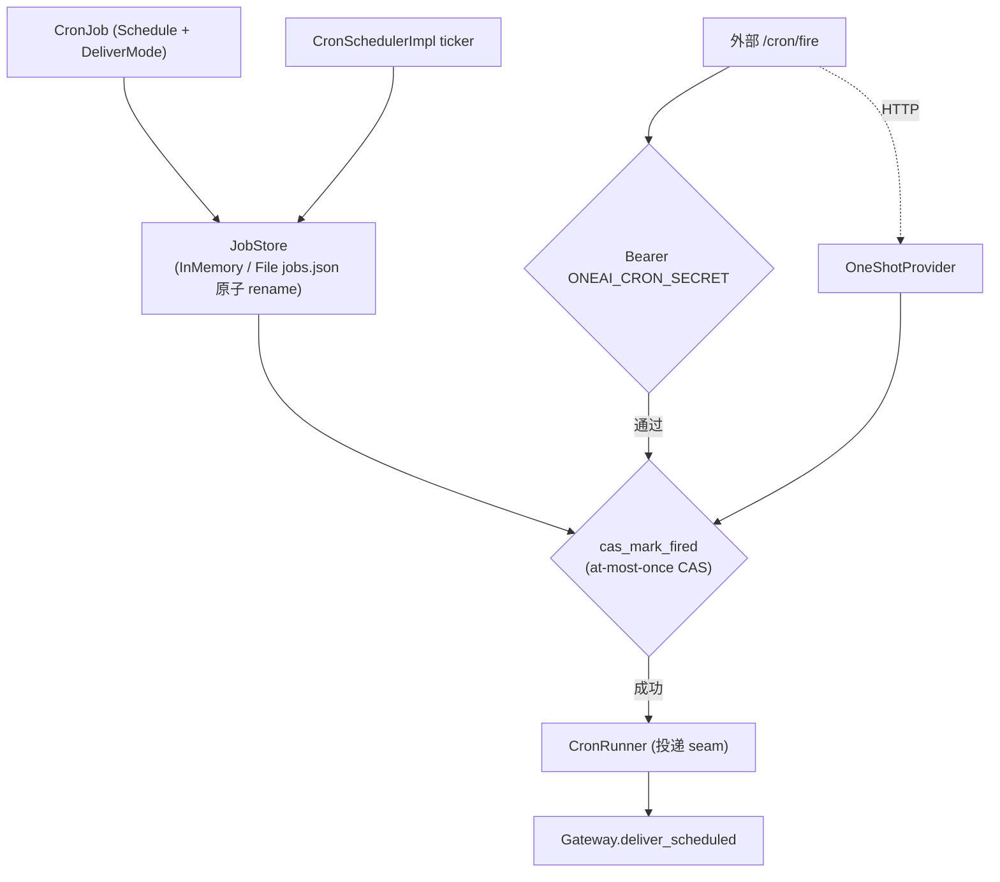

# OneAI Scheduler 机制

> 内存计时器 + 持久 cron 编排——`CronScheduler` trait（core 层 host seam）+ `Schedule` 四方言（`30m`/`every 2h`/ISO/5-field Vixie cron）+ `JobStore`（CAS at-most-once）+ `CronRunner` 投递 seam + 外部 `/cron/fire` 共享密钥 Bearer 触发（`ONEAI_CRON_SECRET`，常量时间，非 JWT）。

## 1. 概述（是什么）

`oneai-scheduler` 是 OneAI 的定时与编排栈。它从单一重启即丢的 `InMemoryScheduler`（core 层 `TaskScheduler` impl）长成一套持久 cron 编排：声明式 `Schedule` 四方言解析、`JobStore` 持久化 + `cas_mark_fired` 原子 CAS 做 at-most-once 触发、`CronRunner` 把触发投递给消费方（如 `Gateway.deliver_scheduled`）、`CronSchedulerImpl` ticker 跑调度循环。外部 `/cron/fire` HTTP 端点经共享密钥 Bearer 鉴权后触发即时投递，让 cron 既能内部 ticker 驱动也能外部 webhook 驱动。

它位于特性层、依赖 `oneai-core`（`CronScheduler`/`TaskScheduler` trait），被 `oneai-app`（`AppBuilder::cron_provider`）与 `oneai-gateway`（`deliver_scheduled` 投递 seam）消费。按供应链戒律，外部触发用共享密钥 Bearer 而非 JWT，不引 JWT 库。

## 2. 职责与能力（做什么）

**调度声明。** `Schedule` 四方言：`30m`（简写）/`every 2h`（every）/ISO 时间戳/5-field Vixie cron，`parse_schedule` 解析，`next_fire_after(now)` 算下次触发。

**持久 + CAS。** `JobStore` trait + `InMemoryJobStore`/`FileJobStore`（`jobs.json` 原子 rename，crash-safe）；`cas_mark_fired(id, now)` 是 at-most-once CAS 点——原子标记已触发，重复触发返 None。

**调度循环。** `CronSchedulerImpl` ticker 周期扫 `JobStore`，对到点的 job 经 `cas_mark_fired` 抢占触发权（成功才投递），投递给 `CronRunner`。

**投递 seam。** `CronRunner` trait——投递给消费方（`Gateway.deliver_scheduled` 复用网关投递），`DeliverMode` 标投递模式。

**外部触发。** `oneshot.rs`：`/cron/fire` HTTP 端点 + 共享密钥 Bearer（`ONEAI_CRON_SECRET`，常量时间比较）+ `FireRequest`/`FireResponse`/`FireState` + `build_router` + `serve` + `OneShotProvider` trait（`HttpOneShotProvider`）。

**provision。** 按需 provision 投递目标（如确保 channel 存在）。

**显式不做什么**：不做 LLM 推理（投递 seam 把消息交给网关/app）；不做 JWT（共享密钥 Bearer 按戒律）；`InMemoryScheduler` 重启即丢（core 层），持久走 `JobStore`。

## 3. 设计动机（为什么这样实现）

| 决策 | 理由 | 否决的替代方案 |
|---|---|---|
| `CronScheduler` trait 在 core、实现在 scheduler | trait 是 host seam，`AppBuilder::cron_provider` 持 trait，实现在 scheduler crate 注入；core 不依赖下游 | trait 在 scheduler → app 反向依赖 |
| 四方言 `Schedule` 而非只 cron | `30m`/`every 2h` 对非运维用户更直观、ISO 表达绝对时刻、5-field cron 表达复杂周期；四者覆盖全场景 | 只 5-field cron → 简单周期写法笨拙 |
| `cas_mark_fired` at-most-once CAS | 多实例/外部触发 + ticker 可能并发抢同一 job；CAS 原子标记保证一 job 只触发一次 | 无 CAS → 重复触发、幂等靠下游 |
| `FileJobStore` 原子 rename | 持久化要 crash-safe，原子 rename 保证不写一半；`jobs.json` 简单人可读 | 直接覆写 → crash 中途损坏 |
| `CronRunner` 投递 seam 而非直接调 AgentLoop | scheduler 不应直接驱动 AgentLoop（职责耦合）；投递给消费方（网关/app）解耦，且复用网关投递链路 | 直接调 AgentLoop → 职责耦合、与网关重复 |
| 外部 `/cron/fire` 共享密钥 Bearer | cron 既要内部 ticker 也要外部 webhook 触发（如 CI/定时服务）；共享密钥 + 常量时间比较简单安全，按戒律不引 JWT | JWT → 供应链负担重、过度工程 |
| `OneShotProvider` trait 注入式 | 即时触发投递路径可单测（`InMemoryOneShotProvider` 替身）而不起活 HTTP | 直接绑 HTTP → 测试需起服务 |
| ticker + 外部触发双驱动 | 内部 ticker 主动调度、外部 webhook 即时触发，两者都经同一 `cas_mark_fired` CAS，行为一致 | 只一种 → 调度场景受限 |

## 4. 架构与核心抽象



**核心类型：**

```rust
pub enum Schedule { /* 30m / every 2h / ISO / 5-field cron */ }
pub fn parse_schedule(input: &str) -> Result<Schedule>;
pub trait JobStore: Send + Sync {
    async fn cas_mark_fired(&self, id: &str, now: DateTime<Utc>) -> Result<Option<CronJob>>;
}
pub struct CronSchedulerImpl { store, runner, /* ticker */ }
pub trait CronRunner: Send + Sync { /* 投递 seam */ }
pub fn secret_from_env() -> Option<String>;   // ONEAI_CRON_SECRET（oneshot.rs）
pub fn build_router(state: FireState) -> axum::Router;   // /cron/fire
```

## 5. 参与的流程

**内部 ticker 调度：**

1. `CronSchedulerImpl` ticker 周期扫 `JobStore` 到点 job。
2. 对每 job 调 `cas_mark_fired(id, now)`——返 `Some(job)` 表示抢到触发权，`None` 表示已被触发（at-most-once）。
3. 抢到的 job 经 `CronRunner` 投递给消费方（如 `Gateway.deliver_scheduled`）。
4. 更新 `next_fire_after` 算下次触发，循环。

**外部触发：**

1. 外部 HTTP POST `/cron/fire` 带 `Authorization: Bearer <ONEAI_CRON_SECRET>`。
2. `secret_from_env` 取密钥常量时间比较验签。
3. 验通过经 `OneShotProvider` 路由到同一 `cas_mark_fired` CAS（与内部 ticker 同路径，at-most-once 一致）。
4. 抢到的 job 投递给 `CronRunner`。

## 6. 依赖关系

| 方向 | 谁 | 内容 |
|---|---|---|
| 上游 | `oneai-core` | `CronScheduler`/`TaskScheduler` trait |
| 上游 | `axum`/`tokio`/`serde`/`chrono` | HTTP 触发、异步、序列化、时间 |
| 下游 | `oneai-app` | `AppBuilder::cron_provider` 注入 |
| 下游 | `oneai-gateway` | `deliver_scheduled` 投递 seam |
| 横切接入 | env | `ONEAI_CRON_SECRET` 共享密钥 |
| 横切接入 | CLI | `oneai cron add/list/rm/fire/serve` |

## 7. 关键类型与文件

| 项 | 位置 |
|---|---|
| `Schedule` 四方言 + `parse_schedule` + `next_fire_after` | `crates/oneai-scheduler/src/job.rs:39,145,54` |
| `CronJob` + `DeliverMode` | `crates/oneai-scheduler/src/job.rs:77,24` |
| `JobStore` trait + `cas_mark_fired` + `InMemory`/`File` | `crates/oneai-scheduler/src/store.rs:50,96,228`（原子 rename）|
| `CronSchedulerImpl` ticker | `crates/oneai-scheduler/src/orchestrator.rs:35,84,102,168` |
| `CronRunner`（投递 seam）| `crates/oneai-scheduler/src/runner.rs` |
| 外部触发 `/cron/fire` + `secret_from_env` + `FireState`/`FireRequest`/`FireResponse` + `build_router` + `serve` | `crates/oneai-scheduler/src/oneshot.rs:49,85,96,114,136` |
| `OneShotProvider` trait + `HttpOneShotProvider` | `crates/oneai-scheduler/src/oneshot.rs:216,234` |
| `CronError` | `crates/oneai-scheduler/src/error.rs:8` |

## 8. 与业界对比

| 系统 | 模型 | OneAI 取舍 |
|---|---|---|
| **cron / crontab** | 5-field Vixie cron | OneAI 支持标准 cron，额外加 `30m`/`every`/ISO 三方言降低非运维用户门槛 |
| **Temporal / Quartz** | 持久调度 + at-most-once + 重试 | OneAI `JobStore` + `cas_mark_fired` 是其精简版（at-most-once CAS），面向本地单用户而非分布式 |
| **APScheduler** | Python 调度器 | OneAI 同类，但 trait 抽象 + 投递 seam + 外部触发共享密钥，更生产级 |
| **systemd timers** | 系统级 cron | OneAI 是应用级，不依赖系统 cron，跨平台一致 |

OneAI 独特点：**四方言 + at-most-once CAS + ticker/外部双驱动** + **投递 seam 解耦**（不直接调 AgentLoop，复用网关投递）+ **共享密钥 Bearer 按戒律不引 JWT**。

## 9. 扩展点与配置

- **加 job**：`Schedule` 四方言声明 + `JobStore` 注册，或 CLI `oneai cron add`。
- **持久**：`FileJobStore`（`jobs.json` 原子 rename）。
- **外部触发**：POST `/cron/fire` + `ONEAI_CRON_SECRET` Bearer。
- **投递 seam**：impl `CronRunner`（`Gateway.deliver_scheduled` 复用）。
- **AppBuilder**：`cron_provider(...)` 注入。
- **CLI**：`oneai cron add/list/rm/fire/serve`（详见 [cli-reference](cli-reference.md)）。

## 10. 深入阅读

- [gateway-mechanism.md](gateway-mechanism.md) —— `deliver_scheduled` 投递 seam 复用网关
- [supervisor-mechanism.md](supervisor-mechanism.md) —— 同为 app 侧常驻服务
- [a2a-mechanism.md](a2a-mechanism.md) —— 共享密钥 Bearer 鉴权同源思路
- 源码：`crates/oneai-scheduler/src/`（8 文件 / ~2.3K LOC）
