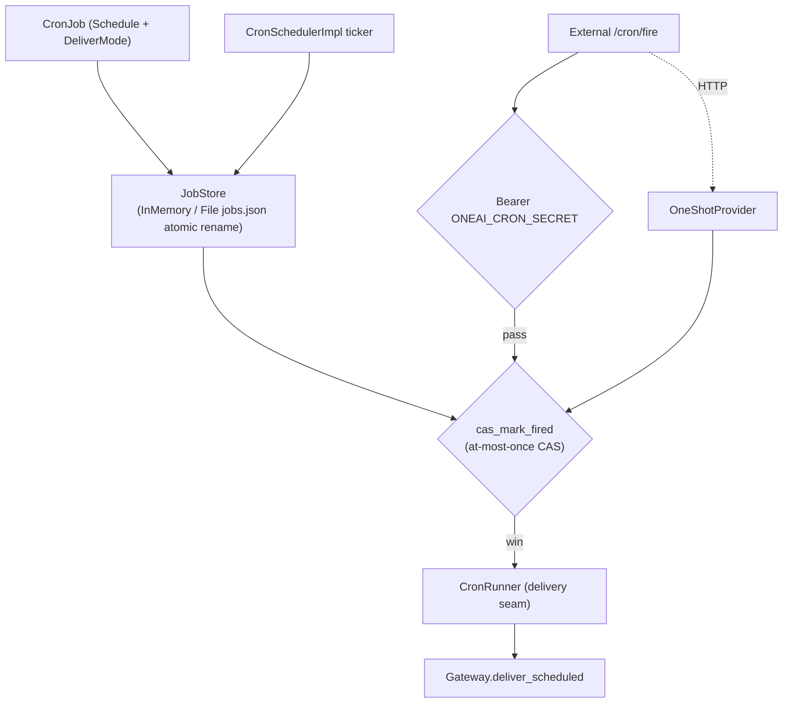

# OneAI Scheduler Mechanism

> In-memory timers + durable cron orchestration — `CronScheduler` trait (core-layer host seam) + `Schedule` four dialects (`30m` / `every 2h` / ISO / 5-field Vixie cron) + `JobStore` (CAS at-most-once) + `CronRunner` delivery seam + external `/cron/fire` shared-secret Bearer trigger (`ONEAI_CRON_SECRET`, constant-time, not JWT).

## 1. Overview (what it is)

`oneai-scheduler` is OneAI's timer and orchestration stack. It grows from a single restart-dies `InMemoryScheduler` (the core-layer `TaskScheduler` impl) into a durable cron orchestration stack: declarative `Schedule` four-dialect parsing, `JobStore` persistence + `cas_mark_fired` atomic CAS for at-most-once firing, `CronRunner` delivers triggers to consumers (e.g. `Gateway.deliver_scheduled`), and `CronSchedulerImpl` runs the ticker loop. An external `/cron/fire` HTTP endpoint triggers immediate delivery after shared-secret Bearer auth, so cron is driven both by an internal ticker and an external webhook.

It sits in the feature layer, depending on `oneai-core` (`CronScheduler`/`TaskScheduler` traits), consumed by `oneai-app` (`AppBuilder::cron_provider`) and `oneai-gateway` (`deliver_scheduled` delivery seam). Per supply-chain discipline, the external trigger uses a shared-secret Bearer rather than JWT — no JWT library.

## 2. Responsibilities & capabilities (what it does)

**Schedule declaration.** `Schedule` four dialects: `30m` (shorthand) / `every 2h` (every) / ISO timestamp / 5-field Vixie cron; `parse_schedule` parses; `next_fire_after(now)` computes the next fire.

**Persistent + CAS.** `JobStore` trait + `InMemoryJobStore`/`FileJobStore` (`jobs.json` atomic rename, crash-safe); `cas_mark_fired(id, now)` is the at-most-once CAS point — atomically marks fired, duplicate fires return None.

**Ticker loop.** `CronSchedulerImpl` periodically scans the `JobStore`; for due jobs it calls `cas_mark_fired` to grab the fire right (only the winner delivers) and hands off to `CronRunner`.

**Delivery seam.** `CronRunner` trait — delivers to a consumer (`Gateway.deliver_scheduled` reuses the gateway delivery); `DeliverMode` tags the delivery mode.

**External trigger.** `oneshot.rs`: `/cron/fire` HTTP endpoint + shared-secret Bearer (`ONEAI_CRON_SECRET`, constant-time compare) + `FireRequest`/`FireResponse`/`FireState` + `build_router` + `serve` + `OneShotProvider` trait (`HttpOneShotProvider`).

**Provision.** Provisions delivery targets on demand (e.g. ensures a channel exists).

**Explicitly does not**: no LLM inference (the delivery seam hands messages to gateway/app); no JWT (shared-secret Bearer per discipline); `InMemoryScheduler` is restart-dies (core layer), durability via `JobStore`.

## 3. Design motivation (why this way)

| Decision | Rationale | Rejected alternative |
|---|---|---|
| `CronScheduler` trait in core, impl in scheduler | The trait is a host seam; `AppBuilder::cron_provider` holds the trait, the scheduler-crate impl is injected; core does not depend downstream | Trait in scheduler → app reverse-depends |
| Four-dialect `Schedule`, not just cron | `30m`/`every 2h` is more intuitive for non-ops users, ISO for absolute instants, 5-field cron for complex cycles; all four cover the space | Only 5-field cron → simple cycles are awkward |
| `cas_mark_fired` at-most-once CAS | Multi-instance/external trigger + ticker may contend on the same job; CAS atomically marks so a job fires once | No CAS → duplicate fires, idempotency pushed downstream |
| `FileJobStore` atomic rename | Persistence must be crash-safe; atomic rename guarantees no half-write; `jobs.json` is simple and human-readable | Direct overwrite → corruption on mid-write crash |
| `CronRunner` delivery seam, not direct AgentLoop | The scheduler should not drive the AgentLoop directly (coupling); delivering to a consumer (gateway/app) decouples and reuses the gateway delivery path | Direct AgentLoop → coupling, duplication with gateway |
| External `/cron/fire` shared-secret Bearer | Cron needs both internal ticker and external webhook triggering (CI / scheduled services); shared secret + constant-time compare is simple and safe; no JWT per discipline | JWT → supply-chain burden, over-engineering |
| `OneShotProvider` trait injectable | The immediate-trigger delivery path is unit-testable (`InMemoryOneShotProvider` double) without a live HTTP server | Bind HTTP directly → tests need a live server |
| Ticker + external dual-driven | Internal ticker actively schedules; external webhook triggers immediately; both pass through the same `cas_mark_fired` CAS, consistent | One only → scheduling scenarios limited |

## 4. Architecture & core abstractions



**Core types:**

```rust
pub enum Schedule { /* 30m / every 2h / ISO / 5-field cron */ }
pub fn parse_schedule(input: &str) -> Result<Schedule>;
pub trait JobStore: Send + Sync {
    async fn cas_mark_fired(&self, id: &str, now: DateTime<Utc>) -> Result<Option<CronJob>>;
}
pub struct CronSchedulerImpl { store, runner, /* ticker */ }
pub trait CronRunner: Send + Sync { /* delivery seam */ }
pub fn secret_from_env() -> Option<String>;   // ONEAI_CRON_SECRET (oneshot.rs)
pub fn build_router(state: FireState) -> axum::Router;   // /cron/fire
```

## 5. Flows it participates in

**Internal ticker scheduling:**

1. `CronSchedulerImpl` ticker periodically scans `JobStore` for due jobs.
2. For each job calls `cas_mark_fired(id, now)` — `Some(job)` means it grabbed the fire right, `None` means already fired (at-most-once).
3. The won job is delivered via `CronRunner` to a consumer (e.g. `Gateway.deliver_scheduled`).
4. Updates `next_fire_after` for the next fire; loops.

**External trigger:**

1. External HTTP POST `/cron/fire` with `Authorization: Bearer <ONEAI_CRON_SECRET>`.
2. `secret_from_env` constant-time compares the secret.
3. On pass, routes via `OneShotProvider` to the same `cas_mark_fired` CAS (same path as the ticker, at-most-once consistent).
4. The won job is delivered via `CronRunner`.

## 6. Dependencies

| Direction | Who | What |
|---|---|---|
| Upstream | `oneai-core` | `CronScheduler`/`TaskScheduler` traits |
| Upstream | `axum`/`tokio`/`serde`/`chrono` | HTTP trigger, async, serialization, time |
| Downstream | `oneai-app` | `AppBuilder::cron_provider` injection |
| Downstream | `oneai-gateway` | `deliver_scheduled` delivery seam |
| Cross-cutting | env | `ONEAI_CRON_SECRET` shared secret |
| Cross-cutting | CLI | `oneai cron add/list/rm/fire/serve` |

## 7. Key types & files

| Item | Location |
|---|---|
| `Schedule` four dialects + `parse_schedule` + `next_fire_after` | `crates/oneai-scheduler/src/job.rs:39,145,54` |
| `CronJob` + `DeliverMode` | `crates/oneai-scheduler/src/job.rs:77,24` |
| `JobStore` trait + `cas_mark_fired` + `InMemory`/`File` | `crates/oneai-scheduler/src/store.rs:50,96,228` (atomic rename) |
| `CronSchedulerImpl` ticker | `crates/oneai-scheduler/src/orchestrator.rs:35,84,102,168` |
| `CronRunner` (delivery seam) | `crates/oneai-scheduler/src/runner.rs` |
| External trigger `/cron/fire` + `secret_from_env` + `FireState`/`FireRequest`/`FireResponse` + `build_router` + `serve` | `crates/oneai-scheduler/src/oneshot.rs:49,85,96,114,136` |
| `OneShotProvider` trait + `HttpOneShotProvider` | `crates/oneai-scheduler/src/oneshot.rs:216,234` |
| `CronError` | `crates/oneai-scheduler/src/error.rs:8` |

## 8. Industry comparison

| System | Model | OneAI's trade-off |
|---|---|---|
| **cron / crontab** | 5-field Vixie cron | OneAI supports standard cron and adds `30m`/`every`/ISO dialects for non-ops users |
| **Temporal / Quartz** | Durable scheduling + at-most-once + retry | OneAI's `JobStore` + `cas_mark_fired` is a slim version (at-most-once CAS), local single-user not distributed |
| **APScheduler** | Python scheduler | OneAI is similar, but the trait abstraction + delivery seam + external shared-secret trigger are more production-grade |
| **systemd timers** | System-level cron | OneAI is application-level, no system-cron dependency, cross-platform consistent |

OneAI's distinct points: **four dialects + at-most-once CAS + ticker/external dual-driven** + **delivery seam decouples** (does not call the AgentLoop directly, reuses gateway delivery) + **shared-secret Bearer, no JWT per discipline**.

## 9. Extension points & config

- **Add job**: `Schedule` four-dialect declaration + `JobStore` registration, or CLI `oneai cron add`.
- **Persistence**: `FileJobStore` (`jobs.json` atomic rename).
- **External trigger**: POST `/cron/fire` + `ONEAI_CRON_SECRET` Bearer.
- **Delivery seam**: impl `CronRunner` (`Gateway.deliver_scheduled` reuses).
- **AppBuilder**: `cron_provider(...)` injection.
- **CLI**: `oneai cron add/list/rm/fire/serve` (see [cli-reference](cli-reference_EN.md)).

## 10. Further reading

- [gateway-mechanism](gateway-mechanism_EN.md) — the `deliver_scheduled` delivery seam reused from gateway
- [supervisor-mechanism](supervisor-mechanism_EN.md) — fellow app-side resident service
- [a2a-mechanism](a2a-mechanism_EN.md) — shared-secret Bearer auth, same idea
- Source: `crates/oneai-scheduler/src/` (8 files / ~2.3K LOC)
