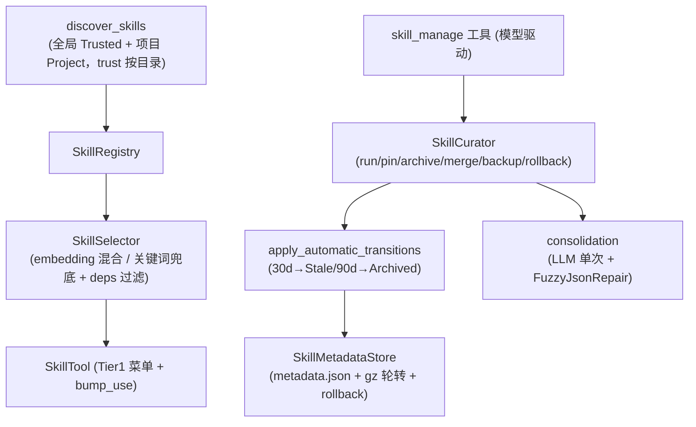

# OneAI Skill 机制

> 渐进式披露技能系统——`SkillDescriptor` + 约定目录发现（全局+项目级，trust 按目录反伪造）+ `SkillSelector`（embedding 混合/关键词兜底 + deps 过滤）+ `SkillState` 生命周期（Active/Stale/Archived 永不删）+ `SkillCurator`（运行/钉/归档/合并/回滚）+ `skill_manage` 模型驱动工具：Footprint ladder 的 `skill` 档（零 schema 提示）。

## 1. 概述（是什么）

`oneai-skill` 是 OneAI 的"技能"系统，对应 Footprint ladder 的 `skill` 档——一段 markdown 提示，对模型零 schema 足迹。技能不是工具，而是教模型"在某种情境下怎么做"的渐进式披露单元：首屏只列技能名（Tier 1 菜单），模型选中某技能才注入其完整提示，避免所有提示常驻上下文。这一层管理技能的发现、选择、生命周期、合并——让 agent "越用越好用"：常用技能保持 Active、不用技能老化归档、窄技能被 LLM 合并成伞技能。

它位于特性层、依赖 `oneai-core`（`SkillDescriptor`/`EmbeddingService` trait），被 `oneai-agent`（`SkillTool` Tier1 菜单 + `skill_manage` 工具 + 反思白名单）与 `oneai-app`（`AppBuilder` 装配）消费。生命周期策略折进 DomainPack 第⑦层 `MemoryProfile`，consolidation 是 LLM 单次推理 + FuzzyJsonRepair 解析。

## 2. 职责与能力（做什么）

**技能描述符。** `SkillDescriptor`（name + description + 提示 + `depends_on` 依赖 + `trust` + 可选 `embedding`）。

**约定目录发现。** `discover_skills` 扫全局目录（`~/.oneai/skills` 等，`Trusted`）+ 项目目录（从 cwd 往上走到 git worktree root 的 `.claude`/`.agents`/`.opencode`/`.oneai` skills，`Project`，同名覆盖全局）；`trust` 按目录计算而非 frontmatter 声明（反伪造）；`parse_skill_descriptor` + `SkillConfig`。

**选择器。** `SkillSelector`（`with_embedding_service` 走 embedding 余弦 + 关键词混合；无服务降级纯关键词；`deps_satisfied` 过滤依赖未满足的技能；`SelectionMode` keyword/hybrid + `top_k`）。

**注册表。** `SkillRegistry`（`register`/`remove`/`list`/`register_builtin`/`find_by_name`）。

**生命周期。** `SkillState`（`Active`/`Stale`/`Archived`，永不硬删）+ `SkillMetadata`（`use_count`/`last_activity_at`/`pinned`/`created_by` Agent/User/Bundled/`origin_note`）+ `apply_automatic_transitions`（30d→Stale、90d→Archived，pinned/Bundled/被引用豁免）+ `SkillMetadataStore`（`metadata.json` 持久 + `.json.gz` 轮转快照 + `rollback` 单独恢复）+ `SkillLifecycleConfig`。

**Curator。** `SkillCurator`（`run` 触发自动迁移 / `status` / `pin`/`unpin` / `archive`/`restore` / `backup`/`list_backups`/`rollback` + `consolidation_candidates` + `apply_merge`）。

**内置技能。** `skill_creator_skill`（开箱即用造技能）+ `coding_skills`/`research_skills`/`general_skills` + `skills_for_domain` + `builtin_skill_names` + `skill_icon`。

**模型驱动工具。** `skill_manage` 工具（在 `oneai-agent`）让模型在反思时主动管技能生命周期；`SkillTool`（Tier1 菜单 + `bump_use`）。

**显式不做什么**：不实现 LLM 推理（consolidation 调 LLM 单次）；不是工具（零 schema 提示，归 Footprint ladder `skill` 档）；不持久化对话（归 persistence）；`trust` 不读 frontmatter（反伪造）。

## 3. 设计动机（为什么这样实现）

| 决策 | 理理 | 否决的替代方案 |
|---|---|---|
| 技能是零 schema 提示而非工具 | Footprint ladder 的 `skill` 档：不占工具 schema 位，只教模型"怎么做"；模型每多见一个工具 schema 决策空间变大，技能避免此 | 技能做成工具 → schema 膨胀 |
| 渐进式披露（Tier1 菜单→选中注入）| 所有技能提示常驻会撑爆上下文；首屏只列名，选中才注入完整提示，按需加载 | 全部注入 → 上下文膨胀 |
| 约定目录发现（全局+项目级）| 技能是"约定优于配置"资产，扫约定目录（`.claude`/`.agents`/`.opencode`/`.oneai` skills）让用户/项目直接放 markdown 即可，无需安装流程 | 外部安装流程 → 门槛高、跨工具不通用 |
| `trust` 按目录计算而非 frontmatter 声明 | frontmatter 可被技能文件伪造 trust；按目录（全局=Trusted、项目=Project）反映真实来源，反伪造 | 读 frontmatter → 伪造 trust 提权 |
| 项目级同名覆盖全局 | 项目特化技能应优先于全局通用；从 cwd 走到 git root 让项目技能随仓库走 | 全局优先 → 项目特化失效 |
| `SkillSelector` embedding 混合 + 关键词兜底 | 语义召回相关度高但需 embedding 服务；无服务时降级纯关键词不报错（零负担）；`deps_satisfied` 过滤依赖未满足的技能防模型选了用不了 | 强制 embedding → 无服务场景不可用 |
| `SkillState` 永不硬删（Active→Stale→Archived）| 技能可能临时不用但未来有用；归档而非删除保留可恢复；pinned/Bundled/被引用豁免老化 | 硬删 → 误删风险、历史丢 |
| `SkillMetadataStore` + gz 轮转快照 + rollback | curator 操作可能出错，需可回滚；metadata.json 持久 + gz 快照轮转 + 单独 rollback 保证可恢复 | 无快照 → 误操作不可逆 |
| consolidation LLM 单次推理 + FuzzyJsonRepair | 窄技能合并成伞技能需语义判断（哪些窄技能同类），LLM 单次推理够；输出经 FuzzyJsonRepair 解析容错 | 规则合并 → 语义同类判不准 |
| version 继承 lexicographic、拒引 semver | 合并产物的版本要可继承但需防 semver 误判（0.1.0 vs 0.10.0）；lexicographic 简单可控 | 引入 semver → 复杂、易误判 |
| `skill_manage` 模型驱动工具 | 让模型在反思时主动管技能（归档不用的、合并窄的），而非靠人工 curator | 只人工 → 技能库无人维护、膨胀 |
| 生命周期策略折进 `MemoryProfile` 第⑦层 | 技能老化是领域属性（coding 域可能不老化、research 域激进老化）；声明式可按域切换 | 写死在代码 → 不可按域调 |

## 4. 架构与核心抽象



**核心类型：**

```rust
pub struct SkillDescriptor { name, description, /* 提示 */, depends_on, trust, embedding: Option<Vec<f32>> }
pub enum SkillState { Active, Stale, Archived }      // 永不硬删
pub enum SkillTrust { Trusted, Project }             // 按目录计算，反伪造
pub struct SkillMetadata { state, use_count, last_activity_at, pinned, created_by, origin_note }
pub struct SkillSelector { /* with_embedding_service / deps_satisfied / top_k */ }
pub struct SkillCurator { /* run/status/pin/archive/restore/backup/rollback/apply_merge */ }
pub struct SkillMetadataStore { /* metadata.json + gz 轮转 + rollback */ }
```

## 5. 参与的流程

**运行期技能选择（每轮或按需）：**

1. `discover_skills` 扫约定目录（全局 Trusted + 项目 Project，项目同名覆盖全局），`trust` 按目录盖戳。
2. 技能装载统一在 `AppBuilder::build()` 内完成(#38):先 `load_discovered` 注册发现技能,再按 merged pack 名 `register_builtin` 内置技能(同名内置覆盖发现;多 pack `a+b` 取两域并集;无 pack 回退 coding),最后 `register_skill_tools` 注册 `skill`/`skill_manage` 工具——CLI/TUI/sidecar(`serve`·`app-server`)/FFI/uniffi 全通路一次拉齐,入口不再各自接线;`AgentLoop` 侧纵深防御:工具表无 `skill` 时不注入技能菜单,菜单与工具永远成对。
3. `SkillSelector` 按当前情境选技能：`deps_satisfied` 过滤依赖未满足的 → embedding 余弦 + 关键词混合打分（无服务降级纯关键词）→ `top_k`。
4. `SkillTool` Tier1 菜单只列技能名给模型；模型选中某技能才注入其完整提示（渐进式披露）；`bump_use` 更新 `use_count`/`last_activity`。

**生命周期维护（curator run / 反思触发）：**

1. `SkillCurator::run(now)` 调 `apply_automatic_transitions`：30d 未用→`Stale`、90d→`Archived`，pinned/Bundled/被引用豁免。
2. 落 `SkillMetadataStore`（`metadata.json` + gz 轮转快照）。
3. `consolidation_candidates` 找窄 Active 技能 → `apply_merge` 经 LLM 单次推理（FuzzyJsonRepair 解析）合并成伞技能，version lexicographic 继承。
4. `skill_manage` 工具让模型在反思时主动 pin/archive/restore/merge；`backup`/`rollback` 可逆。

## 6. 依赖关系

| 方向 | 谁 | 内容 |
|---|---|---|
| 上游 | `oneai-core` | `SkillDescriptor`/`SkillTrust`/`EmbeddingService` trait |
| 上游 | `dirs`/`serde`/`tokio` | 家目录、序列化、异步 |
| 下游 | `oneai-agent` | `SkillTool`（Tier1 菜单 + `bump_use`）+ `skill_manage` 工具 + 反思白名单 |
| 下游 | `oneai-app` | `AppBuilder` 装配选择器 + curator |
| 横切接入 | DomainPack 第⑦层 | `MemoryProfile` 声明生命周期策略（`SkillLifecycleConfig`）|
| 横切接入 | 约定目录 | `~/.oneai/skills` + 项目 `.claude`/`.agents`/`.opencode`/`.oneai` skills |
| 横切接入 | CLI | `oneai curator` |

## 7. 关键类型与文件

| 项 | 位置 |
|---|---|
| `SkillDescriptor`/`SkillTrust`/`SelectionMode` | `crates/oneai-core/src/types.rs`（含 `embedding`/`depends_on`/`trust`）|
| `SkillSelector`（embedding 混合 + deps 过滤）| `crates/oneai-skill/src/selector.rs:22,56,82,87` |
| `SkillRegistry` | `crates/oneai-skill/src/registry.rs:11` |
| `discover_skills` + `skills_dir` + `parse_skill_descriptor` + `find_skill` | `crates/oneai-skill/src/discovery.rs:209,191,106,235` |
| `SkillState`/`SkillAuthor`/`SkillMetadata`/`SkillLifecycleConfig`/`SkillMetadataStore` + `apply_automatic_transitions` | `crates/oneai-skill/src/lifecycle.rs:53,69,86,145,179` |
| `SkillCurator`（run/status/pin/archive/restore/backup/rollback/consolidation/apply_merge）| `crates/oneai-skill/src/curator.rs:85,158,364,381,394,411,417,428,434,215,242` |
| `MergeReport`/`MergeError`/`CuratorReport` | `crates/oneai-skill/src/curator.rs:71,43,98` |
| 内置技能（skill_creator/coding/research/general）+ `skills_for_domain`/`skill_icon` | `crates/oneai-skill/src/builtin.rs:20,41,139,204,249,298` |
| `SkillTool`（Tier1 菜单 + bump_use）| `crates/oneai-agent/src/`（SkillTool）|
| `skill_manage` 工具（模型驱动）| `crates/oneai-agent/src/skill_manage_tool.rs:32,58` |
| consolidation（LLM 单次 + FuzzyJsonRepair）| `crates/oneai-skill/src/curator.rs:199,203,210` + `crates/oneai-agent/src/skill_consolidation.rs` |

## 8. 与业界对比

| 系统 | 模型 | OneAI 取舍 |
|---|---|---|
| **Claude Code Skills** | 渐进式披露 + 约定目录 + creator | OneAI 直接对齐：约定目录发现、Tier1 菜单、内置 skill-creator、`.claude` skills 兼容 |
| **OpenCode Context Epoch** | 上下文按 epoch 增量更新 | OneAI SkillSelector 的 embedding 混合 + 关键词兜底同源"按需加载"思路 |
| **LangChain Hub prompts** | prompt 模板共享 | OneAI 技能是渐进式披露单元（Tier1 菜单 + 生命周期 + 合并），不只是 prompt 模板 |
| **Cursor rules / .cursorrules** | 项目级规则文件 | OneAI 项目级技能同源（`.claude` skills 走到 git root），但多了生命周期 + 合并 + trust 分级 |
| **AutoGen skills** | agent 能力配置 | OneAI 技能有完整生命周期（Active/Stale/Archived + curator + consolidation），AutoGen 无此 |

OneAI 独特点：**Footprint ladder `skill` 档零 schema** + **trust 按目录反伪造** + **完整生命周期永不硬删 + consolidation 合并** + **`skill_manage` 模型驱动**（反思时主动管）+ **跨工具约定目录兼容**（`.claude`/`.agents`/`.opencode`/`.oneai`）。

## 9. 扩展点与配置

- **加技能**：放 markdown 到 `~/.oneai/skills` 或项目 `.claude`/`.agents`/`.opencode`/`.oneai` skills 目录，自动发现。
- **造技能**：`skill_creator` 内置技能开箱即用。
- **接 embedding**：`SkillSelector::with_embedding_service(service)` 走语义混合；无服务降级关键词。
- **生命周期**：`SkillLifecycleConfig`（30d/90d 阈值），折进 `MemoryProfile` 第⑦层。
- **curator**：`oneai curator run/status/pin/archive/restore/backup/rollback/consolidate`。
- **模型驱动**：`skill_manage` 工具让反思子代理主动管。
- **CLI**：`oneai curator *`（详见 [cli-reference](cli-reference.md)）。

## 10. 深入阅读

- [tool-mechanism.md](tool-mechanism.md) —— Footprint ladder 的 `skill` 档（零 schema 提示）
- [domain-pack-mechanism.md](domain-pack-mechanism.md) —— 第⑦层 `MemoryProfile` 折进 `SkillLifecycleConfig`
- [memory-mechanism.md](memory-mechanism.md) —— 反思闭环与 skill consolidation 的联动
- [multi-agent-mechanism.md](multi-agent-mechanism.md) —— 反思子代理 + `skill_manage` 白名单
- [rag-mechanism.md](rag-mechanism.md) —— `SkillSelector` 的 embedding 混合召回
- 源码：`crates/oneai-skill/src/`（7 文件 / ~3.3K LOC）+ `crates/oneai-agent/src/{skill_manage_tool,skill_consolidation}.rs`
