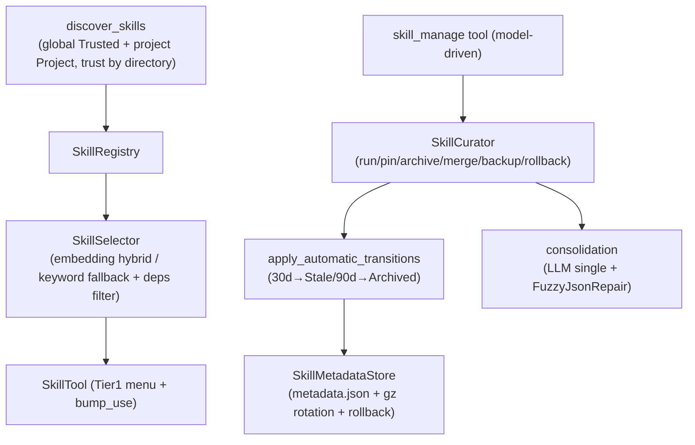

# OneAI Skill Mechanism

> Progressive-disclosure skill system — `SkillDescriptor` + convention-directory discovery (global + project, trust by-directory anti-spoof) + `SkillSelector` (embedding hybrid / keyword fallback + deps filter) + `SkillState` lifecycle (Active/Stale/Archived, never hard-deleted) + `SkillCurator` (run/pin/archive/merge/rollback) + `skill_manage` model-driven tool: the `skill` rung of the Footprint ladder (zero-schema prompt).

## 1. Overview (what it is)

`oneai-skill` is OneAI's "skill" system, corresponding to the `skill` rung of the Footprint ladder — a markdown prompt with zero schema footprint to the model. A skill is not a tool but a progressive-disclosure unit that teaches the model "how to act in a situation": the first screen lists only skill names (Tier 1 menu); the model selects a skill to inject its full prompt, avoiding all prompts resident in context. This layer manages skill discovery, selection, lifecycle, and merging — letting an agent "get better with use": frequently-used skills stay Active, unused ones age to Archived, narrow ones get merged by an LLM into umbrella skills.

It sits in the feature layer, depending on `oneai-core` (`SkillDescriptor`/`EmbeddingService` traits), consumed by `oneai-agent` (`SkillTool` Tier 1 menu + `skill_manage` tool + reflection allowlist) and `oneai-app` (`AppBuilder` wiring). The lifecycle policy folds into DomainPack layer 7 `MemoryProfile`; consolidation is a single LLM inference + FuzzyJsonRepair parsing.

## 2. Responsibilities & capabilities (what it does)

**Skill descriptor.** `SkillDescriptor` (name + description + prompt + `depends_on` deps + `trust` + optional `embedding`).

**Convention-directory discovery.** `discover_skills` scans global dirs (`~/.oneai/skills` etc., `Trusted`) + project dirs (`.claude`/`.agents`/`.opencode`/`.oneai` skills walked up from cwd to the git worktree root, `Project`, project overrides global on name clash); `trust` is computed from the directory, not a frontmatter declaration (anti-spoof); `parse_skill_descriptor` + `SkillConfig`.

**Selector.** `SkillSelector` (`with_embedding_service` uses embedding cosine + keyword hybrid; degrades to pure keyword without a service; `deps_satisfied` filters skills with unsatisfied deps; `SelectionMode` keyword/hybrid + `top_k`).

**Registry.** `SkillRegistry` (`register`/`remove`/`list`/`register_builtin`/`find_by_name`).

**Lifecycle.** `SkillState` (`Active`/`Stale`/`Archived`, never hard-deleted) + `SkillMetadata` (`use_count`/`last_activity_at`/`pinned`/`created_by` Agent/User/Bundled/`origin_note`) + `apply_automatic_transitions` (30d→Stale, 90d→Archived; pinned/Bundled/referenced exempt) + `SkillMetadataStore` (`metadata.json` durable + `.json.gz` rotation snapshots + `rollback` individually restorable) + `SkillLifecycleConfig`.

**Curator.** `SkillCurator` (`run` triggers auto-transitions / `status` / `pin`/`unpin` / `archive`/`restore` / `backup`/`list_backups`/`rollback` + `consolidation_candidates` + `apply_merge`).

**Built-in skills.** `skill_creator_skill` (out-of-the-box skill creation) + `coding_skills`/`research_skills`/`general_skills` + `skills_for_domain` + `builtin_skill_names` + `skill_icon`.

**Model-driven tool.** `skill_manage` tool (in `oneai-agent`) lets the model actively manage skill lifecycle during reflection; `SkillTool` (Tier 1 menu + `bump_use`).

**Explicitly does not**: no LLM inference (consolidation calls the LLM once); not a tool (zero-schema prompt, the Footprint ladder `skill` rung); no conversation persistence (persistence's job); `trust` not read from frontmatter (anti-spoof).

## 3. Design motivation (why this way)

| Decision | Rationale | Rejected alternative |
|---|---|---|
| Skill is a zero-schema prompt, not a tool | The Footprint ladder `skill` rung: no tool-schema footprint, only teaches "how to act"; every extra tool schema the model sees enlarges the decision space, skills avoid that | Make skills tools → schema bloat |
| Progressive disclosure (Tier 1 menu → inject on select) | All skill prompts resident would blow context; the first screen lists only names, full prompt injected on selection, load on demand | Inject all → context bloat |
| Convention-directory discovery (global + project) | Skills are "convention over configuration" assets; scanning convention dirs (`.claude`/`.agents`/`.opencode`/`.oneai` skills) lets users/projects drop markdown with no install flow | External install flow → high barrier, not portable across tools |
| `trust` computed by directory, not frontmatter | A frontmatter can spoof trust; computing from the directory (global=Trusted, project=Project) reflects real source, anti-spoof | Read frontmatter → spoofed trust escalation |
| Project overrides global on name clash | Project-specific skills should override global generic ones; walking from cwd to the git root lets project skills travel with the repo | Global first → project specialization lost |
| `SkillSelector` embedding hybrid + keyword fallback | Semantic recall is more relevant but needs an embedding service; without one, degrades to pure keyword, no error (zero-burden); `deps_satisfied` filters unusable skills | Require embedding → unusable without a service |
| `SkillState` never hard-deleted (Active→Stale→Archived) | A skill may be temporarily unused but useful later; archive, not delete, keeps it recoverable; pinned/Bundled/referenced exempt from aging | Hard delete → deletion risk, history lost |
| `SkillMetadataStore` + gz rotation snapshots + rollback | Curator operations can err; needs rollback; metadata.json durable + gz rotation snapshots + individual rollback guarantees recoverability | No snapshots → irreversible mistakes |
| Consolidation LLM single inference + FuzzyJsonRepair | Merging narrow skills into umbrellas needs semantic judgment (which are同类); a single LLM inference suffices; output parsed via FuzzyJsonRepair for fault tolerance | Rule-based merge → can't judge semantic同类 |
| Version inheritance lexicographic, refuses semver | A merge's version must be inheritable but guard against semver misjudgment (0.1.0 vs 0.10.0); lexicographic is simple and controllable | Introduce semver → complex, error-prone |
| `skill_manage` model-driven tool | Lets the model actively manage skills during reflection (archive unused, merge narrow) instead of relying on manual curation | Manual only → skill library unmaintained, bloats |
| Lifecycle policy folds into `MemoryProfile` layer 7 | Skill aging is a domain property (coding may not age, research aggressively); declarative, switchable per domain | Hardcoded → not switchable per domain |

## 4. Architecture & core abstractions



**Core types:**

```rust
pub struct SkillDescriptor { name, description, /* prompt */, depends_on, trust, embedding: Option<Vec<f32>> }
pub enum SkillState { Active, Stale, Archived }      // never hard-deleted
pub enum SkillTrust { Trusted, Project }             // computed by directory, anti-spoof
pub struct SkillMetadata { state, use_count, last_activity_at, pinned, created_by, origin_note }
pub struct SkillSelector { /* with_embedding_service / deps_satisfied / top_k */ }
pub struct SkillCurator { /* run/status/pin/archive/restore/backup/rollback/apply_merge */ }
pub struct SkillMetadataStore { /* metadata.json + gz rotation + rollback */ }
```

## 5. Flows it participates in

**Runtime skill selection (per turn or on demand):**

1. `discover_skills` scans convention dirs (global Trusted + project Project, project overrides global); `trust` stamped by directory.
2. Skill loading is centralized in `AppBuilder::build()` (#38): first `load_discovered` registers discovered skills, then `register_builtin` adds the builtin set keyed off the merged pack name (same-named builtins upsert over discovered; multi-pack `a+b` unions both domains; pack-less falls back to coding), and finally `register_skill_tools` registers the `skill`/`skill_manage` tools — CLI/TUI/sidecar (`serve` · `app-server`)/FFI/uniffi all wired in one place, entry points no longer wire skills themselves; defense-in-depth in `AgentLoop`: the skill menu is NOT injected when the tool map lacks `skill`, so menu and tool always come as a pair.
3. `SkillSelector` picks skills for the context: `deps_satisfied` filters unsatisfied → embedding cosine + keyword hybrid scoring (degrades to pure keyword without a service) → `top_k`.
4. `SkillTool` Tier 1 menu lists only skill names; the model selects one to inject its full prompt (progressive disclosure); `bump_use` updates `use_count`/`last_activity`.

**Lifecycle maintenance (curator run / reflection-triggered):**

1. `SkillCurator::run(now)` calls `apply_automatic_transitions`: 30d unused→`Stale`, 90d→`Archived`; pinned/Bundled/referenced exempt.
2. Persists to `SkillMetadataStore` (`metadata.json` + gz rotation snapshots).
3. `consolidation_candidates` finds narrow Active skills → `apply_merge` runs a single LLM inference (FuzzyJsonRepair parse) to merge into umbrella skills; version inherited lexicographically.
4. `skill_manage` lets the model actively pin/archive/restore/merge during reflection; `backup`/`rollback` is reversible.

## 6. Dependencies

| Direction | Who | What |
|---|---|---|
| Upstream | `oneai-core` | `SkillDescriptor`/`SkillTrust`/`EmbeddingService` traits |
| Upstream | `dirs`/`serde`/`tokio` | home dir, serialization, async |
| Downstream | `oneai-agent` | `SkillTool` (Tier 1 menu + `bump_use`) + `skill_manage` tool + reflection allowlist |
| Downstream | `oneai-app` | `AppBuilder` wires selector + curator |
| Cross-cutting | DomainPack layer 7 | `MemoryProfile` declares lifecycle policy (`SkillLifecycleConfig`) |
| Cross-cutting | convention dirs | `~/.oneai/skills` + project `.claude`/`.agents`/`.opencode`/`.oneai` skills |
| Cross-cutting | CLI | `oneai curator` |

## 7. Key types & files

| Item | Location |
|---|---|
| `SkillDescriptor`/`SkillTrust`/`SelectionMode` | `crates/oneai-core/src/types.rs` (incl. `embedding`/`depends_on`/`trust`) |
| `SkillSelector` (embedding hybrid + deps filter) | `crates/oneai-skill/src/selector.rs:22,56,82,87` |
| `SkillRegistry` | `crates/oneai-skill/src/registry.rs:11` |
| `discover_skills` + `skills_dir` + `parse_skill_descriptor` + `find_skill` | `crates/oneai-skill/src/discovery.rs:209,191,106,235` |
| `SkillState`/`SkillAuthor`/`SkillMetadata`/`SkillLifecycleConfig`/`SkillMetadataStore` + `apply_automatic_transitions` | `crates/oneai-skill/src/lifecycle.rs:53,69,86,145,179` |
| `SkillCurator` (run/status/pin/archive/restore/backup/rollback/consolidation/apply_merge) | `crates/oneai-skill/src/curator.rs:85,158,364,381,394,411,417,428,434,215,242` |
| `MergeReport`/`MergeError`/`CuratorReport` | `crates/oneai-skill/src/curator.rs:71,43,98` |
| Built-in skills (skill_creator/coding/research/general) + `skills_for_domain`/`skill_icon` | `crates/oneai-skill/src/builtin.rs:20,41,139,204,249,298` |
| `SkillTool` (Tier 1 menu + bump_use) | `crates/oneai-agent/src/` (SkillTool) |
| `skill_manage` tool (model-driven) | `crates/oneai-agent/src/skill_manage_tool.rs:32,58` |
| consolidation (LLM single + FuzzyJsonRepair) | `crates/oneai-skill/src/curator.rs:199,203,210` + `crates/oneai-agent/src/skill_consolidation.rs` |

## 8. Industry comparison

| System | Model | OneAI's trade-off |
|---|---|---|
| **Claude Code Skills** | Progressive disclosure + convention dirs + creator | OneAI directly mirrors: convention-directory discovery, Tier 1 menu, built-in skill-creator, `.claude` skills compatibility |
| **OpenCode Context Epoch** | Context epoch incremental updates | OneAI SkillSelector's embedding hybrid + keyword fallback shares the "load on demand" idea |
| **LangChain Hub prompts** | Prompt template sharing | OneAI skills are progressive-disclosure units (Tier 1 menu + lifecycle + merge), not just prompt templates |
| **Cursor rules / .cursorrules** | Project-level rule files | OneAI project skills are similar (`.claude` skills walk to git root), but add lifecycle + merge + trust tiers |
| **AutoGen skills** | Agent capability config | OneAI skills have a full lifecycle (Active/Stale/Archived + curator + consolidation); AutoGen does not |

OneAI's distinct points: **Footprint ladder `skill` rung, zero schema** + **trust by-directory anti-spoof** + **full lifecycle never hard-deleted + consolidation merge** + **`skill_manage` model-driven** (active during reflection) + **cross-tool convention-dir compatibility** (`.claude`/`.agents`/`.opencode`/`.oneai`).

## 9. Extension points & config

- **Add skill**: drop markdown in `~/.oneai/skills` or a project `.claude`/`.agents`/`.opencode`/`.oneai` skills dir; auto-discovered.
- **Create skill**: `skill_creator` built-in skill, out of the box.
- **Embedding**: `SkillSelector::with_embedding_service(service)` for semantic hybrid; degrades to keyword without a service.
- **Lifecycle**: `SkillLifecycleConfig` (30d/90d thresholds), folds into `MemoryProfile` layer 7.
- **Curator**: `oneai curator run/status/pin/archive/restore/backup/rollback/consolidate`.
- **Model-driven**: `skill_manage` tool for the reflection sub-agent.
- **CLI**: `oneai curator *` (see [cli-reference](cli-reference_EN.md)).

## 10. Further reading

- [tool-mechanism](tool-mechanism_EN.md) — the Footprint ladder `skill` rung (zero-schema prompt)
- [domain-pack-mechanism](domain-pack-mechanism_EN.md) — layer 7 `MemoryProfile` folds `SkillLifecycleConfig`
- [memory-mechanism](memory-mechanism_EN.md) — reflection loop and skill consolidation interplay
- [multi-agent-mechanism](multi-agent-mechanism_EN.md) — reflection sub-agent + `skill_manage` allowlist
- [rag-mechanism](rag-mechanism_EN.md) — `SkillSelector`'s embedding hybrid recall
- Source: `crates/oneai-skill/src/` (7 files / ~3.3K LOC) + `crates/oneai-agent/src/{skill_manage_tool,skill_consolidation}.rs`
