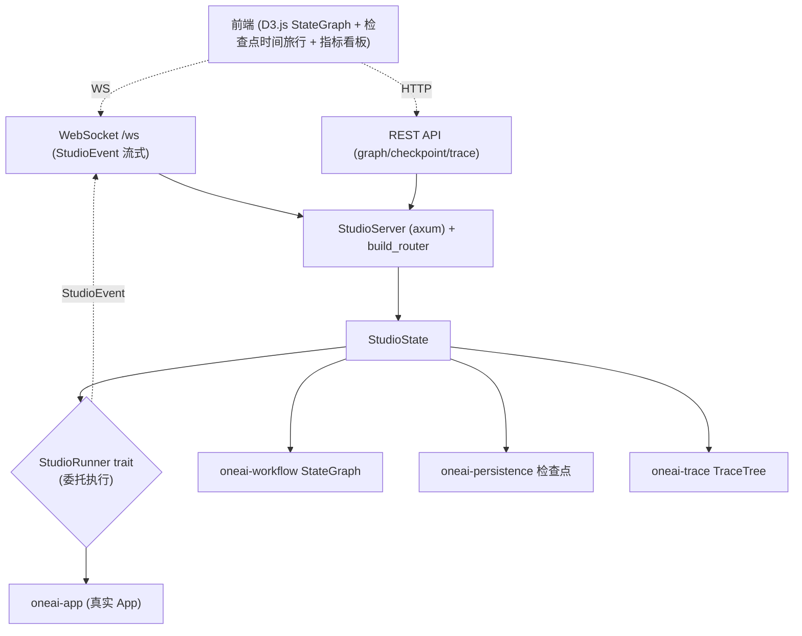

# OneAI Studio 机制

> axum HTTP + WebSocket + REST API + D3.js StateGraph 可视化 + Checkpoint 时间旅行 + 轨迹指标看板：OneAI 的可视化调试环境，灵感来自 LangGraph Studio，让 Agent 执行的图、迭代决策、检查点、指标在浏览器里可观察可回放。

## 1. 概述（是什么）

`oneai-studio` 是 OneAI 的可视化调试 playground。它起一个 axum HTTP 服务，提供 REST API 查 StateGraph/检查点/轨迹，并经 WebSocket `/ws` 实时推送执行事件给前端（D3.js 渲染图、时间旅行浏览检查点、指标看板）。它让开发者能在浏览器里看见 Agent 每一步在图上的位置、每次迭代的决策与工具调用、任一检查点的状态快照、以及成功率/token/延迟等指标——是调试与演示的核心工具。

它位于特性层、依赖 `oneai-core` 与各特性 crate（`oneai-workflow` 取 StateGraph、`oneai-persistence` 取检查点、`oneai-trace` 取轨迹），但**驱动逻辑**经 `StudioRunner` trait 委托——Studio 自身不跑 AgentLoop，把执行委托给 runner（通常由 `oneai-app` 注入真实 App）。它坐在 `oneai-app` 之下、同 `oneai-supervisor`/`oneai-gateway` 是"挂载在 app 侧的辅助服务"。

## 2. 职责与能力（做什么）

**StateGraph 可视化。** `GraphVisualization` + `NodeView`/`EdgeView` + `NodeDetails`，`from_state_graph` 把 `StateGraph` 转 DTO，前端 D3.js 渲染节点+边+当前执行位置。

**检查点时间旅行。** `CheckpointListView`/`CheckpointEntryView`/`CheckpointDetailView` + `AgentStateView`，`from_checkpoint_info`/`from_info_and_state` 把 `CheckpointInfo` 转 DTO，前端选任一检查点 inspect 或 restore。

**轨迹看板。** `TraceTreeView`/`TraceMetadataView`/`SpanView` 把 `TraceTree` 转 DTO，展示成功率/token/延迟/工具准确率。

**实时事件推送。** `ws.rs` WebSocket `/ws` 升级 + `handle_socket`，把 `StudioEvent` 流式推给所有订阅者；`handlers.rs` 把 runner 的事件转 `StudioEvent` 广播。

**REST API + 路由。** `build_router(state)` 出 axum router，挂各 REST 端点 + `/ws`。

**StudioRunner trait。** 执行委托 seam——Studio 不自己跑 AgentLoop，runner 由注入决定（真实 App 或测试替身）。

**显式不做什么**：不实现 AgentLoop（委托 runner）；不持久化状态（读 persistence 的检查点）；不做 USD 成本看板（指标按 token）；不实现前端（D3.js 在前端工程）。

## 3. 设计动机（为什么这样实现）

| 决策 | 理由 | 否决的替代方案 |
|---|---|---|
| axum HTTP + WebSocket 而非内嵌 UI | 可视化是开发/演示场景，浏览器 + D3.js 比 TUI 表达力强；HTTP+WS 是标准 web 栈、零额外依赖 | TUI 可视化 → 表达力弱；内嵌 GUI → 跨平台难 |
| `StudioRunner` trait 委托执行 | Studio 不应自己跑 AgentLoop（会与 app 双重装配）；trait 让执行委托给注入的 app，Studio 只负责观察 | Studio 自跑 AgentLoop → 装配重复、与真实行为漂移 |
| DTO 层（`*_dto.rs`）隔离 | 内部类型（StateGraph/CheckpointInfo/TraceTree）不应直接序列化给前端（耦合 + 版本脆）；DTO 层显式控制暴露面、便于前端稳定 | 直接序列化内部类型 → 耦合、前端接口脆 |
| WebSocket 实时推送而非轮询 | Agent 执行是流式的，轮询延迟高、流量大；WS 推送让前端实时跟踪 | 轮询 REST → 延迟高、流量浪费 |
| 检查点时间旅行读 persistence | 检查点已由 `oneai-persistence` 持久化（`FilePersistence`/`StatePersistence`），Studio 只读不重复造 | Studio 自管检查点 → 与 persistence 漂移 |
| 坐在 app 之下、同 supervisor/gateway | Studio 是挂载在 app 侧的辅助服务，依赖 app 注入 runner，不反向依赖 | 反向依赖 → 循环依赖 |

## 4. 架构与核心抽象



**核心类型：**

```rust
pub struct StudioServer { pub fn with_port(port: u16) -> Self; }
pub fn build_router(state: Arc<StudioState>) -> Router;
pub struct GraphVisualization { pub fn from_state_graph(g: &StateGraph) -> Self; }
pub struct CheckpointDetailView { pub fn from_info_and_state(info, state) -> Self; }
pub trait StudioRunner: Send + Sync { /* 委托执行，产 StudioEvent */ }
```

## 5. 参与的流程

**调试会话：**

1. `StudioServer::with_port(port)` 起服务，`build_router(state)` 挂 REST + `/ws`。
2. 前端连 `/ws` WebSocket，收 `StudioEvent`（runner 执行时产出）。
3. 前端调 REST 拉 StateGraph（`GraphVisualization::from_state_graph`）、检查点列表（`CheckpointListView`）、轨迹（`TraceTreeView`）。
4. 用户选检查点 → REST 取 `CheckpointDetailView` → inspect 或 restore（时间旅行）。
5. runner（注入的真实 App）跑 AgentLoop，每步产 `StudioEvent` 广播给所有 WS 订阅者，前端实时更新图位置 + 迭代决策 + 指标。

## 6. 依赖关系

| 方向 | 谁 | 内容 |
|---|---|---|
| 上游 | `oneai-core` | 共享类型 |
| 上游 | `oneai-workflow` | `StateGraph`（可视化）|
| 上游 | `oneai-persistence` | 检查点（`FilePersistence`/`StatePersistence`）|
| 上游 | `oneai-trace` | `TraceTree`（指标看板）|
| 上游 | `axum`/`tokio`/`serde` | HTTP/WS、异步、序列化 |
| 下游 | `oneai-app` | 注入 `StudioRunner`（真实 App）|
| 下游 | CLI | `oneai studio` |
| 横切接入 | 前端工程 | D3.js SVG 渲染（`platforms/` 或独立 web 工程）|

## 7. 关键类型与文件

| 项 | 位置 |
|---|---|
| `StudioServer` + `with_port` | `crates/oneai-studio/src/server.rs:34` |
| `build_router`（REST + `/ws`）| `crates/oneai-studio/src/routes.rs:32` |
| WebSocket `/ws` + `handle_socket` | `crates/oneai-studio/src/ws.rs:14,33` |
| `StudioRunner` trait + 事件广播 | `crates/oneai-studio/src/handlers.rs:469,472` |
| `GraphVisualization`/`NodeView`/`EdgeView`/`NodeDetails` | `crates/oneai-studio/src/graph_dto.rs:14,38,91,62`（`from_state_graph:116`）|
| `CheckpointListView`/`CheckpointDetailView`/`AgentStateView` | `crates/oneai-studio/src/checkpoint_dto.rs:13,44,55` |
| `TraceTreeView`/`TraceMetadataView`/`SpanView` | `crates/oneai-studio/src/trace_dto.rs:10,28,44` |
| `StudioState` | `crates/oneai-studio/src/state.rs` |

## 8. 与业界对比

| 系统 | 模型 | OneAI 取舍 |
|---|---|---|
| **LangGraph Studio** | 图可视化 + 时间旅行 + 实时跟踪 | OneAI Studio 直接对标，REST+WS 架构同源；差异在检查点读 `oneai-persistence` 而非自管 |
| **LangSmith** | SaaS 轨迹 + 评测平台 | OneAI Studio 自托管、本地起服务，无 SaaS 依赖；轨迹与 `oneai-trace` 同源 |
| **OpenTelemetry UI（Jaeger/Grafana）** | 通用 trace 可视化 | OneAI Studio 面向 agent StateGraph + 检查点时间旅行，比通用 trace UI 多图与状态维度 |
| **Cursor debug panel** | IDE 内调试 | OneAI Studio 是独立 web 服务，可远程访问、可演示，不绑 IDE |

OneAI 独特点：**StateGraph + 检查点时间旅行 + 轨迹看板三合一** + **`StudioRunner` 委托执行**（Studio 只观察不跑 AgentLoop，与真实行为不漂移）+ **读 persistence 检查点**（不重复造持久化）。

## 9. 扩展点与配置

- **起服务**：`StudioServer::with_port(port)` + `build_router`，或 CLI `oneai studio`。
- **注入 runner**：`StudioRunner` trait 注入真实 App 或测试替身。
- **前端**：D3.js 渲染（独立 web 工程或 `platforms/`）。
- **CLI**：`oneai studio`（详见 [cli-reference](cli-reference.md)）。

## 10. 深入阅读

- [workflow-mechanism.md](workflow-mechanism.md) —— StateGraph 可视化的数据源
- [persistence-mechanism.md](persistence-mechanism.md) —— 检查点时间旅行的后端
- [trace-mechanism.md](trace-mechanism.md) —— 轨迹看板的 `TraceTree`
- [supervisor-mechanism.md](supervisor-mechanism.md) —— 同为 app 侧辅助服务
- 源码：`crates/oneai-studio/src/`（9 文件 / ~2.6K LOC）
