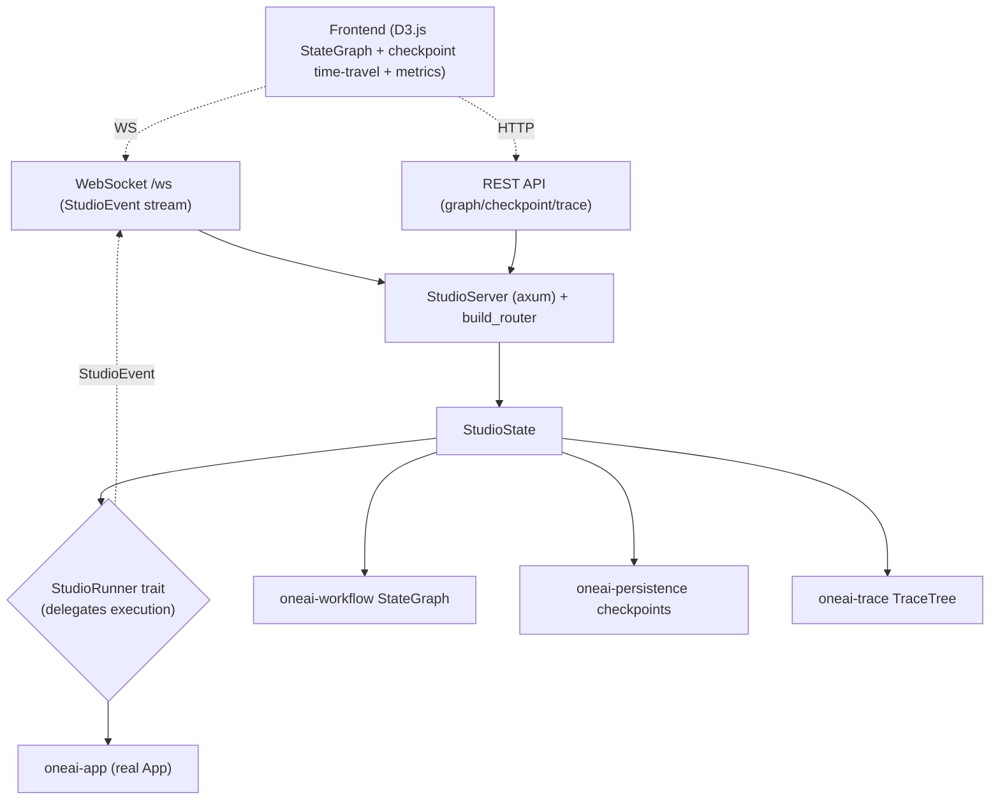

# OneAI Studio Mechanism

> axum HTTP + WebSocket + REST API + D3.js StateGraph visualization + checkpoint time-travel + trace metrics dashboard: OneAI's visual debugging environment, inspired by LangGraph Studio — observe and replay an agent's graph, iteration decisions, checkpoints, and metrics in the browser.

## 1. Overview (what it is)

`oneai-studio` is OneAI's visual debugging playground. It runs an axum HTTP service providing REST APIs to query StateGraph/checkpoints/traces and a WebSocket `/ws` that streams execution events to the frontend (D3.js renders the graph, time-travels checkpoints, shows metrics). It lets a developer see in the browser where the agent is on the graph each step, each iteration's decisions and tool calls, any checkpoint's state snapshot, and metrics like success rate / tokens / latency — the core tool for debugging and demos.

It sits in the feature layer, depending on `oneai-core` and feature crates (`oneai-workflow` for StateGraph, `oneai-persistence` for checkpoints, `oneai-trace` for traces), but **driving logic** is delegated via the `StudioRunner` trait — Studio itself does not run the AgentLoop; it delegates execution to a runner (usually a real `App` injected by `oneai-app`). It sits below `oneai-app`, alongside `oneai-supervisor`/`oneai-gateway` as an "app-side auxiliary service."

## 2. Responsibilities & capabilities (what it does)

**StateGraph visualization.** `GraphVisualization` + `NodeView`/`EdgeView` + `NodeDetails`, `from_state_graph` converts a `StateGraph` to a DTO; the frontend renders nodes + edges + current execution position with D3.js.

**Checkpoint time-travel.** `CheckpointListView`/`CheckpointEntryView`/`CheckpointDetailView` + `AgentStateView`, `from_checkpoint_info`/`from_info_and_state` convert `CheckpointInfo` to DTOs; the frontend selects any checkpoint to inspect or restore.

**Trace dashboard.** `TraceTreeView`/`TraceMetadataView`/`SpanView` convert `TraceTree` to DTOs, showing success rate / tokens / latency / tool accuracy.

**Real-time event streaming.** `ws.rs` WebSocket `/ws` upgrade + `handle_socket`, streaming `StudioEvent` to all subscribers; `handlers.rs` converts runner events to `StudioEvent` broadcasts.

**REST API + routes.** `build_router(state)` produces an axum router mounting REST endpoints + `/ws`.

**StudioRunner trait.** Execution delegation seam — Studio does not run the AgentLoop itself; the runner is injected (real App or test double).

**Explicitly does not**: no AgentLoop implementation (delegates to runner); no state persistence (reads `oneai-persistence` checkpoints); no USD cost dashboard (metrics are token-based); no frontend implementation (D3.js is in the frontend project).

## 3. Design motivation (why this way)

| Decision | Rationale | Rejected alternative |
|---|---|---|
| axum HTTP + WebSocket, not embedded UI | Visualization is a dev/demo scenario; browser + D3.js beats TUI expressiveness; HTTP+WS is the standard web stack, zero extra deps | TUI visualization → weak expressiveness; embedded GUI → hard cross-platform |
| `StudioRunner` trait delegates execution | Studio should not run the AgentLoop itself (would double-assemble with app); the trait delegates to an injected app, Studio only observes | Studio runs AgentLoop itself → duplicate assembly, drift from real behavior |
| DTO layer (`*_dto.rs`) isolation | Internal types (StateGraph/CheckpointInfo/TraceTree) should not be serialized directly to the frontend (coupling + version fragility); a DTO layer explicitly controls the exposed surface, stabilizing the frontend | Serialize internal types directly → coupling, fragile frontend interface |
| WebSocket real-time streaming, not polling | Agent execution is streaming; polling lags and wastes traffic; WS push lets the frontend track in real time | Polling REST → high latency, wasted traffic |
| Checkpoint time-travel reads persistence | Checkpoints are already persisted by `oneai-persistence` (`FilePersistence`/`StatePersistence`); Studio only reads, does not reinvent | Studio manages its own checkpoints → drift with persistence |
| Sits below app, alongside supervisor/gateway | Studio is an app-side auxiliary service that depends on app-injected runner, not reverse-depending | Reverse dep → circular |

## 4. Architecture & core abstractions



**Core types:**

```rust
pub struct StudioServer { pub fn with_port(port: u16) -> Self; }
pub fn build_router(state: Arc<StudioState>) -> Router;
pub struct GraphVisualization { pub fn from_state_graph(g: &StateGraph) -> Self; }
pub struct CheckpointDetailView { pub fn from_info_and_state(info, state) -> Self; }
pub trait StudioRunner: Send + Sync { /* delegate execution, produce StudioEvent */ }
```

## 5. Flows it participates in

**Debug session:**

1. `StudioServer::with_port(port)` starts the service; `build_router(state)` mounts REST + `/ws`.
2. The frontend connects to `/ws` WebSocket and receives `StudioEvent`s (produced as the runner executes).
3. The frontend calls REST to fetch StateGraph (`GraphVisualization::from_state_graph`), checkpoint list (`CheckpointListView`), trace (`TraceTreeView`).
4. The user selects a checkpoint → REST returns `CheckpointDetailView` → inspect or restore (time-travel).
5. The runner (injected real App) drives the AgentLoop; each step produces a `StudioEvent` broadcast to all WS subscribers; the frontend updates graph position + iteration decisions + metrics in real time.

## 6. Dependencies

| Direction | Who | What |
|---|---|---|
| Upstream | `oneai-core` | shared types |
| Upstream | `oneai-workflow` | `StateGraph` (visualization) |
| Upstream | `oneai-persistence` | checkpoints (`FilePersistence`/`StatePersistence`) |
| Upstream | `oneai-trace` | `TraceTree` (metrics dashboard) |
| Upstream | `axum`/`tokio`/`serde` | HTTP/WS, async, serialization |
| Downstream | `oneai-app` | injects `StudioRunner` (real App) |
| Downstream | CLI | `oneai studio` |
| Cross-cutting | frontend project | D3.js SVG rendering |

## 7. Key types & files

| Item | Location |
|---|---|
| `StudioServer` + `with_port` | `crates/oneai-studio/src/server.rs:34` |
| `build_router` (REST + `/ws`) | `crates/oneai-studio/src/routes.rs:32` |
| WebSocket `/ws` + `handle_socket` | `crates/oneai-studio/src/ws.rs:14,33` |
| `StudioRunner` trait + event broadcast | `crates/oneai-studio/src/handlers.rs:469,472` |
| `GraphVisualization`/`NodeView`/`EdgeView`/`NodeDetails` | `crates/oneai-studio/src/graph_dto.rs:14,38,91,62` (`from_state_graph:116`) |
| `CheckpointListView`/`CheckpointDetailView`/`AgentStateView` | `crates/oneai-studio/src/checkpoint_dto.rs:13,44,55` |
| `TraceTreeView`/`TraceMetadataView`/`SpanView` | `crates/oneai-studio/src/trace_dto.rs:10,28,44` |
| `StudioState` | `crates/oneai-studio/src/state.rs` |

## 8. Industry comparison

| System | Model | OneAI's trade-off |
|---|---|---|
| **LangGraph Studio** | Graph visualization + time-travel + real-time tracking | OneAI Studio directly mirrors it; same REST+WS architecture; differs in reading checkpoints from `oneai-persistence` rather than managing them |
| **LangSmith** | SaaS trace + eval platform | OneAI Studio is self-hosted, local, no SaaS dependency; traces same-source with `oneai-trace` |
| **OpenTelemetry UI (Jaeger/Grafana)** | Generic trace visualization | OneAI Studio targets agent StateGraph + checkpoint time-travel, richer than generic trace UI |
| **Cursor debug panel** | In-IDE debugging | OneAI Studio is a standalone web service, remotely accessible, demoable, not IDE-bound |

OneAI's distinct points: **StateGraph + checkpoint time-travel + trace dashboard, three-in-one** + **`StudioRunner` delegates execution** (Studio only observes, does not run the AgentLoop) + **reads persistence checkpoints** (does not reinvent).

## 9. Extension points & config

- **Start service**: `StudioServer::with_port(port)` + `build_router`, or CLI `oneai studio`.
- **Inject runner**: `StudioRunner` trait injected with a real App or test double.
- **Frontend**: D3.js rendering (separate web project or `platforms/`).
- **CLI**: `oneai studio` (see [cli-reference](cli-reference_EN.md)).

## 10. Further reading

- [workflow-mechanism](workflow-mechanism_EN.md) — the StateGraph data source for visualization
- [persistence-mechanism](persistence-mechanism_EN.md) — the checkpoint backend for time-travel
- [trace-mechanism](trace-mechanism_EN.md) — the `TraceTree` for the metrics dashboard
- [supervisor-mechanism](supervisor-mechanism_EN.md) — fellow app-side auxiliary service
- Source: `crates/oneai-studio/src/` (9 files / ~2.6K LOC)
