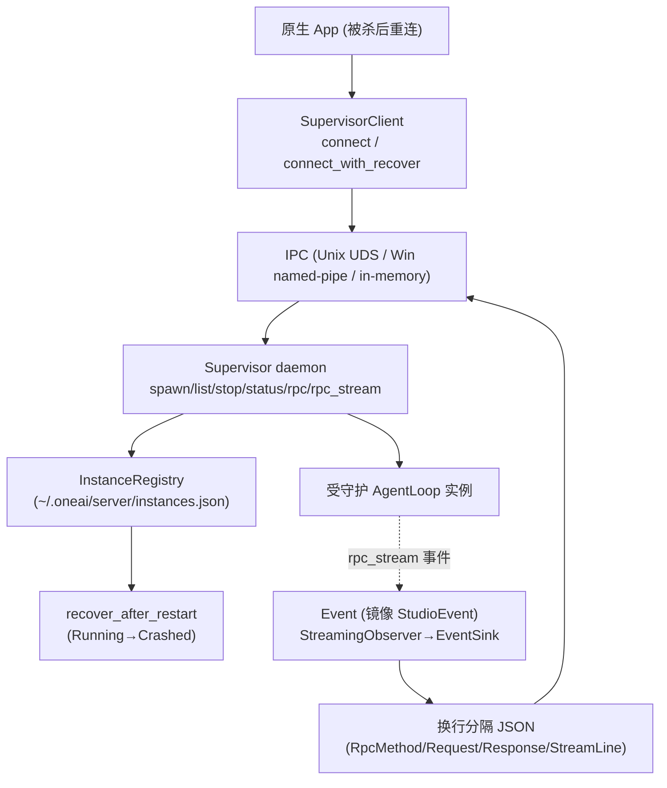

# OneAI Supervisor 机制

> headless 监督 daemon——守护长生命周期 `AgentLoop` 实例：持久实例注册表（`~/.oneai/server/instances.json`）+ 崩溃恢复（`Running→Crashed` + `recover_after_restart`）+ IPC（Unix UDS / Win named-pipe / in-memory duplex）+ `spawn/list/stop/status/rpc/rpc_stream` + 换行分隔 JSON protocol + `Event` 镜像 `StudioEvent`。

## 1. 概述（是什么）

`oneai-supervisor` 解决"原生 App 后台被杀即丢会话"的问题。OneAI 的原生 App（macOS/Win/iOS/Android/HarmonyOS）后台或被杀时 session 丢失——`FileWorkingStateStore` 持久了任务的目标/步骤/决策，但没持久**活的 reconnect 句柄**。supervisor 补这个缺口：一个后台 daemon 守护长生命周期 `AgentLoop` 实例，持久实例注册表于 `~/.oneai/server/instances.json`，经 IPC（Unix domain socket / Windows named pipe / in-memory duplex）暴露 `spawn/list/stop/status/rpc/rpc_stream`，让原生 App 被杀后能经 `recover_after_restart` 重连。

它位于特性层、依赖 `oneai-core`/`oneai-agent`/`oneai-trace`，但**驱动逻辑**经 trait 由 CLI 注入、不加 `AppBuilder` 方法——同 `oneai-studio`/`oneai-gateway` 一样坐在 app 侧的辅助服务。protocol 是换行分隔 JSON（`RpcMethod`/`Request`/`Response`/`StreamLine`），`Event` 镜像 `StudioEvent`，`StreamingObserver→EventSink` 把执行事件桥到 IPC 流。

## 2. 职责与能力（做什么）

**实例注册表。** `InstanceRegistry`（`~/.oneai/server/instances.json`）持久化受守护实例 + `InstanceSpec`（spawner 提供）+ `InstanceStatus`（Running/Stopping/Stopped/Crashed）+ `InstanceInfo`，`register`/`list`/`set_status`。

**崩溃恢复。** `recover_after_restart`——supervisor 重启后扫注册表，把所有 `Running` 标 `Crashed("supervisor_restart")`，让上层决定是否重拉起。

**IPC 传输。** `IpcListener`/`IpcStream` 具体 enum：Unix UDS（Unix）/ Win named-pipe（Windows）/ in-memory duplex（测试）。

**RPC 协议。** 换行分隔 JSON：`RpcMethod` 枚举 + `Request`/`Response`（`ok`/`err`）+ `StreamLine`（`event`/`done_ok`/`done_err`）+ `encode`/`decode`。

**supervisor 操作。** `Supervisor` `spawn`/`list`/`stop`/`status`/`rpc`/`rpc_stream`——`stop` = `request_interrupt`（复用 `CancellationToken`，非额外取消令牌）。

**事件桥。** `Event` 镜像 `StudioEvent` + `StreamingObserver→EventSink`，把 `AgentLoop` 执行事件桥到 `rpc_stream` IPC 流，让重连的 App 实时收事件。

**SupervisorClient。** `connect`/`connect_with_recover`（带重试），App 侧连 supervisor 的客户端。

**显式不做什么**：不跑 AgentLoop 自身（守护实例的 runner 注入）；不持久化对话内容（归 persistence）；`stop` 不用额外 CancellationToken（复用 `request_interrupt`）；不加 `AppBuilder` 方法（trait 由 CLI 注入）。

## 3. 设计动机（为什么这样实现）

| 决策 | 理由 | 否决的替代方案 |
|---|---|---|
| daemon 守护而非 App 内常驻 | 原生 App 后台被杀即丢活句柄；daemon 独立于 App 生命周期，App 被杀后 daemon 仍在，可重连 | App 内常驻 → 被杀即丢 |
| `InstanceRegistry` 持久化 + `recover_after_restart` | supervisor 自身也可能重启，注册表持久化 + 重启后把 Running 标 Crashed 让上层决定重拉起，保证一致 | 只内存注册表 → supervisor 重启全丢 |
| IPC 三实现 enum（UDS/named-pipe/in-memory）| Unix 用 UDS、Windows 用 named-pipe，平台原生；in-memory 测试用；trait + enum 适配跨平台 | 只一种 → 跨平台不通 |
| 换行分隔 JSON protocol 而非二进制 | 可调试（人可读）、跨语言易（C#/Kotlin 都能解）、版本容忍；`RpcMethod` 枚举控方法集 | 二进制 → 调试难、跨语言烦 |
| `Event` 镜像 `StudioEvent` | supervisor 流式事件与 Studio 同构，前端/App 可复用一套事件处理；不重复设计事件模型 | 独立事件模型 → 重复、与 Studio 漂移 |
| `StreamingObserver→EventSink` | 把 `AgentLoop` 的 `StreamingObserver` 桥到 IPC `EventSink`，让重连 App 实时收执行事件，无缝 | 不桥 → 重连后无实时事件 |
| `stop` 复用 `request_interrupt`（CancellationToken） | AgentLoop 已有中断机制，supervisor 不必另造；`request_interrupt` 在迭代边界生效，干净停 | 另造取消令牌 → 与 AgentLoop 中断分裂 |
| trait 由 CLI 注入、不加 AppBuilder 方法 | 同 studio/gateway 是挂载服务，trait 注入更一致，不让 AppBuilder 膨胀 | 加 AppBuilder → builder 膨胀、与同类不一致 |
| `connect_with_recover` 带重试 | App 侧连 supervisor 可能遇 daemon 未起；重试让连接鲁棒 | 无重试 → 启动竞态失败 |

## 4. 架构与核心抽象



**核心类型：**

```rust
pub struct InstanceRegistry { /* register/list/set_status/recover_after_restart */ }
pub enum InstanceStatus { Running, Stopping, Stopped, Crashed(String) }
pub enum RpcMethod { /* spawn/list/stop/status/rpc/rpc_stream */ }
pub struct Request { ... } pub struct Response { pub fn ok(id, result); pub fn err(id, msg); }
pub struct StreamLine { pub fn event(id, ev); pub fn done_ok(id, result); pub fn done_err(id, msg); }
pub struct SupervisorClient { pub async fn connect(path); pub async fn connect_with_recover(path, retries); }
```

## 5. 参与的流程

**守护长生命周期实例：**

1. CLI/App 调 `Supervisor::spawn(spec)` 起 `AgentLoop` 实例，`InstanceRegistry::register` 落 `instances.json` 标 `Running`。
2. 实例跑 `AgentLoop`，`StreamingObserver→EventSink` 把执行事件桥成 `Event`。
3. App 经 `SupervisorClient::connect`/`connect_with_recover` 连 daemon，`rpc_stream` 订阅实例事件流（换行分隔 JSON `StreamLine`）。
4. `stop` = `request_interrupt`（复用 CancellationToken，迭代边界生效），`InstanceStatus` 转 `Stopping`→`Stopped`。

**崩溃恢复：**

1. supervisor 重启 → `InstanceRegistry::recover_after_restart` 扫表。
2. 所有 `Running` 标 `Crashed("supervisor_restart")`（因 supervisor 不知它们是否真活着）。
3. 上层（CLI/App）查 `list` 见 `Crashed`，决定重拉起或清理。

## 6. 依赖关系

| 方向 | 谁 | 内容 |
|---|---|---|
| 上游 | `oneai-core`/`oneai-agent`/`oneai-trace` | `AgentLoop`/`CancellationToken`/`StreamingObserver`/trace |
| 上游 | `tokio`/`serde`/`serde_json` | IPC 异步、protocol 序列化 |
| 下游 | CLI | `oneai supervisor serve/list/spawn/stop/status/rpc/rpc-stream` |
| 下游 | 原生 App | 经 `SupervisorClient` 重连 |
| 横切接入 | 配置 | `~/.oneai/server/instances.json` |
| 横切接入 | macOS LaunchAgent | daemon 自启（随 gateway）|

## 7. 关键类型与文件

| 项 | 位置 |
|---|---|
| `InstanceRegistry` + `InstanceSpec`/`InstanceStatus`/`InstanceInfo` | `crates/oneai-supervisor/src/registry.rs:70,21,36,57` |
| `recover_after_restart`（Running→Crashed）| `crates/oneai-supervisor/src/registry.rs:195` |
| `Supervisor`（spawn/list/stop/status/rpc/rpc_stream）| `crates/oneai-supervisor/src/supervisor.rs` |
| IPC（`IpcListener`/`IpcStream` UDS/named-pipe/in-memory）| `crates/oneai-supervisor/src/transport.rs` |
| `RpcMethod` + `Request`/`Response`/`StreamLine` + `encode`/`decode` | `crates/oneai-supervisor/src/protocol.rs:29,46,54,65,75,87,101,112,123,137,149` |
| `SupervisorClient`（connect/connect_with_recover）| `crates/oneai-supervisor/src/client.rs:24,36,49` |
| `Event` 镜像 `StudioEvent` + `StreamingObserver→EventSink` | `crates/oneai-supervisor/src/server.rs` + `runner.rs` |
| `SupervisorError` | `crates/oneai-supervisor/src/error.rs:13` |

## 8. 与业界对比

| 系统 | 模型 | OneAI 取舍 |
|---|---|---|
| **systemd / launchd** | 系统级进程监督 + 重启策略 | OneAI supervisor 是应用级，专注 `AgentLoop` 实例 + RPC/事件流，不依赖系统 init |
| **supervisord** | Python 进程监督 | OneAI 同源思路，但 RPC + 事件流面向 agent（`rpc_stream` 推执行事件）|
| **LangGraph checkpoint + resume** | 图执行状态持久 + 恢复 | OneAI supervisor 守护**活句柄**（不只状态），App 重连即拿回活实例，非从状态重建 |
| **Temporal activity workers** | 长任务 worker + 持久 | OneAI supervisor 是本地单用户轻量版，IPC 不走网络，换行 JSON 而非 gRPC |

OneAI 独特点：**守护活句柄而非只状态**（App 重连拿回活实例）+ **`Event` 镜像 `StudioEvent`**（与 Studio 事件模型复用）+ **`stop` 复用 `request_interrupt`**（不另造取消令牌）+ **换行 JSON protocol**（跨语言可调试）。

## 9. 扩展点与配置

- **起 daemon**：`oneai supervisor serve`，或 macOS LaunchAgent 自启（随 gateway）。
- **spawn 实例**：`supervisor spawn <spec>`，`InstanceRegistry` 落 `~/.oneai/server/instances.json`。
- **重连**：`SupervisorClient::connect_with_recover(path, retries)`。
- **订阅事件**：`rpc_stream` 订阅实例 `Event` 流。
- **崩溃恢复**：`recover_after_restart` 重启后对账。
- **CLI**：`oneai supervisor serve/list/spawn/stop/status/rpc/rpc-stream`（详见 [cli-reference](cli-reference.md)）。

## 10. 深入阅读

- [working-state-mechanism.md](working-state-mechanism.md) —— 持久任务状态（supervisor 守护活句柄的互补）
- [studio-mechanism.md](studio-mechanism.md) —— `Event` 镜像 `StudioEvent` + 同为 app 侧服务
- [gateway-mechanism.md](gateway-mechanism.md) —— 同为 app 侧常驻服务 + macOS LaunchAgent 自启
- [multi-agent-mechanism.md](multi-agent-mechanism.md) —— 受守护的 `AgentLoop` 实例
- 源码：`crates/oneai-supervisor/src/`（9 文件 / ~2.3K LOC）
