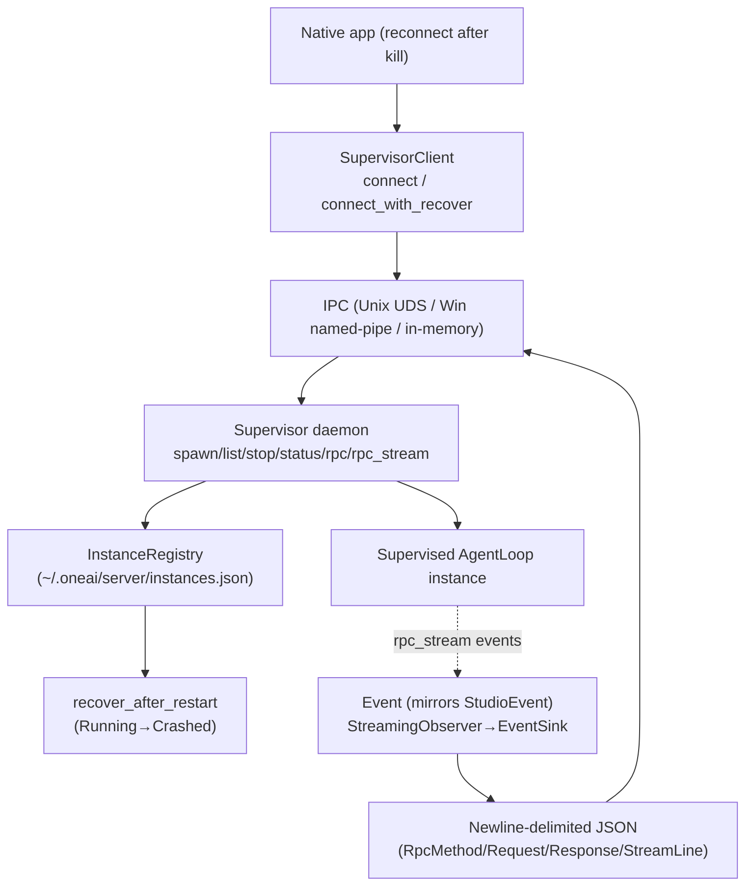

# OneAI Supervisor Mechanism

> Headless supervision daemon — guards long-lived `AgentLoop` instances: persistent instance registry (`~/.oneai/server/instances.json`) + crash recovery (`Running→Crashed` + `recover_after_restart`) + IPC (Unix UDS / Win named-pipe / in-memory duplex) + `spawn/list/stop/status/rpc/rpc_stream` + newline-delimited JSON protocol + `Event` mirrors `StudioEvent`.

## 1. Overview (what it is)

`oneai-supervisor` solves the "native app loses its session when backgrounded or killed" problem. OneAI's native apps (macOS/Win/iOS/Android/HarmonyOS) lose the session on background/kill — `FileWorkingStateStore` persists a task's goal/steps/decisions but not the **live reconnect handle**. The supervisor closes that gap: a background daemon supervises long-lived `AgentLoop` instances, persists an instance registry at `~/.oneai/server/instances.json`, exposes `spawn/list/stop/status/rpc/rpc_stream` over IPC (Unix domain socket / Windows named pipe / in-memory duplex), and lets a native app reconnect after a kill via `recover_after_restart`.

It sits in the feature layer, depending on `oneai-core`/`oneai-agent`/`oneai-trace`, but **driving logic** is via a trait injected by the CLI, with no `AppBuilder` method — isomorphic with `oneai-studio`/`oneai-gateway` as an app-side auxiliary service. The protocol is newline-delimited JSON (`RpcMethod`/`Request`/`Response`/`StreamLine`); `Event` mirrors `StudioEvent`; `StreamingObserver→EventSink` bridges execution events to the IPC stream.

## 2. Responsibilities & capabilities (what it does)

**Instance registry.** `InstanceRegistry` (`~/.oneai/server/instances.json`) persists supervised instances + `InstanceSpec` (from spawner) + `InstanceStatus` (Running/Stopping/Stopped/Crashed) + `InstanceInfo`; `register`/`list`/`set_status`.

**Crash recovery.** `recover_after_restart` — after the supervisor restarts, scans the registry, marks all `Running` as `Crashed("supervisor_restart")`, letting the upper layer decide whether to re-spawn.

**IPC transport.** `IpcListener`/`IpcStream` concrete enum: Unix UDS (Unix) / Win named-pipe (Windows) / in-memory duplex (tests).

**RPC protocol.** Newline-delimited JSON: `RpcMethod` enum + `Request`/`Response` (`ok`/`err`) + `StreamLine` (`event`/`done_ok`/`done_err`) + `encode`/`decode`.

**Supervisor operations.** `Supervisor` `spawn`/`list`/`stop`/`status`/`rpc`/`rpc_stream` — `stop` = `request_interrupt` (reuses `CancellationToken`, no extra cancel token).

**Event bridge.** `Event` mirrors `StudioEvent` + `StreamingObserver→EventSink` bridges `AgentLoop` execution events to the `rpc_stream` IPC stream so a reconnecting app receives events in real time.

**SupervisorClient.** `connect`/`connect_with_recover` (with retries), the client side an app uses to connect to the supervisor.

**Explicitly does not**: does not run the AgentLoop itself (the supervised instance's runner is injected); no conversation-content persistence (persistence's job); `stop` uses no extra CancellationToken (reuses `request_interrupt`); no `AppBuilder` method (trait injected by CLI).

## 3. Design motivation (why this way)

| Decision | Rationale | Rejected alternative |
|---|---|---|
| Daemon supervision, not in-app resident | Native apps lose the live handle on kill; a daemon is independent of the app lifecycle and survives app kills, enabling reconnect | In-app resident → lost on kill |
| `InstanceRegistry` persistent + `recover_after_restart` | The supervisor itself may restart; a persistent registry + marking Running→Crashed on restart lets the upper layer decide re-spawn, keeping consistency | In-memory-only registry → all lost on supervisor restart |
| IPC three-impl enum (UDS/named-pipe/in-memory) | Unix uses UDS, Windows named-pipe, platform-native; in-memory for tests; trait + enum adapts cross-platform | One only → not cross-platform |
| Newline-delimited JSON protocol, not binary | Debuggable (human-readable), cross-language easy (C#/Kotlin can decode), version-tolerant; `RpcMethod` enum controls the method set | Binary → hard to debug, cross-language friction |
| `Event` mirrors `StudioEvent` | Supervisor streaming events are isomorphic with Studio's, so the frontend/App can reuse one event handler; no duplicate event model | Independent event model → duplication, drift with Studio |
| `StreamingObserver→EventSink` | Bridges the `AgentLoop` `StreamingObserver` to the IPC `EventSink` so a reconnecting app gets real-time execution events seamlessly | No bridge → no real-time events after reconnect |
| `stop` reuses `request_interrupt` (CancellationToken) | The AgentLoop already has an interrupt mechanism; the supervisor need not invent another; `request_interrupt` takes effect at iteration boundaries, clean stop | Separate cancel token → splits from AgentLoop interrupt |
| Trait injected by CLI, no AppBuilder method | Isomorphic with studio/gateway as mounted services; trait injection is consistent, keeps AppBuilder lean | Add AppBuilder → builder bloat, inconsistent with peers |
| `connect_with_recover` with retries | The app side may connect while the daemon is not yet up; retries make connection robust | No retry → startup race fails |

## 4. Architecture & core abstractions



**Core types:**

```rust
pub struct InstanceRegistry { /* register/list/set_status/recover_after_restart */ }
pub enum InstanceStatus { Running, Stopping, Stopped, Crashed(String) }
pub enum RpcMethod { /* spawn/list/stop/status/rpc/rpc_stream */ }
pub struct Request { ... } pub struct Response { pub fn ok(id, result); pub fn err(id, msg); }
pub struct StreamLine { pub fn event(id, ev); pub fn done_ok(id, result); pub fn done_err(id, msg); }
pub struct SupervisorClient { pub async fn connect(path); pub async fn connect_with_recover(path, retries); }
```

## 5. Flows it participates in

**Supervising a long-lived instance:**

1. CLI/App calls `Supervisor::spawn(spec)` to start an `AgentLoop` instance; `InstanceRegistry::register` writes `instances.json` as `Running`.
2. The instance runs the `AgentLoop`; `StreamingObserver→EventSink` bridges events to `Event`.
3. The app connects via `SupervisorClient::connect`/`connect_with_recover` and subscribes to the instance event stream via `rpc_stream` (newline-delimited JSON `StreamLine`s).
4. `stop` = `request_interrupt` (reuses CancellationToken, takes effect at iteration boundaries); `InstanceStatus` transitions `Stopping`→`Stopped`.

**Crash recovery:**

1. The supervisor restarts → `InstanceRegistry::recover_after_restart` scans the registry.
2. All `Running` are marked `Crashed("supervisor_restart")` (the supervisor does not know if they are truly alive).
3. The upper layer (CLI/App) sees `Crashed` in `list` and decides to re-spawn or clean up.

## 6. Dependencies

| Direction | Who | What |
|---|---|---|
| Upstream | `oneai-core`/`oneai-agent`/`oneai-trace` | `AgentLoop`/`CancellationToken`/`StreamingObserver`/trace |
| Upstream | `tokio`/`serde`/`serde_json` | IPC async, protocol serialization |
| Downstream | CLI | `oneai supervisor serve/list/spawn/stop/status/rpc/rpc-stream` |
| Downstream | native app | reconnects via `SupervisorClient` |
| Cross-cutting | config | `~/.oneai/server/instances.json` |
| Cross-cutting | macOS LaunchAgent | daemon auto-start (with gateway) |

## 7. Key types & files

| Item | Location |
|---|---|
| `InstanceRegistry` + `InstanceSpec`/`InstanceStatus`/`InstanceInfo` | `crates/oneai-supervisor/src/registry.rs:70,21,36,57` |
| `recover_after_restart` (Running→Crashed) | `crates/oneai-supervisor/src/registry.rs:195` |
| `Supervisor` (spawn/list/stop/status/rpc/rpc_stream) | `crates/oneai-supervisor/src/supervisor.rs` |
| IPC (`IpcListener`/`IpcStream` UDS/named-pipe/in-memory) | `crates/oneai-supervisor/src/transport.rs` |
| `RpcMethod` + `Request`/`Response`/`StreamLine` + `encode`/`decode` | `crates/oneai-supervisor/src/protocol.rs:29,46,54,65,75,87,101,112,123,137,149` |
| `SupervisorClient` (connect/connect_with_recover) | `crates/oneai-supervisor/src/client.rs:24,36,49` |
| `Event` mirrors `StudioEvent` + `StreamingObserver→EventSink` | `crates/oneai-supervisor/src/server.rs` + `runner.rs` |
| `SupervisorError` | `crates/oneai-supervisor/src/error.rs:13` |

## 8. Industry comparison

| System | Model | OneAI's trade-off |
|---|---|---|
| **systemd / launchd** | System-level process supervision + restart policies | OneAI supervisor is application-level, focused on `AgentLoop` instances + RPC/event streams, no system-init dependency |
| **supervisord** | Python process supervision | OneAI is the same idea, but RPC + event streams target agents (`rpc_stream` pushes execution events) |
| **LangGraph checkpoint + resume** | Graph-execution state persistence + recovery | OneAI supervisor guards a **live handle** (not just state); the app reconnects and picks up the live instance, not rebuilds from state |
| **Temporal activity workers** | Long-task workers + durability | OneAI supervisor is a local single-user lightweight version; IPC is not network, newline JSON not gRPC |

OneAI's distinct points: **guards a live handle, not just state** (reconnect picks up the live instance) + **`Event` mirrors `StudioEvent`** (reuses Studio's event model) + **`stop` reuses `request_interrupt`** (no separate cancel token) + **newline JSON protocol** (cross-language, debuggable).

## 9. Extension points & config

- **Start daemon**: `oneai supervisor serve`, or macOS LaunchAgent auto-start (with gateway).
- **Spawn instance**: `supervisor spawn <spec>`; `InstanceRegistry` lands `~/.oneai/server/instances.json`.
- **Reconnect**: `SupervisorClient::connect_with_recover(path, retries)`.
- **Subscribe events**: `rpc_stream` subscribes to instance `Event` stream.
- **Crash recovery**: `recover_after_restart` reconciles after restart.
- **CLI**: `oneai supervisor serve/list/spawn/stop/status/rpc/rpc-stream` (see [cli-reference](cli-reference_EN.md)).

## 10. Further reading

- [working-state-mechanism](working-state-mechanism_EN.md) — persistent task state (complement to the supervisor's live handle)
- [studio-mechanism](studio-mechanism_EN.md) — `Event` mirrors `StudioEvent` + fellow app-side service
- [gateway-mechanism](gateway-mechanism_EN.md) — fellow app-side resident service + macOS LaunchAgent auto-start
- [multi-agent-mechanism](multi-agent-mechanism_EN.md) — the supervised `AgentLoop` instance
- Source: `crates/oneai-supervisor/src/` (9 files / ~2.3K LOC)
