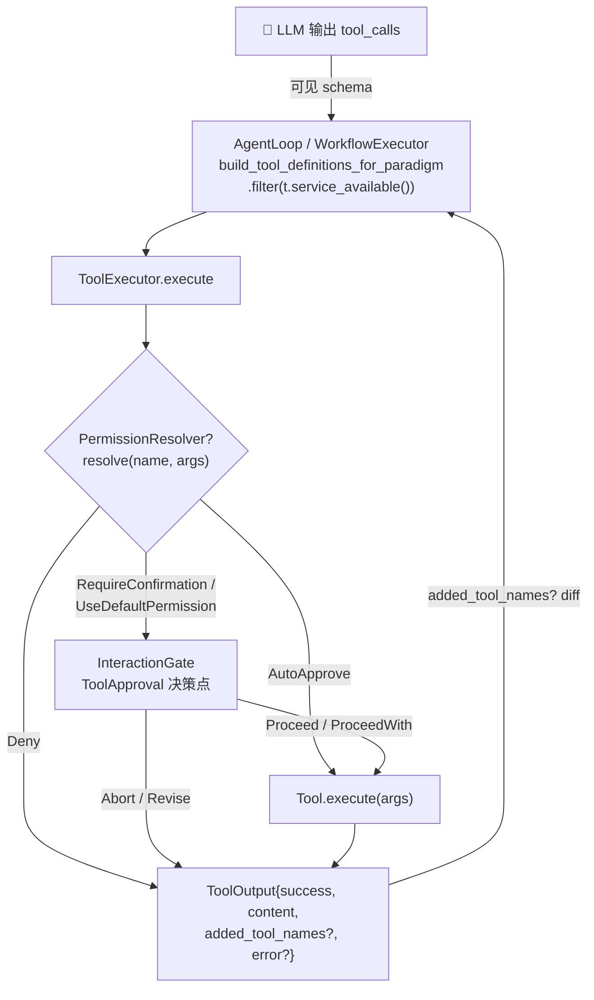

# OneAI 工具系统机制

> `Tool` trait + Registry + 执行器 + 16 内置工具 + MCP 客户端 + Footprint ladder + 三级权限 gate：模型能调用什么、按多大的 schema 足迹暴露、由谁来批准——三条决策在一个 crate 内闭合。

## 1. 概述（是什么）

工具是 Agent 作用于世界的双手。`oneai-tool` 这一层负责把"调用一个工具"从模型的一次函数调用，落地为注册、权限分级、安全执行、结果回填的完整链路，并在这条链路之上回答一个常被忽略的问题：一个新能力该以多大的 schema 足迹暴露给模型。它的答案是 Footprint ladder——能用更小足迹承载的，绝不放大成常驻 schema。

在依赖分层里，它位于特性层：向下依赖 `oneai-core`（`Tool`/`ToolOutput`/`PermissionLevel`/`RiskLevel` trait）与 `oneai-domain`（`PermissionResolver`），向上被 `oneai-agent` 的 `AgentLoop` 与 `oneai-workflow` 的执行器共同消费。这两条消费路径走的是同一个 `ToolExecutor`，因此权限语义不会因入口不同而漂移。

## 2. 职责与能力（做什么）

`oneai-tool` 提供的能力可以分成四组：

**注册与查找。** `ToolRegistry` 是一个按 `tool.name()` 去重的 `Arc<RwLock<HashMap>>`。除了普通的 `register`，它提供两个语义更明确的变体：`override_tool` 在覆盖同名工具时显式打出 audit 日志，让 DomainPack 作者无法静默替换内置工具（Phase 4.2 的 Gondolin 模式靠它把 `read_file`/`shell` 换成 VM 后端实现）；`register_gated` 则把工具包进 `GatedTool`，把"是否对模型可见"交给一个外部 `check_fn` 决定。

**执行。** `ToolExecutor` 是工具执行的单一入口。它内嵌权限解析、InteractionGate 审批、超时三件事，使得任何调用方（AgentLoop、WorkflowExecutor、直接 RPC）拿到的执行语义都一致。

**16 个内置工具。** 按权限分级组织：`Read` 级有 FileRead / FileList / Grep / Glob / Environment / WebFetch / WebSearch；`Standard` 级有 FileEdit / FileWrite / NotebookEdit / ApplyPatch / Calculator / Browser；`Full` 级有 Shell / FileDelete / Schedule。其中 ApplyPatch 支持多文件统一 diff 一次性编辑，Schedule 把 cron 调度作为工具暴露给模型。

**外部接入。** MCP 客户端（基于 `rmcp`）支持 stdio / SSE / streamable-http 三种传输，把远端 MCP server 的工具适配为本 crate 的 `Tool`；`FileOperations` trait 抽象出 Local/Remote 两种文件操作，Remote 经 `TerminalBackend` 在容器内用 `cat`/`base64`/`printf`/`find -printf` 操作文件，并用 `shell_quote` 防注入。

**显式不做什么**，这条边界同样重要：它不解析 LLM 的文本输出（归 `oneai-parser`）；不做 USD 成本统计（用量只按 token 维度，工具只返回 `ToolOutput`）；不持有会话状态——每次 `execute` 都是独立的、无状态调用；它也不直接读 DomainPack 配置，而是经注入的 `PermissionResolver` 间接消费领域策略，从而保持依赖方向干净。

## 3. 设计动机（为什么这样实现）

这一层的设计由几个相互关联的决策塑造，每个都对应一种被否决的替代方案。

**把 `Tool` trait 放在 `oneai-core` 而实现在 `oneai-tool`。** trait 是跨 crate 的契约——agent、workflow、MCP、wasm 都要 impl `Tool`，定义必须下沉到无下游依赖的 core；否则会产生依赖倒置。否决方案是把 trait 放本 crate，但那样 workflow/agent 就要反向依赖 tool crate，分层立即破。

**用 `PermissionAwareTool: Tool` 扩展 trait 而非改 `Tool`。** 三级权限（Read/Standard/Full）是后加的，而 v0.2.0 已承诺 API 稳定。用扩展 trait + `permission_level()` 默认回退 `from_risk_level()`，老工具零改动即可升级，`RiskLevel` 不破。直接给 `Tool` 加 `permission_level()` 会破坏稳定承诺。

**Footprint ladder：足迹最小档优先。** 模型每多见一个工具 schema，决策空间与 token 开销都变大，且会去试一些必然失败的调用。Footprint ladder 把"新能力在哪一档落地"显式成 5 档决策规则——`extend`（复用现有工具组合，无新 schema）→ `skill`（一段 markdown 提示，零工具 schema）→ `service-gated`（服务缺失即从 schema 消失，零足迹）→ `plugin/MCP`（外部进程，条件连接）→ `core tool`（常驻 schema）。举例：要给编码 agent 加"看 git log"的能力，第一选择是 `extend`（用现有 shell 调 `git log`），其次 `skill`（写一段提示教模型用 shell 跑 git），只有当这俩都不行时才考虑造一个 core tool。否决方案是把所有能力都做成 core tool，代价是 schema 膨胀、模型反复试坏选项。

**`service_available()` 返回 false 时让工具从 schema 消失，而非"禁用"。** "禁用"的工具仍占着 schema 位，模型仍会去试一个必然失败的选项；消失则让模型根本看不见它，足迹归零。`GatedTool` 把这一机制做成注册级的 seam：全部 `Tool` 方法委托给内层工具，只覆写 `service_available` 去问 `check_fn`。这样 DomainPack 或 app 能 gate **任何**工具——包括实现住在别处的工具——而无需那个工具自身实现 `service_available`。否决方案是要求每个工具自己 impl `service_available`，但跨 crate 的 gating 逻辑就无处安放了。

**`TerminalBackend` trait + 多后端。** Phase 3.3 把命令执行从内联 `tokio::process::Command` 抽成一个 trait：Local / Docker / Modal / Daytona 四个后端可切换，VM 本身就是安全边界。ShellTool 只做命令串的安全前置（黑名单、shell 写文件检测），实际执行委托给后端。`supports_snapshots` 默认 false——LocalBackend 不需要快照（本地文件系统即状态），而 Docker/Modal/Daytona 用 `docker commit` / 远端镜像做真快照，配 `restore` 与 `cleanup(hibernate=true|false)` 形成可恢复的生命周期。否决方案是为每个后端重写一套 ShellTool，安全逻辑必然重复且漂移。

**给 `ToolExecutor` 注入可选的 `PermissionResolver`。** 这是 gap-analysis P1 的修复：workflow 走 ToolExecutor 路径时曾绕过 DomainPack 的 `deny_by_default`，因为工具只看自己的 `risk_level`。注入 resolver 后，两条执行路径（agent-loop 与 workflow）共用同一个域策略解析，安全语义不再分裂。否决方案是各路径各自解析权限，结果就是域策略被绕过。

**`ToolOutput.added_tool_names` + `#[serde(default)]`。** Phase 3.4 的自扩展能力：工具执行结果可以携带"这次执行新注册了哪些工具"，AgentLoop 在批处理后与执行前的 active 集做 diff∪，触发 `on_tools_added` 钩子并一次性注入 pinned note。这让工具能动态扩展工具面——例如装一个 MCP server 后，它的工具随即出现在下一轮 schema 里。否决方案是预注册全部工具或重启，模型无法在会话中看到新工具。

## 4. 架构与核心抽象

下图把一次工具调用从模型决策到结果回填的完整链路画清楚，权限解析与审批 gate 是其中两条分叉：



`Tool` trait 本身定义在 `oneai-core`，本 crate 是它的消费侧与多数实现侧：

```rust
#[async_trait]
pub trait Tool: Send + Sync {
    fn name(&self) -> &str;
    fn description(&self) -> &str;
    fn parameters_schema(&self) -> serde_json::Value;
    fn risk_level(&self) -> RiskLevel;
    fn service_available(&self) -> bool { true }      // Footprint gate 默认可见
    async fn execute(&self, args: serde_json::Value) -> Result<ToolOutput>;
}

// 本 crate 的扩展：三级权限，默认从 risk_level 转换
pub trait PermissionAwareTool: Tool {
    fn permission_level(&self) -> PermissionLevel { PermissionLevel::from_risk_level(self.risk_level()) }
}
```

Footprint gate 的注册级 seam 是 `GatedTool`，它把"可见性"从工具实现里剥离出来：

```rust
pub type ServiceCheck = Arc<dyn Fn() -> bool + Send + Sync>;
pub struct GatedTool { inner: Arc<dyn Tool>, check: ServiceCheck }   // 全方法委托，只覆写 service_available
```

## 5. 参与的流程

工具系统在每轮 AgentLoop 迭代里都走一遍下面这条链路：

**装配 schema。** 每轮迭代前，`AgentLoop::build_tool_definitions_for_paradigm` 取出 `ToolRegistry` 的全部工具，先 `.filter(|t| t.service_available())` 过滤掉服务缺失的（调用点见 `agent_loop.rs:1460,3031,5122,5163,5227`），再按当前范式过滤工具集，作为 schema 发给模型。被过滤的工具会打一条 `tracing` 日志说明 prerequisite missing，便于排查"为什么模型看不到这个工具"。

**模型决策。** 模型返回 `ToolCalls`，经 `oneai-parser` 的三层防御（约束解码→模糊修复→自纠重提示）解析成结构化调用。

**执行。** `ToolExecutor::execute(tool_name, args)` 先 `registry.get` 找到工具，再过 `PermissionResolver`（如果注入了）。解析返回四种动作之一：`Deny` 直接返回失败结果（content 留空、error 写明原因）；`AutoApprove` 跳过 gate 直接执行，无视工具自身 risk；`RequireConfirmation` 强制按 Full-risk 走审批；`UseDefaultPermission` 用解析出的级别。没有注入 resolver 时回退到工具自身的 `risk_level`——这是 P1 修复前的老行为。

**审批门。** 若需审批且 `InteractionGate.enabled(ToolApproval)` 为真，发一个 `ApprovalRequest`，`PlatformInteractionGate` 弹原生 NSAlert / AlertDialog / UIController。响应有五种：`Proceed` 执行；`ProceedWith(ReplaceToolArgs)` 用改写后的参数执行（其余 modification 不适用此处，原参数执行）；`Abort` 返回拒绝结果；`Revise` 把反馈作为拒绝原因上抛（直接执行路径无法循环消化反馈）；未知变体（`#[non_exhaustive]` 留的扩展位）默认放行。

**执行 + 超时。** `execute_with_timeout` 用 `tokio::time::timeout` 包住 `tool.execute(args)`，超时即取消。返回的 `ToolOutput` 带 `success`/`content`/`error`，以及可选的 `added_tool_names`。

**自扩展 diff。** 批处理完成后，AgentLoop 把执行前快照的 active 集与各工具返回的 `added_tool_names` 做并集 diff，非空则触发 `on_tools_added` 并一次性 `inject_pinned_blocks` 提示模型"新工具可用"。

**回填。** `ToolOutput` 作为 tool result 注入下一轮上下文，循环继续。Workflow 路径走的是同一个 `ToolExecutor`（注入 resolver 后权限语义与 agent-loop 一致），不复用第二条权限路径。

## 6. 依赖关系

| 方向 | 谁 | 内容 |
|---|---|---|
| 上游 | `oneai-core` | `Tool`/`PermissionAwareTool`(消费侧)/`ToolOutput`/`PermissionLevel`/`RiskLevel`/`OneAIError` |
| 上游 | `oneai-domain` | `PermissionResolver` trait（放 core 绕依赖方向，实现在 domain）|
| 上游 | `rmcp` | MCP 客户端协议实现；`regex`/`tokio` 做黑名单与异步超时 |
| 下游 | `oneai-agent` | `AgentLoop` 装配 schema + 执行（`build_tool_definitions_for_paradigm`）|
| 下游 | `oneai-workflow` | `ToolCall` 节点经 `ToolExecutor` 执行 |
| 下游 | `oneai-app` | `AppBuilder` 注册默认工具集 + `terminal_backend()` + MCP 插件 |
| 横切接入 | DomainPack 第①层 | 工具 + 装饰器；`ContainerizedCodingPack` 用 `override_tool` 换同名工具为 VM 后端实现 |
| 横切接入 | DomainPack 第③层 | `PermissionProfile`（`deny_by_default`/`auto_approve`/`require_confirmation`）经 `PermissionResolver` 注入 |

## 7. 关键类型与文件

| 项 | 位置 |
|---|---|
| `Tool`/`PermissionAwareTool` trait | `crates/oneai-core/src/traits.rs:91`（trait 在 core）|
| `ToolOutput`（含 `added_tool_names`） | `crates/oneai-core/src/types.rs:697` |
| `ToolRegistry` / `GatedTool` / `ServiceCheck` | `crates/oneai-tool/src/registry.rs:38,46,33` |
| `ToolExecutor`（权限解析 + gate + 超时）| `crates/oneai-tool/src/executor.rs:75`（`execute` at `:154`）|
| `PermissionResolver` 4 分支解析 | `crates/oneai-tool/src/executor.rs:164` |
| 审批 5 响应分派 | `crates/oneai-tool/src/executor.rs:230`（Proceed/ProceedWith/Abort/Revise/未知）|
| 16 内置工具 | `crates/oneai-tool/src/tool_interfaces.rs`（Shell `:54`/FileRead `:601`/FileEdit `:838`/FileList `:1067`/Grep `:1184`/Glob `:1408`/Env `:1561`/Notebook `:1656`/FileDelete `:2023`/WebFetch `:2121`/WebSearch `:2337`/Browser `:2875`）+ `local_tools.rs`(Calculator/FileWrite) + `apply_patch.rs` + `schedule_tool.rs` |
| 多文件统一 diff | `crates/oneai-tool/src/apply_patch.rs`（`parse_unified_diff:77`/`DiffHunk:39`/`DiffLine:26`/`ApplyPatchTool:484`）|
| `FileOperations` trait + Local/Remote | `crates/oneai-tool/src/file_ops.rs:109,186,317` |
| `ShellTool` 安全前置（黑名单 + 写检测）| `crates/oneai-tool/src/tool_interfaces.rs:54` |
| `SandboxBackend`（Seatbelt/Docker/Regex）| `crates/oneai-tool/src/sandbox.rs:67,97,288,393` |
| `TerminalBackend` trait + Local/Docker/Modal/Daytona | `crates/oneai-tool/src/terminal.rs:131,211` + `terminal/docker.rs` + feature-gated `modal`/`daytona` |
| MCP 客户端（三传输 + Content-Length 帧）| `crates/oneai-tool/src/mcp_real.rs`（`McpTransport:130`/`McpFramingParser:26`）|
| Footprint gate 过滤调用点 | `crates/oneai-agent/src/agent_loop.rs:1460,3031,5122,5163,5227` |

## 8. 与业界对比

| 系统 | 工具模型 | OneAI 取舍 |
|---|---|---|
| **Claude Code** | 工具 + skill（progressive disclosure）+ Bash 沙箱黑名单 | OneAI 的 Footprint ladder 是它的推广：把"工具在哪一档落地"显式成 5 档决策规则；`service_available()` 让缺失服务**消失**而非 disabled——Claude Code 的 disabled 工具仍可能被模型尝试 |
| **OpenAI Function Calling** | 函数 schema 全量常驻，无 footprint 概念 | OneAI 用 ladder 压 schema 膨胀；`extend`/`skill` 档让"不增加 schema 也能加能力"成为第一选项 |
| **LangChain Tools** | `BaseTool` 单 trait，无权限分级、无消失机制 | OneAI 多了三级权限 + Footprint gate + DomainPack 横切权限解析；LangChain 工具始终在 schema 里 |
| **AutoGen** | 工具 + function registration，权限靠 user proxy | OneAI 把权限内建为 `InteractionGate` 的 5 决策点之一，原生 UI 审批，不依赖外部 proxy |
| **MCP（Anthropic 规范）** | 外部进程暴露工具 | OneAI 既是 MCP **客户端**（`mcp_real.rs` 适配为 `Tool`），也是 MCP **服务端**（见 [mcp-mechanism](mcp-mechanism.md)），双向对等 |

OneAI 的独特点有两处：Footprint ladder 是一等公民的设计规则（不是事后优化），以及工具能自扩展工具面（`added_tool_names` → `on_tools_added`）——后者多数框架没有。

## 9. 扩展点与配置

- **加新工具**：impl `Tool`（建议同时 impl `PermissionAwareTool` 设 `permission_level`），通过 `AppBuilder` 或 DomainPack 注册。
- **条件隐藏工具**：`ToolRegistry::register_gated(tool, check_fn)` 或覆写 `Tool::service_available`——服务缺失即从 schema 消失。
- **替换同名工具**：`override_tool`（Phase 4.2 Gondolin 模式，`ContainerizedCodingPack` 把 `read_file`/`shell` 换成 VM 后端实现，VM 即安全边界不砍权限）。
- **切执行后端**：`AppBuilder::terminal_backend(...)`（Local / Docker / Modal / Daytona）；`cleanup(hibernate=true)` 是唯一拆卸 chokepoint（停 + 留可恢复 vs 销毁）。
- **域权限策略**：DomainPack 第③层 `PermissionProfile` → `PermissionResolver` 注入 `ToolExecutor`。
- **沙箱 env**：CodingPack 默认走 seatbelt `allow-default` + 定向写禁止（见 [Issue #16](https://github.com/) ——`(deny default)` 会禁掉 process-fork，使 `||`/`&&`/管道全部 exit 128，故改 allow-default）。

## 10. 深入阅读

- [CLAUDE.md — Tools / Footprint ladder 章节](../CLAUDE.md)
- [permission-mechanism.md](permission-mechanism.md) —— 三级权限 + InteractionGate 5 决策点
- [domain-pack-mechanism.md](domain-pack-mechanism.md) —— 第①层工具+装饰器、第③层 PermissionProfile
- [skill-mechanism.md](skill-mechanism.md) —— Footprint ladder 的 `skill` 档（零 schema 提示）
- [multi-agent-mechanism.md](multi-agent-mechanism.md) —— AgentLoop 如何装配/执行工具
- 源码：`crates/oneai-tool/src/`（16 文件 / ~10K LOC）
