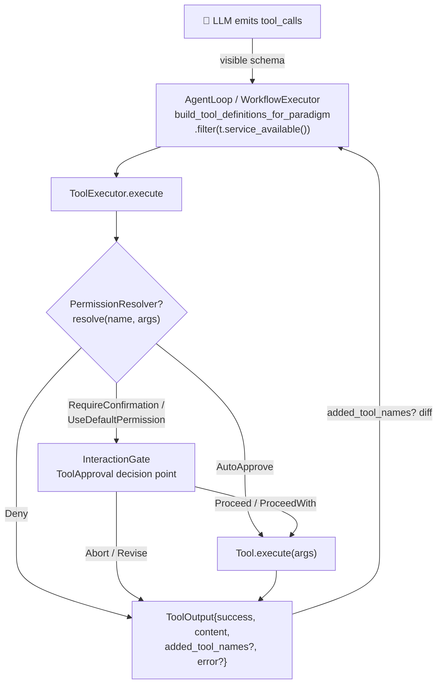

# OneAI Tool System Mechanism

> `Tool` trait + Registry + executor + 16 built-in tools + MCP client + Footprint ladder + 3-tier permission gate: what the model can call, at what schema footprint it is exposed, and who approves it — three decisions closed within one crate.

## 1. Overview (what it is)

Tools are the agent's hands on the world. The `oneai-tool` layer takes "invoke a tool" from a single function call by the model and lands it as a complete chain — registration, permission tiering, safe execution, result feedback — and atop that chain answers a question often overlooked: at what schema footprint should a new capability be exposed to the model. Its answer is the Footprint ladder — whatever can be carried by a smaller footprint is never inflated into a resident schema.

In the dependency layering it sits in the feature layer: downstream it depends on `oneai-core` (`Tool`/`ToolOutput`/`PermissionLevel`/`RiskLevel` traits) and `oneai-domain` (`PermissionResolver`); upstream it is consumed by both `oneai-agent`'s `AgentLoop` and `oneai-workflow`'s executor. Both consumption paths go through the same `ToolExecutor`, so permission semantics do not drift by entry point.

## 2. Responsibilities & capabilities (what it does)

`oneai-tool`'s capabilities fall into four groups:

**Registration & lookup.** `ToolRegistry` is an `Arc<RwLock<HashMap>>` keyed by `tool.name()`. Besides plain `register`, it offers two more meaningful variants: `override_tool` explicitly emits an audit log when overwriting a same-named tool, so a DomainPack author cannot silently clobber a built-in (Phase 4.2's Gondolin mode uses it to swap `read_file`/`shell` for VM-backed impls); `register_gated` wraps the tool in a `GatedTool`, delegating "is it visible to the model" to an external `check_fn`.

**Execution.** `ToolExecutor` is the single entry point for tool execution. It embeds permission resolution, the InteractionGate approval, and timeout, so any caller (AgentLoop, WorkflowExecutor, direct RPC) gets consistent execution semantics.

**16 built-in tools.** Organized by permission tier: `Read` tier — FileRead / FileList / Grep / Glob / Environment / WebFetch / WebSearch; `Standard` tier — FileEdit / FileWrite / NotebookEdit / ApplyPatch / Calculator / Browser; `Full` tier — Shell / FileDelete / Schedule. ApplyPatch supports multi-file unified-diff editing in one shot; Schedule exposes cron scheduling as a tool to the model.

**External integration.** The MCP client (based on `rmcp`) supports stdio / SSE / streamable-http transports, adapting remote MCP server tools into this crate's `Tool`; the `FileOperations` trait abstracts Local/Remote file ops, where Remote operates inside a container via `TerminalBackend` using `cat`/`base64`/`printf`/`find -printf`, with `shell_quote` for injection safety.

**Explicitly does not**, and this boundary matters too: it does not parse LLM text output (that's `oneai-parser`); no USD cost tracking (usage is token-only, tools only return `ToolOutput`); no session state held (each `execute` is independent and stateless); it does not read DomainPack config directly either — it consumes domain policy indirectly via the injected `PermissionResolver`, keeping the dependency direction clean.

## 3. Design motivation (why this way)

This layer's design is shaped by several interrelated decisions, each with a rejected alternative.

**Place the `Tool` trait in `oneai-core` but implement in `oneai-tool`.** The trait is a cross-crate contract — agent, workflow, MCP, wasm all impl `Tool`, so the definition must sink to core with no downstream deps; otherwise a dependency inversion arises. The rejected alternative — putting the trait in this crate — would force workflow/agent to reverse-depend on the tool crate, breaking layering.

**An extension trait `PermissionAwareTool: Tool` rather than modifying `Tool`.** Three-tier permissions (Read/Standard/Full) were added later, and v0.2.0 had already committed to API stability. An extension trait + `permission_level()` defaulting back to `from_risk_level()` lets old tools upgrade with zero changes, and `RiskLevel` stays intact. Adding `permission_level()` directly to `Tool` would break the stability commitment.

**Footprint ladder: smallest-footprint rung first.** Every extra tool schema the model sees enlarges the decision space and token cost, and invites trying calls that are bound to fail. The Footprint ladder makes "which rung does a new capability live at" an explicit 5-rung decision rule — `extend` (compose existing tools, no new schema) → `skill` (a markdown prompt, zero tool schema) → `service-gated` (vanishes from schema when the service is missing, zero footprint) → `plugin/MCP` (external process, conditionally connected) → `core tool` (resident schema). Example: to add "view git log" to a coding agent, the first choice is `extend` (use existing shell to run `git log`), then `skill` (a prompt teaching the model to use shell for git), and only when neither works do you consider a core tool. The rejected alternative — making everything a core tool — costs schema bloat and the model repeatedly trying broken options.

**`service_available()` returning false makes the tool vanish from the schema, not "disabled".** A "disabled" tool still occupies a schema slot and the model still tries a call bound to fail; vanishing means the model never sees it, footprint zero. `GatedTool` makes this a registration-level seam: all `Tool` methods delegate to the inner tool, only `service_available` is overridden to consult `check_fn`. This lets a DomainPack or app gate **any** tool — including one whose impl lives elsewhere — without that tool itself implementing `service_available`. The rejected alternative — requiring each tool to impl `service_available` — leaves cross-crate gating logic nowhere to live.

**`TerminalBackend` trait + multiple backends.** Phase 3.3 extracted command execution from inline `tokio::process::Command` into a trait: Local / Docker / Modal / Daytona switchable, where the VM itself is the security boundary. ShellTool only does command-string safety pre-flight (blacklist, shell-write detection), delegating actual execution to the backend. `supports_snapshots` defaults to false — LocalBackend needs no snapshot (the local FS is the state), while Docker/Modal/Daytona use `docker commit` / remote images for real snapshots, pairing with `restore` and `cleanup(hibernate=true|false)` for a restorable lifecycle. The rejected alternative — rewriting ShellTool per backend — duplicates safety logic and drifts.

**Injecting an optional `PermissionResolver` into `ToolExecutor`.** This is the gap-analysis P1 fix: the workflow path through ToolExecutor once bypassed DomainPack `deny_by_default` because tools only looked at their own `risk_level`. With the resolver injected, both execution paths (agent-loop and workflow) share one domain-policy resolution, so security semantics no longer split. The rejected alternative — each path resolving permissions independently — results in domain policy being bypassed.

**`ToolOutput.added_tool_names` + `#[serde(default)]`.** Phase 3.4's self-extension: a tool's execution result can carry "which tools were newly registered by this execution"; the AgentLoop diffs the active set before and after a batch, triggering `on_tools_added` and a one-shot pinned-note injection. This lets tools dynamically extend the tool surface — e.g. after installing an MCP server, its tools appear in the next turn's schema. The rejected alternative — pre-registering all tools or restarting — means the model cannot see new tools mid-session.

## 4. Architecture & core abstractions

The diagram traces a single tool call from model decision to result feedback, with permission resolution and the approval gate as the two branches:



The `Tool` trait itself is defined in `oneai-core`; this crate is its consumer and most implementations:

```rust
#[async_trait]
pub trait Tool: Send + Sync {
    fn name(&self) -> &str;
    fn description(&self) -> &str;
    fn parameters_schema(&self) -> serde_json::Value;
    fn risk_level(&self) -> RiskLevel;
    fn service_available(&self) -> bool { true }      // Footprint gate, default visible
    async fn execute(&self, args: serde_json::Value) -> Result<ToolOutput>;
}

// This crate's extension: 3-tier permission, defaulting from risk_level
pub trait PermissionAwareTool: Tool {
    fn permission_level(&self) -> PermissionLevel { PermissionLevel::from_risk_level(self.risk_level()) }
}
```

The Footprint gate's registration-level seam is `GatedTool`, decoupling "visibility" from the tool impl:

```rust
pub type ServiceCheck = Arc<dyn Fn() -> bool + Send + Sync>;
pub struct GatedTool { inner: Arc<dyn Tool>, check: ServiceCheck }   // all methods delegate, only service_available overridden
```

## 5. Flows it participates in

The tool system runs through this chain each AgentLoop iteration:

**Schema assembly.** Before each iteration, `AgentLoop::build_tool_definitions_for_paradigm` takes all `ToolRegistry` tools, first `.filter(|t| t.service_available())` to drop those whose service is missing (call sites at `agent_loop.rs:1460,3031,5122,5163,5227`), then filters by the active paradigm, and sends the schema to the model. Filtered tools log `tracing` "prerequisite missing", helping debug "why can't the model see this tool".

**Model decision.** The model returns `ToolCalls`, parsed by `oneai-parser`'s three-layer defense (constrained decode → fuzzy repair → self-correct re-prompt) into structured calls.

**Execution.** `ToolExecutor::execute(tool_name, args)` first `registry.get` to find the tool, then `PermissionResolver` (if injected). The resolver returns one of four actions: `Deny` returns a failure result directly (empty content, error with reason); `AutoApprove` skips the gate and executes, ignoring the tool's own risk; `RequireConfirmation` forces Full-risk approval; `UseDefaultPermission` uses the resolved level. With no resolver it falls back to the tool's own `risk_level` — the pre-P1 behavior.

**Approval gate.** If approval is needed and `InteractionGate.enabled(ToolApproval)` is true, an `ApprovalRequest` is sent; `PlatformInteractionGate` pops a native NSAlert / AlertDialog / UIController. Five responses: `Proceed` executes; `ProceedWith(ReplaceToolArgs)` executes with rewritten args (other modifications don't apply here, original args); `Abort` returns a rejection result; `Revise` surfaces the feedback as a rejection reason (the direct execute path cannot loop on feedback); unknown variants (the `#[non_exhaustive]` extension slot) default to proceeding.

**Execute + timeout.** `execute_with_timeout` wraps `tool.execute(args)` with `tokio::time::timeout`, canceling on timeout. The returned `ToolOutput` carries `success`/`content`/`error`, plus optional `added_tool_names`.

**Self-extension diff.** After the batch, the AgentLoop diffs the pre-execution active-set snapshot against each tool's `added_tool_names` union; non-empty triggers `on_tools_added` and a one-shot `inject_pinned_blocks` note telling the model "new tools available".

**Feedback.** `ToolOutput` is injected as a tool result into the next turn's context; the loop continues. The Workflow path goes through the same `ToolExecutor` (with the resolver injected, permission semantics match agent-loop), not a second permission path.

## 6. Dependencies

| Direction | Who | What |
|---|---|---|
| Upstream | `oneai-core` | `Tool`/`PermissionAwareTool`(consumer)/`ToolOutput`/`PermissionLevel`/`RiskLevel`/`OneAIError` |
| Upstream | `oneai-domain` | `PermissionResolver` trait (in core to invert the dep direction, impl in domain) |
| Upstream | `rmcp` | MCP client protocol impl; `regex`/`tokio` for blacklist and async timeout |
| Downstream | `oneai-agent` | `AgentLoop` assembles schema + executes (`build_tool_definitions_for_paradigm`) |
| Downstream | `oneai-workflow` | `ToolCall` nodes execute via `ToolExecutor` |
| Downstream | `oneai-app` | `AppBuilder` registers the default tool set + `terminal_backend()` + MCP plugins |
| Cross-cutting | DomainPack layer 1 | tools + decorators; `ContainerizedCodingPack` uses `override_tool` to swap same-named tools for VM-backed impls |
| Cross-cutting | DomainPack layer 3 | `PermissionProfile` (`deny_by_default`/`auto_approve`/`require_confirmation`) injected via `PermissionResolver` |

## 7. Key types & files

| Item | Location |
|---|---|
| `Tool`/`PermissionAwareTool` trait | `crates/oneai-core/src/traits.rs:91` (trait in core) |
| `ToolOutput` (incl. `added_tool_names`) | `crates/oneai-core/src/types.rs:697` |
| `ToolRegistry` / `GatedTool` / `ServiceCheck` | `crates/oneai-tool/src/registry.rs:38,46,33` |
| `ToolExecutor` (permission resolution + gate + timeout) | `crates/oneai-tool/src/executor.rs:75` (`execute` at `:154`) |
| `PermissionResolver` 4-branch resolution | `crates/oneai-tool/src/executor.rs:164` |
| Approval 5-response dispatch | `crates/oneai-tool/src/executor.rs:230` (Proceed/ProceedWith/Abort/Revise/unknown) |
| 16 built-in tools | `crates/oneai-tool/src/tool_interfaces.rs` (Shell `:54`/FileRead `:601`/FileEdit `:838`/FileList `:1067`/Grep `:1184`/Glob `:1408`/Env `:1561`/Notebook `:1656`/FileDelete `:2023`/WebFetch `:2121`/WebSearch `:2337`/Browser `:2875`) + `local_tools.rs` (Calculator/FileWrite) + `apply_patch.rs` + `schedule_tool.rs` |
| Multi-file unified diff | `crates/oneai-tool/src/apply_patch.rs` (`parse_unified_diff:77`/`DiffHunk:39`/`DiffLine:26`/`ApplyPatchTool:484`) |
| `FileOperations` trait + Local/Remote | `crates/oneai-tool/src/file_ops.rs:109,186,317` |
| `ShellTool` safety pre-flight (blacklist + write detection) | `crates/oneai-tool/src/tool_interfaces.rs:54` |
| `SandboxBackend` (Seatbelt/Docker/Regex) | `crates/oneai-tool/src/sandbox.rs:67,97,288,393` |
| `TerminalBackend` trait + Local/Docker/Modal/Daytona | `crates/oneai-tool/src/terminal.rs:131,211` + `terminal/docker.rs` + feature-gated `modal`/`daytona` |
| MCP client (3 transports + Content-Length framing) | `crates/oneai-tool/src/mcp_real.rs` (`McpTransport:130`/`McpFramingParser:26`) |
| Footprint gate filter call sites | `crates/oneai-agent/src/agent_loop.rs:1460,3031,5122,5163,5227` |

## 8. Industry comparison

| System | Tool model | OneAI's trade-off |
|---|---|---|
| **Claude Code** | Tools + skills (progressive disclosure) + Bash sandbox blacklist | OneAI's Footprint ladder generalizes it: an explicit 5-rung decision rule for "which rung does a tool live at"; `service_available()` makes a missing service **vanish** rather than disabled — Claude Code's disabled tools can still be tried by the model |
| **OpenAI Function Calling** | Function schemas all resident, no footprint concept | OneAI uses the ladder to curb schema bloat; `extend`/`skill` rungs make "add capability without adding schema" the first option |
| **LangChain Tools** | `BaseTool` single trait, no permission tiers, no vanish mechanism | OneAI adds 3-tier permissions + Footprint gate + DomainPack cross-cutting permission resolution; LangChain tools are always in the schema |
| **AutoGen** | Tools + function registration, permissions via user proxy | OneAI bakes permissions into `InteractionGate`'s 5 decision points, native UI approval, no external proxy dependency |
| **MCP (Anthropic spec)** | External process exposes tools | OneAI is both an MCP **client** (`mcp_real.rs` adapts to `Tool`) and an MCP **server** (see [mcp-mechanism](mcp-mechanism_EN.md)), bidirectional |

OneAI's distinct points: the Footprint ladder is a first-class design rule (not an afterthought), and tools can self-extend the tool surface (`added_tool_names` → `on_tools_added`) — the latter most frameworks lack.

## 9. Extension points & config

- **Add a tool**: impl `Tool` (recommend also impl `PermissionAwareTool` to set `permission_level`), register via `AppBuilder` or DomainPack.
- **Conditionally hide a tool**: `ToolRegistry::register_gated(tool, check_fn)` or override `Tool::service_available` — vanishes from schema when the service is missing.
- **Replace a same-named tool**: `override_tool` (Phase 4.2 Gondolin mode, `ContainerizedCodingPack` swaps `read_file`/`shell` for VM-backed impls; the VM is the security boundary, no permission cut).
- **Switch execution backend**: `AppBuilder::terminal_backend(...)` (Local / Docker / Modal / Daytona); `cleanup(hibernate=true)` is the sole teardown chokepoint (stop+keep restorable vs destroy).
- **Domain permission policy**: DomainPack layer 3 `PermissionProfile` → `PermissionResolver` injected into `ToolExecutor`.
- **Sandbox env**: CodingPack defaults to seatbelt `allow-default` + targeted write ban (see Issue #16 — `(deny default)` disables process-fork, making `||`/`&&`/pipes all exit 128, hence allow-default).
- **CLI**: no standalone `tool` subcommand (tools are driven indirectly via the provider/agent paths); MCP tools via `oneai mcp *`.

## 10. Further reading

- [CLAUDE.md — Tools / Footprint ladder](../CLAUDE.md)
- [permission-mechanism](permission-mechanism_EN.md) — 3-tier permissions + InteractionGate 5 decision points
- [domain-pack-mechanism](domain-pack-mechanism_EN.md) — layer 1 tools+decorators, layer 3 PermissionProfile
- [skill-mechanism](skill-mechanism_EN.md) — the Footprint ladder `skill` rung (zero-schema prompt)
- [multi-agent-mechanism](multi-agent-mechanism_EN.md) — how the AgentLoop assembles/executes tools
- Source: `crates/oneai-tool/src/` (16 files / ~10K LOC)
