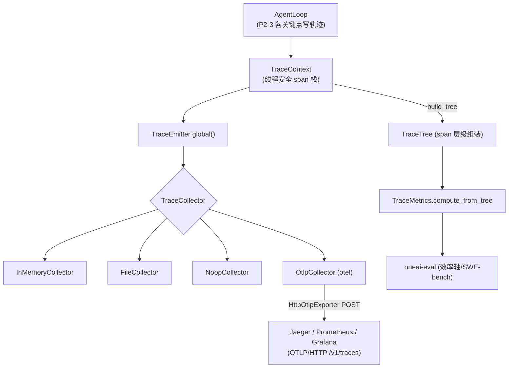

# OneAI 轨迹日志（Trace）机制

> OpenInference 兼容 span 树 + OTEL OTLP 导出：把每轮推理/工具调用/委托/范式切换记录成结构化 span 树，组装成轨迹、计算指标、对接外部链路；feature `trace` 关闭时全部编译为零开销 stub，feature `otel` 开启时经 OTLP/HTTP 真导出到 Jaeger/Prometheus/Grafana。

## 1. 概述（是什么）

`oneai-trace` 是 OneAI 的可观测层。它把 Agent 执行的每一步——模型推理（Thought）、工具调用决策（Action）、工具结果回填（Observation）、子 Agent 委托、范式切换——捕获成结构化 `Span`，按父子关系组装成树，落成 OpenInference 兼容轨迹。这条轨迹既是运行时调试与可视化的依据，也是评测的数据来源（效率轴、SWE-bench 走查都消费它），还能经 OTEL OTLP 协议导出到外部后端。

这一层位于特性层、依赖 `oneai-core`，被 `oneai-agent` 的 `AgentLoop`（P2-3 在主循环各关键点写轨迹）与 `oneai-eval`（轨迹→指标→评测）消费。它的设计姿态是"可关可开"：默认 `trace` feature 开，关掉则所有类型退化为 `noop.rs` 的零开销 stub，完全编译掉；`otel` feature 是 opt-in，开启才有 OTLP 导出。

## 2. 职责与能力（做什么）

**span 树捕获。** `Span`（起止时间 + attributes + events + children）+ `SpanKind`/`SpanStatus`，`TraceContext` 持线程安全 span 栈 + collector 路由，`enter_span`/`exit_span` 管理父子层级，`current_span_id` 取栈顶。

**事件类型。** `TraceEvent` + `EventKind`：`Thought`（模型推理）、`Action`（工具调用决策）、`Observation`（结果回填）、`ToolCall`/`ToolResult`/`ToolError`（工具执行明细）、`Error` 等——直接对应 ReAct 的 Thought/Action/Observation 三步，便于轨迹质量分析。

**collector 策略。** `TraceCollector` trait + `InMemoryCollector`（测试/调试）、`FileCollector`（落盘）、`NoopCollector`（关）；`TraceEmitter` 全局 singleton 负责初始化与 context 创建。

**轨迹组装 + 指标。** `TraceTree` 组装 span 层级 + 元数据；`TraceMetrics::compute_from_tree` 从树算成功率/token/工具调用次数等指标，`merge` 聚合多次运行的指标。

**OTEL 导出。** feature `otel` 开启：`OtlpCollector`（`TraceCollector` 实现，把 OneAI span 转 OTEL span，经 `HttpOtlpExporter` 真的 OTLP/JSON POST 到 `/v1/traces`）+ `OtlpExporter` trait（`InMemoryOtlpExporter` 测试替身）+ `OtlpConfig`；`OtelMetricsProvider`（`record_tool_call` + `MetricsSnapshot`，对接 Prometheus）。

**显式不做什么**：不实现 LLM 推理（只观测）；不做 USD 成本统计（指标按 token/成功率维度）；不持久化会话内容（轨迹是执行元数据，对话内容归 persistence）；不做实时流式可视化（归 Studio 的 WS 事件推送）。

## 3. 设计动机（为什么这样实现）

| 决策 | 理由 | 否决的替代方案 |
|---|---|---|
| OpenInference 兼容而非自定义 schema | OpenInference 是 agent 轨迹的事实标准（Thought/Action/Observation 三步），兼容即可对接 LangSmith、Arize 等工具链，且评测框架能消费标准轨迹 | 自定义 schema → 对接外部工具需适配层、不可移植 |
| span 树 + 父子栈而非扁平日志 | Agent 执行天然分层（一轮迭代含推理+多工具+子委托），树结构能表达"这次工具调用属于哪一轮推理的哪次委托"，扁平日志丢失层级 | 扁平日志 → 层级丢失、指标算不准 |
| `EventKind` 对应 ReAct 三步 | Thought/Action/Observation 是 ReAct 范式的自然切片，按这三类标事件让"轨迹质量"可分析（如某轮只有 Thought 没 Action 可能卡住）| 自由事件名 → 无法归类分析 |
| `trace` feature 关闭零开销 stub | 不是所有部署都需要轨迹（SDK/嵌入式），关 feature 后所有类型退化为 `noop.rs` 空实现，编译掉、零运行时开销 | 始终编译轨迹 → 不需要的场景背上开销 |
| `otel` feature opt-in | OTEL 导出依赖重（opentelemetry crate），且只有接外部后端的部署才需要；opt-in 让默认场景不编译 | 默认引入 OTEL → 编译重、依赖膨胀 |
| `OtlpCollector` 真导出而非 stub | gap-analysis #4 修复：旧 `OtlpCollector` 是 no-op，OTLP 端点从没收到东西；改 `HttpOtlpExporter` 真的 POST `resourceSpans`，且 exporter 注入式让导出路径无活 collector 也能单测 | 留 no-op stub → "已对接 OTEL"假象，实际无数据 |
| `OtlpExporter` 注入式 trait | 让导出路径可单测（`InMemoryOtlpExporter` 替身）而不需起活 Jaeger | 直接绑 HTTP → 测试需起外部服务 |
| `TraceMetrics::compute_from_tree` 从树算 | 指标是轨迹的派生，从 span 树计算保证一致（成功率 = 成功 leaf / 总 leaf）；`merge` 支持跨运行聚合 | 各处手算指标 → 口径不一 |
| `TraceEmitter` 全局 singleton | 轨迹是横切关切，全局 entry 让任意 crate 写 span 而不传 context 穿参 | context 穿参 → API 污染、调用链臃肿 |

## 4. 架构与核心抽象



**核心类型：**

```rust
pub trait TraceCollector: Send + Sync { /* span 落点 */ }
pub struct Span { /* start/end + attributes + events + children */ }
#[non_exhaustive]
pub enum SpanKind { /* 推理/工具/委托/范式… */ }
#[non_exhaustive]
pub enum EventKind { Thought, Action, Observation, ToolCall, ToolResult, ToolError, Error, ... }

pub struct TraceContext { /* 线程安全 span 栈 + collector 路由 */
    pub fn enter_span(&self, kind: SpanKind, name: &str, parent_id: Option<&str>) -> String;
    pub fn exit_span(&self, span_id: &str, status: SpanStatus);
}
pub struct TraceMetrics { pub fn compute_from_tree(root: &Span) -> Self; pub fn merge(&[Self]) -> Self; }

// otel feature
pub struct OtlpCollector { /* 转 OTEL span + HttpOtlpExporter 真 POST */ }
pub trait OtlpExporter { /* HttpOtlpExporter / InMemoryOtlpExporter */ }
```

## 5. 参与的流程

**每轮迭代的轨迹写入（AgentLoop P2-3）：**

1. 迭代开始 `enter_span(SpanKind::Inference, "llm_infer", parent)` 进推理 span。
2. 收到模型输出后 `log_event(Thought, ...)` 记推理；若 `ToolCalls` 则 `log_event(Action, tool_name, args)`。
3. 工具执行 `enter_span(SpanKind::ToolExecution, tool_name, inference_parent)` → 执行 → `log_event(Observation, success, content)` 或 `ToolError` → `exit_span`。
4. 子 Agent 委托 `enter_span(SpanKind::Delegate, kind, ...)` 跨子 span；范式切换 `enter_span(SpanKind::ParadigmSwitch, ...)`。
5. 迭代结束 `exit_span(inference_span_id, status)`。

**轨迹消费：**

- **指标**：`ctx.build_tree()` 组装 span 树 → `TraceMetrics::compute_from_tree` 算成功率/token/工具次数；`merge` 聚合多次运行（评测效率轴消费）。
- **OTEL 导出**：`OtlpCollector` 把 span 转 OTEL span，`HttpOtlpExporter` POST OTLP/JSON `resourceSpans` 到 `/v1/traces`；`OtelMetricsProvider` 记 `record_tool_call` + `MetricsSnapshot` 对接 Prometheus。
- **评测**：`oneai-eval`（SWE-bench 三轴的效率轴、轨迹质量）从 `TraceTree` 消费（见 [eval-mechanism](eval-mechanism.md)）。
- **Studio 可视化**：Studio Web UI 经 WS 事件推送实时展示执行轨迹。

## 6. 依赖关系

| 方向 | 谁 | 内容 |
|---|---|---|
| 上游 | `oneai-core` | 共享类型 + `UsageTracker`（用量与轨迹的 token 维度一致）|
| 上游 | `serde`/`serde_json` | span/event 序列化为 OpenInference JSON |
| 上游 | `reqwest`（otel feature）| OTLP/HTTP POST |
| 上游 | `opentelemetry`（otel feature）| OTEL span 协议 |
| 下游 | `oneai-agent` | `AgentLoop` 在主循环各点写轨迹（P2-3）|
| 下游 | `oneai-eval` | 轨迹→指标→评测（效率轴/SWE-bench）|
| 下游 | `oneai-studio` | 实时轨迹可视化（WS 事件推送）|
| 横切接入 | feature flags | `trace`（默认开，关则零开销 stub）、`otel`（opt-in，OTLP 导出）|
| 横切接入 | CLI | `trace` 经 `--trace-*` 或 AppBuilder 配置 |

## 7. 关键类型与文件

| 项 | 位置 |
|---|---|
| `TraceEmitter`（global singleton + initialize + create_context）| `crates/oneai-trace/src/emitter.rs:34` |
| `TraceContext`（span 栈 + enter/exit_span）| `crates/oneai-trace/src/context.rs:58`（`enter_span:135`/`exit_span:169`）|
| `TraceCollector` trait + `InMemory`/`File`/`Noop` | `crates/oneai-trace/src/collector.rs:23,43,109,158` |
| `Span` + `SpanKind` + `SpanStatus` | `crates/oneai-trace/src/span.rs:73,26,51` |
| `TraceEvent` + `EventKind`（Thought/Action/Observation…）| `crates/oneai-trace/src/event.rs:101,26` |
| `TraceTree`（span 层级组装）| `crates/oneai-trace/src/tree.rs` |
| `TraceMetrics`（compute_from_tree + merge）| `crates/oneai-trace/src/metrics.rs:24,87,189` |
| `OtlpCollector` + `OtlpExporter`/`HttpOtlpExporter`/`InMemoryOtlpExporter`/`OtlpConfig` | `crates/oneai-trace/src/otel_exporter.rs` |
| `OtelMetricsProvider` + `MetricsSnapshot` | `crates/oneai-trace/src/otel_metrics.rs:119,40` |
| `noop.rs`（feature off 零开销 stub）| `crates/oneai-trace/src/noop.rs` |
| AgentLoop 写轨迹接入点 | `crates/oneai-agent/src/agent_loop.rs`（P2-3 各关键点）|

## 8. 与业界对比

| 系统 | 模型 | OneAI 取舍 |
|---|---|---|
| **OpenInference** | agent 轨迹标准（span 树 + Thought/Action/Observation）| OneAI 直接兼容该标准，轨迹 schema 可对接 LangSmith/Arize 等工具链 |
| **LangSmith** | SaaS 轨迹 + 评测平台 | OneAI 自托管等价：span 树 + 指标 + 评测（`oneai-eval`）全在 crate 内，不依赖外部 SaaS；OTEL 导出可对接 LangSmith 兼容后端 |
| **OpenTelemetry** | 通用可观测标准（trace/metrics/logs）| OneAI `otel` feature 把轨迹转 OTEL span 经 OTLP 真导出（gap #4 修复从 stub 变真导出），对接 Jaeger/Prometheus/Grafana |
| **LangGraph studio** | 执行轨迹可视化 | OneAI Studio Web UI 经 WS 实时展示 span 树，同源思路 |
| **Weave / MLflow tracing** | LLM 实验追踪 | OneAI 轨迹面向 agent 执行而非实验管理，且 `trace` feature 关闭零开销——实验追踪通常不可关 |

OneAI 独特点：**OpenInference 兼容 + 零开销可关**（关 feature 全编译掉）+ **OTEL 真导出**（非 stub，gap #4 修复）+ **轨迹与评测同源**（`TraceMetrics` 直接喂 `oneai-eval` 效率轴）。

## 9. 扩展点与配置

- **接轨迹**：`AppBuilder::trace_in_memory()` 或 `trace_to_file(path)`；关 feature 则零开销。
- **接 OTEL**：feature `otel` 开启，`OtlpCollector::new(OtlpConfig{endpoint,..})`，配置指向 Jaeger/OTLP collector。
- **自定义 collector**：impl `TraceCollector` trait。
- **消费指标**：`ctx.build_tree()` → `TraceMetrics::compute_from_tree`；`merge` 聚合。
- **评测接入**：`oneai-eval` 效率轴/SWE-bench 自动消费 `TraceTree`。
- **feature flags**：`trace`（默认开）、`otel`（opt-in）。

## 10. 深入阅读

- [eval-mechanism.md](eval-mechanism.md) —— 轨迹→指标→评测效率轴/SWE-bench
- [multi-agent-mechanism.md](multi-agent-mechanism.md) —— AgentLoop 写轨迹的接入点
- [studio-mechanism.md](studio-mechanism.md) —— 实时轨迹可视化（WS 事件推送）
- [persistence-mechanism.md](persistence-mechanism.md) —— 用量记录与轨迹的 token 维度一致
- [CLAUDE.md — Trace 章节](../CLAUDE.md)
- 源码：`crates/oneai-trace/src/`（11 文件 / ~3.6K LOC）
