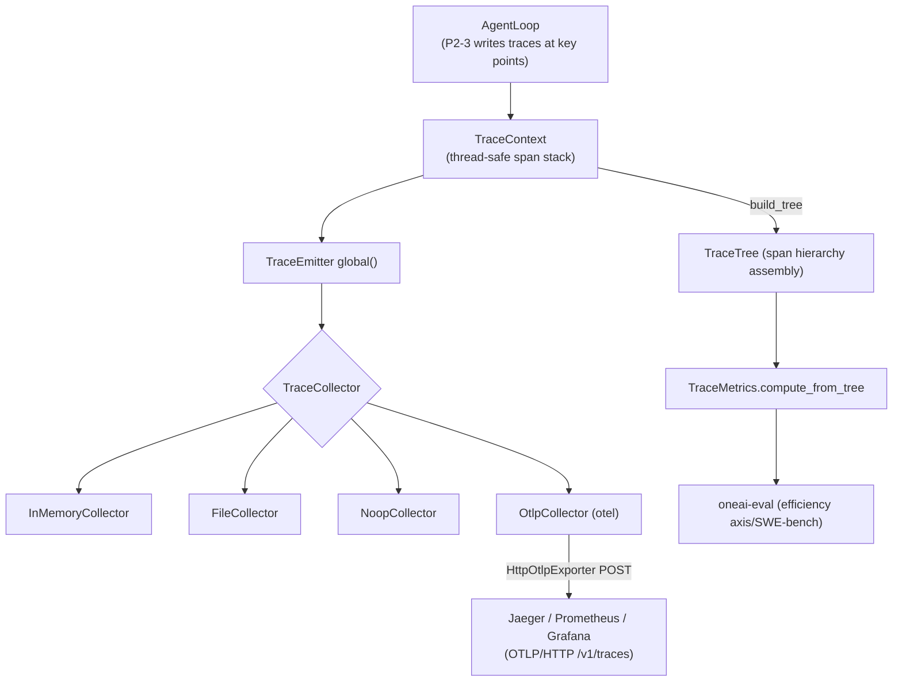

# OneAI Trace Mechanism

> OpenInference-compatible span tree + OTEL OTLP export: captures each inference/tool-call/delegation/paradigm-switch as a structured span tree, assembles a trace, computes metrics, exports to external backends; with the `trace` feature off, everything compiles to a zero-cost stub; with `otel` on, exports via OTLP/HTTP to Jaeger/Prometheus/Grafana.

## 1. Overview (what it is)

`oneai-trace` is OneAI's observability layer. It captures each step of agent execution — model inference (Thought), tool-call decision (Action), tool-result feedback (Observation), sub-agent delegation, paradigm switch — as a structured `Span`, assembles them into a tree by parent-child, and lands an OpenInference-compatible trace. This trace feeds runtime debugging/visualization, evaluation (the efficiency axis and SWE-bench walkthrough consume it), and OTEL OTLP export to external backends.

This layer sits in the feature layer, depending on `oneai-core`, consumed by `oneai-agent`'s `AgentLoop` (P2-3 writes traces at main-loop key points) and `oneai-eval` (trace→metrics→eval). Its posture is "off or on": `trace` defaults on; off, all types degrade to `noop.rs` zero-cost stubs, fully compiled away; `otel` is opt-in, only on does OTLP export.

## 2. Responsibilities & capabilities (what it does)

**Span-tree capture.** `Span` (start/end + attributes + events + children) + `SpanKind`/`SpanStatus`; `TraceContext` holds a thread-safe span stack + collector routing; `enter_span`/`exit_span` manage parent-child hierarchy; `current_span_id` reads the stack top.

**Event types.** `TraceEvent` + `EventKind`: `Thought` (inference), `Action` (tool-call decision), `Observation` (result feedback), `ToolCall`/`ToolResult`/`ToolError` (tool-execution detail), `Error`, etc. — directly mapping ReAct's Thought/Action/Observation, easing trajectory-quality analysis.

**Collector strategy.** `TraceCollector` trait + `InMemoryCollector` (tests/debug), `FileCollector` (to disk), `NoopCollector` (off); `TraceEmitter` a global singleton for initialization and context creation.

**Trace assembly + metrics.** `TraceTree` assembles the span hierarchy + metadata; `TraceMetrics::compute_from_tree` derives success rate/token/tool-call-count metrics from the tree; `merge` aggregates across runs.

**OTEL export.** feature `otel` on: `OtlpCollector` (a `TraceCollector` impl that converts OneAI spans to OTEL spans and really exports via `HttpOtlpExporter` OTLP/JSON POST to `/v1/traces`) + `OtlpExporter` trait (`InMemoryOtlpExporter` test double) + `OtlpConfig`; `OtelMetricsProvider` (`record_tool_call` + `MetricsSnapshot`, for Prometheus).

**Explicitly does not**: no LLM inference (observes only); no USD cost tracking (metrics are token/success-rate); no conversation-content persistence (trace is execution metadata, conversation content is persistence's job); no real-time streaming visualization (that's Studio's WS event push).

## 3. Design motivation (why this way)

| Decision | Rationale | Rejected alternative |
|---|---|---|
| OpenInference-compatible, not a custom schema | OpenInference is the de-facto standard for agent traces (Thought/Action/Observation); compatibility plugs into LangSmith, Arize, etc., and the eval framework can consume a standard trace | Custom schema → adapter layer needed for external tools, non-portable |
| Span tree + parent stack, not flat log | Agent execution is naturally hierarchical (an iteration contains inference + multiple tools + sub-delegations); a tree expresses "this tool call belongs to which inference of which delegation"; a flat log loses hierarchy | Flat log → hierarchy lost, metrics wrong |
| `EventKind` maps ReAct's three steps | Thought/Action/Observation are natural slices of the ReAct paradigm; tagging events by these lets "trajectory quality" be analyzed (e.g. a turn with Thought but no Action may be stuck) | Free event names → can't categorize/analyze |
| `trace` feature off → zero-cost stub | Not every deployment needs tracing (SDK/embedded); off, all types degrade to `noop.rs` empty impls, compiled away, zero runtime cost | Always compile tracing → unnecessary scenarios pay |
| `otel` feature opt-in | OTEL export is heavy (the opentelemetry crate), and only deployments with an external backend need it; opt-in keeps the default from compiling it | Default OTEL → heavy compile, dep bloat |
| `OtlpCollector` really exports, not a stub | The gap-analysis #4 fix: the old `OtlpCollector` was a no-op, the OTLP endpoint never received anything; switched to `HttpOtlpExporter` really POSTing `resourceSpans`, with an injectable exporter so the export path is unit-testable without a live collector | Leave a no-op stub → the illusion of "OTEL integrated" with no data |
| `OtlpExporter` injectable trait | Makes the export path unit-testable (`InMemoryOtlpExporter` double) without a live Jaeger | Bind HTTP directly → tests need an external service |
| `TraceMetrics::compute_from_tree` from the tree | Metrics are derived from the trace; computing from the span tree keeps consistency (success rate = successful leaves / total leaves); `merge` supports cross-run aggregation | Hand-compute metrics per place → inconsistent |
| `TraceEmitter` global singleton | Tracing is a cross-cutting concern; a global entry lets any crate write spans without threading a context | Thread context → API pollution, call-chain bloat |

## 4. Architecture & core abstractions



**Core types:**

```rust
pub trait TraceCollector: Send + Sync { /* span sink */ }
pub struct Span { /* start/end + attributes + events + children */ }
#[non_exhaustive]
pub enum SpanKind { /* inference/tool/delegation/paradigm… */ }
#[non_exhaustive]
pub enum EventKind { Thought, Action, Observation, ToolCall, ToolResult, ToolError, Error, ... }

pub struct TraceContext { /* thread-safe span stack + collector routing */
    pub fn enter_span(&self, kind: SpanKind, name: &str, parent_id: Option<&str>) -> String;
    pub fn exit_span(&self, span_id: &str, status: SpanStatus);
}
pub struct TraceMetrics { pub fn compute_from_tree(root: &Span) -> Self; pub fn merge(&[Self]) -> Self; }

// otel feature
pub struct OtlpCollector { /* convert to OTEL span + HttpOtlpExporter real POST */ }
pub trait OtlpExporter { /* HttpOtlpExporter / InMemoryOtlpExporter */ }
```

## 5. Flows it participates in

**Per-iteration trace writing (AgentLoop P2-3):**

1. Iteration start `enter_span(SpanKind::Inference, "llm_infer", parent)` enters the inference span.
2. After receiving model output `log_event(Thought, ...)` records the inference; if `ToolCalls` then `log_event(Action, tool_name, args)`.
3. Tool execution `enter_span(SpanKind::ToolExecution, tool_name, inference_parent)` → execute → `log_event(Observation, success, content)` or `ToolError` → `exit_span`.
4. Sub-agent delegation `enter_span(SpanKind::Delegate, kind, ...)` spans a sub-span; paradigm switch `enter_span(SpanKind::ParadigmSwitch, ...)`.
5. Iteration end `exit_span(inference_span_id, status)`.

**Trace consumption:**

- **Metrics**: `ctx.build_tree()` assembles the span tree → `TraceMetrics::compute_from_tree` computes success rate/token/tool-count; `merge` aggregates across runs (the eval efficiency axis consumes).
- **OTEL export**: `OtlpCollector` converts spans to OTEL spans, `HttpOtlpExporter` POSTs OTLP/JSON `resourceSpans` to `/v1/traces`; `OtelMetricsProvider` records `record_tool_call` + `MetricsSnapshot` for Prometheus.
- **Eval**: `oneai-eval` (SWE-bench three-axis efficiency axis, trajectory quality) consumes `TraceTree` (see [eval-mechanism](eval-mechanism_EN.md)).
- **Studio visualization**: the Studio Web UI shows execution traces in real time via WS event push.

## 6. Dependencies

| Direction | Who | What |
|---|---|---|
| Upstream | `oneai-core` | shared types + `UsageTracker` (token dimension consistent with trace) |
| Upstream | `serde`/`serde_json` | serialize span/event to OpenInference JSON |
| Upstream | `reqwest` (otel feature) | OTLP/HTTP POST |
| Upstream | `opentelemetry` (otel feature) | OTEL span protocol |
| Downstream | `oneai-agent` | `AgentLoop` writes traces at main-loop points (P2-3) |
| Downstream | `oneai-eval` | trace→metrics→eval (efficiency axis/SWE-bench) |
| Downstream | `oneai-studio` | real-time trace visualization (WS event push) |
| Cross-cutting | feature flags | `trace` (default on, off → zero-cost stub), `otel` (opt-in, OTLP export) |
| Cross-cutting | CLI | `trace` via `--trace-*` or AppBuilder config |

## 7. Key types & files

| Item | Location |
|---|---|
| `TraceEmitter` (global singleton + initialize + create_context) | `crates/oneai-trace/src/emitter.rs:34` |
| `TraceContext` (span stack + enter/exit_span) | `crates/oneai-trace/src/context.rs:58` (`enter_span:135`/`exit_span:169`) |
| `TraceCollector` trait + `InMemory`/`File`/`Noop` | `crates/oneai-trace/src/collector.rs:23,43,109,158` |
| `Span` + `SpanKind` + `SpanStatus` | `crates/oneai-trace/src/span.rs:73,26,51` |
| `TraceEvent` + `EventKind` (Thought/Action/Observation…) | `crates/oneai-trace/src/event.rs:101,26` |
| `TraceTree` (span hierarchy assembly) | `crates/oneai-trace/src/tree.rs` |
| `TraceMetrics` (compute_from_tree + merge) | `crates/oneai-trace/src/metrics.rs:24,87,189` |
| `OtlpCollector` + `OtlpExporter`/`HttpOtlpExporter`/`InMemoryOtlpExporter`/`OtlpConfig` | `crates/oneai-trace/src/otel_exporter.rs` |
| `OtelMetricsProvider` + `MetricsSnapshot` | `crates/oneai-trace/src/otel_metrics.rs:119,40` |
| `noop.rs` (feature-off zero-cost stub) | `crates/oneai-trace/src/noop.rs` |
| AgentLoop trace write points | `crates/oneai-agent/src/agent_loop.rs` (P2-3 key points) |

## 8. Industry comparison

| System | Model | OneAI's trade-off |
|---|---|---|
| **OpenInference** | agent-trace standard (span tree + Thought/Action/Observation) | OneAI directly compatible with this standard; the trace schema plugs into LangSmith/Arize tooling |
| **LangSmith** | SaaS trace + eval platform | OneAI is a self-hosted equivalent: span tree + metrics + eval (`oneai-eval`) all in-crate, no SaaS dep; OTEL export can target LangSmith-compatible backends |
| **OpenTelemetry** | general observability standard (trace/metrics/logs) | OneAI's `otel` feature converts traces to OTEL spans and exports via OTLP for real (gap #4 fix from stub to real export), targeting Jaeger/Prometheus/Grafana |
| **LangGraph studio** | execution-trace visualization | OneAI Studio Web UI shows the span tree in real time via WS, same idea |
| **Weave / MLflow tracing** | LLM experiment tracking | OneAI traces target agent execution not experiment management, and `trace` is zero-cost-off — experiment tracking usually can't be turned off |

OneAI's distinct points: **OpenInference-compatible + zero-cost-off** (off, fully compiled away) + **OTEL real export** (not a stub, gap #4 fix) + **trace and eval same-source** (`TraceMetrics` feeds `oneai-eval`'s efficiency axis directly).

## 9. Extension points & config

- **Wire tracing**: `AppBuilder::trace_in_memory()` or `trace_to_file(path)`; off feature → zero cost.
- **Wire OTEL**: feature `otel` on, `OtlpCollector::new(OtlpConfig{endpoint,..})`, config points at Jaeger/OTLP collector.
- **Custom collector**: impl the `TraceCollector` trait.
- **Consume metrics**: `ctx.build_tree()` → `TraceMetrics::compute_from_tree`; `merge` aggregates.
- **Eval integration**: `oneai-eval`'s efficiency axis/SWE-bench auto-consumes `TraceTree`.
- **Feature flags**: `trace` (default on), `otel` (opt-in).

## 10. Further reading

- [eval-mechanism](eval-mechanism_EN.md) — trace→metrics→eval efficiency axis/SWE-bench
- [multi-agent-mechanism](multi-agent-mechanism_EN.md) — the AgentLoop trace-write points
- [studio-mechanism](studio-mechanism_EN.md) — real-time trace visualization (WS event push)
- [persistence-mechanism](persistence-mechanism_EN.md) — usage records and trace share the token dimension
- [CLAUDE.md — Trace](../CLAUDE.md)
- Source: `crates/oneai-trace/src/` (11 files / ~3.6K LOC)
