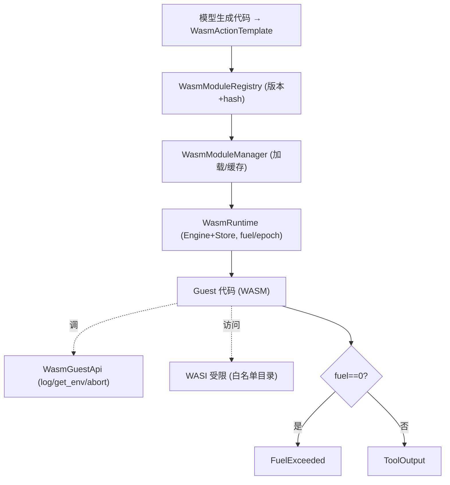

# OneAI WASM 沙箱机制

> Wasmtime 沙箱执行不可信代码——"Code-as-WASM-Action"范式（Smolagents 的 code-as-action，但用 Rust 的 WASM 沙箱做真实进程级隔离，非 AST 级）：`WasmRuntime` + `WasmTool`（Tool trait 实现）+ `WasmModuleManager`（加载/缓存/生命周期）+ fuel/epoch 资源限制 + WASI 受限文件系统。

## 1. 概述（是什么）

`oneai-wasm` 是 OneAI 执行不可信代码的沙箱引擎。它实现"代码即动作"范式——模型生成的代码不直接 eval，而是编译成 WASM 在 Wasmtime 沙箱里跑，享有真实进程级隔离（非 AST 级解释、非正则黑名单）。这让 Agent 能安全地"写代码并执行"而不危及宿主：沙箱外的内存不可访问、文件系统按白名单受限、计算经 fuel/epoch 限量、宿主 API 极简（log/get_env/abort）。

它位于特性层、依赖 `oneai-core`（`Tool` trait）与 `oneai-domain`（pack 注入 WASM 工具），被 `oneai-app`（`AppBuilder` 注册 WASM 工具）与 CLI `oneai wasm` 消费。`WasmTool` 实现 `Tool` trait，所以模型看到的就是一个普通工具，背后是 WASM 沙箱执行。

## 2. 职责与能力（做什么）

**沙箱运行时。** `WasmRuntime` 管 Wasmtime Engine + Store，`fuel_limit`/epoch 做资源限量（计算步数 + 时间），fuel 耗尽检测（`store.get_fuel()==0` → `FuelExceeded`）。

**WasmTool。** 实现 `Tool` trait，包一个 WASM 模块 + `WasmToolMetadata`，`execute` 在沙箱内跑模块、捕获输出/错误，fuel 耗尽即报错。

**模块管理。** `WasmModuleManager`（加载/缓存/生命周期）+ `WasmModuleVersion`（版本 + hash）+ `WasmModuleRegistry`（多版本注册）+ `WasmResourceMonitor`（资源监控）+ `WasmActionExecutionMode`（执行模式）。

**宿主 API。** `WasmGuestApi` 暴露给 guest 的极简宿主函数（`log`/`get_env`/`abort`），预设档 `full`/`minimal`/`strict`/`with_env_vars`，`register_host_functions` 注入 linker。

**WASI 受限。** 受限文件系统访问，白名单目录（`WasiDirConfig`），`permissive_with_wasi` 配置开启受限 WASI。

**Action 模板。** `WasmActionTemplate` 预定义 code-as-action 执行模板。

**配置档。** `WasmRuntimeConfig::strict`（最严，无 WASI 无 env）/`permissive_with_wasi`（受限 WASI）/`with_fuel_limit`/`without_fuel_limit`。

**显式不做什么**：不做 LLM 推理（沙箱内跑的是模型生成的代码）；不做 USD 成本统计；不暴露任意宿主 API（极简 + 档位，防逃逸）；不直接访问宿主文件系统（WASI 白名单受限）。

## 3. 设计动机（为什么这样实现）

| 决策 | 理由 | 否决的替代方案 |
|---|---|---|
| WASM 沙箱而非 AST 级解释 | 不可信代码需真实进程级隔离——Wasmtime 提供内存隔离 + WASI 受限 + fuel 限量；AST 级解释器要自己实现安全语义、易漏；正则黑名单只防已知危险模式 | AST 解释 → 安全语义要手写、易漏；正则黑名单 → 漏判危险模式 |
| "Code-as-WASM-Action" 范式 | Smolagents 的 code-as-action 让模型生成代码即动作，比工具组合更灵活；但 Smolagents 用 Python AST，OneAI 用 Rust WASM 沙箱，保留灵活性换真实隔离 | 纯工具组合 → 表达力受限；Python AST → 隔离弱 |
| `WasmTool` 实现 `Tool` trait | 模型看到的 WASM 工具与普通工具无差，统一 `ToolExecutor` 调度，权限走同一 gate；沙箱是执行细节，对模型透明 | 单独的 WASM 调度路径 → 权限/钩子分裂 |
| fuel + epoch 双重资源限制 | fuel 限量计算步数（防死循环）、epoch 限量时间（防 hang）；两者互补，单一不够 | 只 fuel → 时间 hang 不防；只 epoch → 死循环算到超时 |
| 宿主 API 极简 + 档位 | guest 能调的宿主函数越少逃逸面越小；`strict` 档只暴露最少、`full` 才有 env vars；按需开权 | 全开宿主 API → 逃逸面大 |
| WASI 白名单受限 | WASM 需文件访问时只能碰白名单目录，非任意宿主 FS；`permissive_with_wasi` 显式开 + 配白名单 | 全开 WASI → 宿主 FS 暴露 |
| 模块版本 + hash 注册 | 同名模块多版本（迭代代码），hash 防篡改/去重；版本继承（consolidation lexicographic，拒引 semver）| 单版本 → 迭代不便；无 hash → 篡改不可见 |
| `WasmActionTemplate` 预定义 | 常用 code-as-action 模式预封装，免每次重写；模板降低使用门槛 | 每次手写 WASM 调用 → 门槛高 |

## 4. 架构与核心抽象



**核心类型：**

```rust
pub struct WasmRuntime { /* Engine + config(fuel/epoch/WASI/host api) */ }
pub struct WasmTool { module_name, metadata, runtime }   // impl Tool
pub struct WasmModuleManager { runtime, /* cache */ }
pub struct WasmGuestApi { /* full/minimal/strict/with_env_vars */ }
pub struct WasmRuntimeConfig {
    pub fn strict() -> Self;
    pub fn permissive_with_wasi(allowed_dirs: Vec<WasiDirConfig>) -> Self;
    pub fn with_fuel_limit(mut self, limit: u64) -> Self;
}
```

## 5. 参与的流程

**执行一次 WASM 工具：**

1. `WasmModuleManager::load(module_name, wasm_bytes)` 加载模块（带 `WasmModuleVersion` 版本 + hash），缓存。
2. `WasmTool::execute(args)` 在 `WasmRuntime` 里 instantiate 模块，注入 `WasmGuestApi` 宿主函数 + WASI 白名单。
3. 跑 guest 入口，传 args（经 `WasmGuestApi` 档位决定可调宿主函数）。
4. 执行中 `store.get_fuel()` 监控——若 `==0` 报 `FuelExceeded(fuel_limit)`；epoch 超时同理。
5. 捕获 guest 返回值/异常，封 `ToolOutput` 返 `ToolExecutor`。
6. `WasmResourceMonitor` 记资源使用。

**作为 Tool 被 AgentLoop 调度：** `WasmTool` 注册进 `ToolRegistry`（可经 DomainPack 注入），模型看到的是一个普通工具，`build_tool_definitions_for_paradigm` 把它列入 schema，`ToolExecutor::execute` 经权限解析 + gate 后调 `WasmTool::execute`，背后是沙箱执行。

## 6. 依赖关系

| 方向 | 谁 | 内容 |
|---|---|---|
| 上游 | `oneai-core` | `Tool`/`ToolOutput`/`PermissionLevel`/`RiskLevel` |
| 上游 | `oneai-domain` | pack 注入 WASM 工具配置 |
| 上游 | `wasmtime` | WASM 运行时（fuel/epoch/WASI）|
| 下游 | `oneai-app` | `AppBuilder` 注册 WASM 工具 |
| 下游 | CLI | `oneai wasm list/load/run/health/unload/stats` |
| 横切接入 | DomainPack | pack 注入 WASM 工具与模板 |

## 7. 关键类型与文件

| 项 | 位置 |
|---|---|
| `WasmRuntime`（Engine+Store, fuel/epoch）| `crates/oneai-wasm/src/runtime.rs` |
| `WasmTool`（impl Tool）| `crates/oneai-wasm/src/tool.rs:34`（`execute` + fuel 监控 `:130,208-211`）|
| `WasmModuleManager`（加载/缓存/生命周期）| `crates/oneai-wasm/src/module.rs:42,49` |
| `WasmModuleRegistry` + `WasmModuleVersion`（版本+hash）| `crates/oneai-wasm/src/registry.rs:50,59` |
| `WasmGuestApi` + `WasmHostFunction` + `register_host_functions` | `crates/oneai-wasm/src/guest_api.rs:51,21,133,223` |
| `WasmRuntimeConfig`（strict/permissive_with_wasi/fuel）| `crates/oneai-wasm/src/config.rs:22,99,114,126` |
| `WasmActionTemplate` | `crates/oneai-wasm/src/action_template.rs` |
| WASI 受限（白名单目录）| `crates/oneai-wasm/src/wasi.rs` |
| `WasmResourceMonitor` | `crates/oneai-wasm/src/monitor.rs` |
| `WasmError`（`FuelExceeded` 等）| `crates/oneai-wasm/src/error.rs:8` |

## 8. 与业界对比

| 系统 | 模型 | OneAI 取舍 |
|---|---|---|
| **Smolagents** | code-as-action（Python AST 解释）| OneAI 同范式但用 Rust WASM 沙箱——真实进程级隔离而非 AST 级，逃逸面更小 |
| **Wasmtime / WASI** | 通用 WASM 运行时 | OneAI 把它包成 `Tool` + `WasmGuestApi` 档位 + WASI 白名单，面向 agent 不可信代码场景定制 |
| **OpenAI Code Interpreter** | 沙箱 Python（容器级）| OneAI WASM 沙箱更轻（无容器开销）、fuel/epoch 精确限量、宿主 API 极简 |
| **Pyodide / WASM Python** | 浏览器内 Python | OneAI 是宿主侧 WASM 执行 agent 代码，非浏览器；且 fuel 限量防死循环 |
| **E2B / Modal code sandbox** | 远程容器沙箱 | OneAI 本地 Wasmtime，无网络开销；远程沙箱归 `TerminalBackend` 的 Docker/Modal 后端 |

OneAI 独特点：**真实进程级隔离的 code-as-action**（WASM 非 AST）+ **`Tool` trait 统一调度**（沙箱对模型透明，权限走同一 gate）+ **fuel/epoch + WASI 白名单 + 极简宿主 API** 三重防逃逸。

## 9. 扩展点与配置

- **加载模块**：`WasmModuleManager::load(name, wasm_bytes)` + 版本/hash。
- **配置沙箱**：`WasmRuntimeConfig::strict`（最严）/`permissive_with_wasi(dirs)`/`with_fuel_limit(n)`。
- **宿主 API 档位**：`WasmGuestApi::full/minimal/strict/with_env_vars`。
- **WASI 白名单**：`WasiDirConfig` 列允许目录。
- **作为工具**：`WasmTool` 注册进 `ToolRegistry`（可经 DomainPack）。
- **CLI**：`oneai wasm list/load/run/health/unload/stats`（详见 [cli-reference](cli-reference.md)）。

## 10. 深入阅读

- [tool-mechanism.md](tool-mechanism.md) —— `WasmTool` 实现 `Tool` trait 的调度路径
- [domain-pack-mechanism.md](domain-pack-mechanism.md) —— pack 注入 WASM 工具与模板
- [permission-mechanism.md](permission-mechanism.md) —— WASM 工具走同一权限 gate
- 源码：`crates/oneai-wasm/src/`（11 文件 / ~4.6K LOC）
