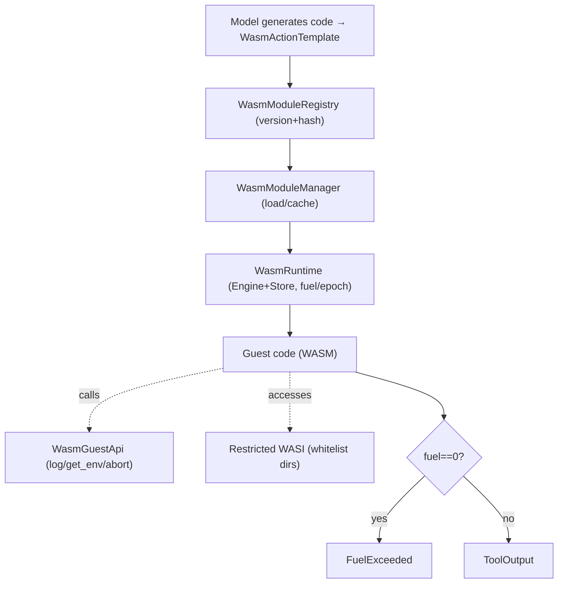

# OneAI WASM Sandbox Mechanism

> Wasmtime sandbox for untrusted code — the "Code-as-WASM-Action" paradigm (Smolagents' code-as-action, but in Rust's WASM sandbox with real process-level isolation, not AST-level): `WasmRuntime` + `WasmTool` (Tool trait impl) + `WasmModuleManager` (load/cache/lifecycle) + fuel/epoch resource limiting + restricted WASI filesystem.

## 1. Overview (what it is)

`oneai-wasm` is OneAI's sandbox engine for executing untrusted code. It implements the "code as action" paradigm — model-generated code is not eval'd directly but compiled to WASM and run inside a Wasmtime sandbox with real process-level isolation (not AST-level interpretation, not regex blacklists). This lets an agent safely "write code and execute it" without endangering the host: memory outside the sandbox is inaccessible, the filesystem is whitelist-restricted, compute is fuel/epoch-limited, and the host API is minimal (log/get_env/abort).

It sits in the feature layer, depending on `oneai-core` (`Tool` trait) and `oneai-domain` (pack injects WASM tools), consumed by `oneai-app` (`AppBuilder` registers WASM tools) and CLI `oneai wasm`. `WasmTool` implements the `Tool` trait, so the model sees an ordinary tool backed by WASM sandbox execution.

## 2. Responsibilities & capabilities (what it does)

**Sandbox runtime.** `WasmRuntime` manages the Wasmtime Engine + Store; `fuel_limit`/epoch limit resources (compute steps + time); fuel-exhaustion detection (`store.get_fuel()==0` → `FuelExceeded`).

**WasmTool.** Implements the `Tool` trait, wrapping a WASM module + `WasmToolMetadata`; `execute` runs the module in the sandbox, captures output/errors, reports `FuelExceeded` when fuel hits zero.

**Module management.** `WasmModuleManager` (load/cache/lifecycle) + `WasmModuleVersion` (version + hash) + `WasmModuleRegistry` (multi-version) + `WasmResourceMonitor` + `WasmActionExecutionMode`.

**Host API.** `WasmGuestApi` exposes minimal host functions (`log`/`get_env`/`abort`) to guests; presets `full`/`minimal`/`strict`/`with_env_vars`; `register_host_functions` injects into the linker.

**Restricted WASI.** Restricted filesystem access with whitelisted directories (`WasiDirConfig`); `permissive_with_wasi` enables restricted WASI.

**Action templates.** `WasmActionTemplate` — predefined templates for code-as-action execution.

**Config presets.** `WasmRuntimeConfig::strict` (strictest, no WASI, no env) / `permissive_with_wasi` (restricted WASI) / `with_fuel_limit` / `without_fuel_limit`.

**Explicitly does not**: no LLM inference (the sandbox runs model-generated code); no USD cost tracking; no arbitrary host API (minimal + presets, anti-escape); no direct host filesystem access (WASI whitelist).

## 3. Design motivation (why this way)

| Decision | Rationale | Rejected alternative |
|---|---|---|
| WASM sandbox, not AST-level interpretation | Untrusted code needs real process-level isolation — Wasmtime gives memory isolation + restricted WASI + fuel limiting; an AST interpreter must implement its own safety semantics and leaks easily; regex blacklists only catch known-dangerous patterns | AST interpreter → hand-written safety, leaky; regex blacklist → misses novel dangerous patterns |
| "Code-as-WASM-Action" paradigm | Smolagents' code-as-action lets the model generate code as an action, more flexible than tool composition; but Smolagents uses Python AST, OneAI uses a Rust WASM sandbox — keeps flexibility, gains real isolation | Pure tool composition → limited expressiveness; Python AST → weak isolation |
| `WasmTool` implements `Tool` | The model sees a WASM tool indistinguishably from an ordinary tool; unified `ToolExecutor` dispatch; permissions flow through the same gate; the sandbox is an execution detail transparent to the model | Separate WASM dispatch path → split permissions/hooks |
| fuel + epoch dual resource limiting | fuel limits compute steps (anti-infinite-loop); epoch limits time (anti-hang); complementary | fuel only → time hang; epoch only → loop runs until timeout |
| Minimal host API + presets | Fewer host functions the guest can call → smaller escape surface; `strict` exposes the least, `full` adds env vars; open up on demand | Full host API → large escape surface |
| WASI whitelist-restricted | When WASM needs file access it may only touch whitelisted dirs, not arbitrary host FS; `permissive_with_wasi` is explicit opt-in | Full WASI → host FS exposed |
| Module version + hash registration | Same-named module multi-version (iterate code), hash prevents tampering/dedup; version inheritance is lexicographic (refuses semver) | Single version → iteration painful; no hash → tampering invisible |
| `WasmActionTemplate` presets | Common code-as-action patterns pre-packaged to avoid rewriting each time; lowers the barrier | Hand-write WASM each time → high barrier |

## 4. Architecture & core abstractions



**Core types:**

```rust
pub struct WasmRuntime { /* Engine + config(fuel/epoch/WASI/host api) */ }
pub struct WasmTool { module_name, metadata, runtime }   // impl Tool
pub struct WasmModuleManager { runtime, /* cache */ }
pub struct WasmGuestApi { /* full/minimal/strict/with_env_vars */ }
pub struct WasmRuntimeConfig {
    pub fn strict() -> Self;
    pub fn permissive_with_wasi(allowed_dirs: Vec<WasiDirConfig>) -> Self;
    pub fn with_fuel_limit(mut self, limit: u64) -> Self;
}
```

## 5. Flows it participates in

**Executing a WASM tool:**

1. `WasmModuleManager::load(module_name, wasm_bytes)` loads the module (with `WasmModuleVersion` version + hash), cached.
2. `WasmTool::execute(args)` instantiates the module in `WasmRuntime`, injects `WasmGuestApi` host functions + WASI whitelist.
3. Runs the guest entry, passing args (the `WasmGuestApi` preset decides callable host functions).
4. During execution `store.get_fuel()` is monitored — if `==0` → `FuelExceeded(fuel_limit)`; epoch timeout likewise.
5. Captures the guest return value/exception, wraps in `ToolOutput`, returns to `ToolExecutor`.
6. `WasmResourceMonitor` records resource usage.

**As a Tool dispatched by AgentLoop:** `WasmTool` is registered in `ToolRegistry` (injectable via DomainPack); the model sees an ordinary tool; `build_tool_definitions_for_paradigm` lists it in the schema; `ToolExecutor::execute` calls `WasmTool::execute` after permission resolution + gate, backed by sandbox execution.

## 6. Dependencies

| Direction | Who | What |
|---|---|---|
| Upstream | `oneai-core` | `Tool`/`ToolOutput`/`PermissionLevel`/`RiskLevel` |
| Upstream | `oneai-domain` | pack injects WASM tool config |
| Upstream | `wasmtime` | WASM runtime (fuel/epoch/WASI) |
| Downstream | `oneai-app` | `AppBuilder` registers WASM tools |
| Downstream | CLI | `oneai wasm list/load/run/health/unload/stats` |
| Cross-cutting | DomainPack | pack injects WASM tools and templates |

## 7. Key types & files

| Item | Location |
|---|---|
| `WasmRuntime` (Engine+Store, fuel/epoch) | `crates/oneai-wasm/src/runtime.rs` |
| `WasmTool` (impl Tool) | `crates/oneai-wasm/src/tool.rs:34` (`execute` + fuel monitoring `:130,208-211`) |
| `WasmModuleManager` (load/cache/lifecycle) | `crates/oneai-wasm/src/module.rs:42,49` |
| `WasmModuleRegistry` + `WasmModuleVersion` (version+hash) | `crates/oneai-wasm/src/registry.rs:50,59` |
| `WasmGuestApi` + `WasmHostFunction` + `register_host_functions` | `crates/oneai-wasm/src/guest_api.rs:51,21,133,223` |
| `WasmRuntimeConfig` (strict/permissive_with_wasi/fuel) | `crates/oneai-wasm/src/config.rs:22,99,114,126` |
| `WasmActionTemplate` | `crates/oneai-wasm/src/action_template.rs` |
| Restricted WASI (whitelist dirs) | `crates/oneai-wasm/src/wasi.rs` |
| `WasmResourceMonitor` | `crates/oneai-wasm/src/monitor.rs` |
| `WasmError` (`FuelExceeded`, etc.) | `crates/oneai-wasm/src/error.rs:8` |

## 8. Industry comparison

| System | Model | OneAI's trade-off |
|---|---|---|
| **Smolagents** | code-as-action (Python AST interpretation) | OneAI same paradigm but Rust WASM sandbox — real process-level isolation, not AST-level; smaller escape surface |
| **Wasmtime / WASI** | General WASM runtime | OneAI wraps it as a `Tool` + `WasmGuestApi` presets + WASI whitelist, tailored for the agent untrusted-code scenario |
| **OpenAI Code Interpreter** | Sandboxed Python (container-level) | OneAI WASM sandbox is lighter (no container overhead), precise fuel/epoch limiting, minimal host API |
| **Pyodide / WASM Python** | In-browser Python | OneAI is host-side WASM executing agent code, not browser; and fuel limits prevent infinite loops |
| **E2B / Modal code sandbox** | Remote container sandbox | OneAI local Wasmtime, no network overhead; remote sandbox is `TerminalBackend`'s Docker/Modal backend |

OneAI's distinct points: **real process-level-isolated code-as-action** (WASM, not AST) + **`Tool` trait unified dispatch** (sandbox transparent to the model, permissions via the same gate) + **fuel/epoch + WASI whitelist + minimal host API** triple anti-escape.

## 9. Extension points & config

- **Load module**: `WasmModuleManager::load(name, wasm_bytes)` + version/hash.
- **Configure sandbox**: `WasmRuntimeConfig::strict` (strictest) / `permissive_with_wasi(dirs)` / `with_fuel_limit(n)`.
- **Host API preset**: `WasmGuestApi::full/minimal/strict/with_env_vars`.
- **WASI whitelist**: `WasiDirConfig` lists allowed dirs.
- **As a tool**: register `WasmTool` in `ToolRegistry` (via DomainPack).
- **CLI**: `oneai wasm list/load/run/health/unload/stats` (see [cli-reference](cli-reference_EN.md)).

## 10. Further reading

- [tool-mechanism](tool-mechanism_EN.md) — the dispatch path where `WasmTool` implements `Tool`
- [domain-pack-mechanism](domain-pack-mechanism_EN.md) — pack injects WASM tools and templates
- [permission-mechanism](permission-mechanism_EN.md) — WASM tools go through the same permission gate
- Source: `crates/oneai-wasm/src/` (11 files / ~4.6K LOC)
