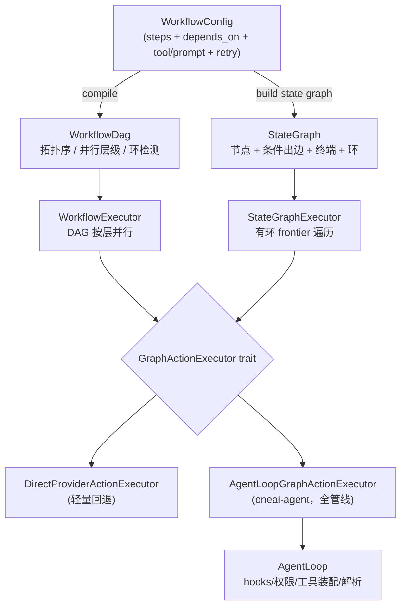

# OneAI 工作流机制

> DAG（无环）+ StateGraph（有环）双图引擎，经 `GraphActionExecutor` 与 AgentLoop 闭环：图节点可内联升级为完整 AgentLoop 管线（hooks/权限/工具装配/上下文），让"声明式多步"与"动态 agentic"共享同一执行语义。

## 1. 概述（是什么）

`oneai-workflow` 是 OneAI 的声明式多步执行引擎。它把一段多步 Agent 行为描述成步骤、依赖、工具绑定与执行策略的配置，编译成图后再执行。这样做的好处是把"确定性的多步流程"从模型自由发挥里抽出来，变成可渲染、可校验、可存盘、可跨 session 复用的资产。

引擎支持两种图。**DAG** 用于无环的并行步骤编排——拓扑排序、按层级并行、重试与超时一应俱全。**StateGraph** 用于有环的迭代流程，能表达 ReAct 循环（推理→工具→再推理）、条件路由、范式切换，并把中断点显式建模为节点。两种图不是两套引擎，而是同一套抽象的两个视图：DAG 是 StateGraph 的无环特例。

关键在于 `GraphActionExecutor` 这个 trait——它把图节点的 LLM 推理与工具调用**委托给 AgentLoop 的完整管线**，于是"工作流里跑的一个节点"和"自由 agentic 循环里的一次迭代"享有同样的 hooks、同样的权限解析、同一套工具装配与上下文装配。声明式编排与动态 agentic 不再是两套割裂的执行语义。这一层位于特性层，依赖 `oneai-core`（`LlmProvider`/`Tool`/`InteractionGate`/`GraphDecision`/`Budget`），被 `oneai-agent`（反向注入 `AgentLoopGraphActionExecutor`）与 `oneai-app` 消费。

## 2. 职责与能力（做什么）

**配置到图的编译。** `WorkflowConfig` 是声明式的步骤集（每步有 `id`/`depends_on`/`tool`/`tool_args`/`prompt`/`requires_approval`/`timeout_secs`/`retry_policy`/`metadata`），`compile()` 把它编成 `WorkflowDag`——计算拓扑序、并行层级（level）、父子依赖，并提供 `has_cycle` / `transitive_deps` 查询。

**DAG 执行。** `WorkflowExecutor` 按并行层级逐层推进，层内步骤并行、层间用 join 屏障。每步可配 `RetryPolicy`（`max_retries` 默认 3、`retry_delay_secs` 默认 5、`retry_on_all_errors` 默认 false）与 `timeout_secs`，`requires_approval` 的步骤经 `InteractionGate` 审批。

**有环 StateGraph 执行。** `StateGraphExecutor` 从 entry 出发遍历，节点动作由 `NodeAction` 枚举表达，出边由 `EdgeCondition` 守卫，命中终端节点或预算耗尽则停。

**变量插值。** `WorkflowContext` 持有变量与各步输出，`interpolate_template` 用 `{{var}}` 把上游输出渲染进下游的 prompt 与 tool_args，让数据在步骤间流动。

**AgentLoop 闭环。** `GraphActionExecutor` trait 把 `LlmInfer`/`ToolCall`/`SwitchParadigm` 三类节点的执行委托出去——可以是 `DirectProviderActionExecutor`（轻量回退，直接调 provider+tool），也可以是 `oneai-agent` 的 `AgentLoopGraphActionExecutor`（全管线）。

**校验与渲染。** `validator` 做结构/语义校验（7 种 `ValidationCode`：环/未定义依赖/重复 id/空步/孤儿节点/自依赖/缺审批 gate），`render` 把图渲成 ASCII 图便于 inspect。

**显式不做什么**：不实现 LLM 推理（委托 `LlmProvider` 或 AgentLoop）；不直接执行工具（经 `GraphActionExecutor` 走 `ToolExecutor`）；不持久化图状态——`GraphState` 是执行期瞬态，落盘归 `oneai-persistence`；不做定时触发，cron 归 `oneai-scheduler`。

## 3. 设计动机（为什么这样实现）

**双图而非仅 DAG。** 无环 DAG 天然不能表达 ReAct 循环——一次推理后要不要继续、走哪条边，取决于模型这次返回了什么。把这种迭代塞进 DAG 节点的内部，图就不可视、不可校验了。StateGraph 显式建模有环 + 条件出边，让 ReAct、Plan→ReAct→Reflect 成为图上可绘制的路径，而非节点里藏着的隐式循环。否决方案只用 DAG，代价是循环逻辑黑箱化。

**用 `GraphActionExecutor` trait 桥接 AgentLoop。** 图节点执行 LlmInfer 或 ToolCall 时，权限、钩子、工具装配、输出解析必须和自由 AgentLoop 一致，否则"工作流跑的工具"会绕过域策略——这正是 gap-analysis P1 在 `ToolExecutor` 上修过的同源问题。trait 让图节点**内联升级**为完整 AgentLoop 管线，而不是图执行器自己去调一次 provider、跑一次 tool。否决方案是图执行器直调 provider+tool，结果就是权限/钩子分裂、与 agent-loop 语义漂移。

**保留 `DirectProviderActionExecutor` 作为回退。** 并非所有场景都需要拉起整个 AgentLoop——一个无 hooks、无审批的纯 provider+tool 流，用轻量执行器更省。两个实现同一 trait，按场景选。只留 AgentLoop 桥接会让轻量工作流被迫拖起重管线。

**`EdgeCondition` 基于 `parsed_decision` 而非字符串匹配。** LLM 输出不可靠（见 [provider/解析](provider-mechanism.md)），靠 regex 或子串去判"模型有没有调工具"很脆弱。StateGraph 在每次 LlmInfer 后把响应解析成结构化的 `GraphDecision`（与 AgentLoop 用同一个 `OutputParser`），存在 `GraphState.parsed_decision` 里，`HasToolCalls`/`IsFinalAnswer`/`RequestsDelegation` 都查这个字段。这样路由与 agent-loop 的决策解析天然一致。否决方案是字符串匹配，结果是路由脆弱、两处解析各自漂移。

**`NodeAction` 是 `#[non_exhaustive]` 枚举。** 未来要加 `ParallelFork`/`Wait`/`Barrier` 这类节点时，作为新变体加入不破 ABI，符合 v0.2.0 稳定承诺。否决方案是用开放式 trait 注册节点，但校验、渲染、路由都要动态适配，复杂度溢出。

**`SwitchParadigm` 作为图节点存在。** 范式切换（Plan→ReAct→Reflect）有两条入口：模型在 AgentLoop 自由循环里通过 `switch_paradigm` 元工具触发，或工作流把它声明成图上一条显式路径。两条入口汇到同一个 `apply_paradigm_switch`——更新 `GraphState.active_paradigm`、清掉 `parsed_decision`（新范式需要重新推理）。这样多范式流程既能声明式编排，也能让模型在运行时临时切换。否决方案是只允许模型驱动，那声明式编排多范式就不可能。

**配置 JSON 可序列化 + 模板插值。** 工作流要能被 DomainPack 第⑥层声明、要能存盘跨 session 复用，就必须可序列化；`{{var}}` 让上游步骤输出自然流入下游 prompt。否决方案是用代码定义工作流，那就不可声明、不可校验、不可共享。

## 4. 架构与核心抽象

下图把配置到两条执行路径，再到 `GraphActionExecutor` 的分叉讲清楚：



节点动作是一个 6 变体的 `#[non_exhaustive]` 枚举：

```rust
pub enum NodeAction {
    LlmInfer { system_prompt_override, use_streaming, include_tool_definitions,
               tool_filter_override, thinking_budget, temperature, max_tokens },
    ToolCall { tool_name, args_template },
    Delegate { agent_kind, task_template },
    HumanApproval { description },
    ConditionCheck { condition },
    SwitchParadigm { paradigm },          // 更新 GraphState.active_paradigm
}
```

`include_tool_definitions` 这一字段是 ReAct 能跑起来的关键：为真时执行器会按当前范式装配工具集，模型才看得见工具、才能决定调不调；为假时是一次纯文本推理，用于终答节点或条件判定。

桥接 trait 把三类节点的执行委托出去：

```rust
pub trait GraphActionExecutor: Send + Sync {
    async fn execute_llm_infer(&self, action: &NodeAction, state: &mut GraphState) -> Result<ActionResult>;
    async fn execute_tool_call(&self, tool_name: &str, args: &Value, state: &mut GraphState) -> Result<ActionResult>;
    async fn execute_paradigm_switch(&self, paradigm: &str, state: &mut GraphState) -> Result<ActionResult>;
    async fn parse_decision(&self, response: &InferenceResponse, state: &mut GraphState) -> Result<GraphDecision>;
}
```

`EdgeCondition` 守卫出边，9 个变体覆盖了路由需要的全部判定：`HasToolCalls`/`IsFinalAnswer`/`RequestsDelegation`（查 `parsed_decision`）、`ErrorOccurred`、`StateEquals{variable,value}`、`Always`、`Custom{name,description}`、`ParadigmEquals{paradigm}`、`IterationExceeds{count}`（循环安全阀）。

## 5. 参与的流程

以一个 ReAct 循环为例，StateGraph 的执行走下面这条链路：

**装配。** DomainPack 第⑥层声明图（CodingPack 内置 react/plan/reflect/explore 四图），或代码 `StateGraph::new(entry_point)` 逐个加节点、条件出边、终端节点。`GraphState` 初始化时带上 `conversation`、空 `variables`、可选的 `active_paradigm`、`iteration_count` 与剩余 token `budget`。

**遍历。** `StateGraphExecutor::execute` 从 entry 出发，对当前节点按 `NodeAction` 分派：`LlmInfer`（`include_tool_definitions=true`）委托 `execute_llm_infer`，由 AgentLoop 装配范式工具集、推理，再把响应解析成 `GraphDecision` 存进 `state.parsed_decision`；`ToolCall` 委托 `execute_tool_call`，跑 PreToolUse hooks → 权限 → 审批 gate → `ToolExecutor` → PostToolUse hooks；`HumanApproval` 走 InteractionGate；`Delegate` 起 SubAgent；`SwitchParadigm` 更新 `active_paradigm` 并清 `parsed_decision`；`ConditionCheck` 求值。

**frontier 路由。** P4.6 起 `route_next_nodes` 返回**所有可满足出边**而非单条，遍历从"单 walker"升级为"frontier 并行"：若 frontier 里有终端节点，先执行确定性优先的那一个；否则执行整个 frontier——frontier 只有一个节点时（历史 ReAct/条件分支的常见情形）顺序执行、不付 clone 开销，行为与改动前完全一致；有多个节点且无 interrupt 点时并发执行，`join_all` 等齐后按 `BTreeSet` 的 `node_id` 顺序确定性合并各分支结果，自然 join。任一节点带 interrupt 点则退回顺序，保证中断语义清晰。

**循环/终止。** 命中终端节点、`should_terminate` 置位、或 `budget` 耗尽则停，返回 `GraphExecutionResult`。`IterationExceeds` 出边可在循环超阈值时路由到 error_handler，作循环安全阀。

**闭环。** AgentLoop 自己也能当节点执行器：模型在自由循环里 `switch_paradigm` 或 `delegate` 时，`apply_paradigm_switch` + `AgentLoopGraphActionExecutor` 内联升级范式（system prompt + 工具过滤），走的与图路径是同一段升级代码——这就是"双向闭环"。

DAG 路径更直接：`WorkflowExecutor::execute` 按 `level` 逐层 join，层内并行，`requires_approval` 经 gate，`RetryPolicy` 控重试，`interpolate_template` 把上游输出注入下游。

## 6. 依赖关系

| 方向 | 谁 | 内容 |
|---|---|---|
| 上游 | `oneai-core` | `LlmProvider`/`Tool`/`InteractionGate`/`PermissionResolver`/`GraphDecision`/`InferenceResponse`/`Budget` |
| 上游 | `serde`/`tokio`/`futures` | 配置序列化、异步并行、`join_all` |
| 下游 | `oneai-agent` | `AgentLoopGraphActionExecutor`（`agent_loop.rs:5648`）反向实现 `GraphActionExecutor`，把图节点委托回 AgentLoop 全管线 |
| 下游 | `oneai-app` | `AppBuilder` 接工作流配置 + 选 action executor |
| 下游 | `oneai-studio` | D3.js 可视化 StateGraph（见 [studio-mechanism](studio-mechanism.md)）|
| 横切接入 | DomainPack 第⑥层 | `Workflow+StateGraph` 声明式图定义，一行切换即换整套工作流 |
| 横切接入 | DomainPack 第④层 | `ParadigmStrategies` 与 `SwitchParadigm` 节点联动 |

## 7. 关键类型与文件

| 项 | 位置 |
|---|---|
| `WorkflowConfig`/`StepConfig`/`RetryPolicy` | `crates/oneai-workflow/src/config.rs:19,57,99` |
| `WorkflowDag`/`DagNode`（拓扑/层级/环检测）| `crates/oneai-workflow/src/dag.rs:49,21`（`topological_order:212`/`has_cycle:220`/`transitive_deps:253`）|
| `compile(config) -> WorkflowDag` | `crates/oneai-workflow/src/compiler.rs:17` |
| `NodeAction`（6 变体）| `crates/oneai-workflow/src/state_graph.rs:44` |
| `EdgeCondition`（9 变体）| `crates/oneai-workflow/src/state_graph.rs:148` |
| `StateGraph`/`GraphNode`/`GraphEdge` | `crates/oneai-workflow/src/state_graph.rs:254,199,225`（`has_cycles:332`）|
| `GraphState`（`conversation`/`variables`/`parsed_decision`/`active_paradigm`/`iteration_count`/`budget`）| `crates/oneai-workflow/src/state_graph.rs:384` |
| `GraphActionExecutor` trait | `crates/oneai-workflow/src/state_executor.rs:152` |
| `DirectProviderActionExecutor`（回退）| `crates/oneai-workflow/src/state_executor.rs:215` |
| `StateGraphExecutor` + frontier 并行 | `crates/oneai-workflow/src/state_executor.rs:503`（`execute:623`，`execute_frontier_parallel` 多 walker + `BTreeSet` 合并）|
| `WorkflowExecutor`/`StepResult`/`WorkflowResult`/`WorkflowContext` | `crates/oneai-workflow/src/executor.rs:161,45,67,114` |
| `interpolate_template`（`{{var}}`）| `crates/oneai-workflow/src/executor.rs:693` + `state_executor.rs:1162` |
| `ValidationCode`（7 码）+ `ValidationIssue`/`Severity` | `crates/oneai-workflow/src/validator.rs:40,15,31` |
| `render`（ASCII 可视化）| `crates/oneai-workflow/src/render.rs:23,72` |
| `AgentLoopGraphActionExecutor`（反向桥）| `crates/oneai-agent/src/agent_loop.rs:5648` |

## 8. 与业界对比

| 系统 | 模型 | OneAI 取舍 |
|---|---|---|
| **Temporal / Airflow** | DAG 工作流引擎，强可靠/可观测 | OneAI DAG 是它们的子集（拓扑/层级/重试/超时）但**面向 Agent**：节点是 LLM 推理或工具调用而非任务函数；可靠性让位于 agentic 灵活度 |
| **LangGraph** | 有环 StateGraph + 条件边 + checkpoint | OneAI StateGraph 是同类设计（节点+条件出边+有环），差异在**与 AgentLoop 闭环**：图节点可内联升级为完整 AgentLoop 管线，而非仅"调一次 LLM"；`parsed_decision` 结构化路由也比字符串匹配稳 |
| **AutoGen / CrewAI** | 对话式多 agent 编排 | OneAI 的多 agent 走 `Delegate` 节点 + `oneai-agent` 的 SubAgent（见 [multi-agent](multi-agent-mechanism.md)）；工作流是**声明式图**，对话式编排归 multi-agent 机制，职责分离 |
| **n8n / Zapier** | 触发+动作 DAG，无 LLM 推理节点 | OneAI 节点一等支持 `LlmInfer`（含工具装配/思考预算/范式切换），是为 agentic 而非为集成而设 |

OneAI 的独特点在于"图节点 = AgentLoop 管线"——经 `GraphActionExecutor`，声明式图与动态 agentic 共享同一套权限/钩子/解析语义。多数框架要么"工作流不跑 agent 全管线"，要么"agent 不走图"，OneAI 把两者做成双向闭环。

## 9. 扩展点与配置

- **声明工作流**：JSON `WorkflowConfig`（`from_json`/`to_json`）或 DomainPack 第⑥层 `Workflow+StateGraph`。
- **选执行器**：`StateGraphExecutor::with_defaults(action_executor)` 用注入的 `GraphActionExecutor`；`with_direct_provider_defaults` 用轻量回退。
- **加节点动作**：`NodeAction` 是 `#[non_exhaustive]`，新变体经枚举扩展（需同步 `GraphActionExecutor` 实现 + 校验 + 渲染）。
- **范式切换**：图内 `SwitchParadigm` 节点，或模型在 AgentLoop 内 `switch_paradigm` 元工具——两条入口汇到同一 `apply_paradigm_switch`。
- **CLI**：`oneai workflow list/show/run`、`oneai graph list/show/run` 子命令 + 对话内 `/wf *` 斜杠命令（详见 [cli-reference](cli-reference.md)）；Studio Web UI 可视化编辑（[studio-mechanism](studio-mechanism.md)）。

## 10. 深入阅读

- [multi-agent-mechanism.md](multi-agent-mechanism.md) —— AgentLoop + `AgentLoopGraphActionExecutor` 反向桥 + 范式切换
- [domain-pack-mechanism.md](domain-pack-mechanism.md) —— 第⑥层 Workflow+StateGraph、第④层 ParadigmStrategies
- [tool-mechanism.md](tool-mechanism.md) —— `ToolCall` 节点委托的 `ToolExecutor` 与权限
- [permission-mechanism.md](permission-mechanism.md) —— `HumanApproval` 节点走 InteractionGate
- 源码：`crates/oneai-workflow/src/`（9 文件 / ~4.9K LOC）
