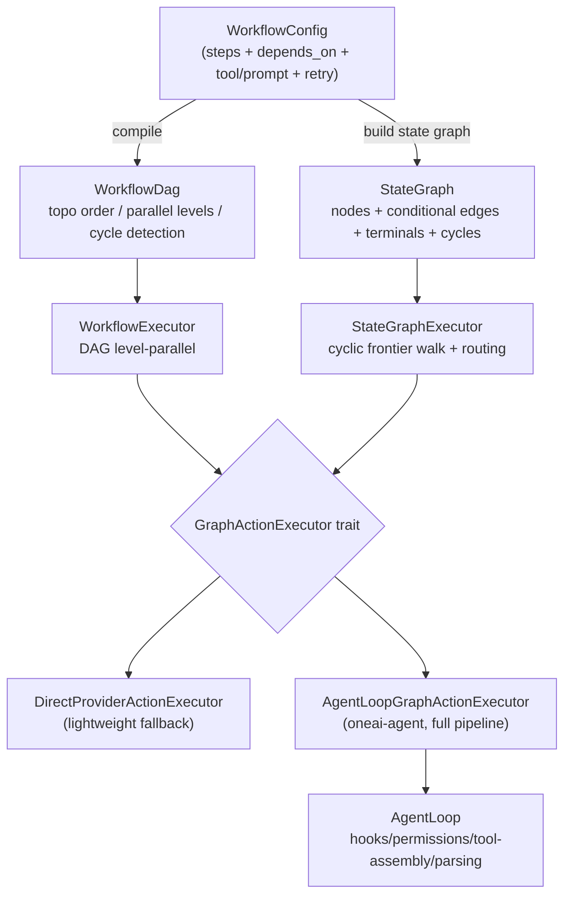

# OneAI Workflow Mechanism

> DAG (acyclic) + StateGraph (cyclic) dual-graph engine, closed-loop with the AgentLoop via `GraphActionExecutor`: graph nodes can inline-upgrade to the full AgentLoop pipeline (hooks/permissions/tool-assembly/context), so "declarative multi-step" and "dynamic agentic" share the same execution semantics.

## 1. Overview (what it is)

`oneai-workflow` is OneAI's declarative multi-step execution engine. It describes a stretch of multi-step agent behavior as a config of steps + dependencies + tool bindings + execution policies, compiles it into a graph, then executes. The benefit is pulling "deterministic multi-step flow" out of the model's free play, making it renderable, validatable, storable, and cross-session reusable.

The engine supports two graphs. **DAG** is for acyclic parallel step orchestration — topological sort, level-parallel, retry and timeout included. **StateGraph** is for cyclic iterative flows, expressing ReAct loops (reason → tool → reason again), conditional routing, and paradigm switching, with interrupt points modeled explicitly as nodes. The two graphs are not two engines but two views of one abstraction: DAG is the acyclic special case of StateGraph.

The key is the `GraphActionExecutor` trait — it **delegates** a graph node's LLM inference and tool calls **to the AgentLoop's full pipeline**, so "a node in a workflow" and "a free agentic iteration" share the same hooks, the same permission resolution, the same tool assembly and context assembly. Declarative orchestration and dynamic agentic are no longer two split execution semantics. This layer sits in the feature layer, depending on `oneai-core` (`LlmProvider`/`Tool`/`InteractionGate`/`GraphDecision`/`Budget`), consumed by `oneai-agent` (which reverse-injects `AgentLoopGraphActionExecutor`) and `oneai-app`.

## 2. Responsibilities & capabilities (what it does)

**Config → graph compilation.** `WorkflowConfig` is a declarative step set (each step has `id`/`depends_on`/`tool`/`tool_args`/`prompt`/`requires_approval`/`timeout_secs`/`retry_policy`/`metadata`); `compile()` produces a `WorkflowDag` — topological order, parallel levels, dependency queries, cycle detection.

**DAG execution.** `WorkflowExecutor` advances level by level, parallel within a layer, join barrier between layers. Each step can configure `RetryPolicy` (`max_retries` default 3, `retry_delay_secs` default 5, `retry_on_all_errors` default false) and `timeout_secs`; `requires_approval` steps go through `InteractionGate`.

**Cyclic StateGraph execution.** `StateGraphExecutor` walks from the entry node; node actions are the `NodeAction` enum, outgoing edges are guarded by `EdgeCondition`, stopping at a terminal node or when the budget is exhausted.

**Variable interpolation.** `WorkflowContext` holds variables and per-step outputs; `interpolate_template` renders downstream prompts and tool_args with `{{var}}`.

**AgentLoop closed-loop.** The `GraphActionExecutor` trait delegates the execution of `LlmInfer`/`ToolCall`/`SwitchParadigm` nodes — either to `DirectProviderActionExecutor` (a lightweight fallback that calls provider+tool directly) or to `oneai-agent`'s `AgentLoopGraphActionExecutor` (full pipeline).

**Validation & rendering.** `validator` does structural/semantic validation (7 `ValidationCode`s: cycle/undefined-dep/duplicate-id/empty-step/orphan/self-dep/missing-approval-gate); `render` produces an ASCII graph for inspection.

**Explicitly does not**: no LLM inference (delegates to `LlmProvider`/AgentLoop); no direct tool execution (via `GraphActionExecutor` to `ToolExecutor`/AgentLoop); no graph-state persistence — `GraphState` is execution-time ephemeral, persistence is `oneai-persistence`'s job; no scheduling (cron triggering is `oneai-scheduler`'s).

## 3. Design motivation (why this way)

| Decision | Rationale | Rejected alternative |
|---|---|---|
| Dual graph (DAG + StateGraph), not DAG only | An acyclic DAG cannot express a ReAct loop (reason → tool → reason again); StateGraph explicitly models cycles + conditional edges, making ReAct/Plan→ReAct→Reflect graph paths rather than implicit loops in nodes | DAG only → loop logic black-boxed in nodes, graph not visualizable/validatable |
| `GraphActionExecutor` trait bridges the AgentLoop | When a node runs LlmInfer or ToolCall, the permissions/hooks/tool-assembly/parsing must match the free AgentLoop, or "a tool run by a workflow" bypasses domain policy — the same source problem gap-analysis P1 fixed on `ToolExecutor`. The trait lets a node **inline-upgrade** to the full AgentLoop pipeline rather than the graph executor calling provider+tool itself | Graph executor calls provider+tool directly → split permissions/hooks, drift from agent-loop |
| `DirectProviderActionExecutor` retained as fallback | Backward compat + lightweight scenarios (no hooks/approval, pure provider+tool) need not spin up the whole AgentLoop; two impls of one trait, chosen per scenario | Keep only the AgentLoop bridge → lightweight workflows forced to drag heavy pipeline |
| `EdgeCondition` based on `parsed_decision`, not string matching | LLM output is unreliable (see [provider/parser](provider-mechanism_EN.md)); a structured `GraphDecision` parsed by the same `OutputParser` as the AgentLoop makes routing consistent | Regex/string matching model output → fragile routing, drift from agent-loop parsing |
| `NodeAction` is `#[non_exhaustive]` | Future node types (e.g. `ParallelFork`/`Wait`) add as variants without breaking ABI; honors the v0.2.0 stability commitment | Open-trait node registration → validation/render/routing all dynamic, complexity overflow |
| `SwitchParadigm` as a graph node | Paradigm switching (Plan→ReAct→Reflect) has two entries: model-triggered inside the AgentLoop via the `switch_paradigm` meta-tool, or declared as an explicit graph path; both converge on `apply_paradigm_switch` — updating `GraphState.active_paradigm`, clearing `parsed_decision` (the new paradigm needs fresh inference). This lets multi-paradigm flows be both declaratively orchestrated and runtime-switched by the model | Model-driven only → declarative multi-paradigm orchestration impossible |
| Config JSON serializable + template interpolation | Workflows must be declarable by DomainPack layer 6, storable, cross-session reusable; `{{var}}` lets upstream step outputs flow into downstream prompts | Code-defined workflows → not declarative, not validatable, not shareable |

## 4. Architecture & core abstractions



Node actions are a 6-variant `#[non_exhaustive]` enum:

```rust
pub enum NodeAction {
    LlmInfer { system_prompt_override, use_streaming, include_tool_definitions,
               tool_filter_override, thinking_budget, temperature, max_tokens },
    ToolCall { tool_name, args_template },
    Delegate { agent_kind, task_template },
    HumanApproval { description },
    ConditionCheck { condition },
    SwitchParadigm { paradigm },          // updates GraphState.active_paradigm
}
```

The `include_tool_definitions` field is key to ReAct working: when true the executor assembles the paradigm's tool set so the model can see tools and decide whether to call them; when false it's a pure-text inference for final-answer nodes or condition checks.

The bridge trait delegates three node kinds:

```rust
pub trait GraphActionExecutor: Send + Sync {
    async fn execute_llm_infer(&self, action: &NodeAction, state: &mut GraphState) -> Result<ActionResult>;
    async fn execute_tool_call(&self, tool_name: &str, args: &Value, state: &mut GraphState) -> Result<ActionResult>;
    async fn execute_paradigm_switch(&self, paradigm: &str, state: &mut GraphState) -> Result<ActionResult>;
    async fn parse_decision(&self, response: &InferenceResponse, state: &mut GraphState) -> Result<GraphDecision>;
}
```

`EdgeCondition` guards outgoing edges with 9 variants covering all routing needs: `HasToolCalls`/`IsFinalAnswer`/`RequestsDelegation` (checking `parsed_decision`), `ErrorOccurred`, `StateEquals{variable,value}`, `Always`, `Custom{name,description}`, `ParadigmEquals{paradigm}`, `IterationExceeds{count}` (loop safety valve).

## 5. Flows it participates in

Taking a ReAct loop as the example, StateGraph execution goes through this chain:

**Assembly.** DomainPack layer 6 declares the graph (CodingPack ships react/plan/reflect/explore), or code `StateGraph::new(entry_point)` adds nodes + conditional edges + terminals one by one. `GraphState` is initialized with `conversation`, empty `variables`, optional `active_paradigm`, `iteration_count`, and remaining token `budget`.

**Walk.** `StateGraphExecutor::execute` starts from the entry, dispatching per `NodeAction`: `LlmInfer` (`include_tool_definitions=true`) delegates to `execute_llm_infer`, where the AgentLoop assembles the paradigm tool set, infers, and parses the response into a `GraphDecision` stored in `state.parsed_decision`; `ToolCall` delegates to `execute_tool_call`, running PreToolUse hooks → permissions → approval gate → `ToolExecutor` → PostToolUse hooks; `HumanApproval` goes through InteractionGate; `Delegate` spawns a SubAgent; `SwitchParadigm` updates `active_paradigm` and clears `parsed_decision`; `ConditionCheck` evaluates.

**Frontier routing.** Since P4.6 `route_next_nodes` returns **all satisfiable edges**, not just one, upgrading the walk from single-walker to frontier-parallel: if the frontier has a terminal node, the deterministic-first one runs first; otherwise the whole frontier runs — a single-node frontier (the common historical ReAct/conditional case) runs sequentially with no clone overhead, identical behavior to before; multiple nodes with no interrupt points run concurrently, `join_all`-ed then merged deterministically by `BTreeSet` `node_id` order, a natural join. Any node with an interrupt point falls back to sequential, keeping interrupt semantics clean.

**Loop/terminate.** Stops at a terminal node, when `should_terminate` is set, or when `budget` is exhausted, returning `GraphExecutionResult`. An `IterationExceeds` edge can route to an error_handler past a threshold as a loop safety valve.

**Closed loop.** The AgentLoop itself can be the node executor: when the model in a free loop does `switch_paradigm` or `delegate`, `apply_paradigm_switch` + `AgentLoopGraphActionExecutor` inline-upgrades the paradigm (system prompt + tool filter), running the same upgrade code as the graph path — this is the "two-way closed loop".

The DAG path is more direct: `WorkflowExecutor::execute` joins level by level, parallel within a layer, `requires_approval` through the gate, `RetryPolicy` controls retries, `interpolate_template` injects upstream outputs downstream.

## 6. Dependencies

| Direction | Who | What |
|---|---|---|
| Upstream | `oneai-core` | `LlmProvider`/`Tool`/`InteractionGate`/`PermissionResolver`/`GraphDecision`/`InferenceResponse`/`Budget` |
| Upstream | `serde`/`tokio`/`futures` | config serialization, async parallel, `join_all` |
| Downstream | `oneai-agent` | `AgentLoopGraphActionExecutor` (`agent_loop.rs:5648`) reverse-impls `GraphActionExecutor`, delegating nodes back to the full AgentLoop pipeline |
| Downstream | `oneai-app` | `AppBuilder` wires workflow config + chooses the action executor |
| Downstream | `oneai-studio` | D3.js StateGraph visualization (see [studio-mechanism](studio-mechanism_EN.md)) |
| Cross-cutting | DomainPack layer 6 | `Workflow+StateGraph` declarative graph definition; switching a pack swaps the whole workflow set |
| Cross-cutting | DomainPack layer 4 | `ParadigmStrategies` interplays with the `SwitchParadigm` node |

## 7. Key types & files

| Item | Location |
|---|---|
| `WorkflowConfig`/`StepConfig`/`RetryPolicy` | `crates/oneai-workflow/src/config.rs:19,57,99` |
| `WorkflowDag`/`DagNode` (topo/levels/cycle) | `crates/oneai-workflow/src/dag.rs:49,21` (`topological_order:212`/`has_cycle:220`/`transitive_deps:253`) |
| `compile(config) -> WorkflowDag` | `crates/oneai-workflow/src/compiler.rs:17` |
| `NodeAction` (6 variants) | `crates/oneai-workflow/src/state_graph.rs:44` |
| `EdgeCondition` (9 variants) | `crates/oneai-workflow/src/state_graph.rs:148` |
| `StateGraph`/`GraphNode`/`GraphEdge` | `crates/oneai-workflow/src/state_graph.rs:254,199,225` (`has_cycles:332`) |
| `GraphState` (`conversation`/`variables`/`parsed_decision`/`active_paradigm`/`iteration_count`/`budget`) | `crates/oneai-workflow/src/state_graph.rs:384` |
| `GraphActionExecutor` trait | `crates/oneai-workflow/src/state_executor.rs:152` |
| `DirectProviderActionExecutor` (fallback) | `crates/oneai-workflow/src/state_executor.rs:215` |
| `StateGraphExecutor` + frontier-parallel routing | `crates/oneai-workflow/src/state_executor.rs:503` (`execute`, multi-walker merge P4.6) |
| `GraphCheckpoint`/`GraphCheckpointStore` + InMemory/File stores (gap P2 #14 resume) | `crates/oneai-workflow/src/checkpoint.rs` + `state_executor.rs` (`execute_with_checkpoints`/`resume`) |
| `WorkflowExecutor`/`StepResult`/`WorkflowResult`/`WorkflowContext` | `crates/oneai-workflow/src/executor.rs:161,45,67,114` |
| `interpolate_template` (`{{var}}`) | `crates/oneai-workflow/src/executor.rs:693` + `state_executor.rs:1162` |
| `ValidationCode` (7 codes) + `ValidationIssue`/`Severity` | `crates/oneai-workflow/src/validator.rs:40,15,31` |
| `render` (ASCII visualization) | `crates/oneai-workflow/src/render.rs:23,72` |
| `AgentLoopGraphActionExecutor` (reverse bridge) | `crates/oneai-agent/src/agent_loop.rs:5648` |

## 8. Industry comparison

| System | Model | OneAI's trade-off |
|---|---|---|
| **Temporal / Airflow** | DAG workflow engines, strong reliability/observability | OneAI DAG is a subset (topo/levels/retry/timeout) but **agent-facing**: nodes are LLM inference or tool calls, not task functions; reliability cedes to agentic flexibility |
| **LangGraph** | Cyclic StateGraph + conditional edges + checkpoints | OneAI StateGraph is the same design (nodes + conditional edges + cycles + **checkpoint-resume**); the difference is the **closed loop with the AgentLoop**: a node can inline-upgrade to the full AgentLoop pipeline rather than just "call an LLM once"; `parsed_decision` structured routing beats string matching |
| **AutoGen / CrewAI** | Conversational multi-agent orchestration | OneAI's multi-agent goes through `Delegate` nodes + `oneai-agent`'s SubAgent (see [multi-agent](multi-agent-mechanism_EN.md)); workflows are **declarative graphs**, conversational orchestration belongs to the multi-agent mechanism — a clean separation |
| **n8n / Zapier** | Trigger+action DAG, no LLM-inference nodes | OneAI nodes first-class support `LlmInfer` (with tool assembly/thinking budget/paradigm switching), built for agentic not integration |

OneAI's distinct point: **graph nodes = AgentLoop pipeline** (via `GraphActionExecutor`), so declarative graphs and dynamic agentic share one set of permission/hook/parsing semantics — most frameworks either "workflows don't run the full agent pipeline" or "agents don't run as graphs"; OneAI closes the loop both ways.

## 9. Extension points & config

- **Declare a workflow**: JSON `WorkflowConfig` (`from_json`/`to_json`) or DomainPack layer 6 `Workflow+StateGraph`.
- **Choose executor**: `StateGraphExecutor::with_defaults(action_executor)` uses the injected `GraphActionExecutor`; `with_direct_provider_defaults` uses the lightweight fallback.
- **Checkpoint-resume (first durable-execution step, gap P2 #14)**: `execute_with_checkpoints(graph, state, run_id, store)` persists the walk state (frontier, iterations, full `GraphState`) into a `GraphCheckpointStore` (`InMemoryCheckpointStore` for tests / `FileCheckpointStore` — one JSON per run, survives process restarts) at **every iteration boundary**; after an interruption/crash, `executor.resume(graph, run_id, store)` validates the graph name, clears the interruption flags, and continues from the saved point; completed runs delete their checkpoint. run_id is sanitized against path traversal.
- **Add a node action**: `NodeAction` is `#[non_exhaustive]`; new variants extend the enum (sync `GraphActionExecutor` impls + validation + rendering).
- **Paradigm switch**: a `SwitchParadigm` node in the graph, or the model's `switch_paradigm` meta-tool in the AgentLoop — both converge on `apply_paradigm_switch`.
- **CLI**: `oneai workflow list/show/run`, `oneai graph list/show/run` subcommands + in-conversation `/wf *` slash commands (see [cli-reference](cli-reference_EN.md)); Studio Web UI visual editing (see [studio-mechanism](studio-mechanism_EN.md)).

## 10. Further reading

- [multi-agent-mechanism](multi-agent-mechanism_EN.md) — AgentLoop + `AgentLoopGraphActionExecutor` reverse bridge + paradigm switching
- [domain-pack-mechanism](domain-pack-mechanism_EN.md) — layer 6 Workflow+StateGraph, layer 4 ParadigmStrategies
- [tool-mechanism](tool-mechanism_EN.md) — the `ToolExecutor` and permissions a `ToolCall` node delegates to
- [permission-mechanism](permission-mechanism_EN.md) — `HumanApproval` nodes go through InteractionGate
- Source: `crates/oneai-workflow/src/` (9 files / ~4.9K LOC)
